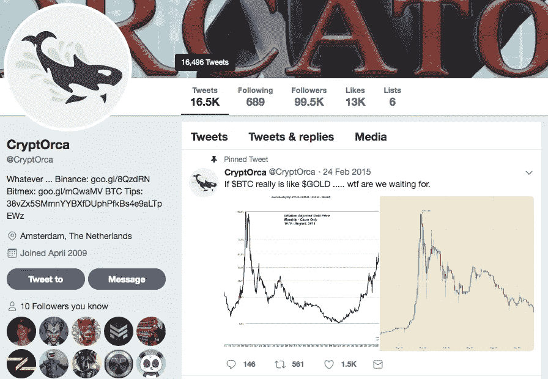

# @CryptOrca:改变市场的 140 个符号

> 原文：<https://medium.com/hackernoon/cryptorca-140-symbols-that-change-the-market-a60d3be2d21f>

他可以写一条推特，每个人都会跑去买他提到的 altcoin。他可以随意地谈论这个项目——就像 MBN Global 一样，第二天，流行的加密媒体就会跟进他所说的话。

没有人看到他的脸，也没有人认识他。但是, **推特里的 99000 名粉丝不会错。** **他是**[**@ CryptOrca**](https://twitter.com/CryptOrca)**。**今天，他向我们讲述了他自己，讲述了他是如何开始的，并为初学者提供了一些建议。这是一个匿名的，但仍然是一个非常有趣的采访。谢谢大家！

**你是如何开始从事 crypto 的？**

始于 2013 年底。起初，我打算重返外汇市场。我有 90 年末交易期权的历史，所以对我来说并不陌生。自从互联网出现以来，很多事情都变了，但这是另一个故事

因此，在与一家在线经纪商联系并浏览报价机后，我发现了一种叫做“比特币”的东西，它以一种荒谬的价格进行交易。起初它并没有引起我的注意，直到几周后我的弟弟来了，并开始谈论“加密硬币”。他给了我一些月亮和 DOGE 硬币玩，这就是一切如何开始。

**你如何帮助密码新手？**

主要通过推特发布“教育”内容。当他们有问题时，他们会通过 DM 联系我。我也参加了一些电报小组，但那太乱了，没法进行像样的对话。

**№1 推荐给 crypto noobs？**

学习！

你的一天通常是怎么过的？

通常早上 07:00 左右醒得早。喝了一杯好咖啡后，我查看了一下昨晚的市场行情。我在高时间段的助教大部分是在周末完成的，所以我只需要在一周内做一些小的调整。我所在的时区也很幸运，因为我可以赶上欧盟和美国的外汇市场。

交易结束后，欧盟市场开放，我要么有一些 RL 的事情要做，要么跳回床上。我在图表上的下一个检查是在美国各地开放和关闭，除非一些警报早些时候。

Twitter 和 Telegram 好像整天都在。

**用 crypto 为你讲述情感故事？**

目前还没有。

好的交易的秘诀是什么？一个交易者有哪些问题？

制定一个计划并坚持下去。

**有哪些交易平台方便你了解？说说他们**

谈到 BTC，我大多是在 Bitfinex 上看现货，在 OKEX/BITMEX 上看期货。很长一段时间以来，我一直在 Poloniex 和 Bittrex 上交易替代币，但由于没有创新和不断出现的问题，我搬到了币安。

**你最近有没有从 MBN 平台写你要去参加** [**全球交易员大赛**](https://membrana.io/competition/) **？为什么你确定你赢了，你会拿走$ 100，000 奖金池吗？**

这么说吧，我会在网上展示我的成果，分享我的技能。想和我比吗？欢迎光临！