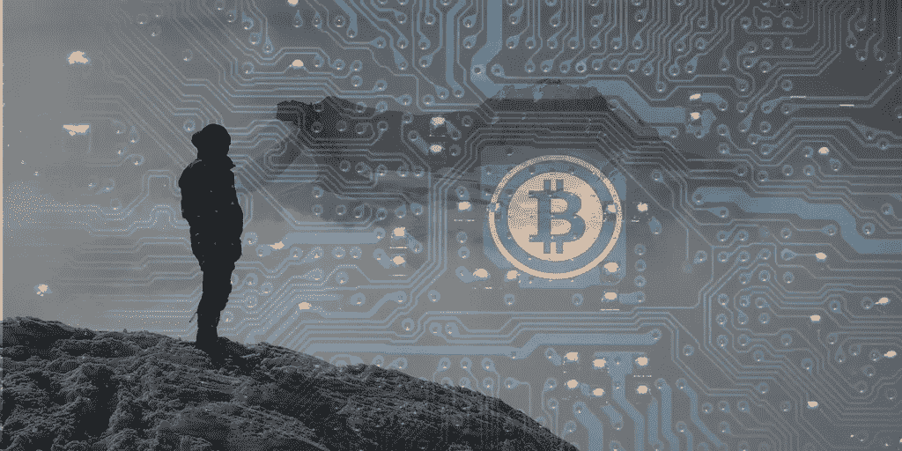

# 密码又回来了:快速致富怎么了？

> 原文：<https://medium.com/hackernoon/cryptos-are-back-down-what-happened-to-getting-rich-quick-9de455be0e49>

## 定价理念

## 我们被告知，cryptos 已经触底，现在将继续上涨。专家们怎么会弄错呢？

Cryptos 从上周的高点回落。比特币甚至一度跌破 7000 美元。这并不是一场灾难，但如果你看看其他货币，甚至像以太坊这样的大货币，数字都在下降。那么，当价格不断波动只会回落时，为什么专家们继续预测加密货币的巨大数字呢？

重要的是要记住，总会有那些自我描述的“影响者”试图通过制造极端预测的嗡嗡声来推高价格。应该注意的是，cryptos 是一个长期的游戏，在许多方面仍处于起步阶段。

当机构还没有想出如何“玩”加密市场时，波动是必然的。此外，很少有人以连贯和可理解的方式向更广泛的投资者群体传授我们真正在应对什么。

## 识别挑战

挑战不仅仅是创建混合交易所，比如 Ternion 正在做的，或者比特币基地正在推广的证券担保托管账户。投资者必须明白是什么让 cryptos 运行，以及它们为什么会存在。可以理解，这根本不是一件容易的事。

> “传统资产非常规范和安全。而加密货币资产还没有变得对每个人都安全。这就是为什么需要教育。”

[Ternion](https://ternion.io) 的首席执行官 Rudolf Medvedev 就密码教育的需求说:“整个想法是，当你有快速增长的密码市场时。和已经安全的传统投资市场。你必须小心整个关于密码的交易。传统资产是相当规范和安全的。而加密货币资产还没有变得对每个人都安全。这就是为什么需要教育。”

毕竟，加密货币诞生于挑战现状的愿望和本质上的需要。当新事物出现时，投资者总是会参与进来，只要赚钱的模式很容易解释，但加密货币是一种完全不同的动物。从某种意义上说，它们不属于典型的投资者模式，因为它们不是一项投资，而是我们与金钱关系的一场革命。

## 挣脱过去的金融链条

想想吧。加密货币提供了一个打破已经存在了 500 年的模式的机会。自从英国的金匠们开始为人们开设存款账户，并规范货币交易以来，人们已经习惯了我们所知道的银行业务。我们需要银行来储存我们的钱，或者充当中介将我们的资金转移到另一个人手中的想法正在终结，但许多投资者被困在这一思维过程中。不仅如此，整个金融系统正受到加密货币的攻击，然而在许多方面，我们需要这些投资者加入进来。

教育是让投资者摆脱旧意识的关键。我们越是关注这一点，而不仅仅是依靠提供更顺畅、更简单的方式来投资密码，那么在没有当前波动的情况下，密码价格就会越是增长和稳定。