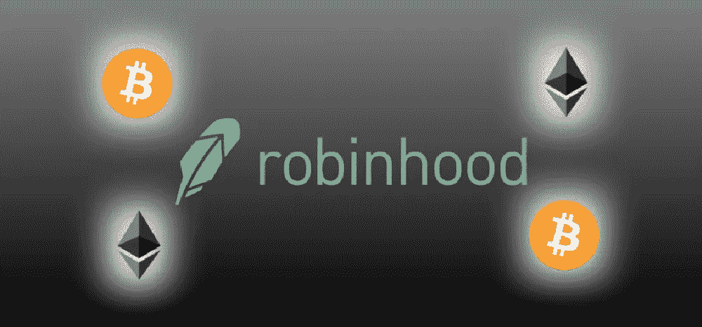

# Cryptos 触底反弹&大量资金涌入

> 原文：<https://medium.com/hackernoon/cryptos-bottoming-out-large-sums-of-money-coming-in-8c9260e1cb84>

安德森·霍洛维茨(Andreessen Horowitz)已经决定向一只加密货币基金投入 3 亿美元，这对于单个投资者来说是一大笔钱。这种投资活动令人振奋，因为它预计将对其他希望向市场投入更多资金的投资者产生积极影响，而这反过来又可能在不久的将来引发一场严重的好转。

这家美国硅谷公司已经启动了这个新基金，它将被命名为 A16Z。该基金将邀请前联邦检察官兼助理美国检察官凯瑟琳·霍恩(Catherine Horn)担任联合领导人之一，因为霍恩已被任命为该公司的最新普通合伙人。

这家投资公司也将寻求极大地扩展他们在加密领域的活动范围。这并不奇怪，因为他们已经持续投入了大量的资金到围绕用例构建的项目中。

Andreessen Horowitz 还投资了一些著名的初创企业，包括比特币基地加密货币交易所，并且在过去的投资中非常成功。比特币基地是有史以来最大的加密货币交易所之一，购买硬币比以往任何时候都更容易。它对普通人的投资额也有很大影响，随着机构投资者开放其机构产品，机构投资无疑会增加。

AH 普通合伙人 C. Dickson 先生最近暗示，加密基金将对他们的投资活动采取果断的长期策略，因为他们已经投资加密资产 5 年多了，而且从未出售过任何这些投资。人们可以想象五年前加密货币的价格，与现在的价格相比，会为他们带来可观的财富，他们打赌，如果他们继续持有他们的硬币五年，价值将呈指数增长。

他们将 A16Z 产品的结构设计成能够持有投资超过十年，看看结果如何将是令人兴奋的。考虑到他们在过去五年中持有的加密货币价值至少增长了 100%至 10000 %,持有资产 10 年以上可以赚多少钱的想法是投资这一新基金的一个非常诱人的理由。

Dickson 暗示了该基金的总体观点，他说 A16Z 将把精力集中在具有潜在实际用例的项目上，这就是他们想要推动它的方向。他们希望帮助加密货币和区块链的发展，并通过投资为自己赚一大笔钱。

另一件表明很快会有大量资金涌入加密领域的事情是，ing 表示对比特币的兴趣将会翻倍。他们从上一份消费者经济报告中获得了这一想法，该报告表明，不到十分之一的欧洲人目前拥有任何加密货币资产，但 16%的人预计在不久的将来会拥有它们。这项调查收到了来自欧洲各地的约 15，000 份回复。这家荷兰金融机构认为，这项研究反映了人们对比特币、以太坊和 Ripple 等加密货币的态度逐渐改变，这也是他们认为兴趣很快就会翻倍的原因。

这项调查中最令人惊讶的发现之一是，15%的受访者表示，尽管市场波动性众所周知，但他们会考虑以比特币和其他加密货币来领取工资。因此，如果 16%的人希望在未来拥有加密货币，而 15%的人不介意使用加密技术获得报酬，这将为这个有望吸引大量资金的领域带来巨大的新发展。

考虑到仅在一年前，大多数人还不会考虑使用加密货币来获得工资，这种态度的转变来得非常快，随着时间的推移，预计只会在世界各地传播得更快。这一统计数据非常乐观，应该会鼓舞任何想投资加密货币的人。

另一家将向加密货币投入大量资金的公司是 Robinhood，因为他们将与比特币基地等其他交易所竞争，并通过提供自己的钱包来支持他们的免佣金加密货币交易来进一步扰乱局面。这将允许投资者将他们的加密货币从其他钱包转移到平台上，而不必先出售，这将使那些想要投资他们的硬币的人更加方便和有吸引力。

Robinhood 还希望改进他们的加密货币产品和钱包功能。希望，这将开放他们的硬币到不同的国家和美国不同的州，这将带来更多的人，更多的投资在他们的产品上。

另一个进入加密货币的大笔资金是 Bitpanda，该公司也在朝着正确的方向发展，以扩大他们的产品。他们正在与奥地利邮政系统合作，并对其进行设置，以便人们可以在邮局购买不同的加密货币(比特币和以太坊等)。这意味着奥地利各地的 400 多家邮局和 1300 家合作伙伴分支机构将使用您可以在柜台上购买的预付加密货币券提供这项服务，这将使奥地利人民无需登录就可以非常容易地投资加密。

人们可以看到这方面的潜力，特别是如果它流行起来，其他国家开始在他们的邮局或许多人经常去的其他公共场所提供类似的服务。

因此，现在正在发生的一些事情将在不久的将来为加密货币带来数百万美元的收入，对于那些已经投资或想要投资加密货币但被最近的低迷吓退的人来说，请注意。加密货币不会走向任何地方，虽然市场波动有时会让人头晕，但很容易看到对区块链技术的大规模投资，特别是加密货币，将继续增长和扩大市场，同时为那些愿意花时间实施最佳加密货币交易策略的人带来巨大的机会，并愿意在市场仍然冷静的时候进入市场。