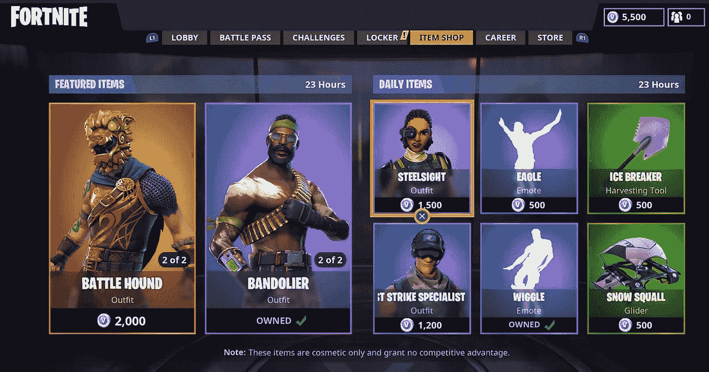

# 加密的下一个催化剂:游戏—第 1 部分

> 原文：<https://medium.com/hackernoon/cryptos-next-catalyst-gaming-part-1-e4b26676fbc7>

# **总结**

*   博彩业现在每年在全球创造超过 1300 亿美元的收入[。这是全球电影(](https://newzoo.com/insights/articles/global-games-market-reaches-137-9-billion-in-2018-mobile-games-take-half/)[406 亿](https://www.statista.com/statistics/271856/global-box-office-revenue/))和音乐产业([173 亿](https://www.musicbusinessworldwide.com/global-recorded-music-industry-revenues-grew-8-1-in-2017-to-reach-17-3bn/))总和的两倍多。
*   Twitch 等网站上的游戏直播流整体上比大多数传统运动和顶级运动员获得了更高的收视率和更强的参与度。游戏影响者是新的超级明星。
*   游戏开发商可以整合智能合同和不可替代的资产，以增强他们的项目基础设施，并产生新的收入流。不可替代的代币可用于创造透明的数字稀缺，刺激玩家参与，并允许资产所有权的安全和货币化。

看看 DappRadar，交易所已经被证明是迄今为止最成功的区块链应用。IDEX 一直是跟踪的 dapp 的第一名，保持着大约 2000 名每日活跃用户和每 24 小时大约 10，000 笔交易。在整个以太坊 dapp 生态系统中，只有大约 10，000 名日常交易用户。这与拥有数千万 dau 的顶级应用相比，仍然是杯水车薪。哪个部门最适合迎来下一波主流采用，在哪些明智的使用案例中，这种技术可以带来最大的价值？

Screenshot of the Ethereum dapp landscape from October 9th, 2018.

当你分析生态系统景观时，一个清晰的模式出现了。我们看到大量的区块链游戏进入或退出前十名。目前，几乎所有基于区块链的游戏都有简单的机制，无聊的游戏，并收取过高的费用。新版本发布后，使用量会出现短暂的飙升，然后很快就会看到用户群的减少。这是因为这些游戏大多缺乏深度，不太好玩。坦白说，他们很烂。

来自传统游戏行业的成功游戏掌握了留住用户和令人上瘾的游戏玩法的艺术。基于区块链的游戏正处于萌芽阶段，他们将区块链的功能融入到根本缺乏的体验中，与乐趣水平相比，入门障碍太高。这篇文章旨在为不熟悉游戏市场的规模和观众群的人提供入门知识，以及区块链的功能如何促进该行业的发展。

**基于 AAA 区块链的游戏**

随着这个行业的不断成熟，我们将会看到更多的 AAA 游戏开发商进入区块链游戏市场。随着教育和技术挑战的克服，许多人可能会采用轻触式集成，为游戏玩家创建一个有价值的功能，并改善所有权、稀缺性和次要物品交易方面的低效率。对于其他人来说，随着高质量游戏完全去中心化的力量开始激增，它可能会成为游戏的核心元素。令人兴奋的项目如[被解放的神](https://godsunchained.com/)、 [Axie Infinity](https://axieinfinity.com/#) 和 [Project Genesis](https://www.facebook.com/8circuitstudios/videos/1114165638730470/?fref=tag) 已经开始实现，展示了分散功能和高质量游戏的正确融合。

**1000 亿美元的游戏市场**

游戏行业之外的大多数人都严重低估了它的市场规模和影响力。领先的游戏行业研究公司 Newzoo 预计今年全球将有 23 亿游戏玩家，全球收入将达到 1370 亿美元。换句话说，游戏收入是全球电影([406 亿美元](https://www.statista.com/statistics/271856/global-box-office-revenue/))和音乐产业([173 亿美元](https://www.musicbusinessworldwide.com/global-recorded-music-industry-revenues-grew-8-1-in-2017-to-reach-17-3bn/))总和的两倍多！在过去的十年里，我们消费媒体的方式发生了巨大的变化。千禧一代不会和父母一起在客厅看《宋飞正传》的重播。他们在房间里玩视频游戏，看 YouTube 视频，或者在 Twitch 上观看他们最喜欢的游戏影响者的直播。

游戏市场包括从在火车上玩休闲手机游戏到在 PC 上玩激烈的竞技射击游戏的一切。就销售额和观众人数而言，亚洲目前是全球最大的游戏市场。直播已经迅速成为中国最热门的在线趋势之一，大部分观众都来自电子竞技，这是一个围绕世界上最具竞争力的游戏而兴起的蓬勃发展的行业。

电子竞技的在线观众水平增长非常快，共同代表了世界上最受欢迎的观众体育运动之一。这不是收集猫或压碎糖果。这些都是竞争激烈的现场赛事，需要瞬间决策，熟练的手眼协调，以及与队友数月的练习。这些比赛由联盟组织，并由全球数亿游戏玩家直播和观看。电子竞技是新的大学足球。

**直播游戏赛事正在超越传统体育项目**

你可能会问，谁会想看青少年点击鼠标玩电子游戏呢？结果是 Twitch 上每月有超过 2 亿人，YouTube 上[每天有 2 亿人](https://techcrunch.com/2018/09/18/youtube-to-shut-down-standalone-gaming-app-as-gaming-gets-a-new-home-on-youtube/)！亚马逊旗下的直播网站 Twitch 是美国第 14 大流量网站(全球第 35 大流量网站),每月托管 2M 个人流媒体。类似地，中国的一些网站，如斗鱼和虎牙的数量甚至更大。正如你可能从来不踢足球，但你喜欢看超级碗，游戏玩家喜欢看著名球员的游戏。观众可以通过聊天来学习和互动，这比传统的电视体育节目更有吸引力。

Twitch 由于其嵌入式聊天和提示系统，是最具吸引力的观看方式之一。流媒体工具的聊天框变成了一系列即时反应、其他流行笑话的参考资料，以及通过语音捐款和问答环节与影响者的直接互动。一个典型的 8 小时的著名流媒体将通过 Twitch chat 向玩家发送数千条消息和捐赠数百美元。streamers 用于捐款的附加软件之一 StreamLabs 在 Q1 支付了 3400 万美元的小费，比上一季度增长了 33%。

The infamous Drake & Ninja stream that broke the record for an individual stream with over 600,000 concurrent viewers.

观看传统电视的反应已经远远不如游戏。重播之间，令人压抑的商业广告，缺乏直播内容，没有办法直接互动，观看体验极其浅薄。有了像 Twitch 这样的流媒体网站，这种动态个性化的内容和与内容制作人实时互动的能力加深了体验，并为高调的活动和受欢迎的球员带来了惊人的收视率。

**电竞投资&收视率**

这是网络电视，收视率高得惊人。《英雄联盟》是世界上最受欢迎的竞技游戏之一，其全球总决赛观众达到了[3600 万独立观众](https://www.kotaku.com.au/2016/06/more-people-watched-league-of-legends-than-the-nba-finals/)。这比 2016 年 NBA 总决赛的 3100 万还要多。除了一个网络摄像头和丰富多彩的个性，个人游戏彩带正以令人难以置信的水平赚钱，并成为明天的超级明星。

投资正以狂热的速度涌入电子竞技领域。传统的运动队，如洋基队、T2 队、大都会队、T4 道奇队、牛仔队也投入了大量资金，围绕这些超级联赛的明星球员建立专业的基础设施。仅在过去的 12 个月里，像 TSM [这样的顶级团队就筹集了 3700 万美元](https://www.forbes.com/sites/mattperez/2018/07/24/tsm-raises-37-million-investors-include-stephen-curry-jerry-yang/#626fa2537f8a)，cloud 9[2500 万美元](http://www.espn.com/esports/story/_/id/21125519/esports-cloud9-receives-25-million-series-funding-wwe-hunter-pence-others)，Team Liquid[2500 万美元](http://www.espn.com/esports/story/_/id/23574675/team-liquid-parent-axiomatic-raises-25-million-series-b-investment)，NRG[1500 万美元](https://esportsinsider.com/2017/09/nrg-esports-set-close-15m-funding-round-j-lo-amongst-investors/)。这可能是世界上最有价值的人口统计，投资者急于利用这种增长。

**现场彩带是新的超级明星**

这种流媒体现象的中心是 Twitch 上最受欢迎的流媒体工具泰勒“忍者”布莱文斯。今年 4 月，忍者击败了克里斯蒂亚诺·罗纳尔多和沙克，成为全球社交活动最多的运动员。最近，说唱歌手德雷克加入了忍者的 6 小时会议的流行儿童友好射击游戏堡垒之夜。他们一起打破了 Twitch 的单个观众人数记录，在播出高峰时有 635，000 人同时观看。他们的视频流持续了大约 6 个小时，同时观看人数保持在 40 万以上，因此总的独立观看人数估计超过 300 万。这一收视率超过了预算数百万美元的热门电视节目，如吸引了 210 万观众的《西部世界》大结局。

Ninja garnered more Twitter interactions than any other athlete in April.

Ninja 每月有大约 15 万付费用户。基本订阅费为 5 美元，这使潜艇能够访问特殊的忍者主题聊天表情符号，在公共聊天框中他们的名字旁边有一个显著的标志，并能够向每个观看的人大声朗读他们的每月 resub 消息。Ninja 每月仅从 Twitch 订阅中就能获得超过 50 万美元的收入。他还有一个拥有超过 1800 万订户的 [YouTube 频道](https://www.youtube.com/channel/UCAW-NpUFkMyCNrvRSSGIvDQ)和超过 300 万 [Twitter](https://twitter.com/Ninja?ref_src=twsrc%5Egoogle%7Ctwcamp%5Eserp%7Ctwgr%5Eauthor) 粉丝，他正在利用这个频道赚钱。这还不包括他拥有的任何主要的非地方性企业赞助，如[红牛](https://esportsobserver.com/red-bull-ninja/)、 [PSD 内衣](https://esportsobserver.com/ninja-psd-underwear/)，以及最近的 [UberEats 交易](https://esportsobserver.com/ninja-uber-eats/)。

**堡垒之夜热**

Twitch 上流量最大的游戏《堡垒之夜》打破了多项记录。今年三月，堡垒之夜获得了 2 . 96 亿美元的收入，主要来自于销售兽皮。皮肤是游戏中的物品，可以改变你的角色的外观。它们不会让你的角色变得更强大或更有可能获胜。皮肤仅仅是一种审美升级，可以向其他玩家炫耀，让你的角色与众不同。这款游戏可以免费开始玩，游戏商店会在一周内发布新的皮肤，通常每张 10-20 美元。

随着堡垒之夜在 Twitch 上如此受欢迎，游戏公司现在正在招募大牌明星在这些令人垂涎的人群面前播放他们的新发布。我们已经看到像 [Geico](https://www.geico.com/more/geico-community/news-events/gaming-ambassadors/) 、 [Mastercard](https://esportsobserver.com/riot-games-mastercard-global-sponsorship/) 和 [Samsung](https://esportsobserver.com/ninja-samsung-commercial-video/) 这样的非本土公司投入大量营销费用来吸引有影响力的人。经常听说大型游戏公司为了推广一款新游戏每小时可以获得 2000 美元的报酬。

在最初推出不到一年的时间里，这款游戏现在拥有 1 . 25 亿玩家，并宣布计划在 2019 年通过直播竞技活动发放 1 亿美元奖金。这款游戏如此受欢迎，以至于家长们现在开始招募家教来帮助他们的孩子在游戏中脱颖而出。超过 200 份离婚申请中甚至提到了堡垒之夜。

**卖兽皮是大买卖**

当你想到“收藏品”这个词时，它通常指的是一件实物，比如运动衫或一张罕见的棒球卡。全球传统收藏品市场在 2016 年创造了超过 3700 亿美元的收入。就像一个篮球超级粉丝愿意花 10 万美元购买迈克尔·乔丹在他 1997 年著名的“流感比赛”中穿过的鞋子[，游戏迷也可以类似地痴迷于收集独家数码纪念品。](https://www.businessinsider.com/michael-jordans-flu-game-shoes-sold-at-auction-for-100000-2013-12)

今年早些时候，一名电子竞技爱好者支付 61，000 美元为他的游戏内步枪购买了一个罕见的皮肤，该皮肤属于一名刚刚赢得一场重要反恐精英锦标赛的著名玩家。虽然这是游戏中化妆品的最高价格之一，但皮肤交易市场已经蓬勃发展了多年。根据 Narus Advisors 的报告，2016 年，游戏玩家在皮肤交易和赌博上花费了相当于近[50 亿](https://calvinayre.com/2017/01/24/business/esports-players-wagered-nearly-5-billion-csgo-skins-2016/)美元。市场已经很大了，而这仅仅是几款游戏的结果。

This rare skin previously, owned by Counter-Strike player Skadoodle, sold for over $60,000 after his team won the ELeague Boston Major tournament.

像堡垒之夜这样的游戏有一个封闭的物品系统，物品不能转让给其他玩家，也不能出售。这就造成了一种情况，你的数字产品的价值被困在特定游戏的经济中。物品不能被清算，玩家不能将他们的数字财富转移到其他游戏系统。像反恐精英这样的游戏普及了可交易的皮肤，并催生了数十亿美元的市场，但我相信这只是一个开始。如果有一种方法来增强这种蓬勃发展的项目基础设施，并为游戏世界带来真正的数字稀缺，会怎么样？

**区块链游戏用例**

游戏行业可以成为主流消费者采用区块链应用程序的教育特洛伊木马。作为一个游戏玩家和狂热的密码爱好者，我相信这两者之间有很强的相关性。游戏玩家已经掌握了数字资产交易的概念，并对技术有足够的了解，能够及早适应新趋势。到目前为止，游戏已经是最大的娱乐媒体，它的成熟来自区块链的颠覆。

在 dapp 的采用非常缺乏的时候，游戏行业可以成为我们的行业展示一些真正有用的应用程序的渠道，这些应用程序可以增强游戏玩家的体验。第 1 部分探讨了我认为最容易实现的不可替代的令牌。通过使用不可替代的代币在游戏中创造透明的数字稀缺，增强数字资产的交易基础设施，并利用 Twitch 流现象来教育和接纳新用户。

**不可替换的令牌**

最近几个月，数字收藏品在区块链空间获得了巨大的兴趣，这主要是因为 CryptoKittie 的成功带来了不可替代令牌(NFT)的激增。简而言之，不可替换令牌是一种特殊类型的加密令牌，用于表示唯一的数字资产。如果你给某人一张 20 美元的钞票，而他们找给你两张 10 美元的钞票，你们都明白这是完全相同的价值。金钱具有可替代性。如果你把你的车给我，我给你带回同样的品牌和型号，但它不是“一样的”，这些物品在价值上是不可替代的。

Different types of collectibles from physical to digital.

无论是第一版的《x 战警》漫画书、原创艺术品、签名的迈克尔·乔丹运动衫，还是数字交易卡，NFTs 都可以跟踪和代表各种资产的所有权。传统的游戏产业已经习惯了带有皮肤和传奇物品的独特资产的概念。目前，游戏物品不是使用区块链或类似的公共追踪系统创建的，所以没有办法区分两个看起来一样的东西。此外，游戏中有价值的物品通常是不可交易的，也没有游戏创作者的透明发行机制。这创造了一个人为稀缺的世界，不得不相信开发商的所有权历史。

**将 NFT 应用于游戏经济**

有数以千计的数字物品看起来一样，但由不同的玩家拥有，并有不同的所有权历史。某个物品可能已经被一个世界冠军拥有，这给了它额外的价值，类似于世界职业棒球大赛中一个亲笔签名的本垒打球。如果没有某种数字签名，就不可能知道哪个确切的物品属于一个著名的游戏玩家，除非你直接要求游戏开发者验证其真实性。

理解一个世界冠军或著名的流媒体工具所使用的数字项目的普罗维登斯是一个强大的功能，可以为数字电子竞技纪念品和“名人皮肤”创造一个巨大的市场。不可替换的代币充当独特物品的数字表示，允许这种类型的供应和真实性的透明验证，而不必信任游戏开发者。发布日期带有时间戳，总供应量可通过 block explorer 获得，供任何人独立验证。玩家真正拥有他们的资产，因为他们可以在游戏之外放在个人钱包里。

启用区块链的项目甚至可以延续到流行游戏的续集中，或者代表两个不同游戏中的两个独立项目，[创造一个多元宇宙](https://blog.enjincoin.io/what-is-a-gaming-multiverse-b8718f16aba7)就像金恩正在做的那样。更进一步，NFT 甚至可以“拥有”其他 NFT。在这种情况下，传输令牌组合意味着传输整个项目层次结构，类似于捆绑包。一个由相互关联的游戏经济和真正稀有的资产组成的可互操作的世界正在迅速发展。

**创造真正的数字稀缺**

在目前的范式下，游戏开发商就是自己的央行。它们在内部不透明地规定了一种商品的供应量以及可以购买的数量。这通常意味着无限量。这些物品被人为地变得稀缺，为游戏玩家创造了他们资产未来价值的不确定性，而这些资产在大多数情况下也是不可转让的。对于每种物品目前的数量和通货膨胀率，没有公共供应上限。给游戏内经济带来更高的透明度是一大进步，对于知名游戏开发商来说将变得越来越重要。

中小型游戏工作室一直在寻找方法来引入有趣的新游戏机制，以与堡垒之夜这样的行业巨头竞争和区分。能够将真正的数字稀缺性应用于稀有物品，对于已经蓬勃发展的皮肤市场来说可能是一个巨大的福音。对于游戏玩家来说，其结果是更安全的资产所有权，可靠的交易环境，以及可核实的稀缺收藏品。彩带和游戏开发商可以使用这些独家项目，通过小费和礼物来加强营销活动。

Example of weekly skins and cosmetics from Fortnite.

选择创造一个物品作为 NFT 的游戏开发者对该物品的供应和血统做出了可信的承诺，玩家可以独立验证。在我看来，有一种对某些开发者的鄙视，他们过分依赖于出售无限数量的皮肤，并禁止开放的交易系统。这将是游戏行业内关于透明度的更广泛道德讨论中的一个巨大进步，并允许玩家将其资产货币化。

**新的收入来源:二级交易收入**

有很多关于开放游戏内经济到二级交易是否会增加市场的整体规模或蚕食销售的讨论。虽然双方都有道理，但我认为，拥有一个开放的系统，让玩家可以交易高流动性的资产，并在生态系统之间转移数字财富，会加深这种体验。玩家们会觉得更有必要花更多的钱，因为他们知道他们不会在游戏中的所有购买上 100%亏损。市场在很大程度上是不可信的，基于智能合约的市场开辟了新的收入来源，并使交易对玩家来说是一个更安全、更有保障的环境。

开放系统创造了一个积极的反馈循环，玩家可以从游戏中获得实实在在的回报，他们可以将这种价值货币化。正如在《反恐精英》和《魔法聚会》等游戏中看到的那样，广泛采用的开放式项目系统为交易和赌博创造了一个强大的二级市场。当应用于竞技游戏时，这将导致事件的更高收视率，因为在线观看会更有趣和更有吸引力。游戏开发商一旦采用开放系统，就可以通过利用基于智能合约的市场来获取二级市场收入。

大多数反恐精英项目的交易和赌博发生在第三方，完全集中的市场。这些灰色市场在游戏开发商的控制之外运作，尽管交易费用很高(通常为 15 -20%)，交易量高达数十亿美元，但开发商却没有任何收入。如果游戏开发商将这种二级交易引入内部，他们可以获得数百万美元的交易费收入。所有交易都将被自动跟踪和执行，从而减少欺诈。卖家、开发商(以及潜在的流媒体)之间的收入分成，以及所有权历史等有价值的数据，都将被透明地纳入其中。

**增加直播的参与度**

我最喜欢的潜在用例与抽动流光现象密切相关。游戏开发者可以创建 NFT 皮肤，并将其分发给著名玩家，以分发给他们的流媒体社区和现场活动。这将增加游戏推广的投资回报率，正如我前面提到的，游戏推广正日益成为推广新游戏和传播品牌意识的主要营销手段。

堡垒之夜背后的开发商 Epic Games 可能会发布 1000 套限量版忍者品牌皮肤，以庆祝他最近的锦标赛胜利。忍者会把这些皮肤送给他的观众，并向他们展示如何操作钱包。赢得或赢得这些独家物品的观众可以在游戏中使用它们，或者选择在市场上出售它们。想象一下对 100，000 名现场观众使用 MetaMask 演示忍者的采用情况。虽然已经是印钞机的堡垒之夜不太可能选择这样做，但下一个堡垒之夜可能会。

CNBC interviews Ninja on Fortnite success and making over $500,000 per month on Twitch.

NFT 兽皮是真正的稀有收藏品。唯一标识符是区块链上的数字签名，将用于证明职业玩家所有权的真实性，而不必依赖游戏创作者的直接验证。我相信，这种透明的发行和流动的可交易性将在数字领域创造出类似于职业玩家纪念品的东西。玩家可以追踪到忍者在游戏中穿的或者拍卖给慈善机构的皮肤。一个很好的类比是勒布朗·詹姆斯在 NBA 比赛中脱下他的球衣，在上面签名，然后分发给一个球迷。

**教育&融合**

有很多理论在酝酿，但传统游戏行业的主要参与者还没有做出重大举措。不幸的是，大多数大型游戏开发商仍将区块链视为一个新兴产业，早期涉足其中既危险又令人困惑。正因为如此，中小型游戏开发商将率先尝试这些新功能。他们更有可能在早期采用新技术，以便与世界上的暴风雪和暴乱游戏竞争。

用户入职可能是目前行业最大的痛点。在像比特币基地这样的坡道上是解决这个问题的一小部分，但我们需要尽可能少的步骤使装载和使用钱包变得无痛。可伸缩性虽然通过创建私有侧链得到了部分解决，但仍然没有在大型游戏中得到演示，并且需要一个块浏览器供公众验证事务。开发者 API 工具和侧链解决方案，如[【金恩】](https://www.enjin.com/api)和 [Loom Network](https://loomx.io/) 应该有助于在不久的将来缓解这个问题，随后是[分片](https://www.ccn.com/vlad-zamfir-codes-sharding-prototype-what-it-means-for-ethereum-scalability/)的长期发展。

在这个早期采用者阶段，教育将是关键，因为游戏质量平平，主流入职障碍重重。游戏产品团队和上层管理人员需要熟悉集成要求和加密世界。说 ERC-721 不可替代代币是失去某人注意力的最快方式，所以更周到地使用限量版项目和流光皮肤等营销术语是更好的方法，仍然可以向主流玩家传达这一概念。

**区块链游戏的未来**

我预测在接下来的 5 年里，我们将会看到一个大规模的魔兽世界风格的游戏，它很大程度上是分散的，并被数千万玩家所采用。游戏玩家的中产阶级，那些每月收入不到几十万美元的人，应该得到更好的 AAA 级大片游戏。一个去中心化的魔兽世界，采用激进的透明度，给玩家提供将他们的数字资产货币化的方法，是杀手级游戏应用。看到这样的游戏获得成功，将会激励世界上最大的游戏开发商采用这项技术。

虽然我不认为我们还没有到那一步，但看着第一人称射击游戏像 8 Circuit Studio 的 [The Genesis](https://cryptobitgames.com/8-circuit-studios-announces-project-genesis/) 一样出现，将第一人称射击游戏和太空探索正确地结合在一起，让我对未来感到兴奋。我已经看到一些非常有前途的项目在今年晚些时候进入市场，比如由 Fuel Games 制作的策略数字纸牌游戏[和](https://godsunchained.com/)。《被解放的上帝》在过去几个月里一直是排名前五的游戏，只有打开包装的功能可用。

我期待着在 Fuel Games 称之为世界上第一个基于区块链的电子竞技中，用我充满传奇色彩的证明是罕见的卡片赢得每月的 ETH 锦标赛。这些已经流行的游戏(这里是炉石)的分散式“分叉”通过允许大多数玩家真正拥有和出售他们的稀有物品，为他们提供了更好的赚钱可能性。

Promising blockchain games I’m keeping my eye on.

**结论**

游戏资产的令牌化是一项明智的技术进步，它将把透明的数字稀缺引入游戏经济，并增强玩家交易和货币化他们有价值物品的方式。搭配流行的 Twitch 彩带来帮助教育大众，NFT 物品可以创造更深层次的玩家参与和对可验证的稀缺收藏家物品的欣赏。

游戏玩家应该越来越要求这种类型的透明度和问责制，因为开发者对他们游戏的经济和竞争基础设施保持了太多的控制。尽管顶级游戏公司的股票价格在过去 5 年里上涨了 [300% — 600%](https://www.fool.com/investing/2018/08/13/if-you-invested-1000-in-these-4-video-game-stocks.aspx) ，但玩家却没有获得切实的回报，这为一款颠覆性游戏赢得数百万玩家提供了巨大的机会。

像[区块链游戏联盟](https://www.livebitcoinnews.com/ubisoft-consensys-and-others-unite-to-form-blockchain-game-alliance/)这样的组织是帮助教育全球成千上万游戏开发者的优秀举措。在一个理想的世界里，普通玩家不需要成为使用钱包或在交易所进行第一笔交易的专家，就可以开始与智能合约互动。区块链的功能应该被抽象出来，用来创建游戏玩家喜欢的有用的功能，同时又不妨碍游戏的趣味性和可用性。深思熟虑地将区块链理工大学应用于拥有数百万用户的 AAA 级游戏将极大地提高知名度，并迎来下一个一百万区块链用户。