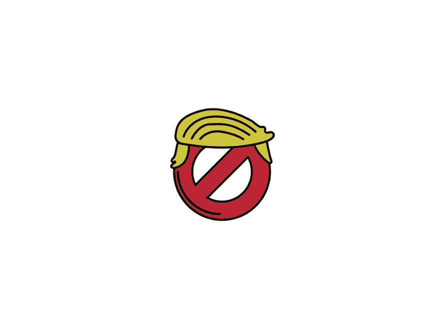

# Crypto 的政治硬币“烫手”

> 原文：<https://medium.com/hackernoon/cryptos-political-coin-was-too-hot-to-handle-cdc3e8b5b991>

> 亲爱的读者们:
> 
> 下面是我写的一个非虚构的故事，讲述了我在 2017 年底开发、品牌化和推出加密货币的经历，灵感来自对加密的狂热。我认为有必要在前言中提到，我不是一个有政治动机的人，而是一个想看看一个想法能走多远的人。
> 
> 就这样，享受吧。
> 
> 肖恩

*Fuck Trump Coin (FTC) Logo*

# WWIII 就在一条推特之外

*2018 年 5 月 13 日，ICO 前 2 天*

当我拖着满满的文件和笔记本电脑奔向我的汽车，与欧洲最大的加密货币交易所之一的开发副总裁贾希德进行紧急电话会议时，我的 fuck-you 人字拖拍打着沥青。当我在当地公共图书馆(也就是我的办公室)的地下室对我们的测试服务器进行冒烟测试时，我被他刚刚发给我的短信弄得晕头转向。我需要隐私来接电话。

“肖恩，删除你的最后一条推文…我们会在几分钟内打电话给你。”正文如下。

“呃……我说什么了？我们是谁？”我以为。

六周前，在贾希德的老板、该交易所的首席执行官和他的助理主动联系我，提出主办我的加密货币“去他妈的特朗普币”(FTC)的首次硬币发行(ICO)之后，我“见过”了贾希德——想想让一家私营公司上市吧。该交易所拥有 50 多种加密货币，日交易额达 2000 万美元，在国际上也很活跃。与这个交易所合作是我的项目的重大突破。

首席执行官看到了我和 FTC 的潜力，为我的团队提供了 12 名全职开发人员，并免除了 80，000 美元的集成成本，以便能够参与我的项目。我们协商了一个创造性的支付结构，在 ICO 中筹集的一定比例的资金将由交易所保管。谈判成功后，首席执行官的助理贾希德和我花了数周时间敲定每个细节，将我的 ERC20 令牌与他们的平台无缝集成。到最后，我们有了一个计划，确保一个良好的技术基础和一个清晰的路线图来吸引投资者。

离 ICO 只有两天了，贾希德和我一致认为我们越来越接近了，所以我发了一条推特给全世界…

在我的车里安顿下来后，我的电话响了。我让它在我的手掌里振动了一会儿，吸了口气，然后接受了电话。我在电话的另一端遇到了一大群人，当我参加会议时，他们又吼又叫。我听着贾希德或首席执行官助理的声音，但听不出任何声音，也听不懂任何话语，直到…

“各位，操特朗普币的肖恩加入了通话…他只会说英语。”我终于听出了一个声音——贾希德。

一时间，谁喊得最响的竞争变成了窃窃私语。平静是短暂的，随后又是一波口头攻击，“浪费！”

我听到背景中不时传来报纸的声音，有人大喊:“乱七八糟！…川普…支持团队来电！”哭喊声伴随着一种我听不懂的语言发出的不分青红皂白的叫喊声。

我把电话从耳朵上拔了下来。“呀，为什么有这么多人打这个电话？”我以为。

我 10 分钟前发布的推文无非是宣布在该交易所的平台上推出 FTC，并鼓励我的观众创建交易账户，以便他们可以参与我的项目将于两天后举行的 ICO。我不知道用户和投资者会给交易所的支持团队打来大量电话。不断的电话促使公司召开紧急会议。

我拿着电话坐在车里，一顿接一顿地打，等着轮到我说话。没过多久，我就意识到不会有缓刑了。我强行加入了这场激烈的对话，并解释了事件的时间线以及我与平台的关系，从我第一次被接触到我们通话的那一刻开始。经过几分钟的过度解释和坚持我的立场，我实际上感觉很好。

*砰砰！随着另一个语言障碍的破裂，我的信心瘪成了一个用过的气球。在这些毛茸茸的东西中，我能够辨认出一个完整的英语思维，“政治太热了。”*

我喘着气，因为思想和图像淹没了我的脑海。当我把手机扔到汽车地板上时，我喘不过气来。

*点击*，通话结束。

“我会坐牢吗？有可能从另一个国家被逮捕吗？引渡就是这个意思吗？我引发了一起国际事件吗？那实际上有点坏男人…不，不是，笨蛋！第三次世界大战？?"恐慌蒙蔽了我的双眼，我的脑海里闪过我认为可能发生的每一个可怕的结果。

*sluuurp*

嘎吱嘎吱嘎吱

用黄油般的手指，我检查了我的手机。这是 2018 年 5 月 15 日星期二下午 12 点 40 分，我是当地电影院唯一的赞助人，看着灭霸不择手段地追求六颗无限宝石。在我的世界因为 20 分钟前我离开的电话会议而崩溃后，剧院是我唯一能想到的地方。我独自一人，在黑暗、寒冷的礼堂里，拿着我花了 12 美元买的*我讨厌自己*大小的爆米花，克里斯·海姆斯沃斯把他那该死的动画赶出去陪我。

我想理清思绪，享受这部电影，但当我焦急地吞下我的零食时，我的想法尖叫着四处游荡，“我怎么能像那样谈判另一个伙伴关系呢？我留下一切来建立的东西正在死去，我不认为这次它能被拯救。”当我把另一把爆米花塞进嘴里时，我的思绪停顿了一下。

"哦，西妮，你这个笨蛋……怎么一切都分崩离析了？"我问一个独眼半死不活的雷神。

30 分钟后，我知道我不会进入这部电影。于是，我把脚支在前面空座位的头枕上，重走了项目的每一步。

# 啜饮着库尔助手

*2017 年 10 月 9 日:ICO 前 220 天*

2017 年 10 月 9 日，我在比特币上花了 2500 美元。为什么不呢，对吗？我和其他 50 名错位的聪明人一起站在罗纳德·里根华盛顿国家机场号的停机坪运输机上。离开一周后，我乘飞机回家，在一家企业内容管理软件公司做旅行解决方案工程师。像我这样学历的人最理想的毕业后工作。装在运输工具里，沙丁鱼式的，我们都急于赶上去克利夫兰的飞机，并对 15 分钟的延误感到恼火。

那周在华盛顿与一位特别难相处的客户打交道，让我筋疲力尽，一败涂地。老实说，我只是很高兴离开这座城市，带着疲惫的呼吸，转向我的手机，在我的生活中寻找一盎司的控制权。通常情况下，我会打开我裸露的玫瑰金 iPhone 7，上面有破裂的屏幕和剥落的屏幕保护器，启动 Tumblr 社交媒体应用程序，并记录我的社交媒体品牌 Cwote 在一天中积累了多少通知和关注者(或者自从我上次检查以来，每五分钟一次)，希望这个数字足够高，足以引发我大脑中的多巴胺下降…

但一周前，它被一位居住在温哥华的韩裔加拿大企业家收购。

不幸的是，社交媒体的关注者并不太值钱。即使参与度很高，171，284 名粉丝兑换 2，495 美元的汇率也没能让我辞掉工作。但是额外的钱总是好的。当你得到额外的钱时，唯一合理的做法是什么？

*花掉它。*

我们就像行驶中的运输工具铁罐里的沙丁鱼，随着停机坪上的每一次颠簸而摇晃。拿着手机，我启动了 AppStore，然后下载 CoinBase 来输入我的银行信息。在我意识到之前，我已经站在购买比特币的屏幕前，准备扔掉——我是说投资——尽可能多的钱。由于账户未经核实，我每周的存款限额是 2500 美元，足够支付 0.54 BTC。我想买一整枚硬币，但我愿意尽我所能。

我抱着运输工具的立杆，站在那里盯着购买屏幕，等待确认或拒绝一项尚未提交的交易。我的拇指停留在完整的购买。我在等待勇气。结果，我所需要的只是在柏油路上开一个深深的裂缝，来激发巴士的颠簸。手里拿着手机，我的身体向前倾斜，与站在我前面的乘客相撞。在机舱安顿下来后，我向被我撞到的先生们尴尬的道歉，然后我看了看我的手机。在我模糊疲惫的脑海中，购买屏幕上的字母重新排列了一下，

“你还在等什么？”他们嘲笑我。

我曾经空空如也的 CoinBase 钱包现在装满了超过一半的比特币，一半是我一无所知的东西。当我意识到这一点时，一阵激动人心的焦虑被一阵兴奋所平衡，淹没了我。

我已经正式啜饮了库尔助手…它是美味的。

# 大口大口地喝着饮料

*2017 年 10 月 29 日:ICO 前 200 天*

到家后，我立即开始消费[的加密](https://hackernoon.com/tagged/crypto)内容。金钱是一个巨大的动力，我必须知道我的未来。渴望了解[区块链](https://hackernoon.com/tagged/blockchain)的方法和原因，我在 Reddit 的 [/r/Cryptocurrency](https://www.reddit.com/r/cryptocurrency) 上吃零食，在 YouTube 上看视频，边吃边听 TED 演讲，啜饮丹尼尔·杰弗里斯[的中型史诗](https://medium.com/u/618a7c78c957?source=post_page-----cdc3e8b5b991--------------------------------)，此外还加入了播客的碎屑和与精明的同事的对话。这不是一个选择，我必须知道更多。有一个新的副业也不错。

下班后，我花了无数个晚上来吸收堆积如山的新信息，没过多久，我就变得在办公室里让人无法忍受，对同事们说教，好像这是基督的第二次降临。

# 公牛队

*2018 年 12 月 4 日:ICO 前 162 天*

到了 12 月，比特币的成功赶上了主流，促使我的同事和我一起投资。很快，我们中的一小群人会在会议和客户电话之间，坐在办公桌旁讨论新硬币、先进技术和货币的未来。比特币突破每枚 1 万美元的那天，我大摇大摆地走进办公室，有领衬衫的扣子比平时低了一颗，迎接我的是一轮又一轮的击掌。我们的收获不足以让我们放弃事业，但即便如此，我们还是觉得自己破解了生活中的一个秘密代码。

我们度过了 8-10 周的永无止境的牛市，在绿色中睡觉，醒来时更绿。当我们急切地将越来越多的钱投入到蓬勃发展的生态系统中，收获立竿见影的收益时，我的手因为无休止的击掌而变得酸痛，我的脸颊因为无尽的兴奋而开始抽筋。

疯狂永远不会结束…直到它结束。

# 熊队

*2018 年 1 月 16 日:红色星期二&ICO*前 119 天

红色星期二将永远留在加密的耻辱堂中，因为前 50 种加密货币中有 49 种变成了深红色。我的同事们的士气随着各自投资组合的价值而崩溃，每一个投资组合都像上涨时一样暴跌。我的投资组合也不例外，因为曾经繁荣的收益花园已经变成了和我的同志们一样荒凉的荒地。

通过耀眼的红色和无尽的 FUD 关于加密市场的文章，很难保持乐观，但我还是忍不住看到了一个具有未实现潜力的全球市场。我的好奇心战胜了恐惧。

到一月底，密码市场继续全面崩溃。几周前的击掌感觉就像一场梦，我开始回忆 12 月的牛市和登月。通过对“光辉岁月”的回忆，我讲述了一天下午我和同事们的一次谈话，当时他们正在市场的草坪上。通过靠运气获得的信心，我们一致认为我们想做的不仅仅是投资。

我们想要我们自己的硬币。

# 一朵玫瑰换成别的名字就不会那么甜美了

*2018 年 1 月 29 日。ICO* 前 106 天

回到去年 12 月，我和我的同事们被 1000%的 altcoin 收益蒙蔽了双眼，只配备了一些流行词汇，FOMO、FUD、权力下放、HODL 和 MOOOON！。很明显，我们对实际支持加密货币的区块链框架知之甚少，但却天真地认为我们无论如何都可以启动一个加密项目。没有改变区块链生活的应用程序或进步的代码库，我们唯一的希望是创造一个可以大声喊着*真的*、*真的*的硬币。也是在 12 月的牛市期间，我开始注意到脖子后面有一个兴奋的瘙痒表面，推动着每一次对话。

“嘿！”我从电脑前抬起头，看到了我的同事兼加密员 Asher 的大眼睛和厚颜无耻的微笑。那是红色星期二后的两个星期，从那以后，我和强盗们的秘密对话就消失了。我们都回去专注于我们的日常工作和我们作为解决方案工程师的真正未来。

“老弟！”他扬起眉毛以示强调。"我今天在推特上浏览，突然想到了这个."

我困惑的脸丝毫没有阻止阿瑟的热情。他继续说道，“还记得那些对试图进入美国的移民实施的旅行禁令吗？那些家庭在机场被扣为人质，每个人都很困惑，他们都对唐尼感到愤怒。”他停下来，吸进空气喘口气。“那是我们的硬币人！一枚硬币对抗川普！”

诚然，我在政治上很幼稚(现在依然如此)，但我明白唐纳德·特朗普是全世界激烈辩论的中心。从最左翼的自由派到右翼的保守派，特朗普激发了无止境的喋喋不休，每个人都有自己的观点。

我很好奇。

“这可能只是工作的人。”我的心思漫游为我的脖子熟悉的痒重新浮现。

不到一天后，我和同事们又聚在同一个办公桌前，讨论我们的新想法。

“人们绝对讨厌这个家伙！”阿舍辩解道。

“男孩们听着，我们只需要让我们的硬币的市值高于特朗普的净资产！”鼓励另一位兴奋的同事。“那我们套现！”

我们之前的热情复苏受到了热烈欢迎，但我似乎是唯一一个意识到我们没有人知道如何编写加密货币代码的人，我也不相信我的同事有兴趣学习如何编写。如果这个项目有任何公开的机会，我们中的一个必须学习。

随着每一个新的标题打击川普和他的政府，我们的热情倍增，因为我们看到了一个机会，可以用我们总统的每一个“于戈”来推销我们未创造的硬币是的。特朗普并不愚蠢，我们知道只要他在任，他就会处于人们思想和智能手机的最前沿。

我脖子里的烦躁加剧了，因为我的思想继续溃烂关于我们未创造的秘密的病毒的可能性。只有当我被工作分散注意力时，我才感到宽慰，但不幸的是，我的日常工作并不是补救措施。随着一月的慢慢过去，我记得我越来越期待下午 5 点，这样我就可以跑到停车场开车回家做研究。

我在执行任务。

在反特朗普标题和更加绝望的学习欲望的推动下，我开始了我的新秘密切线。很明显，如果这个项目要超越笑声中的美元符号的对话，我就需要找出方法。我的研究从市场条件转向了开发框架和加密货币参数。

在大学里，我在两门面向对象编程课上表现很好，但我不是开发人员，区块链也不是面向对象编程。因此，我开始在我面前的加密山的底部攀登，以“ [What The Func](https://www.youtube.com/channel/UC0Wu-J4_SoFOYVKA8JRuRRg/about) 的 YouTube 视频作为我的向导。主持人展示了使用其 ERC20 协议将新的加密货币部署到以太坊的区块链是多么简单。但他的视频遭到了我不熟悉的术语的地毯式轰炸，迫使我每 30 秒暂停一次视频，谷歌一个术语，注释一篇文章，详细说明这个术语是什么以及它为什么对 cryptos 重要，然后导航回 YouTube 继续播放视频。随着我开始理解，这个过程将每 15 分钟的视频变成了一部故事片。

在花了数不清的时间观看视频，阅读以太坊网站上的源代码，并在以太坊的 Ropsten 测试网络上部署了一个装满失败代码的垃圾箱后，我有了我完美的 shitcoin 的完美代码库。我知道我的 ERC20 智能合约背后没有先进的技术，而是带有一种类似于 1970 年代宠物石的新奇感。如果我没有成功复制加里·达尔(Gary Dahl)的惊人成功——他在 1975 年以每块 4 美元的价格出售了 150 万块宠物石——在最糟糕的情况下，FTC 项目可以教会我加密货币的商业一面。我能失去什么？

最后，去他妈的特朗普币(FTC)，其供应的 73，500，000 枚代币代表了在 2016 年美国总统大选中投票反对特朗普-彭斯的每个美国人，现在可以在以太坊的 block explorer 上搜索， [EtherScan.io](https://etherscan.io/token/0xfbe0e9846bd736b84a0a973322ad2a1fc8d7e5ca) 。在公共区块链上拥有自己的空间，世界上任何人都可以搜索和交易，这种感觉是整个项目中许多有益体验的第一个。

# 我有我的产品。是时候辞职了。

*2018 年 2 月 9 日:ICO 前 95 天*

傲慢是一种可恶的东西。带着我漂亮的大学学位，带着《财富》100 家最佳雇主之一签发的近两年的薪水，带着一个 22 岁年轻人盲目的乐观，是时候辞职了！

对我来说不幸的是，在那个星期一的早上，上述的招摇并没有完全到达我老板的办公室。

当我递交两周前的辞呈时，我像一副扑克牌一样折叠在他的办公桌上。这是一场灾难，声音颤抖，手心出汗，尤塞恩·博尔特在完成 100 米短跑时心跳加速。我的老板很震惊。但他祝我一切顺利，并说如果不成功，欢迎我回来。

告别和祝福过后，当我最后一次离开办公室走向我的车时，我的喉咙哽咽了。我没有合伙人，也不知道如何让 FTC 运转起来。

# 我做了什么？

*2018 年 3 月 5 日:ICO 前 71 天*

现在是 2018 年 3 月初。在我克利夫兰的公寓里，我穿着失业运动裤坐在笔记本电脑前，一边啜饮着我犯了一个错误的咖啡，一边盯着 FTC 的 Twitter 账户，看着它的零粉丝。

“我以前做过这个。社交媒体很简单肖恩，只要选择你的观众，你的内容和他妈的去！”，当我开始回顾为 Cwote 建立一个成功的社交媒体社区的步骤时，我心想。

2015 年春天，我在俄亥俄大学读二年级。最近，我离开了之前的刺猬饲养员兼职，开始寻找另一个项目。令人惊讶的是，社交媒体是我在 2013 年高中毕业后忘记拥抱的东西。我没有使用脸书，我没有发推特，tumbl 或者 gram。老实说，我对社交媒体一无所知，但这是我希望在经营 breedery 时能够熟练掌握的东西，所以我决定为我的下一个项目，我要成为一名社交媒体大师。

当我在寻找一个平台来托管互联网的下一个病毒式社交媒体账户时，我看到了 YouTuber，Lazy Ass Stoner，关于未被充分利用的平台 Tumblr 的一个视频(本质上是一个匿名 Instagram 和 Blogger.com 的婚姻)。作为一个焦虑的青少年，只剩下几个小时了，我在 2015 年 4 月 15 日，我 20 岁生日的前夕，创建了我的 Tumblr 账户 Cwote，拥抱了这种社交媒体反主流文化。

在遵循了 Lazy Ass Stoner 的 how-to 视频中概述的步骤(并在我认为合适的地方进行了修改)之后，仅仅几个月的时间，Cwote 就从 0 名粉丝增长到了可观的 21，000 名活跃粉丝。虽然这需要相当多的工作和日常纪律，但我惊讶于社区围绕我的内容发展得如此之快。

*还是 2018 年 3 月 5 日。*梦想以前的成就是一种简单的逃避，在两个小时讲述 Cwote 的成功和漫不经心地观看 YouTube 视频后，我除了喝第三杯咖啡，什么也没喝完。我开始质疑自己辞职时的判断力——一份我擅长的工作，一份报酬丰厚的工作，一份我有一个很棒的老板和迷人而有才华的同事的工作。我离开了一家很棒的公司，在那里我可以建立自己的事业。另一场恐慌淹没了我。

“妈的。”回荡在我散漫的脑海里。

正是在这一连串的自我怀疑和焦虑中，我想起了 Cwote 在 Tumblr 上最简单、最分享的帖子之一:

“第一步是最难的，但永远是最重要的。”

这句话的各种版本已经在互联网上被分享了数百万次，这种情绪非常模糊，几乎适用于生活中的任何情况。它提供了一种平静和内疚的混合感觉，激励我回去工作。

于是我照做了。我不确定地向前走了一步，努力不回头看。

# 在山脚下

*还是 2018 年 3 月 5 日:ICO 前 71 天*

周一，我匆匆离开了星巴克(Starbucks)《轻度烘焙》和《激励》( Motivation)YouTube 视频记录了像“摇滚”德怀恩·约翰逊(Dwayne Johnson)、凯文·哈特、罗布·迪戴克(Rob Dierdek)等人这样的骗子的成功职业生涯，开始构思联邦贸易委员会针对 Twitter 的内容策略的第一个版本。在我接触过的所有社交网络中，Twitter 位于图腾柱的底部，仅次于 LinkedIn 和脸书。尽管我在 Reddit、Telegram、YouTube 和 Medium 上开设了 FTC 账户，但我觉得 Twitter 是开始品牌建设的最佳平台，因为它与我所掌握的 Tumblr 平台最为相似。它也没有伤害，Twitter 是一个活跃的加密社区和唐纳德的肥皂箱的家。

## 电阻不买密码

我创建社交媒体品牌的第一步是“受众识别”。知道我将为谁创建内容将有助于集中我将分享的内容类型。有了“去他妈的特朗普币(FTC)”这个名字，*很明显*热情的特朗普抵制者将是第一批接受并团结在我的项目周围的人。转换成本可以忽略不计！

我真是大错特错了。

我知道做销售很难，我的意思是，至少，我听人们是这么说的。我不知道。我的一个亲密朋友是一个成功的推销员，他告诉我 10%的成功被认为是好的。我相信他的建议，但接受 10%的成功率也意味着接受你 90%的时间里都会听到“不”。出于这个项目的目的，我将成功定义为至少持有一枚我的硬币的特朗普电阻。很简单。但在一个月每天花 12 个小时试图复制我之前在 Tumblr 上的胜利后，我的成功是一个巨大的零。第一场为期 30 天的失望龙卷风尘埃落定，给我留下了一个由 670 名半活跃的 Twitter 粉丝组成的社区，他们讨厌特朗普，对加密不屑一顾。

我并没有完全被打败，而是略微修改了我的方法，使用电子邮件 Freedom@FuckTrumpCoin.io 联系那些对政治和金融科技有明显兴趣的作家。这种重叠是我的项目的甜蜜点。我发了一封又一封电子邮件，耗尽了 BuzzFeed 和其他以 clickbait 为中心的在线出版商的名册。联邦贸易委员会牢牢抓住了比特币狂热和唐纳德的尾巴，准备飞向病毒明星。

但是，令人沮丧的 670 名推特粉丝似乎是我新方法的一个预兆。我用一个空的收件箱和开始的腕管完成了另一个没有结果的追求。

# 对加密感兴趣的人就是对加密感兴趣的人

*2018 年 4 月 2 日 43 时前 ICO*

很快我就发现我的吸引观众策略很糟糕。当我继续追寻没有任何结果的线索和 Twitter 对话时，我的自我怀疑非常高。

我不知道是什么让我继续。我真的不知道。我知道，如果我放下自尊，我就可以放弃这份工作，回到我的工作岗位上，或者去其他十几家软件公司面试。对于 22 岁的人来说，一个月的失业可以很容易地被包装成准备招聘的人力资源部门的某种研究生假期。但我还是继续了。

就像一个被晒伤的漂流者在安静多雾的太平洋上轻轻摇晃，我听到一艘路过的船只沉重的喇叭声，它发现了我。

“你好……”荷兰的密码爱好者乔丹发消息说。“……我偶然看到了您的项目，想知道是否可以与我的 WhatsApp 小组分享。我们有大约 40 名成员，他们热爱 crypto，讨厌 Trump。”经过 30 天的漂泊，我不再孤独。

掩盖我的绝望，我精心制作了完美的回应。“呃，去他妈的尤雅可以！我也能加入这个团体吗？你想要我网站的链接吗？？我的白皮书？?"

我玩得很酷。

在 Jordan 分享了我的项目后不久，我就开始收到关于 FTC、我在做什么以及我的项目的整个过程的问题。人们开始加入我曾经安静的 Telegram 群聊，并在 Twitter 上关注这个项目。随着 WhatsApp 小团队的成员与他们各自的网络分享这个项目，这种势头越来越大。自从第一次将我的智能合约部署到以太坊的 live net 以来，我还没有感受到类似的乐观情绪。通过与乔丹的那一次谈话，FTC 的趋势开始转变。

# 我的新强盗队

*2018 年 4 月 9 日:ICO 前 36 天*

我着火了！我欢迎每一个新成员加入 Telegram 群组聊天，交流红色星期二战争故事，分享令人畏缩的特朗普迷因。这是我的第一次大突破，我杀了它！

“老兄，你做什么都是错的。”乔丹的一个朋友尼克在给我的一封私信中宣称。

那是乔丹第一次联系我的两天后——四月初的一个星期三。我在推特上发布关于特朗普的回收 clickbait 内容的时间后来被重新分配给了与世界各地的人们建立联系。随着 crypto 的全球采用率与美国相差无几，我发消息的几乎每个人要么知道，要么参与了整个加密货币的生命周期。他们了解自己的情况，随着我的电报小组继续壮大，我知道我将需要帮助。

“什么意思？”我给了尼克一个回应。在没有团队支持的情况下，我希望他能指出我的项目的缺点。

我和他来来回回，适应彼此在书面英语方面的差异(他说荷兰语)。我开始意识到我对加密项目的最佳实践知之甚少。我坐在电话旁，急切地等待他的每一条消息，谦逊地吸取他在 FTC 看到的每一条评论和瑕疵。通过他在过去项目中的经验，他回答了一些我知道甚至会难倒谷歌的问题。

在尼克一连串的寓言开始后，他说，“真的，你的下一步是做好空投。看人家喜不喜欢。”

隐藏我的无知，我很快谷歌了一下，“空投是什么 tf？”在回应之前。"是的，让人们对这个项目感到兴奋是个好主意."在讲述一个加密论坛时，我继续说道，“我们应该使用谷歌表单来获取参与者信息吗？”

他的回答戳穿了我的谎言。"😂😂😂“我不知道我在做什么，他知道，”没有人。我们用电报机器人……我有个朋友可以帮忙。”

我了解到，隔空投送几乎是硬币创造出来后任何加密项目的第一步，(也就是说，我应该在头 30 天做的事情，而不是针对 Twitter 上讨厌特朗普的人)。在这一步骤中，项目团队向在有限的几天内加入其项目社区的任何人提供免费硬币(空投可以在 Telegram 群组聊天、Twitter 账户、脸书页面等上进行。).我们选择了我的电报频道，拥有近 100 名社区成员。

没过多久，Nic 的朋友 Sebi，一位精通 Python 的开发人员，给我发了一条消息。使用 Telegram 作为管理大型社区的渠道的好处之一是，每个聊天都是可配置的。可编程机器人可以“加入”聊天，使其社区能够根据预先配置的命令与之互动。Sebi 开发了一个定制的电报机器人，旨在收集隔空投送参与者的信息，他想在 FTC 上测试一下。

虽然我仍然是一个人表演，但我开始更多地关注从乔丹分享我的项目开始滚雪球般的电报对话。数百人向我伸出援手。一些人花了整个对话时间向我的私人收件箱发送特朗普迷因和兰博基尼的照片，兴奋地表示他们在一个新项目的底层。在我只能认为是特朗普支持者的仇恨浪潮中，还有一些人写信给我，说我在浪费生命，应该自杀。

像 Nic 和 Sebi 这样的人，带着他们的好奇心、帮助他人的愿望和对金融科技的兴趣，是我寻找的潜在团队成员。

尚未正式加入团队，Nic 开始花越来越多的时间与我和这个项目在一起，我们一起制定了空投的参数(空投将持续 30 天，参与者加入我们的电报组将获得 100 FTC，他们推荐的每个成员将获得额外的 50 FTC)。在完成他的电报机器人的烟雾测试后，Sebi 给 Nic 和我开了绿灯，让他们在美国东部时间 4 月 16 日早上 7:00 开始空投。

# 唯一放弃的是我的怀疑

*2018 年 4 月 16 日:ICO 前 29 天*

我的时间是早上 6:30，尼克刚刚在荷兰吃完午餐。我从美国东部时间早上 5:45 就醒了，自己测试 Sebi 的机器人，完成我的公告推特，电报公告信息，在我的电脑前踱步。

空投是测试，看看这个项目是否有任何腿。如果失败了，这个项目就结束了。

我很紧张。

Nic 曾帮助其他组织发起空投，甚至自己也参与了一些空投。他很清楚会发生什么。

“老兄，冷静点。你让我紧张 lol。我们的机器人工作正常，公告看起来也很好。”Nic 在早上 7:00 快到了的时候打了我。“我有一些加密组来分享我们的空投，如果我们幸运的话，周五会有 3000 名成员。”

他的自信让我平静下来。

"只要准备好在人们出现时回答电报上的问题就行了."他说。“剩下的我来做。”

五点到七点，我给自己倒了杯咖啡，然后回到电脑前。

6:58
喝一口。

6:59
*喝一口。公告已排队，准备发布。*

7:00
*公告送达。*

用一个“👍“从 Nic 开始，他开始与他的网络分享我们空投的消息，他的网络是少数对新的加密项目感兴趣的电报团体。在这一点上，我能做的就是等待。为了在五天内达到 3000 名社区成员的目标，我们需要每天吸引 600 名新成员。

那每小时才 25 英镑。
每 2 分钟不到 1 次。

对于一个只有 100 名成员的团体来说，分解目标让它看起来不那么大胆。

“我们可以做到这一点”，当我们的第一批成员慢慢加入这个团体时，我对自己说。

做我们做过的事…

# 去月球

*2018 年 4 月 17 日:ICO 前 28 天*

我从来没有在 YouTube 上发布过像病毒一样传播的视频，也从来没有被名人转发过，但我想那感觉有点像 FTC 空投的那一周。

集成到 Sebi 的机器人是一个独特的参考链接生成器。这意味着，每一个与机器人进行适当互动的成员都会获得一个可共享的链接，以跟踪谁点击了该机器人，并记录该参与者的总推荐数。人们可以方便地分享我们空投的消息，硬币的名称和标志可以让人们立即理解，参与者渴望加入我们不断增长的社区。

我们完全推翻了 Nic 最初预测的 3000 名成员，在不到五个小时而不是五天内通过。

在空投的第一天，我兴奋地熬过了午夜，以最快的速度回答问题并欢迎新的社区成员。在唤醒了 15，000 个新电报通知和 7，000 个群聊成员后，我知道我没有取得任何进展。

“老弟！神圣的什叶派！”第二天早上，我给已经起床几个小时的 Nic 发了消息，欢迎我们的新成员。

我们的空投一帆风顺，比大多数有营销预算和全职员工的项目都要快。只有我们三个人掌舵(尼克、塞比和我)，驾驶我们的火箭去月球。

在与 Nic 和 Sebi 分享迷因和听 Queen 的“我们是冠军”的快速电报庆祝后(想起我从 12 月开始与我的前同事享受的 bull run pod 会谈)，我滚动浏览 FTC 聊天，以获得人们在我睡着时问的问题的更新。除了浮肿的群聊，给我的个人信息也失控了。现在有成千上万的人给我注册了 memes，新成员表示感谢和兴奋，在无尽的通知中，更多的 Nic 和 Sebi 想要提供帮助。

# 联邦贸易委员会的密码专家

*2018 年 4 月 19 日:26 天。ICO 之前*

Nic 和 Sebi 是 FTC 团队的正式成员，但我仍然需要更多的人力。谢天谢地，随着联邦贸易委员会空投的成功，提供帮助的人并不缺乏。我梳理了我的收件箱，通过电报对话审查人们。我没有工作描述或具体的标准，而是寻找过去的经验，诚实的意见和可信度。许多人都想帮忙，但只有少数人的才能和真诚给我留下了深刻的印象。请注意，我只通过电报短信和表情符号与那些可能不是英语母语的人交流，但即使如此，也不难区分老兵和恶意者。只用了几个小时，我的起跑线就组装好了，我也有了自己的团队:

*Nic — 23 岁，来自荷兰，以任务为导向，坚韧不拔，我的得力助手
Sebi — 25 岁，来自挪威，精通技术的开发人员& fintech 爱好者
Zareef — 22 岁，来自南非，comic relief，manpower
Henri — 31 岁，来自荷兰，工作狂
Matías — 25 岁，来自巴西，网页设计师
Jordan — 23 岁，来自荷兰，我的新手*

在数百名电报申请者中，这六个人是我觉得可以信任的人。他们精通技术，关心他人，而且基于他们对迷因的流利程度，我觉得我会喜欢和他们一起工作。在确定了我的摇滚明星乐队后不久，我们为自己建立了一个私人小组聊天，在那里我们可以谈论这个项目并“闲逛”。

在开始空投之前，我最大的担心是惨淡的投票率会让这个项目以沉闷的失败告终。不到 48 小时后，我最担心的是我和我的新团队能否保持我们的速度。我们夜以继日地工作，轮流睡觉和工作来维持电报聊天，并向我们日益增多的观众发布公告。我们是一台运转良好的机器，将第一天的胜利延续到了本周的剩余时间。

FTC 是一个装满燃料的火箭，径直穿过云层。

# 嗨肖恩，我是贾希德

*2018 年 5 月 1 日:离 ICO 还有 14 天*

那是五月初，距离联邦贸易委员会的空投行动开始仅两周多一点。在七天内聚集了超过 33，000 名 Telegram chat 成员后，我和我的团队决定提前结束空投，试图将我们的势头带入尚未计划的 ICO。除了手动空投分发的小挫折和从我们的 Telegram Supergroup 中识别和删除近 20，000 个垃圾邮件帐户的自我打击之外，几乎没有出现什么问题。我一直在平衡客户关系管理和领导我的国际团队，这一切都是在当地的公共图书馆——FTC 总部的地下室里进行的。

在 FTC 社区聊天中，我们的成员在看到他们的加密钱包中的空投硬币后会感到高兴，并向其他沮丧的参与者保证他们的也会到来。尽管我们的任务是手动分发数百万个 FTC，但我和我的团队能够像承诺的那样在不到两周的时间内执行近 13，000 个事务。

为了让我的注意力集中在分销上，而不是 FTC 群聊中的特朗普迷因这一唾手可得的果实上，我会将 FTC 主电报频道和我的每个 DM 静音，只在我需要从单调的发送交易中快速喘息时，才回复我团队聊天中的消息。我们快到周末了，虽然看起来我们会按时完成发行，但我仍然担心我们的下一步是没有计划的 FTC ICO。

在六个小时的发送交易后，我需要休息一下，去了趟公共图书馆的图画书部。我在复习《金发女孩》和《三只熊》的同时，浏览了我的 DMs。

“好项目！永远支持 FTC”，其中一条写道。

“伟大的工程肖恩！！！FTC 到月球！”，另读。

源源不断的快速祝贺信息涌入我的收件箱。我很开心地浏览了另外十几条来自对这个项目很感兴趣的人的信息，这时我发现了一条引起了我的注意。这条消息更长。这条信息带有更严肃的语气，没有表情符号和多余的感叹号。

“你好肖恩。我是 Haines，我代表我们的首席执行官和欧洲最大的加密货币交易所之一发言。我们想祝贺你空投成功，并提供我们的帮助。如果你还没有计划，我们想主办他妈的特朗普币(FTC)的 ICO。”我简直不敢相信自己的眼睛。"如果你感兴趣，我会让我们的开发主管贾希德尽快与你联系."我得救了。

在迅速核实了欧洲交易所的硬币市值并确认了联系我的员工后，我的手机嗡嗡作响，“你好，肖恩，我是贾希德……”

灭霸消灭了半个宇宙，我的爆米花也不见了。这部电影的后期制作结束了，我对 FTC 的希望也结束了。

目前，对我来说，除了这个项目之外没有什么，当我离开剧院时，我不禁对 FTC 和我的团队感到绝望。这一次没有解决方案，也没有人准备拯救这个项目。与欧洲交易所的联系是一个极其成功的侥幸，如果没有大量的资金，我们将无法复制。

看着我的手机，我知道我只能离开 Telegram 几个小时，然后我就必须和我的团队分享这个项目的失败。是我放手的时候了。

# 新的开始

*2018 年 6 月 29 日:ICO 后 45 天*

我的冒险已经尘埃落定，通过写这篇文章，我有时间反思这个项目；发生了什么以及项目目前的位置。去他妈的特朗普币，只要以太坊维持他们的区块链，它就会永远存在。作为全球市值第二大的加密货币，我相信以太坊和 FTC 将会继续存在。

我相信 FTC 项目仍然有价值，并为我和我的团队在 2018 年春天完成的工作感到非常自豪。任何产品的主流采用都是一个理想主义的目标，我和我的团队通过与欧洲最大的加密货币交易所之一的合作关系在几个小时内实现了这个目标，然后因为“太热而无法处理”而被抛弃。

尽管如此，FTC 仍有可能被用作一种新奇事物或抗议声明，永远是以太坊区块链上特朗普不可改变的中指。FTC 在 2018 年 11 月的中期选举期间可能会有生命，或者被用作抗议特朗普 2020 年竞选连任的工具。至少，去他妈的特朗普币(FTC)加入了数百人(如果不是数千人的话)在死亡密码墓地等待复活的行列。

我一点也不后悔。

****免责声明:为保持匿名，人物姓名均已更改****

**/////**

以下是一些链接到块浏览器，网站和宣传视频，以提供一些项目的背景，感谢阅读。

[以太扫描块浏览器](https://etherscan.io/token/0xfbe0e9846bd736b84a0a973322ad2a1fc8d7e5ca)
[FTC 宣传动画](https://www.youtube.com/watch?v=51ltk1CVEIQ&t=2s)
[网站](https://www.FuckTrumpCoin.io)