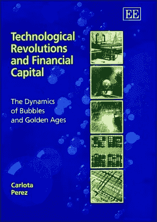
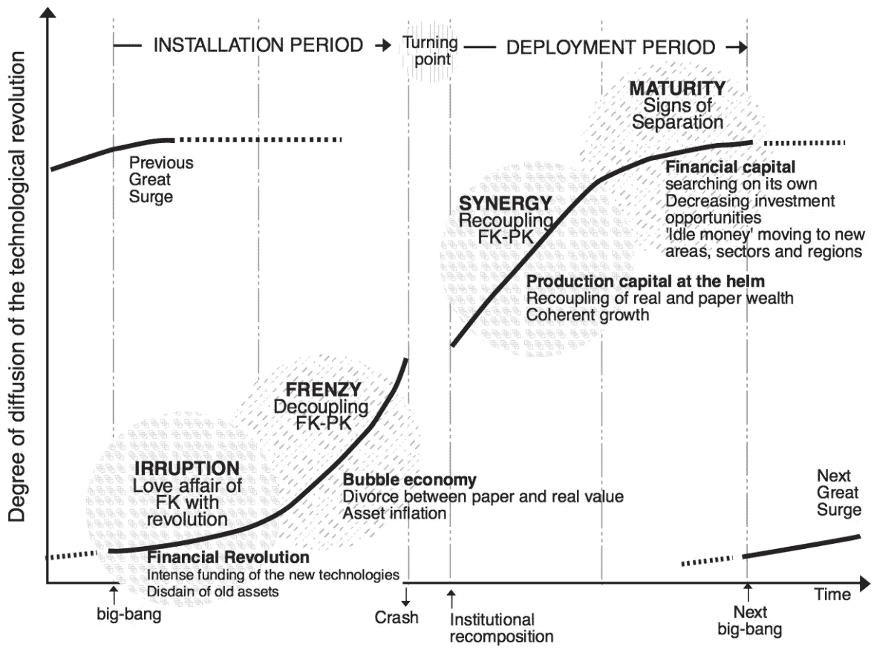
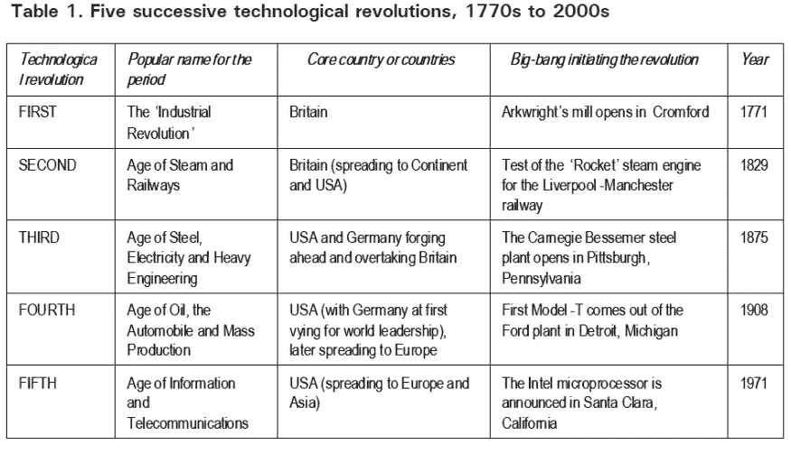
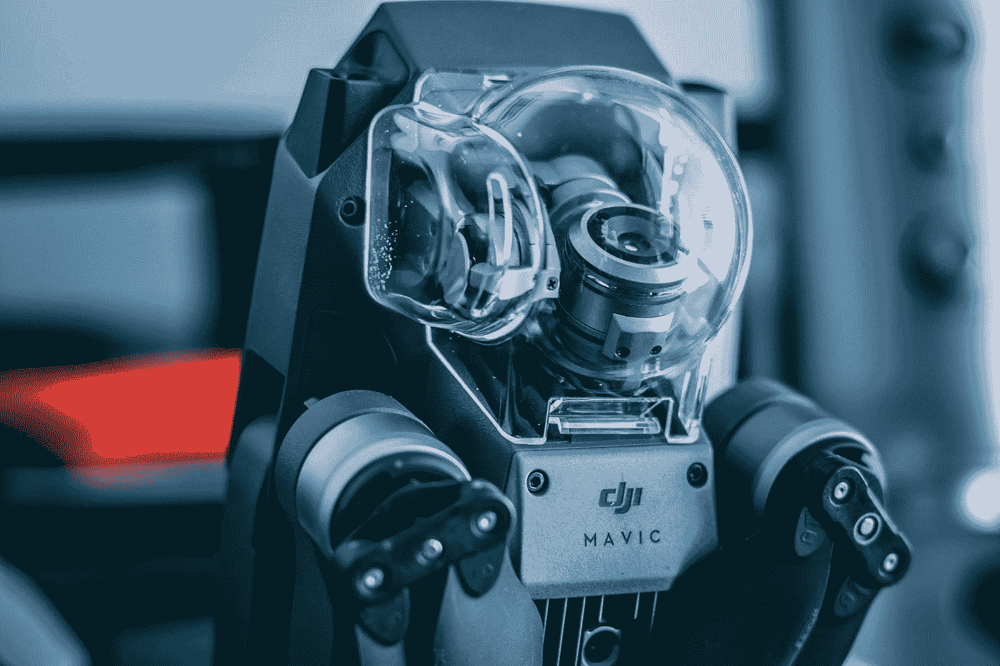
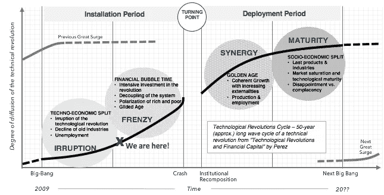

# 加密在自治时代的作用

> 原文：<https://medium.com/hackernoon/cryptos-role-in-the-age-of-autonomization-2bf414ceb5d2>

许多人表示，比特币类似于郁金香狂热。不是的。诚然，加密货币可能处于价格与生产率脱钩的狂热阶段，但这并不能说明全部情况。区块链技术，以及推而广之的加密货币，是一场技术革命，它遵循工业时代和信息时代等其他技术革命的周期。有时，我会互换使用区块链和加密。要让区块链技术改变世界，它必须以加密货币的形式实现。这两者有着千丝万缕的联系。本文旨在解释比特币(以及整个加密资产类别)和郁金香狂热之间的区别。我打算表明，加密货币作为一种与其他技术相呼应的技术，正在推动下一个长波经济周期。技术革命改变了世界，我将说明加密资产如何、何时、何地适合这一图景。

比特币是一种名为区块链的技术的第一个“杀手级应用”。比特币创造了一个数字化转移和存储价值的全球系统，带来了一些创新。它通过其设计以新的方式使用去中心化、不变性和激励来实现这一点，允许在不需要可信第三方(例如银行)的情况下进行商业交易。此外，下一代加密货币带来了智能合约(即可编程货币)的能力。这些能力是全新的，它们将引发一场围绕我们如何在全球范围内创造、储存和转移价值的技术进步浪潮。让我们看看技术革命及其漫长的经济周期是如何构建的。

## 技术革命的模式

我刚刚读完卡洛塔·佩雷兹的《技术革命和金融资本:泡沫的动力和黄金时代》 。她概述了过去 200 年中的 5 次浪潮，并解释了这些长周期如何演变的模型和机制。这让我想起了过去互联网浪潮中的技术革命。我想看看我经历这一循环的经历如何与这本书的内容相吻合。它解释了很多，并帮助我以新的方式思考互联网时代。然后，我开始思考这是否可以描述人工智能(AI)和加密货币目前的情况。我相信是的。

每一次增兵都有两个阶段，本质上非常不同:*安装阶段*和*部署阶段*。一般来说，每次激增持续 40-60 年，激增中的每个时期持续 20-30 年。

每个周期内有两个阶段。安装期有*突入期*和*狂潮期。部署期有*协同阶段*和*成熟阶段*。安装和部署阶段由一个关键的里程碑分隔，佩雷斯称之为转折点。除了其他事情之外，这也是崩溃发生的地方。因为我们关注当前的技术革命，所以我们将关注当前的*安装期及其两个阶段，*直到当前浪潮的转折点。*

From “Technological Revolutions and Financial Capital” by Perez page 32

这本书概述了一些抽象概念和模型，说明了技术革命如何随着时间的推移而类似地发生，描述了周期的各个阶段，并通过过去的技术革命说明了她的模型。她在书中讨论的过去 200 年的 5 次浪潮是:

1.  工业革命:1771 年至 1829 年
2.  蒸汽和铁路时代:1829 年至 1873 年
3.  钢铁和电力时代:1875 年至 1918 年
4.  石油和大规模生产时代:1908 年至 1974 年
5.  信息与电信时代:1971-20？？
6.  自主年龄:2009 年？

**注意:这是我的断言或预测，不是本书的一部分*

From the book, “Technological Revolution and Financial Capital” by Perez

## 第六次浪潮——新时代

根据书中概述的模型，我认为我们正处于一个新时代——自主的时代。许多人都在谈论“自动化时代”，但我认为这个描述并没有抓住全貌。自动化集中于使系统和过程自动化，而不需要操作员(人)的连续干预或输入。自治着重于使代理或系统自治。正如我们将会看到的，这一细微的差别造成了所有的差异。

这一新的技术革命符合康德拉提夫周期(T21)或长波范式的模型，以及佩雷兹在书中概述的模型。一些人写道[加密货币本身遵循 Kondratieff 长波周期](http://synapsetrading.com/2018/01/cryptocurrencies-50-year-kondratiev-wave-cycle/)。下面我们将讨论技术革命周期中的模式，列举每个时期和阶段的一些事件，并描述更大的背景。

Photo by [Yucel](https://unsplash.com/@ymoran?utm_source=medium&utm_medium=referral) on [Unsplash](https://unsplash.com?utm_source=medium&utm_medium=referral)

## 自动化时代—迄今为止的描述

许多人都写过关于自动化时代的文章。只是[谷歌](https://www.google.com/search?q=age+of+automation&oq=age+of+automation)这个术语。是关于人工智能(AI)、物联网(IoT)和机器人的。在过去的几年里，已经有很多关于这些话题的故事和纪录片。有专注于人工智能/机器人和自动化的交易所交易基金(ETF)投资，如$BOTZ 和$ROBO。

自动化是一个重要的趋势，但它不是*的*重要趋势。我断言它们本身不会带来技术革命。最后需要的技术是区块链，以及其架构中的去中心化思想。重要的趋势是*自治化*。

Photo by [Ryoji Iwata](https://unsplash.com/@ryoji__iwata?utm_source=medium&utm_medium=referral) on [Unsplash](https://unsplash.com?utm_source=medium&utm_medium=referral)

## 区块链——拼图的最后一块

虽然我认为自动化和加密货币的观点都增加了一般运动的价值，但我认为作者有点错过了应用程序和模型结构。推进自动化的技术，如人工智能或机器人技术，可以很容易地适应当前的范式。任何投资建造这些建筑的公司都将获得投资回报。没有范式转变，也没有改变现状。

有 3 项创新使加密货币成为最后一个支柱。第一个是价值的全球生成、转移和储存的新数字模型。第二个是智能合约的能力，它允许以编程方式进行基于规则的价值转移。第三是分散化，它允许我们跨越组织边界，打破集权组织或中央权威的束缚。

范式的转变是我们如何一起工作以及如何管理关系的转变。这种转变是通过分散的自治组织(DAO)、智能合同和新的治理模式实现的。这将权力和回报从中央集权的组织转移回个人手中。所有这些都发生在加密货币领域。因此，带来新时代所需的最后一项技术是加密货币。

就像上一次激增一样，互联网是激增的重要组成部分，但不是其核心焦点。这是一个不可或缺的机制，但这场革命的意义更大。那是信息时代。同样，这一新浪潮也是关于自治的。加密货币将是一个不可或缺的组成部分，但这场革命不仅仅是关于加密货币。这是支撑更广阔时代的最后一根支柱——自主时代。

Photo by [Jelleke Vanooteghem](https://unsplash.com/@ilumire?utm_source=medium&utm_medium=referral) on [Unsplash](https://unsplash.com?utm_source=medium&utm_medium=referral)

# 自治时代——什么是可能的

这个新时代将会带来变革。它将改变企业或组织生产商品和服务的方方面面。在全球范围内，每个行业、社区和政府都将开始构建自主代理来生产工作、创造价值，然后转移和储存价值。

这些行动将由软件代理和机器人通过加密货币平台网络实施智能合同来创建和执行。机器人将实现物理世界中的任何运动。物联网将提供传感器和网络来测量和交流数据。人工智能将在一个封闭的系统中提供判断、专业知识和评估。分散的加密货币平台将通过智能合同提供跨组织的移动，以管理和执行所生产工作的价值转移和存储。

这也将恢复个人和群体之间的平衡。在一个去中心化的世界中工作的自主代理将允许人们投资和从事他们感兴趣的项目，并为他们的贡献获得报酬或奖励。通过工作赚取代币或投资于你相信的加密资产，可以让收益回归个人。将不再有像脸书、优步、谷歌或任何其他公司那样的寻租中介从整体中榨取价值。中央机构将不再积累所有的利益。权力还给了个人，因为他们将能够在没有政治的治理系统中投票，也没有一个绕过集体个人意志的中间人。

# 我们现在在哪里？

重要的是要努力找出我们在这个循环中的位置。我相信“大爆炸”的里程碑发生在 2009 年比特币的发明。人工智能、物联网和机器人技术在 2010 年早期和中期都在各自的领域取得了重大进展。过去的九年是关于技术的，尚未扩散到更广泛的受众。这些线索告诉我们，我们正处于入侵阶段的末期。此外，我们已经看到 2017 年加密货币的一些市场热情，因此我们处于狂热阶段的早期阶段。因此，我在下面标出了我估计我们所处的周期。

## 入侵阶段——发生了什么？

正如 Perez 所定义的，突入阶段是发现新技术的周期的开始。重点是技术。这个阶段始于一个“大爆炸”时刻，也就是一些新技术被发现的时候。这是一个好消息，因为世界正在经历经济不和谐和失业，这是由过去激增的旧产业的衰落造成的。新技术的入侵创造了新的可能性，在入侵阶段，远见者和早期采用者正在发明并弄清楚新技术到底是什么，以及它会如何影响世界。

## 狂热阶段——期待什么？

狂热阶段始于密集投资。这个阶段的重点是投资和投机。狂热阶段带来了投机者，在这一阶段，我们看到投资和生产脱钩。此外，可以预期贫富分化会加剧。疯狂阶段以“崩溃”事件结束，这是周期的转折点。

来自佩雷斯—“*无论是 17 世纪 30 年代的郁金香狂热还是 1720 年的南海泡沫都不符合这种意义，因为没有技术革命推动这些事件。事实上，有许多心理学现象与投机行为有关，但与资本主义背景下的技术革命同化无关*。"

并非所有泡沫或狂热行为都是技术革命的一部分。郁金香不是技术革命。然而，确实存在符合这一既定范式的泡沫或狂热。区块链技术，以及推而广之的加密货币，确实符合上述范式。因此，我们可以预期未来的周期会跟随过去的技术革命周期。

Photo by [rawpixel](https://unsplash.com/@rawpixel?utm_source=medium&utm_medium=referral) on [Unsplash](https://unsplash.com?utm_source=medium&utm_medium=referral)

# 结论

正如你所看到的，我们已经开始了一场新的浪潮，一场新的技术革命。行动将围绕在整个生产周期中建立自主性。加密货币将发挥关键作用。我预测，到这股浪潮结束时，我们将不再围绕劳动和生产来组织社会。生产，作为一个单位，就解决了。机器人技术将使物理世界的生产自动化，而传感器和数据将通过物联网移动。通过机器人、代理和加密货币，软件将产生、转移和存储世界的价值。人工智能将为学习、执行、测量和适应分散系统中的每个组件提供脑力。新的模式将带来我们新的未来。

现在，作为投资者，我们正处于一个激动人心的时期。我们刚刚开始了一个阶段，在这个阶段，对新技术革命的投机和投资将带来巨大的财富。就像 19 世纪的铁路和信息和电信时代的最后一波浪潮一样，我们正在开始一个投资可以产生巨大回报的高峰期。加密货币不像郁金香狂热，因为它是由一种新技术的采用推动的，这种新技术最终会重组整个地球的功能。这不会在一夜之间发生，但如果我们仔细观察，我们会发现这只是历史再次重演。

*免责声明:以上仅代表一种观点，仅供参考。它无意成为投资建议。请自己做作业。*

[***杰克·瑞安***](/@jake_ryan) ***是加密对冲基金 Tradecraft Capital 的创始人。他还是一名创业顾问、天使投资人和投资作家。如果你喜欢这篇文章，请“鼓掌”帮助别人找到它！欲知更多，敬请关注*** [***【脸书】***](https://www.facebook.com/WealthRituals/)*[***碎碎念***](https://twitter.com/TradecraftJake) ***。****

*# crypto #加密货币#比特币#投资#区块链#贸易*