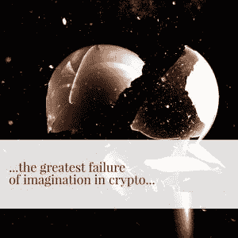
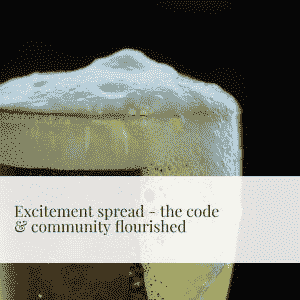
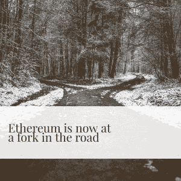

# Crypto 的秘制酱

> 原文：<https://medium.com/hackernoon/cryptos-secret-sauce-c67b133a5565>

## 为什么用 ProgPoW 和类似的倡议来保护独立采矿社区有利于分散化和加密。

将加密货币矿工视为一个需要解决的问题，而不是一种可以利用的资源，是当今该领域想象力的最大失败。考虑到权力下放的风气以及矿业社区的热情和投资水平，这是值得注意的。那么，这些早期采用者是如何成为开发人员项目会议和媒体事后讨论的令人不安的话题的呢？

在密码价格下跌的完美风暴、ASIC 对每个“抗 ASIC”区块链的入侵，以及公众将采矿视为一个有待解决的问题的刺激下——在这个曾经乐观主义盛行的领域，我现在在与小矿商的交谈中遇到了一种令人不安的自满情绪。为了提供当前状态的背景，以及独立矿工和加密社区中其他人之间不断变化的关系，我将提供一点历史，并以一个在加密中谋生的矿工的个人观点进行搅拌。

由于它目前的困境，人们总是问我 GPU，或者更广泛地说，非 ASIC 挖掘是否已经死亡。我的答案永远是一样的——如果有可能扼杀非 ASIC 矿业，那它早就死了。让我们说，只有少数抗 ASIC 的加密项目仍然存在。他们将继续吸引不成比例的关注，仅仅因为他们利用了 crypto 最大的粉丝和最被低估的资源独立矿商。

只要加密仍然是一个默默无闻的行业，大众不仅不理解，而且完全持怀疑态度，高度参与的基层支持者传播福音，消除神话，并通过口口相传一点一滴地建立善意，无疑是最好的倡导者。对于许多早期采用者来说，挖掘是他们进入加密空间的开端。人们经常注意到，大多数长期的加密支持者都是从怀疑论者开始的，我也不例外。许多年前，我发表了不少关于比特币“显然”是一个庞氏骗局的长篇大论——但我是一个拥有强大 GPU 的 PC 游戏玩家，谁能与免费的神奇互联网货币争论呢？特别是在强大的社区宣传和铁杆支持下。2013 年的这个时候，ASIC 对比特币的全面收购已经完成，但我无法抗拒总督的诱惑。开始挖掘比我想象的要容易得多，最重要的是，当时我对加密几乎一无所知。我只知道我的 GPU 把电变成了钱。当最初观看 Dogecoin 涓涓细流的兴奋消退后，采矿激起了我足够的兴趣，我决定找出这个疯狂的比特币到底是怎么回事。就像在我之前的许多人一样，我掉进了兔子洞。

但是，唉，总督和他的 altcoin 伙伴不能让聚会永远进行下去。最终，它也将屈服于 ASICs 的蛮力，于是开始了密码挖掘的黑暗时代。虽然 GPU mining 近乎彻底的崩溃只不过是 2014 年熊市的又一个受害者——对于那些没有经历过熊市的人，让我向你们保证，事情比现在更加暗淡和绝望。实际上我已经一无所有了。矿工们纷纷认输，二级市场上 GPU 的价格跌至不可思议的低点。PC 游戏玩家欢欣鼓舞，而 GPU 挖掘几乎已经死亡。那是一个完全绝望的时代，没有人会因为相信采矿甚至加密和比特币只不过是昙花一现的时尚而受到责备，因为它们的光辉岁月终将结束。没有了采矿的诱惑，我的注意力从加密上转移了。我确定我不是一个人。

直到 2015 年，一线希望才出现在地平线上。不仅对矿工，而且对整个加密。以太坊白皮书毫无歉意地支持 ASIC 抵抗。但它的雄心远远不止是成为另一种由人民生产、为人民服务的货币——它是一个成熟的计算平台。更不用说这是一种独特的新筹资方式——ICO——的第一个主要例子。所有这些元素汇集在一起，结果是宏伟的。开发者才华横溢，愿景远大，想法强大，ICO 为以太坊创建了一个利益相关者网络，并为 2017 年的 ICO 爆炸奠定了基础。以太坊崛起中最不受重视的因素是异常强大的 ASIC 抵抗，它让一支潜伏的密码狂热者大军重获新生。矿工们终于又有了兴奋的事情。随着兴奋情绪的传播以及代码和社区的蓬勃发展，以太坊的价值突飞猛进。一时间，我们的 GPU 满溢着 eth 的甜蜜甘露。派对持续了相当长一段时间，让全世界的电脑游戏玩家懊恼不已。XMR、ZEC、VTC、LBRY 和无数其他公司——对我来说太多了，时间却这么少。

当 2017 年末 crypto 狂潮达到顶点时，各行各业的人突然对 crypto 产生了兴趣。我敢肯定，我不是唯一一个突然开始从朋友和家人那里收到各种问题的加密爱好者，他们多年来没有听到过这些问题。几乎一夜之间，我们默默无闻的痴迷变成了全世界的话题。我们中的许多人听到了这一号召，并与朋友和家人联系，解释加密的神奇之处，甚至建立企业来传播这一信息。一次又一次，话题常常很快转向采矿。即使他们不能理解区块链，把电变成钱的机器的概念对任何人来说都是足够简单的。采矿是通往一个全新世界的大门。加密的最大挑战仍然是让人们进门，高度可访问的 GPU 挖掘的复兴创造了新一代的加密爱好者，并在一定程度上促成了 2017 年的牛市。以太坊和其他 ASIC 抵抗链为加密货币注入了新的活力，以小企业家可以实现的方式将其纳入主流，巩固了他们所依赖的去中心化基础。

当然，比特大陆和他的朋友们绝不会袖手旁观。一个接一个，以前抗 ASIC 的区块链开始倒向 ASIC。BTC、LTC 和 Dash 在文艺复兴之前就已经失传了，但没过多久，许多较小的硬币，如 Decred、Sia、Pascal 和其他硬币迅速贬值。很快，巨人开始倒下。ZCash 是近期最引人注目的 ASIC 收购案。像 Monero 这样的基于 Cryptonight 的硬币成为目标，但与 ZCash 不同，它被大多数社区彻底拒绝，Cryptonight ASICs 很快就变成了镇纸。尽管 Ethhash 已经被证明是一座需要攀登的陡峭的山，ASIC 制造商似乎已经最终打破了那个鸡蛋。许多较小的项目继续拒绝让步，并迅速转向 Cryptonight 和 Equihash 的变体，使当前的 ASICs 无效。我相信从长远来看，这个决定将是明智的。

但是对于许多项目，特别是以太坊，他们的领导层似乎已经放弃了他们的创建原则，并背弃了他们社区中的一个重要派别。这样做，往好了说，他们是在丢弃他们最有价值的资源之一，往坏了说，他们是在拿项目的未来冒险。人们只需看看西亚科恩托和比特大陆威胁要从“腐败的创始人”手中夺取控制权，就能明白这条路的尽头是什么。

尽管有有限的理由支持 ASICs 提高安全性，从而提升区块链的价值，但我认为，总的来说，它们削弱了社区，扼杀了项目的活力和生机，损害了区块链的价值，尤其是在项目的早期阶段。我认为，在过去几年里，ASICs 是比特币主导地位严重下降的一个重要原因，因为小型独立矿商不再有参与比特币的渠道。大自然厌恶真空，而第一个能够有效利用这种潜在热情的项目将收获高度参与的社区的回报。我相信这绝不是一个巧合，最近几年最抗 ASIC 的加密技术迅速崛起，成为王位的主要竞争者。这不是唯一的原因，但毫无疑问，这是以太坊迅速成功的一个因素。

在这种情况下，以太坊的领导者如此渴望通过匆忙转向股权证明来放弃他们最大的优势之一，更不用说让 ASIC 的入侵在此期间慢慢削弱对该项目的热情，这让我感到困惑。尽管他们可能是非常聪明的开发人员，是寻找技术问题的创造性技术解决方案的专家，但阻碍以太坊和加密技术发展和普及的因素并不完全是技术方面的，甚至主要是社会和政治方面的。一个很好的例子——比特币与比特币现金。毫无疑问，比特币在泡沫期间艰难地度过了严重的技术难关，至少在短期内，比特币现金有了一个有效的技术解决方案。为什么当时它没有轻松超越 BTC？很简单——尽管 BTC 矿业已经相对集中且仅限 ASIC 使用，但 BTC 用户中的一大群直言不讳的人可能会看到在他们已经拥有的集中化道路上继续前进的危险。无论这种集权是通过采矿、公司权力还是其他方式实现的，任何形式的集权都与他们对该项目的长期愿景背道而驰。显而易见的技术解决方案具有不值得牺牲的权衡，因为长期的政治和社会问题超过了短期的技术问题。

以太坊现在正处于一个岔路口，面临着类似的前景——但似乎选择走上集中化的道路，低估了 ASICs 的威胁。我不认为这是因为开发人员和社区不理解理论上的威胁，而仅仅是因为他们不认为这是一个明确而现实的危险。社区中的感觉很明显—“*谁会关心 ASICs，因为利益相关的证据即将到来，并且会从源头上解决问题？*

但是，为什么以太坊社区和领导人如此急于转移到股权证明？技术原因是显而易见的——易于扩展和能效低几个数量级。抛开 PoS 的任何理论上的安全性考虑，其他的权衡是什么？与采矿不同，理论上，对于非技术用户来说，staking 是一个更容易参与的过程，因此人们甚至可以说它将增加参与者的数量并扩大社区的覆盖范围。从数量上来说，我同意利益相关者可能比矿工多得多。但从质量上来说，独立矿商是更有价值的参与者。赌注是一个非常简单的过程，只需要一点点存款。采矿业不仅更加复杂，而且竞争激烈。这是一种技能和艺术，每个矿工都需要做出数十个变量和决定。如果不深入了解区块链和加密，以及围绕采矿形成的加密空间中一些最强大的社区，就无法做出这些决定。而且没有办法胜过其他人，没有任何技巧或艺术可以吸引和激发赌注者——这只不过是一种无聊的被动投资。世界上没有人会对赌注如此热情，以至于他们会熬夜调整他们的赌注，如果这样的事情甚至是可能的话。企业花费数十亿美元来建立有参与用户的社区，以建立品牌知名度，小型加密矿工非常投入，他们愿意花费大量的金钱和时间来直接参与区块链的工作。这些是大多数公司和项目都想争取的狂热分子，这种纯粹的利害关系证明是无法复制的。为什么会有项目急着抛弃它们呢？

这只是社会/政治方面。如果你想完全简化它，你可以把矿工看作是为区块链工作的计算机——这是一个巨大的、基本上未开发的资源。现在，虽然我似乎很少相信花在工作证明上的每一焦耳都是值得的，而且获得开放的区块链与浪费资源完全相反——但目前的情况是，全球计算平台正急切地准备扔掉世界上有史以来最强大的通用计算网络。然而，似乎很少有人考虑让如此庞大的 GPU 集合做点别的事情。当然，我们有很多项目，如假人、RenderToken、SOMN 等，但这些项目不太可能在未来几年内扩大规模，以消耗目前支持以太坊的大量通用计算能力。虽然我不认为用“有用的”工作替代散列来保护区块链是正确的做法，但区块链让其矿工在协议层的平台内做一些其他类型的通用计算的想法似乎很少被探索。

即使以太坊协议开发人员认为这是一种功能蠕变，至少他们仍然应该能够看到让这些矿工忙碌起来的智慧，直到实用令牌平台足够成熟，能够吸收哈希功能，并在更高的层上更好地使用它。似乎很明显，去中心化的应用程序正走在一条道路上，就像大多数现代 web 应用程序一样，它们最终将能够从后端强大的计算(和存储)资源中获得极大的好处。仅仅因为这个原因，为下一代 dapps 留下矿工是明智的。有人可能会说，没有必要在今天的矿工和明天的分散后端计算提供商之间保持连续性。如果他们建成了，他们会来的。但是，如果以太坊现在拒绝矿工，他们可能会失去所有的精力和兴奋给竞争对手。以太坊不知从哪里冒出来，在不到两年的时间里几乎从比特币手中夺走了宝座——这大约是预计 PoS 过渡所需的时间(在最好的情况下。以太坊不要理所当然地认为他们是领先的去中心化应用平台，因为如果他们不小心抓住他们拥有的每一个竞争优势，这种情况会很快改变。这些仍处于早期阶段，去中心化的应用程序比大多数人意识到的更容易跨平台转移。

许多支持股权证明的人认为，通过 PoS 获得区块链的成本最终会提高他们的投资价值，因为支付给股东的通胀率比支付给矿工的低。在更大的画面中被忽略的是，采矿奖励不仅支付安全，还支付“街头团队”的关注和参与。你是否认为这种草根营销的效果足够显著，足以证明其成本是值得讨论的——但现在它甚至不是辩论的一部分。我们永远无法知道这条未走过的路的真实结果，但通过证明利害关系来降低通胀最终会导致价格上涨，这一点还远未确定。这只是一个庞大等式中的一个变量，潜在的意外后果没有得到足够的重视。

那我是在反对股权证明吗？不完全是。我主要认为，对价值数十亿美元的企业级区块链的共识进行如此大规模的改变，是一项极其危险的行动，需要格外谨慎。撇开采矿不谈，我仍然认为这是一件需要很多年才能慢慢适应的事情。但是，即使按照最快的时间表，PoS 仍然还有一段时间。现在有一个 ASIC 的问题正在酝酿中。这是一种癌症，需要在它扩散并超过我们阻止它的能力之前切除。以太坊不希望像 Siacoin 一样，被声称保护它的实体扣为人质。

但是我们真的能阻止 ASICs 吗？说到想象力的失败，反对 ASIC 抵制的最普遍的论点是，没有真正防 ASIC 的算法，因此我们最终应该投降，接受 ASIC 对 PoW 的完全接管是不可避免的。一些项目将这一点发挥到了逻辑的极致，甚至构建 ASIC 友好的算法来尽快邀请 ASIC 的加入。虽然从技术上来说，完全和完全的抗 ASIC 理论上是不可能的，但从技术上来说，也不存在完美的抗生素。细菌总是会进化来抵抗它们。对于制药公司来说，这是不是一个令人信服的理由，只要一发现耐抗生素细菌的迹象，就耸耸肩，甚至放弃生产青霉素？当然不是，那将是荒谬和不负责任的。是的，这将是一场持续的斗争。这将永远是一场猫捉老鼠的游戏——但是除非所有的老鼠都投降，否则猫永远也抓不到所有的老鼠。它们会不断进化和繁殖。

即使是现在，也不缺乏解决这个问题的方法。ProgPoW 正在以太坊开发者中获得一些牵引力，我强烈支持将其与发行减少一起实施，以在可预见的未来击退 ASIC 的威胁。但从长远来看，ASIC 抵制的限制因素将始终是开发者和社区想出新方法来抵制 ASIC 的意愿。需要是所有发明之母——Prog pow 非常聪明，但它今天存在只是因为更明显的 ASIC 电阻解决方案已经被攻克。如果有一天 ProgPoW 未能阻止 ASICs 的潮流，我认为这是在低估开发人员的创造力，暗示他们最终会耗尽创意。

出于这个原因，无论以太坊选择哪条道路，我相信通用设备上的独立采矿——无论是 CPU、GPU、FPGAs 还是硬盘——都将在未来许多年继续存在。现在不要误解我——以太坊大规模放弃矿工将是他们的项目和整个加密的巨大损失。至少在短期内。但就像 2015 年一样，培养强大的独立矿业社区并找到新颖和聪明的方法来吸引矿工及其计算能力的项目将吸引该领域最高度参与的用户的注意。如果到那时它还在，也许他们甚至会在以太坊建造那个项目。

但是，不管你认为事情的长期发展方向如何，决定以太坊和许多其他项目未来的决定需要在今天做出。无论是现在还是将来，矿商和股权证明都不必相互排斥。更改工作证明算法会带来风险，但使用 PoS 更改替代共识机制可能会带来更大的风险。最重要的是，当 ASICs 慢慢侵蚀去中心化的时候，自满会给任何选择忽视它们的项目带来生存风险。不再有安全的现状可以依靠——不管我们喜欢与否，问题就在眼前，我们今天如何处理它将决定以太坊和其他项目在未来许多年的命运。

###########################################

***Bitpro*** 设计、建造和管理加密货币开采钻机和大规模运营。除了我们在采矿方面的专业知识之外，我们还是一家全方位服务咨询公司，在所有加密货币(有利可图，值得您花费时间)方面拥有深厚的知识和专业技能，使我们成为一个有价值的合作伙伴和知识贡献者。我们帮助您建立并最大化您的投资— *我们与您一起赚钱*、*而不是离开您*。在我们的网站上了解更多关于我们的信息:[bitprocrypto.com](https://bitprocrypto.com/)

*原载于 2018 年 10 月 21 日*[*【bitprocrypto.com】*](https://bitprocrypto.com/2018/10/21/crypto-secret-sauce-independent-gpu-miners-progpow/)*。*