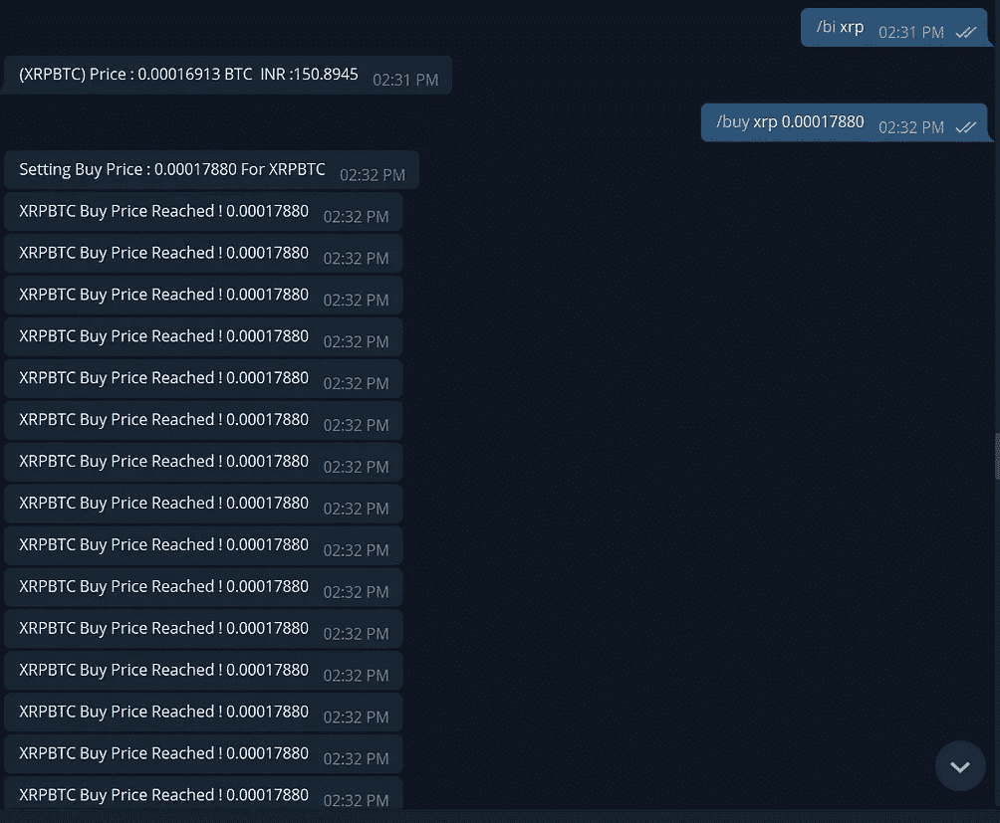

# 密码电报机器人:自动化你的基本密码工作

> 原文：<https://medium.com/hackernoon/cryptotelegram-bot-to-automate-your-basic-cryptowork-707f3a4242f>

*   一年前，在学习 python 的时候，我出于学习目的创建了一个电报机器人来自动化日常生活的加密工作流，它包括以下特性。

1.  *在币安上买卖对子:设置一个买价&和对子一起卖价，如果对子达到买价就自动买入，如果达到卖价就自动卖出。*
2.  *币安对信息:(开盘价、收盘价、盘低、盘高、成交量、状态、主动买入、主动卖出)*
3.  *币安上的手表对:设定一个价格，在电报上得到通知。*
4.  *收集代币/硬币价格的历史信息，以年/月/日/分/小时跟踪最近的价格。*
5.  *在* [*上买卖对 Koinex*](https://hackernoon.com/tagged/koinex) *:同(1)。*
6.  *koin ex 上的手表对。*
7.  [*ZebPay*](https://hackernoon.com/tagged/zebpay) *所有对的买入/卖出价格。*
8.  CoinMarketCap 资产跟踪系统。
9.  *使用 google-finance-api 的 in INR 中的概况/损失计算器*

> **撕裂**