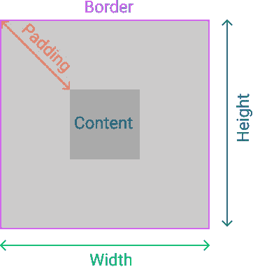

# CSS 101:盒子模型

> 原文：<https://medium.com/hackernoon/css-101-the-box-model-34f44eac250f>

每个初学者都应该首先从基础开始。就 CSS 而言，基础是学习盒子模型。在继续学习任何其他 CSS 概念之前，这是您应该首先掌握的一个概念！

盒子模型是 CSS 的基本构件。

这确实会给初学者造成困惑，所以现在是澄清事实的时候了。在这里，您将了解盒子模型的所有基本元素以及它们是如何连接的。

在你深入研究之前，每个人都需要明白网页设计中的每个元素都是一个矩形框。您可能已经听过很多次了，但是这是每个开发人员都应该知道的一个重要概念。

现在，我们来解释一下神秘的盒子模型！

# 箱式模型的结构

如上所述，箱式模型的结构包括:

*   **内容**(高度和宽度)，
*   **填充**，
*   **边框**，
*   **余量**。

这些都是浏览器渲染一个盒子模型所需要的元素。谢天谢地，有了 CSS，你可以单独控制它们。让我们看看怎么做。

在这篇文章中，我将向您展示如何使用下面的代码，并逐步添加到它。

超文本标记语言

```
<div class=”box”>Lorem ipsum dolor amet whatever woke cronut, farm-to-table church-key tousled edison bulb. </div>
```

半铸钢ˌ钢性铸铁(Cast Semi-Steel)

```
.box {
  background-color: hotpink;
  color: #fff;
}
```

# 内容

内容很清楚。元素的内容具有特定的宽度和高度。可以使用 CSS 属性的高度和宽度设置固定的高度和宽度，也可以由内容本身决定。


现在，这里有一点令人困惑的是内联或块级元素的用法。

# 使用内联和块级元素

提醒你一下，内联元素和块元素的区别在于，**块元素占据了容器宽度**的 100%，而**内联元素只占据了内容需要的空间**。

当使用**内联**元素时，**不可能**为该元素设置固定的宽度或高度，因为该元素没有任何预定的宽度和高度(因为宽度和高度是由内容决定的)。**这可以通过将元素转换为块元素来解决。**

与行内元素不同，**当使用块级元素时，你可以很容易地为它设置固定的宽度或高度**。由于默认情况下块级元素占据了容器宽度的 100%,您可以通过设置一个固定的宽度来轻松地覆盖它。

你也可以将你的元素转换成**内嵌块**。当使用 inline-block 时，该元素具有 inline 元素(仅占用内容空间)**的**行为，但是您可以像操作 block 元素**一样操作它。**

现在，当你有一个块级元素时，你可以给它一个宽度和高度。

半铸钢ˌ钢性铸铁(Cast Semi-Steel)

```
.box {
  height: 200px;
  width: 200px;
  background-color: hotpink;
  color: #fff;
}
```

结果是这样的:


# 衬垫

接下来，让我们添加一些填充框。

填充定义内容和框边缘之间的空间。


让我们看看它的实际效果吧！

半铸钢ˌ钢性铸铁(Cast Semi-Steel)

```
.box {
  height: 200px;
  width: 200px;
  background-color: hotpink;
  color: #fff;
  padding: 10px;
}
```

结果是:


在图像中，您可以看到填充如何影响盒子的整体外观。所有四个面上的内容和盒子边缘**之间有 10px 的空间。你也可以单独添加填充到每一边，使用**填充顶部，填充底部，填充左侧，填充右侧。****

# 边境

下一个合乎逻辑的步骤是定义边界。边框包围了内容，你不必使用它，但它仍然存在。这只是意味着边框的宽度为零。



现在，让我们给前面的例子添加一个边框。

半铸钢ˌ钢性铸铁(Cast Semi-Steel)

```
.box {
  height: 200px;
  width: 200px;
  background-color: hotpink;
  color: #fff;
  padding: 10px;
  border: solid 3px black;
}
```


# 保证金

盒子模型的最后一个方面是利润。正如你们中的一些人可能知道的，边距是边界之外的空间。它是元素之间的空间。


在实际例子中演示这一点的最好方法是向您展示两个元素如何在有和没有边距的情况下定位。

超文本标记语言

```
<div class=”box”></div>
<div class=”box”></div>
```

半铸钢ˌ钢性铸铁(Cast Semi-Steel)

```
.box {
  height: 200px;
  width: 200px;
  background-color: hotpink;
  color: #fff;
  padding: 10px;
  border: solid 3px black;
  margin: 0
}
```


在这个例子中，您可以看到，如果没有边距，两个元素会粘在一起，并且它们之间没有空格。

现在，让我们添加一些空白。

半铸钢ˌ钢性铸铁(Cast Semi-Steel)

```
.box {
  margin: 20px;
}
```


现在，这看起来更好！你在盒子之间增加了一些空间。你也可以使用**上边距、下边距、左边距或右边距在元素的每一边添加空间。**

就这样——看起来你已经完成了这篇文章的结尾！恭喜你。:)

那么，你学到了什么？

1.网页上的每个元素基本上都是一个盒子。
2。盒子模型的方面是内容、填充、边框和边距。
3。使用内联元素时，您不能为该元素设置固定的宽度或高度，但可以使用 block 和内联块元素。

希望这能帮助你学到新的东西或刷新你的记忆。

感谢阅读！

*原载于 2018 年 6 月 19 日*[*kolosek.com*](https://kolosek.com/css-box-model-for-beginners/?utm_source=me)*。*