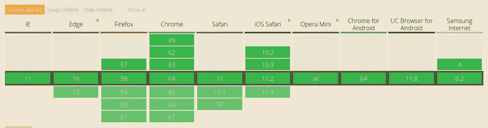
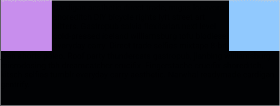
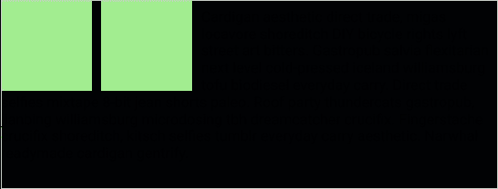

# CSS 基础:浮动属性

> 原文：<https://medium.com/hackernoon/css-basics-the-float-property-1deef5e53aec>

每个网页设计者应该学习的最基本也是最重要的属性之一是**浮动属性**。它最常用于**在图像周围浮动文本或者创建两列布局**。如果没有完全理解 float 属性，它会导致很多挫折和困惑，所以让我们通过这个简短但全面的解释来消除这些困惑。

# 定义

顾名思义，CSS float 属性指定了元素应该如何浮动。通过使用 float 属性，元素被放置在其容器的左侧或右侧。

float 属性有可能的值:

*   **Left** —元素浮动到其包含块的左侧。
*   **Right** —元素浮动到其包含块的右侧。
*   **无** —元素不能浮动。

当一个元素设置了 float 时，它被移动到**右侧或左侧**，直到它接触到容器元素的**边缘或另一个浮动元素**。

# 支持

检查 CSS 属性支持程度的最佳地方是[我可以使用](https://caniuse.com/#search=float)服务吗。这里我们看到浮动属性的支持度极高，**超过 97%** 。



# 例子

现在，让我们用例子来支持浮动理论，使事情更清楚。这些例子将向你展示如何在一个 div 周围浮动文本。

**HTML**

```
<div class=”container”> <div class=”left-segment”></div> <div class="right-segment”></div> <p class=”segment_text”>Cardigan aesthetic direct trade, migas locavore shoreditch DIY bicycle rights lyft street art bitters. Gastropub salvia flexitarian next level cold-pressed iceland williamsburg tofu biodiesel everyday carry. Direct trade selfies mixtape 8-bit jean shorts paleo. Roof party thundercats gastropub, jianbing williamsburg microdosing tbh dreamcatcher crucifix. Fingerstache crucifix shoreditch, kitsch selfies tumblr everyday carry aesthetic. Narwhal readymade cardigan gentrify.</p> </div>
```

**CSS**

```
.container { border: solid thin #ccc; } .left-segment { height: 200px; width: 200px; background-color: #C98EED; float: left; } .right-segment { height: 200px; width: 200px; background-color: #8FC9FF; float: right; }
```



在这个例子中，我们可以看到两个 div**浮动在容器**的右侧和左侧。文本在 div 周围流动，并在 div 下方继续。

之后，我们可以给元素[一些样式](https://kolosek.com/10-ways-to-improve-your-website-design/)和文本[一些格式](https://kolosek.com/css-line-height/)。

**HTML**

```
<div class=”container”> <div class=”left_segment”></div> <div class=”left_segment”></div> <p class=”segment_text”>Cardigan aesthetic direct trade, migas locavore shoreditch DIY bicycle rights lyft street art bitters. Gastropub salvia flexitarian next level cold-pressed iceland williamsburg tofu biodiesel everyday carry. Direct trade selfies mixtape 8-bit jean shorts paleo. Roof party thundercats gastropub, jianbing williamsburg microdosing tbh dreamcatcher crucifix. Fingerstache crucifix shoreditch, kitsch selfies tumblr everyday carry aesthetic. Narwhal readymade cardigan gentrify.</p> </div>
```

**CSS**

```
.container { border: solid thin #ccc; } .left-segment { Height: 200px; Width: 200px; Margin-right: 10px; Background-color: #A1ED8E; Float: left; }
```



第二个示例展示了如何使用 **float:left** 属性将两个 div**浮动到容器的左侧**，以及文本如何环绕这些 div 并在它们下面继续。

希望这篇文章在使用 **float** 属性时会有用。

请继续关注进一步解释 **clear 属性**的文章，这是另一个与 float 属性紧密相关的极其重要的属性。

除了浮动，其他重要属性包括[行高](http://kolosek.com/css-line-height/)和[位置属性](https://kolosek.com/css-position-relative-vs-position-absolute/)。

下次见！

*原载于 2018 年 3 月 15 日*[*kolosek.com*](https://kolosek.com/css-float/)*。*