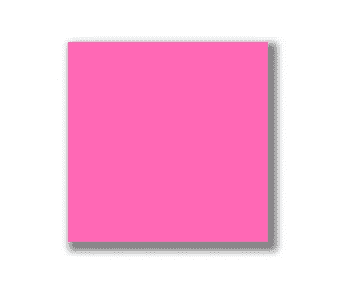
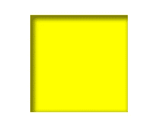
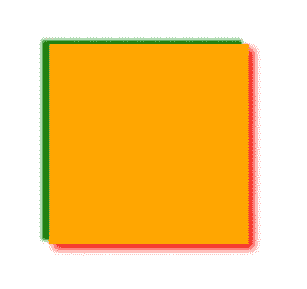
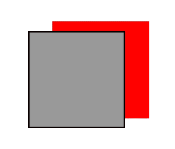
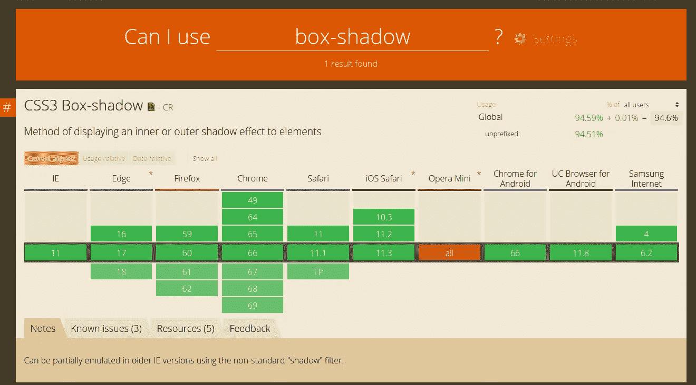

# 阴影:阴影中有东西

> 原文：<https://medium.com/hackernoon/css-box-shadow-there-is-something-in-the-shadow-240fcafd12d4>

box-shadow 属性用于给元素添加阴影效果。

这个属性经常被用来给网站上的元素赋予深度，所以完全理解它是很有用的。

# 语法

box-shadow 属性的语法如下:

```
.box {
  box-shadow: 5px 10px 5px 4px #666;
}
```

我们来翻译一下，这样你就能理解每个值的意思了:

```
box-shadow: horizontal offset | vertical offset | blur radius | spread radius (optional) | color
```

# 价值观念

*   **水平偏移** —阴影向左或向右扩散多远(如果值为正，它将向右扩散，如果值为负，它将向左扩散)。
*   **垂直偏移** —阴影将在元素上方或下方扩散多远(如果值为正，它将扩散到底部，如果值为负，它将到达顶部)。
*   **模糊半径** —数字越大，阴影越模糊，如果数字为 0，则阴影越清晰。
*   **扩散半径** —默认值为 0，数值越大，阴影越大。
*   **颜色** —定义阴影的颜色。

# 例子

半铸钢ˌ钢性铸铁(Cast Semi-Steel)

```
.box {
  background-color: hotpink;
  height: 200px;
  width: 200px;
  box-shadow: 5px 5px 10px 4px rgba(0,0,0,0.5);
}
```

结果是:



通常，你没有必要为一个盒子阴影使用纯色，增加一些不透明度会给它一种更自然的感觉。

# 嵌入阴影

创建插入阴影时，产生的效果是阴影进入元素内部，并使元素内部的内容看起来凹陷。

半铸钢ˌ钢性铸铁(Cast Semi-Steel)

```
.box {
  background-color: yellow;
  height: 200px;
  width: 200px;
  box-shadow: inset 5px 5px 10px 4px rgba(0,0,0,0.5);
}
```



# 两个不同的影子

你也可以创建一个有两种不同阴影，宽度不同颜色的元素。

半铸钢ˌ钢性铸铁(Cast Semi-Steel)

```
.box {
  background-color: orange;
  height: 200px;
  width: 200px;
  box-shadow: 5px 5px 10px purple, -7px -4px 4px green;
}
```



# 实心阴影

半铸钢ˌ钢性铸铁(Cast Semi-Steel)

```
.box {
  background-color: #999;
  border: solid 3px #000;
  height: 200px;
  width: 200px;
  box-shadow: 5rem -20px red;
}
```



正如你从这个例子中看到的，使用纯色阴影是好的，但是通常给它一些扩散和不透明度会产生更好的效果。

# 箱形阴影发生器

既然你已经理解了这个属性，并且已经看到了它的作用，那么提一下你也可以使用很多**生成器**是个好主意。通常很难将设想的设计转化为框阴影属性值，因此有一些工具可以帮助您。

可以使用 [CSS matic](https://www.cssmatic.com/box-shadow) 、 [CSS3 Gen](https://css3gen.com/box-shadow/) 、[Mozilla](https://developer.mozilla.org/en-US/docs/Web/CSS/CSS_Background_and_Borders/Box-shadow_generator)box-shadow generator。这些都有助于你在视觉上达到你想要的方框阴影效果。

# 浏览器兼容性

检查正在学习的新属性的浏览器兼容性始终是一个好的做法。目前，最好使用的服务是[can use](https://caniuse.com/)。



你可以看到浏览器支持非常好，除了使用 **Opera Mini** 的时候。你应该知道这个特性在那里是行不通的。

# 结论

我已经解释了**盒子阴影属性**和它所有的值代表什么。现在，就看你如何进一步探索和释放它的全部潜力了。

感谢您的阅读！

*原载于 2018 年 7 月 10 日*[*kolosek.com*](https://kolosek.com/unlocking-css-box-shadow/?utm_source=me)*。*