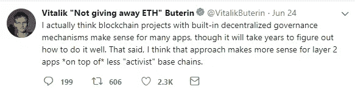
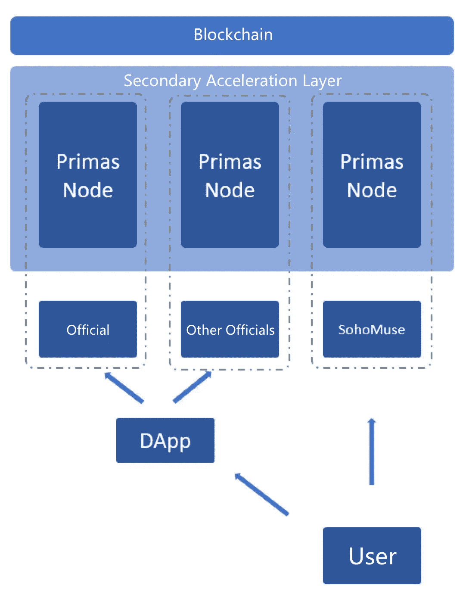
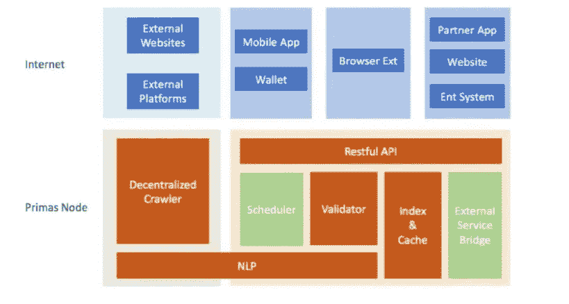

# 一个首席技术官的故事:“在一个真正去中心化的系统中设计、构建和与人打交道的技术和伦理挑战”

> 原文：<https://medium.com/hackernoon/cto-life-technical-and-ethical-challenges-of-designing-building-and-dealing-with-decentralized-ee03de6ec818>

为了让大家更好地理解处理去中心化系统的复杂性，我想分享一些我的经验，阐述一下 Primas 现阶段的系统架构。系统相当大，不能一下子全部讲解完，我就分主题来讲。

Primas 现在已经正式上线一段时间了。在这个初始阶段，我们的华人社区特别活跃。每天人们都会玩不同的游戏，并且在如何利用小团体和试图在系统中寻找漏洞方面非常有创造力。与此相反，人们还会热烈地讨论**的道德规范，为什么**这些人会被这个平台吸引，以及这些漏洞的可能解决方案。

过去，我们遇到过一些拥有大量设备的用户，这些设备被用来重复发布和分享剽窃的文章。使用机器人，这些人能够通过利用设计的经济激励系统内的漏洞来最大化他们的代币支出。在此之后，“官方”帐户被用于将可用 HP 的数量减少到 0。这导致许多人怀疑 Primas 是否真的以分散的方式使用区块链。

所以让我们从关于*分散架构*的讨论开始。

为了清楚起见，为了理解该系统各部分之间的关系，必须首先定义几个名称。

**-分散式可信内容协议(DTCP):** 一组概述元数据收集和存储标准的规则。该协议可以支持任何类型的应用。
**- Primas:** 项目和团队的名称。
**- Primas 网络:**对 Primas 的二级加速层、经济激励系统、鹰眼节点、去中心化爬虫网络、用户可信度模型给出的统称。
**——Primas DApp:**第一款建立在 Primas 网络之上的移动应用。

> Primas 是一个真正的分散系统。

处理 Primas 的一个巧妙之处是，只要有人愿意使用它，它就会存在。单个节点的故障或“官员”的疏忽不会使系统停止运行。

为了解决以太坊突出的成本和速度挑战，Primas 设计了一个“二次加速”层。使用令牌预锁和多流并行技术也解决了可扩展性问题；在这篇文章中，我不会详细介绍这种特定的技术。不久前，Vitalik Buterin 在 tweeted 上支持以太坊之上的二级层，并提到这些层如何有意义地支持应用程序。仿佛深谙 Primas，Vitalik 的话准确地概括了 Primas 二次加速层和和 Dapp。

**I cannot agree more with Vitalik’s words.**

今年，每个人都在谈论公共链，宣称当前的公共链无法支持大规模应用程序，这是需要克服的最大和最相关的技术障碍。由此，各种公链项目如雨后春笋般出现，都号称“100 万 TPS”。投资者似乎只对公共链感兴趣，他们亲自找到我，问我 Primas 在做什么，我回答说，我们能够支持以太坊上的大量用户。一半人不相信我，另一半人说:“哦，你只是一个 DApp。”

超越了我自己。最终，Primas DApp 并不直接连接到以太坊，而是先连接到中间的“二级加速网络层”，再连接到以太坊。这个中间层也是完全分散的，由许多节点组成。在移动设备上，Primas DApp 连接到 Primas 节点，以便访问 Primas 网络。Primas 节点为移动应用提供 API 服务，能够连接到区块链并直接在其上写入。

> 任何人都可以成为 Primas 节点。

作为一个节点支持 Primas 系统的运行，这是 Primas 完全去中心化的核心。类似于比特币挖矿，用户可以是一个 Primas 节点，以便服务于整个 Primas 系统；节点运营商也将获得 PST 奖励。这确保了只要 PST 有价值，就会有人愿意将 Primas 节点作为一个节点来运行，并且系统将继续运行。

二级加速网络使用类似于 PoS 的共识模型。它被称为“类 PoS ”,因为只使用了 PoS 标记、验证和惩罚机制；没有使用区块链的数据结构，这实际上构成了加速的核心。主要层负责令牌和治理，而次要层采用区块链的单流结构，并将其划分为多个并行流。由此，并发性、重复花费和验证问题通过其他方式解决。这种加速方案不是一般的方案。事实上，我也觉得没有放之四海而皆准的方案。没有逻辑方法可以完全满足“强一致性(安全性)与速度”的冲突。

用更外行的话来说: ***要做一个节点，就必须拥有并入股 PST。*** 如果你做了其他节点都认为不可接受的事情，你的赌注将被归还给集体。

因此，这是一个完全“无中心”的自治系统，“官方”的角色被简化为早期推广、开发和运行节点，仅此而已。如果是别人经营一个节点，他们的权力就和任何一个“官员”完全一样。

那么为什么人们说一个“官方”可以删除一个用户的 PST 呢？

这是因为有问题的 PST 最初是借给这些用户的。Primas 依靠经济激励系统来降低试图利用该系统的人的效率。其不幸的结果是为初学者设立了相当高的门槛——用户需要 PST 才能开始使用 Primas DApp，但许多 Primas 的目标用户不知道如何购买和转移加密货币。所以在项目前期，为了让更多的人使用 DApp，Primas 在系统中设计了“出借 PST”功能，允许节点运营商(官方的就是一个)出借 PST，从而降低了新用户的门槛。当借用 PST 时，系统通过使用智能合约被设计为在确定的时间段之后收回该 PST。注意，这里借出的 PST 是真实的。如果节点运营商想把 PST 借给用户，它必须有足够的 PST。

另一个被投诉的领域是“官方”帐户如何在用户的文章被发布后不允许给用户象征性的奖励。为了防止用户抄袭或发布不合适的内容，在发表文章之前，一定量的 PST 会被锁定若干天。如果该文章在此时间内被报告并确认违反了群规则，这些令牌将被分发到社区。一经确认，被举报人的信用评分也会降低，从而影响以后所有的收入收益。这里的一个问题是，谁将确认被报道的内容。当然，原则上，经社区确认，会有类似投票或代理投票的机制。这部分还没有完成，所以暂时由我们的“决策委员会”来确认。所以这部分本身就是去中心化的制度设计，而不是官方的“中心化”行为。

**这里介绍了顶层的分散设计。**

我知道大家其实更关心的是 Primas 经济激励体系的设计。Primas 系统已经发展了很长时间，随后经济激励系统本身也经历了多次迭代。在下一篇文章中，我将更详细地讨论这一部分。

我希望你读完这篇文章后有所收获，再次感谢你一直以来的支持！