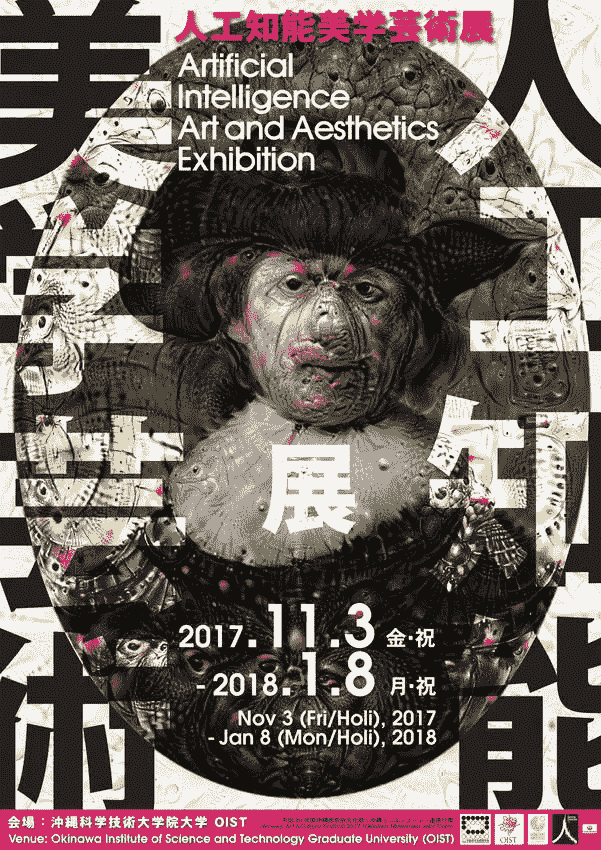

# 机器智能时代的文化标准化

> 原文：<https://medium.com/hackernoon/cultural-standardization-in-the-age-of-machine-intelligence-6b56fd60b7fe>

我们可以很容易地注意到[机器学习](https://hackernoon.com/tagged/machine-learning)的最多样的例子和含义，在大多数情况下，机器学习在效率和耐力方面超过人类，自动化了大量传统的人类活动。

然而，我们很少意识到，随着时间的推移，它会导致文化多样性的减少。人类和智能机器之间的新兴关系提高了文化艺术品的自动化程度，在这种情况下，趋向于文化标准化。

首先，谈论文化不是一件容易的事情，即使对于许多广泛从事这一课题的理论家来说，也没有一致的概念，而且，它的定义随着时间的推移而变化。

如果我们考虑到学者和文化理论家特里·伊格尔顿的观点，文化是复杂和矛盾的，有时被认为是它的对立面，“自然”，这也赋予了解释的巨大困难。

在他的书*中，*以区分文化的不同含义为中心的文化思想，揭示了在其古典概念中定义文化是可能的，其中“文化”一词的词源来源于拉丁语 *colere* ，它可以意味着耕种农业或农业耕作。

农业耕作的原始含义已经扩展到人类官能的培养，其中文化从培养谷物的想法过渡到培养心灵。

但是，当心智的培养超越了人类，也开始由机器来完成时，会发生什么呢？

人工智能——特别是以机器学习的形式，如强化学习——在现代世界中被频繁使用，以提高一系列任务的效率和安全性，如防止欺诈、信贷决策、购物推荐等。

这种情况并不仅限于商业领域，事实上，智能机器开始越来越多地出现在我们的家中，通常是以智能助手的形式出现，如 Siri、Google Home、Alexa，以及在我们的休闲时间，包括人类表达创造力的地方，如博物馆和文化中心。

例如，布宜诺斯艾利斯的现代艺术博物馆使用了人和艺术品之间的认知对话。

助手，认知机器，比使用语音向导时有更近的体验。这可以让艺术和阿根廷博物馆的参观者之间的互动更加容易。

以类似的方式，通过从皮纳科特卡圣保罗博物馆借来的智能手机和耳机，游客可以与一些绘画和雕塑交谈。

这个聊天机器人将通过智能手机回答游客关于巴西艺术博物馆收藏的一些艺术品的问题。

在另一个场景中，我们可以在看起来像人类生成的创造性作品中，以特殊的方式，在[视觉艺术](/artists-and-machine-intelligence/deepdream-art-and-machine-learning-symposium-2016-recap-396d1ecf87e3)、[音乐](/artists-and-machine-intelligence/neural-nets-for-generating-music-f46dffac21c0)甚至[诗歌](/artists-and-machine-intelligence/adventures-in-narrated-reality-6516ff395ba3)中，看到 AI 和[深度学习](https://hackernoon.com/tagged/deep-learning)。因此，出现了一个肥沃的地方带来新的关注艺术创作领域。

意识到这种新的情况，一些地方已经做了非凡的工作，将这一主题引入讨论，作为一个很好的说明，日本冲绳科学技术研究所研究生大学的人工智能艺术和美学展览。

在所有情况下，一些人可以将与 AI 最密切的关系视为艺术作品的一部分，另一方面，一些批判性的潮流可以完全拒绝这种想法——
成为或不成为艺术的一部分是一个大讨论，我强烈推荐 Blaise Aguera y Arcas 关于这个主题的[机器智能时代的文本艺术](/artists-and-machine-intelligence/what-is-ami-ccd936394a83)。

然而，在上面的例子中，为文化产品的大规模生产和分销的自动化创造了肥沃的土壤。这让我们产生了一个问题:**人工智能方法复制的文化的一致性是否能引导我们走向文化标准化？**

好吧，我们正在谈论人工智能、机器人、机器学习、深度学习、认知机器……但这不是一个新问题。在不太近的过去，我们对摄影、广播、电视和电影等技术有类似的担忧。

将近一百年前，一些理论潮流对文化产品大规模生产和分销方式的出现提出了批评。像阿多诺和霍克海默这样的学者在《文化工业:作为大规模欺骗的启蒙运动》一书中，对通过广播、电影、杂志等复制的文化的一致性给予了强有力的理解。

作者关注的是自动化和文化工业的兴起，这导致了文化形式的标准化和合理化。这反过来又削弱、萎缩和摧毁了个人以批判和自主的方式思考和行动的能力。

然而，许多专家和学者对工业生产的大量文化产品是如何被人们消费的并没有一致的看法。我们不能假设观众被动地接受所有的大众文化产品。

有一种观众的“协商”和“反对”。接受理论的主要支持者之一，文化理论家斯图尔特·霍尔的一种方法。他在 1973 年发表了一篇名为“电视话语中的编码和解码”的论文，该论文对媒体信息如何产生、传播和解释的理论方法做出了贡献。

作者谈论的不仅仅是电视话语，他谈论的是一种信息或产品，可能是一本书、一部电影或其他创造性的作品，无论是什么，都不仅仅是被动地被观众接受。在他的理解中，读者/观众基于她或他的个人文化背景和生活经历来解释意义。

他说的听起来不错，但正如我们所看到的，新的艺术和媒体对我们文化的影响是不可预测的，充满了模糊性。文化理论家和专家们对于在如此复杂多变的世界中会产生什么样的后果还没有达成一致。

就像收音机、印刷机、电影、电视和计算机的发明一样，我们相信机器智能是一项将深刻影响艺术和文化的创新。机器开始学习、传播和影响我们的文化。

从近期来看，它将改变我们对外部现实的理解以及我们的感知和认知过程。我们可以假设我们的文化开始延伸到机器，甚至更多，以新的方式复制和改变它的巨大力量。

经常探索人类和机器之间界限的行为艺术家 Sterlac 说，我们的身体已经过时了，它需要升级。如果 Sterlarc 说我们的身体需要扩展，从这个角度来看，我们的思想和文化也可以被认为是过时的。

[https://labio tech . eu/bioart-ste larc-obsolete-human-body-med tech/](https://labiotech.eu/bioart-stelarc-obsolete-human-body-medtech/)

Alternate Anatomical Architectures | Stelarc | TEDxVienna

如果一方面，我们的身体和文化过时了，另一方面，我们正在开发可以破解和扩展这两者的技术。在 19 世纪，蒸汽机以前所未有的水平扩展和自动化了我们的力量，现在，我们看到机器以前所未有的水平扩展了我们的身体、思想和文化。

最后，我们正在见证一个人类和机器并存的时代的消失，然而今天，我们开始看到一个混合的过程，模拟和数字以前所未有的方式混合在一起，以这种方式，产生了人类更多的机器和机器更多的人。

人工智能比早期的创新更深入，比文化标准化更复杂，它将扩展我们的思维和文化；最终以从今天的角度来看难以想象的方式改变社会。

***如果您觉得这篇文章有用或有趣，请👏，鼓掌分享一下！😊***