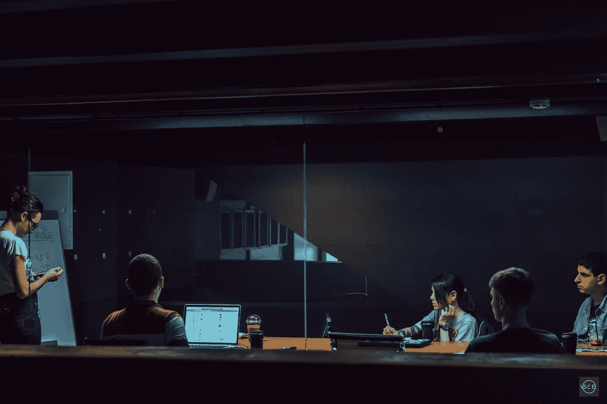
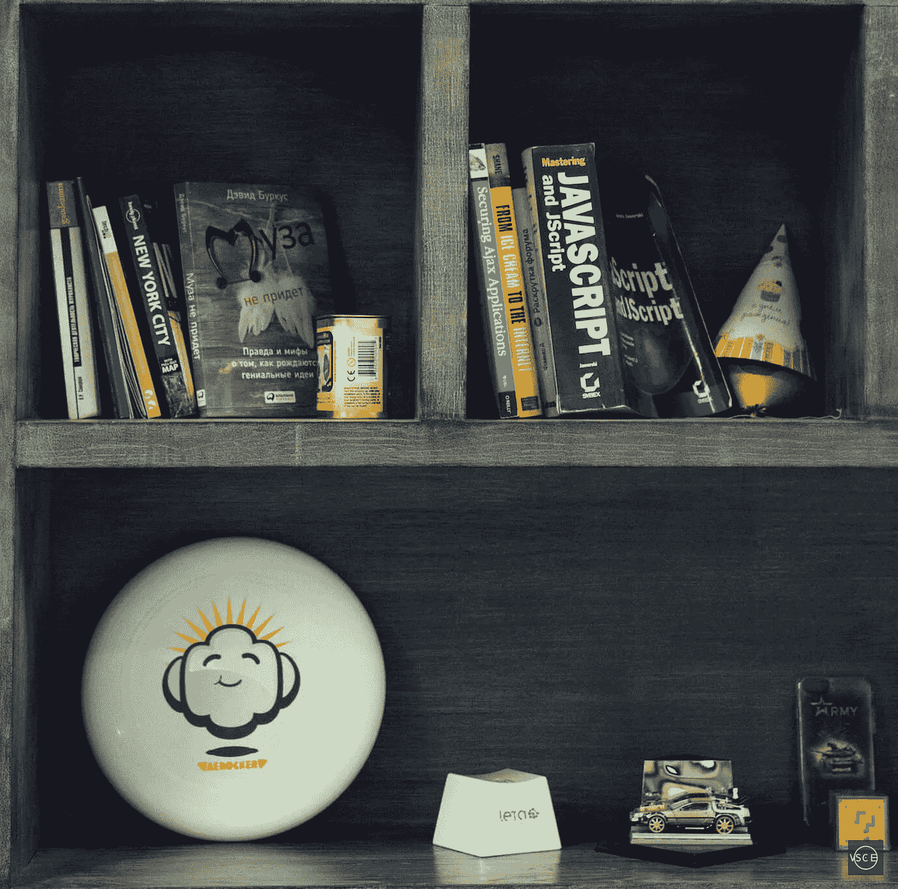

# 文化即服务:品牌如何突破科技媒体泡沫

> 原文：<https://medium.com/hackernoon/culture-as-a-service-how-brands-can-break-through-the-tech-media-bubble-b976da1ebd35>

*© VSCE /* [*Dmitry Kabanov*](https://medium.com/u/a1d1c2e0a44f?source=post_page-----b976da1ebd35--------------------------------)

祝你好运，让人们阅读你的品牌技术故事。现在，在你生气之前，我肯定你有一些很棒的东西要分享。我相信你找到了解决某类问题的令人兴奋的新方法。你所希望的是其他人能像你一样对此感到兴奋。不幸的是，机会对你不利。

我可以说科技媒体市场已经饱和，但我们几年前就已经过了这个阶段。一个过度饱和的市场仍然以一种混乱、破碎的方式运作着。至少它加强了多样性，赋予了消费者权利。

今天的科技媒体场景并非如此。

向出版商砸钱来推广你的品牌的日子已经一去不复返了。对许多人来说，营销传统技术内容意味着参加一场大喊大叫的比赛。无论你的声音多么优雅，它都有可能淹没在科技产品的汪洋大海中。即使你的出版商是最成功的。

我们是怎么到这里的？

# **科技出版简史**

当互联网还很年轻、很慢的时候，一个普通人不得不特意去阅读科技新闻。这些故事并没有真正引起公众的兴趣。你必须要么是一个行业专业人士，要么是一个极客来享受这种东西。

那是一个新技术被高价出售的时代，尽管它的寿命相对较短。竞争非常激烈，你可以打赌，新奇的小玩意可能会在一年内过时。早期采用[数码相机](https://www.theverge.com/2012/9/14/3330924/first-lcd-digital-camera-casio-qv-10)、[电子阅读器](http://money.cnn.com/galleries/2010/technology/1010/gallery.ereader_history/2.html)和[掌上电脑](https://www.pcmag.com/feature/260439/r-i-p-palm-a-history-of-the-smartphone-pda-pioneer)的大多是有钱的 IT 人员。

到 2000 年，刚刚超过 50%的美国家庭拥有个人电脑，更不用说花钱购买昂贵的非必要技术了。毫不奇怪，在这种环境下，科技新闻的市场非常有限。但是出于好奇*想知道的需求*确实存在。

这些 80 年代和 90 年代的科技出版物，针对的是狂热爱好者和 T2 的专业人士，今天仍然存在。 [ZDNet](https://www.zdnet.com/article/zdnet-1991-vs-2011-the-more-tech-changes/) 成立于 1991 年。1998 年，也就是第一版印刷出版的四年后,《登记簿》上线了。全彩色印刷杂志如《个人电脑世界》也是第一批将内容放到网上的杂志。

在 2000 年代中期，[宽带互联网](http://www.visualcapitalist.com/rising-speed-technological-adoption/)开始变得真正无处不在。从电子邮件和社交网络到在线游戏，各种背景的年轻人都有理由使用它。同样是这些人想知道科技世界将会发生什么。像[Gizmodo](https://gizmodo.com)(2002 年成为 Gawker Media 的子公司)和[Engadget](http://engadget.com/)(2004 年由 AOL 推出)这样的出版物在那段时间声名鹊起。他们的目标是更多的普通观众，但仍然专注于技术，除了技术什么都不是。

快进 10 年。每个人都有一部智能手机，大多数人会定期更换。每个人都在线。数字技术对我们的文化至关重要。突然之间，科技新闻变成了…仅仅是新闻。人们意识到科技报道不再是利基市场。就在那时，市场爆发了。

*© VSCE /* [*Dmitry Kabanov*](https://medium.com/u/a1d1c2e0a44f?source=post_page-----b976da1ebd35--------------------------------)

# 今日的报摊

科技媒体行业的现状如下:五种媒体实体争夺大体相同的受众:

*   你已经有了传统媒体*([《卫报》](https://www.theguardian.com/)[《独立报》](https://www.independent.co.uk)[《华盛顿邮报》](https://www.washingtonpost.com/)等)，它们覆盖了广泛的科技相关话题，并以其高编辑水准吸引读者。*
*   *像 [Arstechnica](http://arstechnica.com) 、 [CNet](https://www.cnet.com) 和 [Mashable](https://mashable.com) 这样的纯技术出版物试图在保持对技术关注的同时，保持其新闻的可访问性。*
*   *面向 IT 专业人士的*出版物，如[《注册》](https://www.theregister.co.uk)仍然专注于他们的核心读者，同时偶尔[发布吸引普通大众的新闻](https://www.theregister.co.uk/2018/01/04/intel_amd_arm_cpu_vulnerability/)。**
*   **有些网站 ***只报道一个话题*** ，企图在竞争中脱颖而出。**
*   **成千上万的 ***独立博主*** 在 Medium、YouTube 这样的 UGC 平台上直接与上面的网站竞争。**

**从技术上来说，你可以将你的品牌内容发布到这些网站中的任何一个上，并展示给数百万的读者。但是现代科技媒体的密度使得它无法导航。**

**读者也和你一样困惑。**

# ****今日的读者****

**我们停止*阅读*新闻，开始*跟随*新闻。我们并不特别关心我们在读哪种出版物，也就是说，我们是否在读任何东西。最近的一项研究表明，60%的美国人只看头条新闻。大多数人甚至不会阅读他们在社交媒体上分享的文章。人们对新闻机构的信任也明显下降。我们更有可能根据分享文章的人来判断文章的可信度，而不是来源。**

**难怪人们不读报纸，而是依赖链接聚合器和社交媒体。它们通常提供标题的简明视图供读者选择，并由读者信任的社区本身监管。此外，它们还提供了一个有节制的安全讨论平台。**

**两个最受欢迎的科技新闻聚合器是 Reddit 和 T2 hacker news。这两个网站都享有很高的直接流量。[这些网站超过一半的访问者是因为他们想去那里而去的。他们平均在这些平台上花费 5 到 10 分钟。](https://www.similarweb.com/website/news.ycombinator.com?competitors=reddit.com)**

**相比之下,《卫报》和 ArsTechnica 等新闻来源从搜索引擎获得的流量份额最大，读者通常会在不到 3 分钟的时间内离开网站。这些链接聚合器在塑造我们讨论技术的方式方面非常强大，你必须接触他们才能做大。**

**大多数科技新闻读者也在 UGC 平台上维护个性化新闻。然而，把你的内容放到这些平台上并不意味着真的被听到，因为没有人会费心去阅读他们的全部内容。**

**你必须脱颖而出。**

****

***© VSCE /* [*Dmitry Kabanov*](https://medium.com/u/a1d1c2e0a44f?source=post_page-----b976da1ebd35--------------------------------)**

# ****到首页并超越****

**那么，什么样的科技故事会在 Reddit 和 HackerNews 上大放异彩呢？很难说。这两个平台都有他们最喜欢的来源，分别是 [The Verge](/@hoffa/reddit-favorite-sources-the-most-linked-sites-expanded-and-interactive-79070d648573) 和 [TechCrunch](https://docs.google.com/spreadsheets/d/1mmfbNWaX0Nr1P65VmwZpm4WiceK7pepknSob4ti0M7s/htmlview) 。《卫报》和《纽约时报》等传统媒体也经常与。但如果你看看特定故事曝光的方式，这是一场赌博。**

**有时，这是第一个由知名社区成员提交的问题。所有关于这个话题的讨论都将转移到这个帖子的评论区，其他的文章基本上就看不见了。其他时候只是运气。**

**但是有一件事你可以确定。**

**互联网喜欢愤怒。负面的故事总是最有吸引力。有史以来最受欢迎的五大科技文章中有四篇是负面新闻。一个明显的反派给了这些董事会成员一个互相拍背的机会。或者[误用](http://www.businessinsider.com/reddit-falsely-accuses-sunil-tripathi-of-boston-bombing-2013-7)他们的自以为是感。不管怎样，他们喜欢以牺牲他人为代价来获得优越感。**

**作为一个品牌，你不能利用它。制造坏消息很难，而诽谤活动和攻击广告往往适得其反，甚至可能是非法的。三星在 2012 年[发布的恶名昭彰的](https://youtu.be/GWnunavN4bQ)嘲讽苹果的广告遭到了广泛的批评，这不仅仅是因为它在史蒂夫·乔布斯去世两天后被批准。**

**人们希望事情因其本身的优点而令人满意！消极的营销策略只会产生糟糕的公关。**

# ****不允许快捷方式****

**如果你想在当今竞争激烈的科技媒体市场取得成功，你必须创造大量高质量的内容。对大多数品牌来说，这是难以下咽的苦果。他们只是没有合适的资源或合适的营销策略来做这两件事。人们通常善于察觉虚伪，识别伪装成新闻的营销文章。**

**你必须有一个真正的理由去写一些东西，你必须有一些有价值的东西与你的读者分享。**

**不，你不能只是重复使用同样的老把戏。大多数企业的媒体营销工具包已经过时了。不管你的产品有多好，你的 3 段新闻稿看起来和你的竞争对手一样。你的白皮书可能很无聊，而且沾沾自喜。**

**在这种环境下，你能做的最好的事情就是培育一种真正的企业文化。**

**不允许快捷方式。**

****

***© VSCE /* [*Dmitry Kabanov*](https://medium.com/u/a1d1c2e0a44f?source=post_page-----b976da1ebd35--------------------------------)**

# ****培养文化****

**我们都知道什么是真正的企业文化，但很少有人能够从零开始创造它。**

1.  **从定义你的内部文化开始。因为是在那个时间点上。拥有真实的内容对于与你的潜在客户建立关系至关重要，所以如果需要的话，准备好做出改变。人们可以很容易地分辨出那些只关心其他业务收入的文化差的企业。**
2.  ****把它变成一个镜头。**你需要接受这种文化、这种抱负和价值观，并把它变成一个透镜，通过它来照亮你所涵盖的主题。这将确保你的内容，无论是什么主题，都是独一无二的、可识别的和真实的。这种方法并非没有风险——投资于一系列想法会让你受到与你的产品或服务无关的批评。但是这些风险是值得冒的。**
3.  ****忘掉新闻稿吧。传统的新闻稿和公告既无聊又没什么用处。没有人读它们，因为他们想读。人们真正喜欢的是故事，记叙文。他们想感受一些东西。如果你敞开心扉，让他们融入你的企业文化，他们也会让你融入其中。人性化你的业务。不要用流行语和企业用语疏远你的客户，而是让他们了解你。如果他们理解你为什么做你所做的事情，他们会发现和你相处会容易得多。****
4.  ****永远是生产内容。**无论你的产品有多好，你的文化更重要。购买你的产品只是让顾客分享你围绕品牌建立的文化的一种方式。所以建造它。你需要日复一日地积累标题和你想报道的话题，并努力让这种文化成为现实。**
5.  **代表你的文化。你创造的内容是参与的入口。你的内容越严肃，你得到的回应就越严肃。不要把自己局限于状态更新和简短的笔记，更认真地对待你的听众。准备好就你认为重要的问题发表长篇文章。当你的观众和你一起讨论严肃的事情时，当你的观众开始提问时，那就是他们把你的文化当成自己的文化的时候。没有比这更有价值的了。**

****

***© VSCE /* [*Dmitry Kabanov*](https://medium.com/u/a1d1c2e0a44f?source=post_page-----b976da1ebd35--------------------------------)**

# ****激发真正的改变****

**如今，推广你的业务似乎比以往任何时候都难。当然，互联网的信噪比非常高。但是如果我们缩小范围，停止使用营销术语，我们可以看到挑战和以前一样。企业仍然是为了激励变革而创建的。创造就业机会并赋予人们权力。想要帮助人们让世界变得更美好，这没有什么不真诚的。最难的部分是培养你与客户之间的互利关系。**

**今天媒体市场的密度意味着你不能再忽视这方面的业务。你不能像 20 年前那样简单地花钱做广告，然后收工。你必须尽最大努力，不仅仅成为另一家公司。这是一项艰苦的工作，容不得半点差错。**

**然而，不走捷径的好处是，只要你坚持走下去，它几乎总是有回报的。**

****关于作者:****

> ***Dmitry 与品牌合作，创建内容并大规模推广企业文化。他是 Techstars Startup Digest 的元老之一。除此之外，他还担任 SXSW Pitch 活动和 SXSW Release IT 活动的顾问。***
> 
> **startupdigestmail.com**