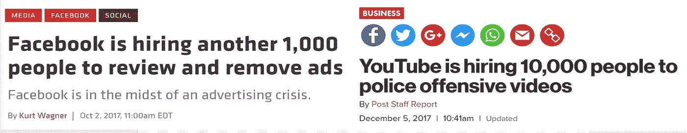

# 管理一个良性的数字世界

> 原文：<https://medium.com/hackernoon/curating-a-virtuous-digital-world-b89363e8ab15>

*The internet content landscape today*

高质量的信息对世界至关重要。

像脸书、推特、T2、谷歌和 Reddit 这样的社交媒体巨头每天都在管理数十亿人消费的数据。然而，随着数字社会的扩张，这些公司正面临巨大的规模问题。

猖獗的垃圾邮件，企图游戏系统，假新闻和不适当的内容都困扰着今天的信息经济。

随着公司尽最大努力进行打击，它们面临着审查、人类偏见和垄断行为等险恶问题的风险。

但是，尽管雇佣了成千上万的人类策展人，部署了复杂的机器学习过滤器，坏演员仍然沉重地压在社交媒体巨头的肩上。

例如，看到我的 Twitter 订阅被诈骗机器人入侵是令人讨厌的。Twitter 的高级机器学习过滤器、人群报告功能和大批员工似乎无法抵御诈骗机器人的侵扰。有志者事竟成，任何被数百万(甚至数十亿)人使用的平台都有被有事业心的暴民剥削的危险。

现在，让我们进行一次认知飞跃，将社交媒体公司视为现代民族国家的一种形式:数十亿全球公民团结在一个平台下，每个人都在促进自己的竞争利益。

**那么，这些公司如何最大限度地提高用户体验呢？**

通过起草一份经过深思熟虑的宪法，也就是所谓的服务条款。一旦起草并通过，下一个问题是，如何正确执行 ToS 的规则？

对于机器可识别的违反服务条款的行为，算法可以有效地全部过滤掉*。然而，不足之处在于，即使有数十亿美元的研究和开发，人工智能和机器学习似乎离有意义的能力还很远。*

*许多潜在的违反服务质量条款的行为是机器无法识别的，并且可能永远无法识别。对于数不清的机器可读的违规行为，*，*企业需要招募成千上万的人类管理者。这导致成千上万的人每天都在观看可怕的视频，阅读令人不快的推文，浏览假新闻。过滤违反 ToS 的情况。*

*此外，也许为了起草尽可能最道德的服务条款，某些原则需要*相当客观*。理论上，这种信息可能永远都不是机器可读的。举个例子，关于什么是仇恨言论和什么是受保护的言论自由的无休止的讨论。脸书、Youtube 和苹果最近封杀了亚历克斯·琼斯，但*没有*推特，这重新点燃了这个古老的讨论。*

**(*更新:自从这篇文章发表后，亚历克斯·琼斯也被禁止在推特上发布)**

*几个世纪以来，能够客观地区分仇恨言论和自由言论一直是政府的一个谜。尽管困难重重，但宪法为其潜在的解决方案提供了合理客观的指导方针。宪法必须被写成能够在分散的法院系统中进行仲裁；在地方、州和联邦法院，通过律师、法官和陪审团的正当程序。如果法律框架足够有效，法律决议将在各级法院系统中复制，并产生类似的结果。*

*至于亚历克斯·琼斯，我不打算知道哪家公司禁止他的言论是对还是错。正如法律一样，规则也是数字领域的规则。法律并不总是正确的同义词。在这种情况下，在民主政府中，有一个潜在的修改宪法本身的更大的正当程序。*

*这一观点揭示了民族国家和公司国家之间的关键区别。数字世界的服务条款没有为用户提供民主的正当程序来改变或执行法律。数字平台将数十亿全球公民联系在一起，并做出对全球社会产生巨大影响的行政决策。然而，很少有像民主国家那样的治理程序。*

*也许硅谷焦点小组和人工“标记”工具是我们最接近的比较。这些过程是有意义的，但是有严重的局限性。随着数字世界的成熟，这种机制可能会被证明是不够的。*

*数字世界，尽管拥有信息获取民主化的所有优点，却是一个高度敌对的环境。内容质量受到抨击，公司模式最终可能不足以维护信息高速公路。*

## *加密货币领域正在测试新的实验和公司倒闭的潜在解决方案。*

*软件平台的新治理模式正在高度敌对的环境中接受测试。事实上，加密货币沼泽中的生物甚至在挑战企业软件模式(例如，加密诈骗机器人占领了 Twitter)。*

*针对此类问题的一个特别有趣的实验可以在名为“令牌管理注册”的软件技术中找到。也被称为 TCR，它是一种软件模型，用于从经济上激励大众的智慧，以便引出、立法和执行一个良性的服务条款。*

*代币经济(可兑换真实货币)激励一个不受任何一家公司*、*控制的社区来管理软件平台上的信息质量。术语令牌管理的注册中心或 TCR 已经成为大肆宣传和承诺的主题。例如，想象一下，如果你可以根据你拥有多少令牌来直接影响 Spotify、OpenTable 或你的 Twitter feed 等平台上内容的排名可见性。*

*代币作为对主观内容的可见性进行排名的一种方式，例如“马德里最佳餐厅”或流行的“说唱鱼子酱播放列表”的排名，可能会成为炒作的牺牲品。*

*主观 *TCRs* (或排名 TCRs)的问题还没有解决。严格根据你有多少钱来对主观的内容的可见性进行排名，可能看起来不诚实或令人反感。*

*它现在代表着世界上最受欢迎的内容提要，可见性排名*似乎*是根据非货币衡量标准进行的，如脸书上的喜欢，Twitter 上的喜爱和 Medium 上的掌声。这样做的目的是，被推荐或付费的帖子会被清楚地标上#ad。*

*在 TCRs 的早期理论中，以严格的金钱方式对内容可见性进行排名*、*可能会失败。如果我的个人内容提要基本上由出价最高者决定——通过俄罗斯机器人、Instagram 影响或有偏见的员工等秘密手段——我宁愿幸福地不知道。*

**

*Example of a “monetarily” ranked feed on Steemit, curated by the “Steem” token*

*然而，TCRs 的成功实施采取了一种不同的方法:使用一种令牌化的激励机制，让用户管理*合理客观的*信息。*

*例如，想象一下，如果苹果新闻是由一个客观的令牌管理的注册表。*

*真正的苹果新闻 ToS(你可能在法律上同意，但从未读过)可能陈述了一系列人类几乎无法阅读的复杂规则。然而，人类承包商(配备了机器学习过滤器)确保每个出版物、作者和帖子符合 ToS 的基线要求。*

*这种过滤通常会闭门进行。除非一个配置文件在各种平台上足够响亮(比如亚历克斯·琼斯)，否则没有人会注意到一个配置文件突然被清除。当然，亚历克斯·琼斯应该受到谴责，但他的免职暴露了一个问题，即公司监管模式可能会被滥用到何种程度。更令人担忧的是，有限责任公司可能无力应对未来的生存问题。*

*合理客观的数字法律的有效实施可能需要一定程度的公共论坛、正当程序和既得利益，这对于企业来说在逻辑上是不可能的。非机器可读信息(尽管一些策展人可能会用 ML 辅助工具武装自己)，经过一组合理客观美德的过滤，将可能在 TCR 实验中取得更成功的结果。*

*在开源平台上利用代币经济可以激励大众产生关于服务条款的信息，并以透明的方式帮助仲裁服务条款。作为一个例子，让我们模拟一个令牌策划的应用程序，称为斑纹新闻:*

*与苹果类似，但没有有限责任行话的阴霾，《斑纹新闻宪法》引用了“禁止仇恨言论”等道德原则，并小心翼翼地与“促进言论自由权”并列。此外，只要符合基本的新闻标准，每种出版物都有编辑自由的权利。在某些情况下，出版物是否违反规则的答案不容易由人类策展人来确定，更不用说机器了。与苹果不同，它的分散对手有一个公共论坛来仲裁非机器可读的策展。*

***通过 dApple 的 token 策展注册，一种公共论坛中的正当程序形式，帮助每个解决方案变得相当客观*。****

*以下是 dApple 新闻的具体运作方式:*

*为了成为一个经过验证的“新闻编辑室”，一个组织必须支付固定的提交费，比如说这个例子中的 100 美元，这个费用可以立即以动态(不稳定)的自由市场价格兑换成网络令牌。*

*在立桩期间的任何时候，任何用户都可以质疑某个组织是否违反了网络章程。然而，挑战需要与出版物的初始赌注费用相等且相反的象征性股份。然后，挑战由更大的令牌持有者社区投票决定，任何用户都可以加入。在质询过程中允许讨论，但投票是盲目的。*

*例如，如果 Infowars 想在 dApple 新闻平台上占有一席之地，我可以以发表可客观证实的仇恨言论为由对其提出质疑。因此，我赌 100 美元反对 Infowars 的原始提交，并向社区陈述我的情况。在我的挑战材料中，我展示了 Infowars 帖子公然煽动针对某个社区的暴力的时间戳证明。随后在投票板上展开了积极的讨论，平台的任何用户都可以参与其中。*

*投票完成后，大多数象征性投票证明帖子客观上符合仇恨言论的定义。信息战争要么用更多的代币来呼吁并陈述他们的理由，要么永远被踢出这个平台。一旦成功，除了 Infowars 应用程序股份(总价值 200 美元的代币)之外，我还可以拿回我的挑战性股份。*

*令牌持有者倾向于维护服务的良性条款，因为这些标准赋予了他们的网络价值。能够参与到这样的平台中则赋予了底层代币真正的价值。这样的系统鼓励一种新的勤奋读者和福音代币持有者。*

*只要每个组织坚持 dApple 服务条款，他们就永远不会失去他们的应用程序股份。对他们的任何轻率或失败的挑战都会导致他们自己的代币持有量增加。TCR 的概念仍处于早期阶段，需要做大量工作来应对意想不到的后果。以 dApple 为例，它最终会进化成一个意识形态同质的社区吗？dApple 的替代品会出现吗？它有相同的服务条款，但包含明显不同的内容。不同的团体会使用 TCR 来更严厉地执行他们内部的正统观念吗？我相信会有解决方案，随着我们继续探索这个不断发展的空间，这些主题将得到更深入的探讨。*

*虽然还是理论上的，但我相信客观的 TCR 可能会证明是解决数字世界衰落的一个无价的实验。随着数字世界被暴民所取代，或许可以在大众的智慧中找到解决方案。*

**感谢* [*古哈*](https://cs.stanford.edu/~guhaj/)*[*尹吾*](/@helloworld314) *和* [*约瑟夫·乌尔戈*](https://twitter.com/jfurgo?lang=en) *的对话和观点促成了这篇帖子。***