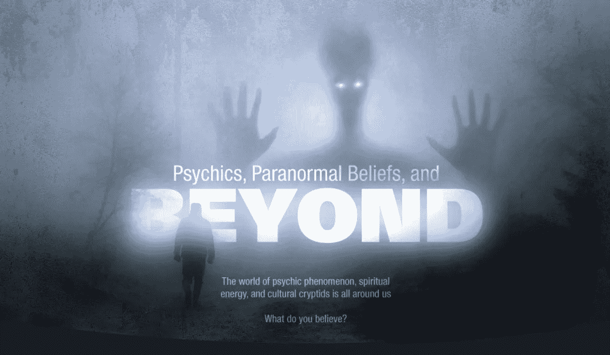
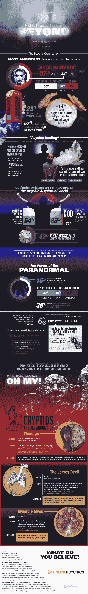

# 好奇心:你相信什么？

> 原文：<https://medium.com/hackernoon/curiosity-what-do-you-believe-in-849675cd2554>

根据 2002 年对美国成年人的调查，近 60%的人相信有灵异现象发生。在大洋彼岸，23%的英国人咨询过灵媒，其中 57%的人相信他们是真实的读者。精神能量触及所有文化的人们，从时间的黎明到我们的现代社会，超自然工作的想法仍然渗透着我们的信仰体系。那么，是什么超越自然的力量如此吸引我们的注意力呢？

近 20%的人报告说在他们的生活中经历过某种形式的心灵感应或超感知觉。这是否可以归因于简单的直觉、机会或巧合，还没有定论。甚至有 42%的人相信真正的鬼屋，38%的人表示，在适当的条件下，死者的鬼魂和灵魂可以回来并与活人互动。尽管在所有领域都有显著的不同，但世界上大多数文化都相信人类无法控制的善良和邪恶的力量。虽然这些故事可能已经演变成营火故事和怪异的睡前故事，但像精灵和鬼魂这样的生物曾经被认为是现实的一部分，在某些情况下仍然如此。

不管是真是假，足够多的人相信精神现象至少值得一些理性的思考。当谈到超自然现象时，你相信什么？它是如何影响你的生活的？看看这张来自 onlinepsychics.com 的信息图，了解更多关于精神现象，它对文化、心理健康的影响，以及它如何抓住我们的想象力。

