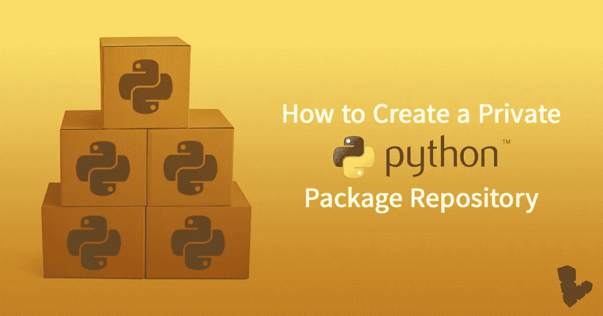
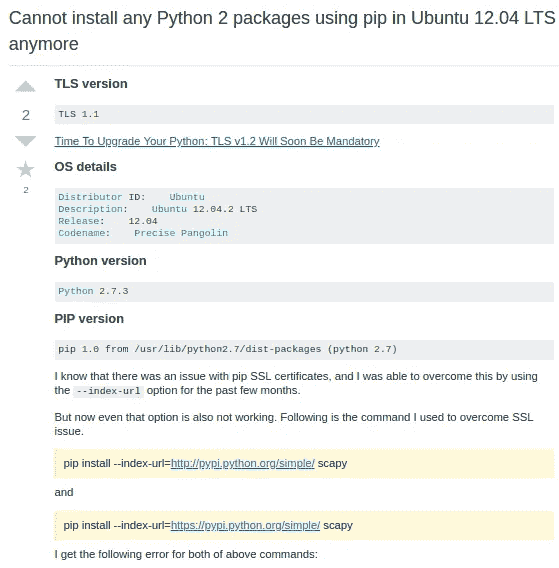

# 私有 Python 包存储库

> 原文：<https://medium.com/hackernoon/custom-python-pypi-repository-409f14975374>



默认情况下，Python 从 PyPI 存储库中下载它的依赖项。它包含最新版本(可以是稳定的或不稳定的)和各种数量的软件包。我们很好，对吗？那么，定制私有包存储库的需求是什么呢？

## **依赖关系管理**

您可以显式地控制包的依赖关系，而不管版本弃用或最新的向后不兼容版本。当然，这可以通过在 *requirements.txt、*中定义版本来实现，但是为了确保我们得到的每个包都是我们所期望的，最好使用定制库。

## PyPI 服务器不支持 TLS v1.1 版和 1.0 版

PyPI 服务器已经停止支持 TLS 1.0 / TLS 1.1 版本设备下载包。

> “我将考虑在截止日期前组织一些预定的 TLSv1.0 和 TLSv1.1 断电’活动，尝试帮助人们找到需要更新的地方。任何计划中的限电将在发生之前发布到 status.python.org。”

因此[升级你的 Python: TLS v1.2 将很快成为强制性的](https://pyfound.blogspot.com/2017/01/time-to-upgrade-your-python-tls-v12.html)，现在它已经成为强制性的了。安装了 Ubuntu 12.04 或更低版本的设备安装了 TLS v1.1，这意味着这些设备无法从默认的 python 包管理服务器下载任何 python 包。通过在终端中运行以下命令来检查您的 TLS 版本。

```
python2 -c "import urllib2,json; print(json.loads(urllib2.urlopen('https://www.howsmyssl.com/a/check').read())['tls_version'])"
```

有一些变通办法，比如明确地说 PIP 从 PyPI 服务器下载。

```
pip install --index-url=[https://pypi.python.org/simple/](https://pypi.python.org/simple/) scapy
```

这在一段时间内有效(在限电期间)，然后它也不会发生作用。



[Too many stack overflow questions!](https://stackoverflow.com/questions/49943662/cannot-install-any-python-2-packages-using-pip-in-ubuntu-12-04-lts-precise-pang)

这里我们只有两个选择，升级 TLS 版本或使用自定义存储库。过了一段时间，升级 TLS 也变得不可能，因为你需要升级 openssl 和 **python 加密模块**。升级 python 模块是不可能的，所以我们陷入了死锁😕。这就是自定义存储库的用武之地！😃

# 构建自定义存储库

您需要以下东西来创建您自己的定制 python 库。

1.  托管 Ubuntu 服务器
2.  使用 TLS v1.2 版的 Python 环境
3.  公有土地

好吧，让我们把手弄脏😉

首先登录你的 Ubuntu 服务器，在 requirements.txt 文件中列出你需要的所有依赖项，如下所示

```
boto3==1.4.4
botocore==1.5.90
click==3.1
coloredlogs==8.0
configobj==5.0.6
docutils==0.13.1
futures==3.1.1
jmespath==0.9.3
pexpect==3.1
pyOpenSSL==0.15.1
pyasn1==0.4.2
pycrypto==2.6.1
python-dateutil==2.6.1
requests==2.5.3
s3transfer==0.1.10
scapy==2.4.0
six==1.5.2
speedtest-cli==2.0.0
urllib3==1.7.1
virtualenv==15.2.0
websocket-client==0.16.0
wheel==0.24.0
ndg-httpsclient
distribute
pip==1.5.4
```

然后创建 Python 虚拟环境来安装这些依赖项。

```
pip install virtualenv
virtualenv repo
source repo/bin/activate
mkdir /home/batman/py-cache
```

虚拟环境中现有的 pip 版本应为 **1.5.4** 。

```
pip install -r requirements.txt --no-use-wheel --download="/home/batman/py-cache"
```

现在已经把所有的包下载到了你的 Ubuntu 服务器上，我们需要把所有的包组织到一个标准的目录结构中，这样 PIP 客户端就可以识别模块了。为此，我写了一个小脚本，在 py-cache 目录下运行它，它将为您完成这项工作😃

```
import os

for filename in os.listdir('/home/batman/py-cache'):
    try:
        package_name = filename.split('.')[0].split('-')
        del package_name[-1]
        package_name = '-'.join(map(str, package_name))
        print package_name
        os.system('mkdir %s' % package_name)
        os.system('mv %s %s/' % (filename, package_name))
    except Exception as e:
        print 'ERROR: '
        print 'e'
```

确保所有的包裹都被搬走了。如果没有移动任何东西，手动创建一个目录，并将 tar 文件移动到里面。我们快到了！让我们托管存储库。

首次安装托管客户端

```
pip install twisted
```

默认情况下，主机从端口 8080 启动，确保没有其他进程拥有它。

```
lsof -i:8080
```

将您的终端放入 **py-cache** 目录

```
twistd -n web --path .
```

就是这样！👏您已经构建了自己的定制库，现在它托管在您的 Ubuntu 服务器的端口 8080 中。

## 向 PIP 客户告知我们的自定义存储库

在你的客户身上，

```
vim /etc/pip.conf
```

添加您的自定义存储库 URL

```
[global]
index-url = [http://10.1.10.69:8080](http://10.1.10.69:8080)
```

然后导出一个环境变量 PIP_CONFIG_FILE。

```
export PIP_CONFIG_FILE=/etc/pip.conf
```

就是这样。现在，通常的 pip 安装如下，将从您的自定义库安装 python 包。

```
pip install scappy
```

在这里，您可以完全控制需要提供的依赖项，以及需要验证和禁止哪些客户端。我希望我已经和你们分享了有用的信息。

干杯🍻

编码快乐！