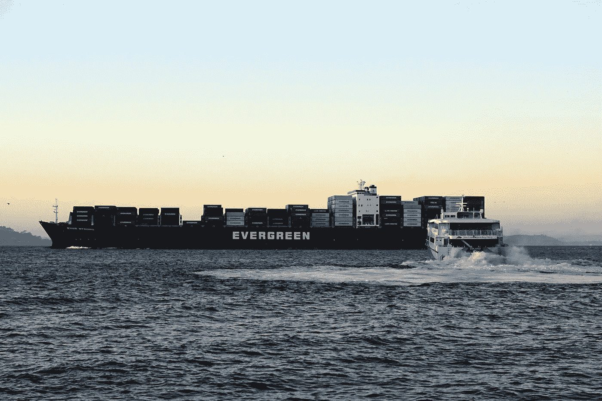
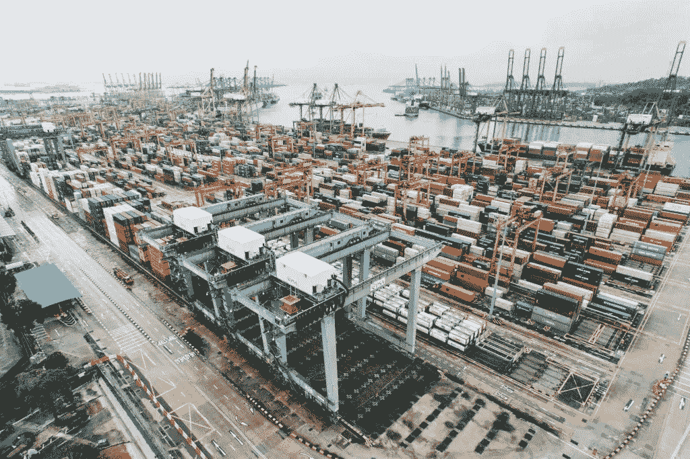

# 定制 TMS 软件:值得努力吗？

> 原文：<https://medium.com/hackernoon/custom-tms-software-is-it-worth-the-effort-c01bf5fb6b0b>

运输[物流](https://hackernoon.com/tagged/logistics)和货运操作的自动化是当今的趋势。与 2017 年初相比，目前使用运输[管理](https://hackernoon.com/tagged/management)系统的中小企业增加了 15–20 %,这是一个巨大的突破。在大型组织中，大约 50%的托运人已经实施了 TMS。由于 TMS 维护费用的降低及其带来的好处，预测甚至承诺了更大的需求。

[ARC Advisory group research](https://www.arcweb.com/market-studies/transportation-management-systems) 指出，TMS 的应用为公司节省了高达 8%的成本，这可归功于自动化决策、装载整合、路线优化、时间节约、承运人超额收费的减少以及自动化货运审计。

需求与供应相结合:越来越多的 TMS 解决方案被发布。如何选择一个好的，是更好地利用现有的选项还是建立自己的 TMS？让我们看看。

# 是什么造就了一个好的运输管理系统

无论您是托运人、承运人还是第三方物流公司，高效的 TMS 都会让您的工作变得更加轻松。但是，只有当它满足您的业务需求时。每个系统都有自己的特点，并与其他系统不同。其中一些只是针对特定的经济学领域。因此，一个好的 TMS 的第一个也是最重要的指标是它像手套一样适合你的业务。

其次，好的运输管理系统是多功能的，允许不同的数据处理。TMS 最常见的特征包括:

*   合同管理(查看合同、比较成本、跟踪条款和协议)；
*   运费结算(审核、支付运费发票、创建付款凭证)；
*   报告和分析；
*   业务绩效监控和财务报告；
*   风险管理；
*   运输过程的可见性。

其他重要问题包括连通性以及进一步发展和适应的潜力。TMS 在很大程度上依赖于不同合作伙伴(供应商、承运商和物流服务提供商)之间的数据交换，因此它必须能够与外部系统集成。并且在营业额和系统负载增加、供应链进步或其他改变的情况下，应该可以更新系统而没有额外的成本。

# 运输管理系统:建造还是购买

如今有数百家供应商提供 TMS 解决方案。有许多现成的产品，您只需支付实施和订阅费用。那么，真的有必要再开发一个 TMS 吗？

要回答这个问题，企业应该定义它的操作需求，以及它希望通过 TMS 实现什么。作为一个企业主，考虑你的长期目标以及差异化和扩张的可能性。每个企业都是独特的，有自己的需求、文化和内部流程。即使忽略一个有意义的特性，也会导致在实施过程中甚至实施之后额外的金钱和时间开销。在最坏的情况下，你的 TMS 可能完全不适合。

您还需要考虑隐藏的 TMS 成本，例如许可证、实施、订阅延期、年度维护、购买和实施第三方软件的必要性以及人员培训。

最后，数据安全是一个很大的需求。保护不当的数据存储导致的损失可能是致命的。当然，在这方面，内部解决方案有很大优势。

还有一组技术功能使 TMS 变得有用和高效。我们来看看最本质的。

# 如何选择技术功能

TMS 可以采取不同的形式。它可以是一个独立的产品，也可以是更广泛的供应链套件的一个组成部分。根据您的目标，您可能需要一组独特的技术功能。

让我们考虑一下 [Smartseeds](https://stfalcon.com/en/portfolio/smartseeds-ru) 的例子，这是由[Stfalcon.com](https://stfalcon.com/en/portfolio)开发的服务。这项服务的主要目的是将货主和货运经营者联合成一个谷物运输系统。它可以让货主很容易地找到承运人，并减少官僚程序。另一方面，货运经营者可以合作在任何距离运输任何数量的货物。开发人员还有一项任务，就是在整个行程中提供与司机的持续沟通。

因此，设计了以下系统架构:

*   API，通过它提供所有交易，
*   两类用户的客户端网络接口(前端部分):货主和货运经营者，
*   系统管理员的 web 界面(后端部分)，
*   跟踪车辆坐标的地理信息服务，
*   司机手机 app，
*   面向货主和货运运营商的类似优步的移动应用程序。

我们还确保了与外部功能的集成，如发送通知、1C 会计、银行服务和谷歌地图 API。如您所见，所有功能都是针对服务的业务目标而定制的。

# 定制 TMS 的开发成本

开发成本是根据项目长度计算的。它包括用户界面和用户体验设计、前端和后端开发以及质量评估(自动化和验收测试)。

对于现代 TMS 来说，基本要素是管理控制面板、GIS 和司机-调度员通信功能以及综合会计。基于这个最小集合，整个开发周期的大概价格是 20 万美元。但是，它可能会根据对您的业务很重要的功能集而有所不同。

如果你想为客户端和驱动程序添加移动应用程序(就像我们为 Smartseeds 所做的那样)，两个平台(iOS 和 Android)将花费 9 万美元。

# 综上

TMS 在现代运输和物流中是不可或缺的。目前，TMS 维护变得越来越便宜和方便，越来越多的公司将它应用到他们的供应链中。从零开始开发 TMS 允许根据您的业务需求精确调整解决方案，并增强安全性和竞争力。

TMS 开发成本大约在 200-300，000 美元之间，但根据所包含的功能，总额可能会有所不同。考虑到与现成 TMS 解决方案的实现和定制相关的隐藏成本和困难，开发您的定制 TMS 仍然是非常值得考虑的。

Stfalcon.com 被列为欧洲最佳物流开发商之一。我们在运输管理系统和物流应用程序的开发方面拥有深厚的专业知识，并邀请您加入我们的业务合作。

*最初发表于*[T5【stfalcon.com】](https://stfalcon.com/en/blog/post/TMS-development-cost)*。*