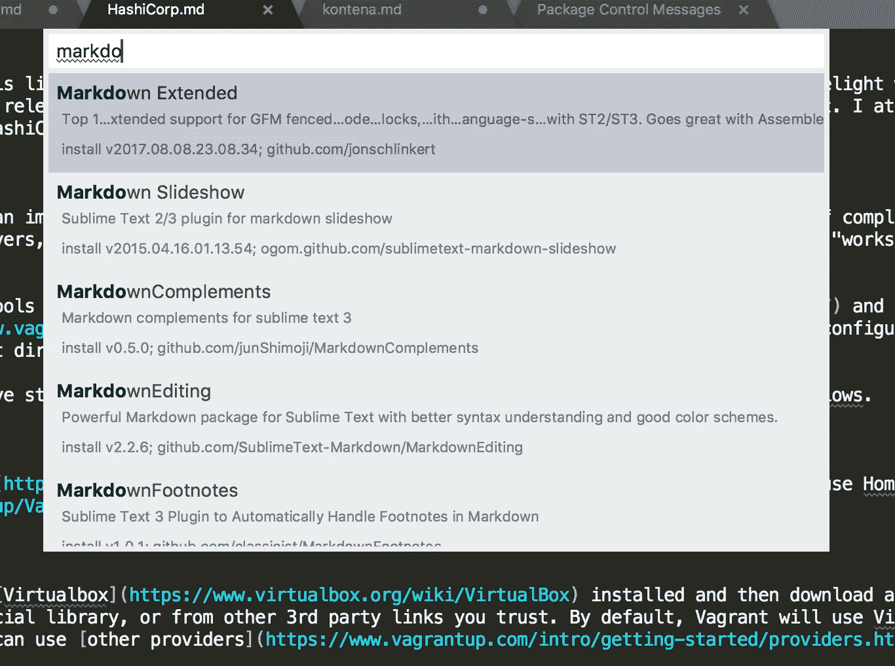
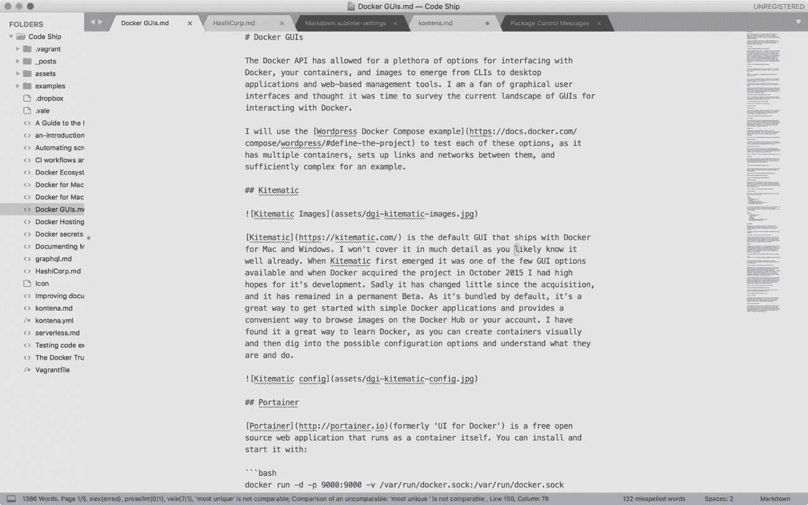
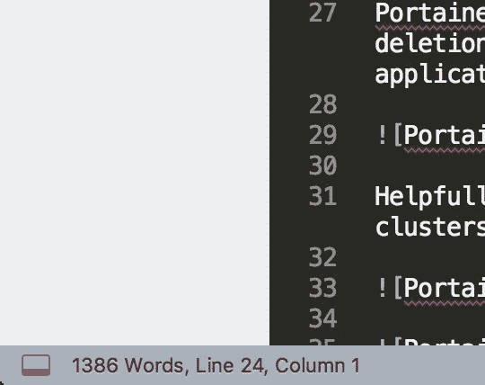

# 为作家定制崇高的文本

> 原文：<https://medium.com/hackernoon/customizing-sublime-text-for-writers-d9beb658bbfc>

到目前为止，我已经写了[如何为作者](https://hackernoon.com/making-atom-even-more-awesome-my-setup-e7a89969a876)定制 Atom 和 [Visual Studio 代码。事实证明，这些帖子很受欢迎，人们一直在问我最喜欢的文本编辑器。这个系列现在以](https://dzone.com/articles/customizing-visual-studio-code-for-writing)[崇高文本](https://www.sublimetext.com/)继续，这是我作为开发人员工作时使用的编辑器，后来我不再喜欢它了，主要是因为开发停止了一段时间。版本 2 和版本 3 之间有很多混淆，然后我发现了 [Atom](http://atom.io/) ，然后就有点忘记它了。然而，崇高的文本正在经历某种复兴，我想是时候重温它，看看它对作家有多适合。一个警告:虽然 Sublime 核心开发已经苏醒，但是许多包还没有。由于它是一个旧的稳定的代码库，这可能无关紧要，包可能仍然有效。我试图只包含与 Sublime 版本 3 兼容的包，并且有一些最近的开发活动。

要安装软件包，请打开控制面板并使用软件包控制来搜索和添加软件包。

# 增加可读性

默认情况下，Sublime 突出显示当前行，您的主题决定了它的可见性。为了进一步控制，您可能喜欢[高亮文字](https://packagecontrol.io/packages/HighlightWords)、[高亮文字](https://packagecontrol.io/packages/Highlighter)和[高亮文字](https://packagecontrol.io/packages/WordHighlight)软件包。

# 语言格式化程序和代码片段

# 标记支持

Sublime 有一些软件包可以让 markdown 编辑得更好，同样，找到它们需要[在包控制](https://packagecontrol.io/search/markdown)中搜索，同样，我在弄清楚如何让它们工作方面有着复杂的经历。例如， [MarkdownEditing](https://packagecontrol.io/packages/MarkdownEditing) 增加了一个轻松的主题，并将编辑器主体集中化，我一直认为这更适合写作工作。它还增加了各种快捷方式、林挺和便利功能。此外， [MarkdownExtended](https://packagecontrol.io/packages/Markdown%20Extended) 增加了对 YAML 前端事件和代码块高亮显示的支持，这对技术作家来说更有用。

Asciidoc 有一个包，[asciidor](https://packagecontrol.io/packages/Asciidoctor)。用于[重组文本](https://packagecontrol.io/packages/RestructuredText%20Improved) (RST)和[RST 片段的荧光笔](https://packagecontrol.io/packages/Restructured%20Text%20(RST)%20Snippets)

当然，德高望重的 P [andoc](https://packagecontrol.io/packages/Pandoc) 也有一个包。

还有一整个系列的[‘文本操作’](https://packagecontrol.io/browse/labels/text%20manipulation)软件包，其中一些我可以想象作者可能会觉得有用，比如 [ChangeQuotes](https://packagecontrol.io/packages/ChangeQuotes) 和 [LineEndingsUnify](https://packagecontrol.io/packages/Line%20Endings%20Unify) 。

# 项目管理

Sublime 内置了[项目管理](https://www.sublimetext.com/docs/3/projects.html)，有一个配置文件可以用来创建你需要的设置，如果需要更多，可以试试[项目管理器](https://packagecontrol.io/packages/ProjectManager)包。

# 写得更好

默认情况下，Sublime 有拼写检查功能，但是您需要通过将以下内容添加到您的用户设置文件中来启用它:

在引擎盖下，Sublime 使用 H [unspell](http://hunspell.github.io/) 、[并且你需要下载除了 US 和 GB 英语之外的任何词典](https://www.sublimetext.com/docs/3/spell_checking.html)。遗憾的是，它没有利用许多操作系统所具有的内置功能。

对于字数统计，使用[字数统计](https://packagecontrol.io/packages/WordCount)包，它也有计算阅读时间的设置和一些高级功能。

# 林挺

Sublime 有广泛的 [SublimeLinter](https://packagecontrol.io/packages/SublimeLinter) 包，有一长串官方的和贡献的扩展([这是最好的选择](https://packagecontrol.io/browse/labels/SublimeLinter))。很难找到一个全面的列表，但这里有一些我发现的可能会引起作家的兴趣。

虽然我必须承认，我努力让它们中的许多正常工作，配置并不总是清晰的，并且 linter 消息的显示也没有像 Atom 和 VSC 那样集成得那么好。

*   [亚历克斯](https://packagecontrol.io/packages/SublimeLinter-contrib-alex)
*   [散文](https://github.com/amperser/SublimeLinter-contrib-proselint)
*   [Testlint](https://packagecontrol.io/packages/SublimeLinter-contrib-textlint)
*   [Vale](https://packagecontrol.io/packages/SublimeLinter-contrib-vale)
*   [写好了](https://packagecontrol.io/packages/SublimeLinter-contrib-write-good)

如果您希望 lint 代码片段包含在您的文档中，那么几乎每种语言都有可用的选项，但是同样，使用它们的好处可能会有所不同。

# 我应该用它吗，克里斯？

人们仍然喜欢 Sublime 而不是 Atom 和 VSC 的原因之一是性能。Sublime 是用 Python 而不是 JavaScript 编写的，因此消耗的内存和 CPU 更少。我没有用它来证明或反驳这种说法，但在我的 Mac 上简单看了一下 Activity Monitor 后，CPU 使用率普遍低于其中任何一个编辑器，但没有我预期的那么多。许多 CPU 峰值是由包及其依赖项引起的，这在所有编辑器中都是一样的。

嗯，坦白地说，我会说不。如果你已经在使用 Sublime，并且知道如何让它以一种更加用户友好的方式工作，那么添加一些以 writer 为中心的包可以增强你的体验。但是对于寻找新选择的作者来说，Atom 和 Visual Studio 代码要好得多，也更现代，可供他们使用的软件包也是如此。

*最初发表于*[*【dzone.com】*](https://dzone.com/articles/customizing-sublime-text-for-writers)*。*