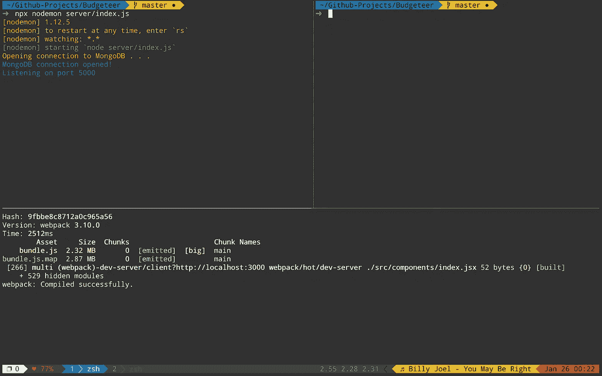

# 定制 Tmux 状态行的权威指南

> 原文：<https://medium.com/hackernoon/customizing-tmux-b3d2a5050207>

我假设您已经设置了一个正在使用的. tmux.conf 文件。如果没有，首先查找 setting . tmux . conf 或类似的文件。

# 步骤 1:如何更改状态行

> 设定-g 状态-左侧
> 
> 设置-g 状态-右侧

用一串你想要的选项替换`<options>`。可以使用`#[bg=colour*]`设置背景颜色，其中`*`是 0-255 之间的某个数字，用于支持 256 色的终端。要改变前景色(文本颜色)，只需`#[fg=colour*]`(再次用 0 到 255 之间的数字替换*)。

要一次查看所有 255 种颜色，请查看[该堆栈溢出答案的注释](https://superuser.com/a/1104214)

我想做的第一件事就是在状态行中添加日期和时间。很简单对吧。这里是一个选项的完整列表[https://linux.die.net/man/3/strftime](https://linux.die.net/man/3/strftime)或者一个更短更可读的列表见我的`[.tmux.conf](https://github.com/sbernheim4/dotfiles/blob/master/.tmux.conf#L59.)`的一部分

在`<options>`字符串中添加`%H:%M`将会以 24 小时格式显示当前时间，不带秒(类似于 15:38)。

# 步骤 2: Tmux 特定值

Tmux 有自己的一套代表不同事物的价值观。例如，`#H`指的是您当前所在的计算机的主机名，`#S`指的是当前会话的索引。关于选项的完整列表，请点击[此处](https://linux.die.net/man/1/tmux)并搜索短语“字符对替换为”

—2018 年 4 月 20 日更新—

所以我最近学会了如何在当前状态下显示或隐藏状态栏中的文本(如果前缀被按下或者窗口被缩放等)。tmux 的官方手册页有一个记录窗格/窗口/会话状态的属性列表。访问该页面，搜索“以下变量适用”，您将看到一长串选项。你可能会问，如何使用它们，为了知道前缀是否被按下，我用下面的代码改变了我的状态行的颜色。

> `#{?client_prefix,#[bg=colour2],}`

如果前缀是活动的(就像我刚才按下它一样)，那么它会在第一个逗号后插入文本，否则会在第二个逗号后插入文本，在本例中没有任何内容。这里我插入文本来改变背景颜色，但是任何文本都可以插入，包括…图标。要在当前窗口放大时显示图标(可以用前缀+ z 来实现)，请参见下面的代码。

> `#{?window_zoomed_flag, ,`🔍`}`

这将在状态行中的任何位置添加一个放大镜。(对于图标，您可能需要在图标前后添加额外的空格。我在前后都增加了额外的空间，以免显得拥挤)。

—结束更新—

# 步骤 3:使用 Bash 命令显示很酷的东西

最后一个关键步骤是能够使用 bash 命令显示很酷的信息。这可以包括诸如电池百分比、当前歌曲播放等内容。要做到这一点，您首先必须找到一个 bash 脚本或命令来提供您想要的输出。例如，我使用以下命令显示当前的电池百分比:

> `pmset -g batt | grep [0-9][0-9]% | awk ‘NR==1{print$3}’ | cut -c 1–3`

注意:这只适用于 mac，因为 pmset 是 MAC 特有的终端命令。

我电脑里存了一个文件叫 battery.sh，文件有两行长。第一行是 bash shebang ( *#！/bin/bash* )而第 2 行是上面的命令。为了在状态行中显示电池，在我的. tmux.conf 中的<选项>中我有

> `#(path/to/battery.sh)`

(专业提示:在#前添加一个表情符号，如:♥，会在状态行显示为♥ 64%，看起来比 64%更酷)

# 第四步:插件

好吧，这些并不是真正的插件，而是其他人已经写好的脚本。查看[https://github.com/jdxcode/tmux-spotify-info](https://github.com/jdxcode/tmux-spotify-info)获取当前播放的 Spotify 歌曲，这又是 mac 版，因为开发者用苹果脚本编写了这个脚本。但关键是您可以找到其他人已经为您的环境编写的脚本，并轻松地将它们添加到您的状态行中。

# 步骤 5:自定义窗口

希望您已经知道了会话、窗口和窗格之间的区别。如果没有，请快速阅读。

要点是，除了状态行的左侧和右侧之外，您还可以使用以下选项自定义窗口在状态中的显示方式:

> `set -g window-status-format <options>`

其中<options>与之前的配置相同。您还可以自定义当前窗口的显示:</options>

> `set -g window-status-current-format <options>`

再次查看[这个](https://linux.die.net/man/1/tmux)站点，搜索“字符对替换为”查看一些专门为 windows 保留的 Tmux 命令。然后，您还可以自定义用于显示窗口之间差异的分隔符。自定义分隔符可能需要修补字体来显示某些字符。在谷歌上快速搜索修补过的字体应该会得到一些好的结果。对于很酷的 unicode 字符分隔符(尽管它们是 unicode，仍然可能需要修补的字体)，请查看[这个网站](http://www.amp-what.com/unicode/search/)。

> 提示:尝试搜索类似左三角形的东西

感谢阅读。[查看我自己的. tmux.conf](https://github.com/sbernheim4/dotfiles/blob/251a30db0dbbd2953df35bfa0ef43e92ce15b752/tmux/.tmux.conf#L1)