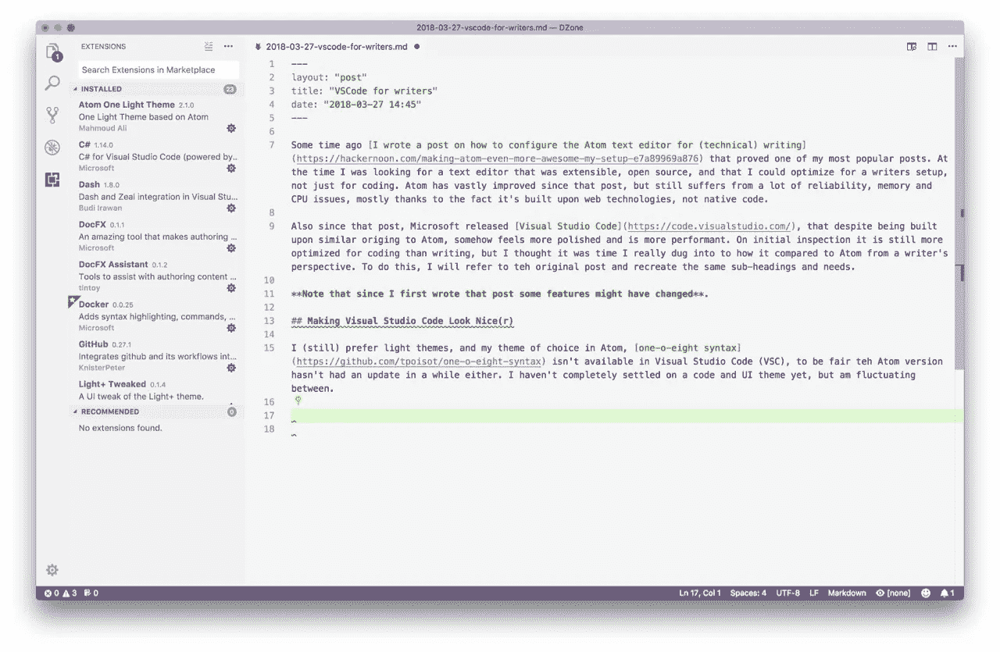
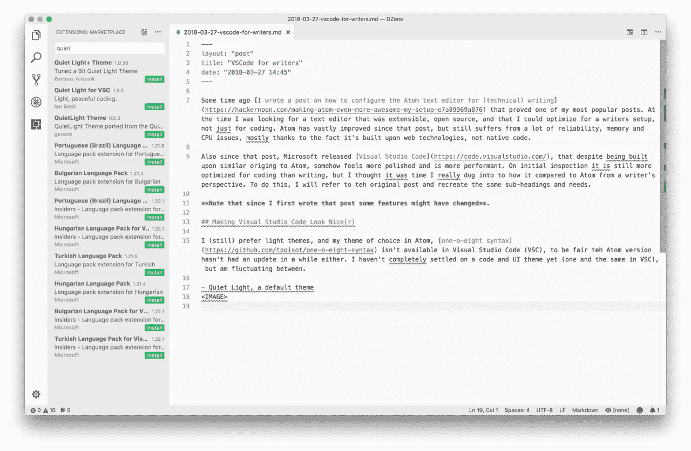
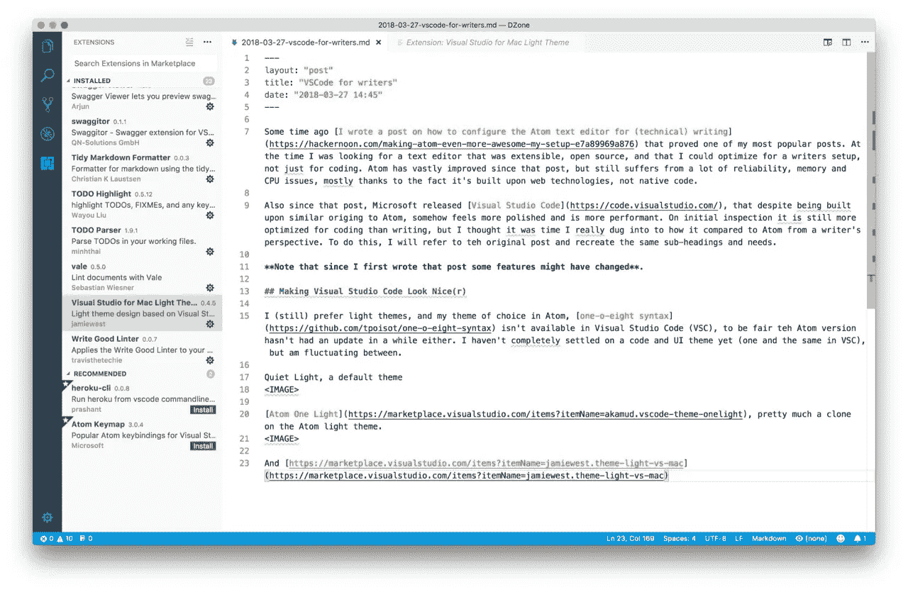
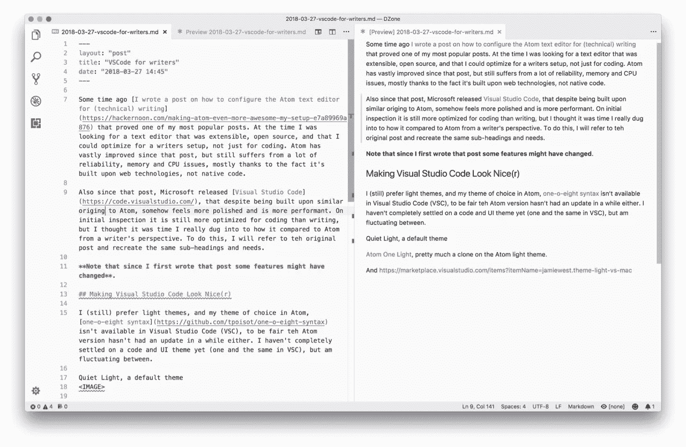

# 自定义用于编写的 Visual Studio 代码

> 原文：<https://medium.com/hackernoon/customizing-visual-studio-code-for-writing-2e6e621e069e>

前段时间[我写了一篇关于如何配置 Atom 文本编辑器用于(技术)写作](https://hackernoon.com/making-atom-even-more-awesome-my-setup-e7a89969a876)的帖子，这是我最受欢迎的帖子之一。当时，我正在寻找一个可扩展的、开源的文本编辑器，并且我可以针对编写器设置进行优化，而不仅仅是针对编码。自那篇文章发表以来，Atom 已经有了很大的改进，但仍然存在许多可靠性、内存和 CPU 问题，这要归功于它是基于 web 技术而不是本地代码构建的。

也是在那篇文章之后，微软发布了 [Visual Studio 代码](https://code.visualstudio.com/)，尽管与 Atom 起源相似，但不知何故感觉更加完美，性能也更好。在最初的检查中，它仍然比编写更适合编码，但我认为是时候从一个作者的角度深入研究它与 Atom 相比如何了。为了做到这一点，我主要参考原始帖子，并重新创建相同的副标题和需求。自从我第一次写那篇文章以来，Atom 的一些特性发生了变化，我的需求也发生了变化，所以这篇文章不会完全遵循原来的内容。

# 让 Visual Studio 代码看起来更好(r)

# 主题

我(仍然)喜欢轻松的主题，我在 Atom 中选择的主题， [one-o-eight 语法](https://github.com/tpoisot/one-o-eight-syntax)在 Visual Studio Code (VSC)中不可用，公平地说 Atom 版本也有一段时间没有更新了。我还没有决定代码和 UI 主题(在 VSC 是同一个主题)，但是我在它们之间摇摆不定。

安静的灯光，VSC 的默认主题。

Atom One Light ，很大程度上是 Atom light 主题的克隆。

以及 [Visual Studio for Mac Light 主题](https://marketplace.visualstudio.com/items?itemName=jamiewest.theme-light-vs-mac)。

# 增加可读性

默认情况下，VSC 会高亮显示线条，您可以配置该设置以满足大多数需求。

# 美化和编码格式

默认情况下，VSC 美化了大多数常见的代码格式，但是，对于文本格式，您需要一个扩展，例如[remark](https://marketplace.visualstudio.com/items?itemName=mrmlnc.vscode-remark)for markdown；我找不到任何其他常见的技术写作标记语言。

对于那些希望自由书写的人来说，就像普通人一样，想写多长就写多长，但是你必须将你的更改提交给系统(或人)，这些系统(或人)希望行设置在某个长度，这里有 [rewrap 扩展](https://marketplace.visualstudio.com/items?itemName=stkb.rewrap)。它不像 Atom 中的[断开线长度](https://atom.io/packages/line-length-break)和[多绕线导轨](https://atom.io/packages/multi-wrap-guide)软件包那样容易设置和使用，但它确实完成了任务。

VSC 没有颜料[扩展](https://atom.io/packages/pigments)，但是[着色](https://marketplace.visualstudio.com/items?itemName=kamikillerto.vscode-colorize)略有相似。

# 语言格式化程序、Linters 和 Snippets

VSC 处理您需要的大多数代码格式化程序和语言，但是特别关注对写作中使用的语言的语言支持，有:

*   [重组文本](https://marketplace.visualstudio.com/items?itemName=lextudio.restructuredtext)。
*   [乳胶成型机和工具](https://marketplace.visualstudio.com/search?term=latex&target=VSCode&category=All%20categories&sortBy=Relevance)，特别是[乳胶车间](https://marketplace.visualstudio.com/items?itemName=James-Yu.latex-workshop)。

# 降价

特别提一下 Markdown，因为它是我(和许多其他人)最常用的格式。与 Atom 不同，VSC 的默认 markdown 预览还不错，还有一个好处是预览与编辑窗格保持同步。

其他有用的扩展包括:

*   [减价棉绒](https://marketplace.visualstudio.com/items?itemName=DavidAnson.vscode-markdownlint)。
*   [降价快捷方式](https://marketplace.visualstudio.com/items?itemName=mdickin.markdown-shortcuts)。

# 项目管理

VSC 有很好的内置项目管理功能，但是要真正复制 Atom [项目经理](https://atom.io/packages/project-manager)包，还有[项目经理](https://marketplace.visualstudio.com/items?itemName=alefragnani.project-manager)。

要像 Atom 的[自动完成路径](https://atom.io/packages/autocomplete-paths)一样添加路径自动完成，请尝试[路径智能感知](https://marketplace.visualstudio.com/items?itemName=christian-kohler.path-intellisense)。

谢天谢地，奇妙的 [git 时光机](https://atom.io/packages/git-time-machine)在(几乎势不可挡的) [GitLens](https://marketplace.visualstudio.com/items?itemName=eamodio.gitlens) 中有一个 VSC 替代品。此外，模仿 Atom [pull requests](https://atom.io/packages/pull-requests) 包的是 [GitHub](https://marketplace.visualstudio.com/items?itemName=KnisterPeter.vscode-github) 扩展，它自然地添加了许多其他功能。

# 写得更好

好了，现在来看最重要的事情。

谢天谢地，VSC 有一个[写得好的棉绒](https://marketplace.visualstudio.com/items?itemName=travisthetechie.write-good-linter)，一个[亚历克斯棉绒](https://marketplace.visualstudio.com/items?itemName=shinnn.alex)，对于更喜欢冒险的人来说，还有 [vale](https://marketplace.visualstudio.com/items?itemName=lunaryorn.vale) 和 [textlint](https://marketplace.visualstudio.com/items?itemName=taichi.vscode-textlint) 。这些都不是那么受欢迎，这也许说明了当前 VSC 用户的一些情况。

奇怪的是，VSC 默认没有拼写检查，但有许多选项可用，包括[代码拼写检查器](https://marketplace.visualstudio.com/items?itemName=streetsidesoftware.code-spell-checker)、[拼写检查器](https://marketplace.visualstudio.com/items?itemName=swyphcosmo.spellchecker)(使用 hunspell 实现最大的全局兼容性)和[拼写正确](https://marketplace.visualstudio.com/items?itemName=ban.spellright)。我仍然在测试我更喜欢哪一个，但是拼写正确和拼写检查更适合作者的需要。

[字数](https://marketplace.visualstudio.com/items?itemName=ms-vscode.wordcount)，嗯，给你看一个字数。

那把奇妙的瑞士军刀，Pandoc，[有一个扩展](https://marketplace.visualstudio.com/items?itemName=DougFinke.vscode-pandoc)，可以生成各种各样的文件格式。

# 奖金

什么东西 VSC 有而原子没有？一个和另一个有什么不同？很高兴你问了。

几个 [Swagger/Open API](https://marketplace.visualstudio.com/search?term=swagger&target=VSCode&category=All%20categories&sortBy=Relevance) 扩展。

许多林挺软件包可以更好地集成到 VSC 界面/操作系统界面中，而 Atom 则是开发者提供的解决方案的大杂烩。但是并不是所有的扩展都遵循这种模式，有时还遵循它们自己的范例。

不知道您在寻找什么扩展？VSC 有一个方便的功能，根据文件扩展名提供建议，这意味着你经常会发现你不知道存在的有用的花絮。

Atom 包通常在代码中有它们的设置，但是所有的 VSC 设置都在配置文件中。它有一个友好的界面来编辑它们，但是它没有*的用户友好。*

我还发现 VSC 扩展偶尔会像 Atom 包一样不可靠和不一致，这可能是配置问题，但不容易知道哪些设置可用。

# 我应该用什么克里斯？

我就知道你会问这个。Atom 开始时是一个更简单的文本编辑器，你可以用包来增强，Visual Studio 代码默认有更多的功能，但主要针对编码人员，你不能禁用它们。我只是刚刚开始尝试在我的文本编辑中使用 VSC，所以我仍然在学习使用它的特点和微妙之处。我不知道，两个都玩，看看你更喜欢什么。请在下面的评论中告诉我你的经历。

*原载于*[*dzone.com*](https://dzone.com/articles/customizing-visual-studio-code-for-writing)*。*