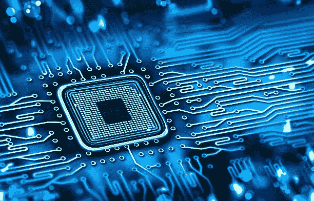

# 控制论有机体:人与机器兼容的困难

> 原文：<https://medium.com/hackernoon/cybornetic-organisms-the-difficulties-of-compatibility-between-man-and-machine-5342da5ddf6b>

Computer Chip Matrix. Source: technologynewsextra.

仿生生物，或者是拯救呼吸的“电子人”,是既有机械元件又有有机身体部分的生物。像“生物”和“有机体”这样的术语可以指动物或人，也可以指两者。

就动物王国而言，科学家已经将昆虫和其他小生物改造成可控的电子人，操纵它们的运动。机械化设备控制任何东西的运动，更不用说任何人的思想，这一纯粹的概念会让某些人感到震惊，包括我自己。

一些未来学家和科学家真诚地认为，一个世纪后，大多数人类将被植入计算机芯片，以便将人脑与某种人工智能连接起来。实际上，这些微型计算机芯片将成为一种极其便利的脑机接口形式。

这些植入物有可能让病人通过更新版本的精神心灵感应进行交流。这正是杰夫·斯蒂贝尔在他的*福布斯*文章“[侵入大脑:你头脑中的未来计算机芯片](https://www.forbes.com/sites/jeffstibel/2017/07/10/hacking-the-brain/#34a54c572009)”中提出的观点之一 Stibel 继续提到了一些关于标准人类计算机芯片的未来装置的合理担忧。

他的一个担忧是，一个人的记忆有可能被黑客攻击，甚至被删除。我希望人类的后代有意识地考虑人们记忆的某种备份驱动器。

但是想一想:人们，例如世界领导人和外国科学家，以前很难相互交谈，现在可以顺畅地交流。不会有语言障碍。除了能够解决许多交流问题之外，迷你脑-机接口将是一种能够提高创造力和解决问题能力的媒介。

另一方面，这种计算机芯片也可能成为一种以不同方式操纵我们大脑的手段，就像科学家操纵小生物一样。同样，如果某人的思想可能被“侵入”，那么其他人是否能够控制它的问题很可能会出现。

有不正当动机的人或疯狂的人工智能控制某人的大脑是一个分裂的想法，我希望没有人会去探索。但是，如果这种对人类思想的控制是可能的，它将会消除使人成为人类的一个重要因素:我们的自由意志。

我们选择向左走还是向右走，早上什么时候起床，一天中我们计划做什么。如果在未来被改造成电子人，人类做出的选择可能不是他们自己的。十亿个问题从这个计算机芯片场景中产生。"一个被黑客攻击的人会意识到这一点吗？"—比如说。

或者，关于一个更有可能发生的不幸，“如果一个人的计算机芯片被意外损坏或自动失灵怎么办？”在这种情况下，一个人会怎么样？会有生命危险吗？如果没有功能完善的芯片，人体能够存活吗？无论如何，这个清单还在继续。但是时间是一份礼物，要适度使用。

总之，人和机器的融合有起有落。但恐怕这次唐斯夫妇赢了。这个概念有很多道德和逻辑上的缺陷。这些必须首先被检查。