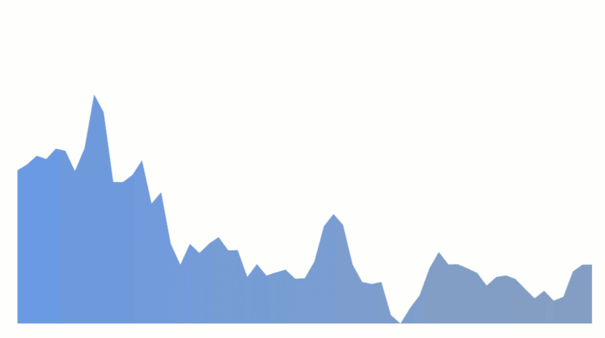
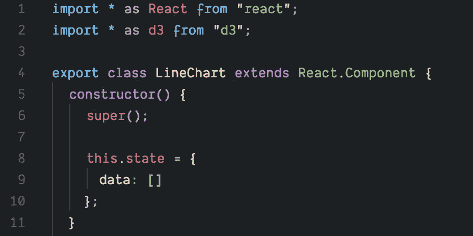
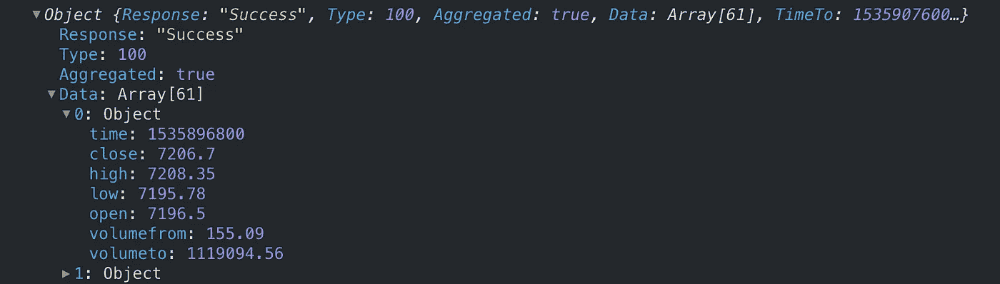
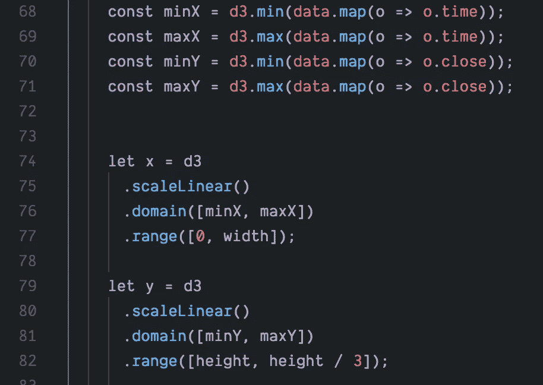
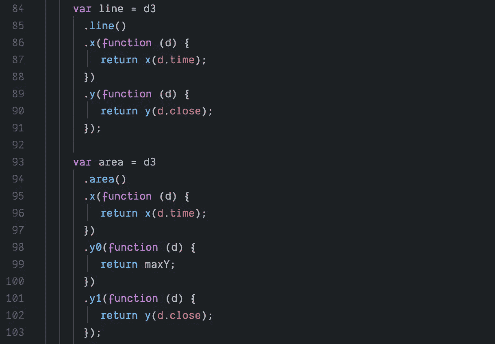
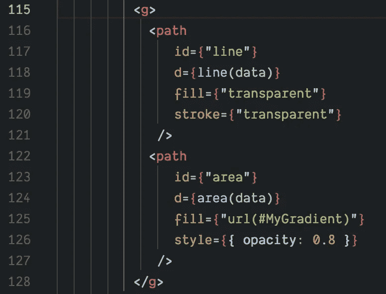
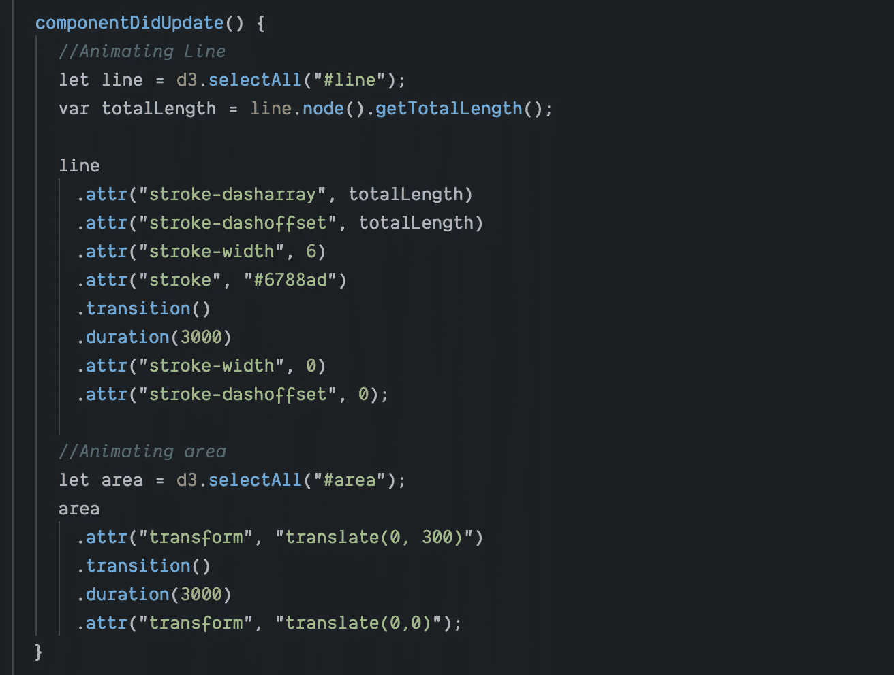

# D3 + React Intro #4 |动画加密货币线+面积图

> 原文：<https://medium.com/hackernoon/d3-react-intro-4-animated-cryptocurrency-line-area-chart-eeac2b76d4c6>

作为 D3 简介的第 4 部分，我想用动画制作一些线图，因为根据我的经验，这是很多前端开发人员感兴趣的事情，尤其是当你处理金融数据或[加密](https://hackernoon.com/tagged/crypto)数据时。

不幸的是，D3 对于新开发人员来说可能是令人生畏的，而且事实上有很多使用不赞成使用的 D3 版本的例子，这对试图学习这个库的人没有帮助。此外，虽然 GitHub 上的文档内容丰富，但缺乏示例，这迫使您在 web 上搜索代码片段来复制和使用。这可能很乏味，尤其是考虑到您经常会遇到不推荐的例子。

但是一切都很好！做这个系列的全部目的是通过结合解释和你可以投入的实际工作代码来帮助你们。(*code sandbox . io 上的开发者们为构建了可以说是最好的基于浏览器的编辑器体验而欢呼。)*

好了，让我们开始吧！… ps:完整编辑器示例的链接在这篇文章的底部。

我们将从导入 [React](https://hackernoon.com/tagged/react) 和 D3 开始，同时写出我们的构造函数并设置我们的状态以包含一个名为 data 的属性。我在这里使用有状态组件，因为我将为图表导入实时数据。

接下来，让我们导入一些随机的加密货币数据，我们可以使用这些数据作为图表的基础。[正如通常推荐的，](https://reactjs.org/docs/faq-ajax.html)您将希望在‘componentdimount()’生命周期方法中编写 ajax http 请求。这将允许您在检索到数据后调用 setState()方法来构建图表。

*注意:我正在从 Cryptocompare 的公共 Api 中获取比特币数据。你可以在这里找到文档* [*。*](https://www.cryptocompare.com/api/#public-api-invocation)

如果您不明白我为什么使用“res.Data ”,请查看 http 请求返回的对象:

如您所见，我们实际的数据数组包含在“data”属性中，因此我们需要提取它。

现在我们有了数据，我们必须考虑如何将它转换成我们的 SVG，并弄清楚如何根据我们想要的窗口大小绘制一条跟踪数据的线。这就是 D3 的“linearScale()”函数的用武之地。

linearScale()接受一个“域”和一个“范围”,它所做的非常简单。你甚至可以快速构建自己的缩放函数，但我更喜欢使用 D3，因为一旦你理解了它，它就很直观。

**线性标度()。域()**

这个域基本上是问你“嘿，伙计，我应该从你的数据集中期望的最小和最大值是多少？”。所以，为了让域函数开心，我们就这么做 *(PS:我详细编码了寻找最小值/最大值的过程。如果您想最小化代码行，请查看 d3.extent()。你传递你的数据，它自动为你创建一个带有最小值和最大值的数组！)*

**linearScale()。范围()**

现在真正的奇迹发生了。这个函数基本上是问“Ok 酷，在你告诉我输入数据是什么样子的域中。现在我需要知道您的 SVG/display 元素有多大，这样我就可以获取输入数据，并给出它相对于该元素大小的相对值！”。

这里有一个简单的心理例子:

*假设您在一个数组([1，2，3，4，5])中有 5 个数据点，您希望将其用于图表上的 X 轴。您决定将图表的宽度设为 300px，所以现在您需要将数组转换为屏幕上相应的像素。这就是 linearScale()的用武之地。它会说“Ok cool，你的宽度是 300px，所以 1 的值应该位于(300px / 5) * 1 = 60px，2 的值应该位于(300px/5) * 2 = 120px 等等……”*

好了，让我们继续吧…

如果你知道 SVG 是如何工作的，你就会知道一行是通过一个<path>元素创建的。并且这个<path>元素需要一个属性“d”。这个属性是坐标的实际组合，SVG 将使用它来连接线条。挺酷的。</path></path>

如果这听起来令人困惑，请看一些 SVG 行如何工作的例子[这里](https://www.w3schools.com/graphics/svg_line.asp)。

D3，因为它很棒，提供了开箱即用的函数来创建看起来晦涩难懂的坐标组合，您将把它传递给<path>元素来绘制一条线。</path>

**上面的代码一开始可能看起来有点混乱，但它是这样运行的:**

*(注意:我们将不得不使用我们的数据调用我们创建的 line 变量，并将其传递给 path 元素，如下所示:<path d = { line(this . state . data)}/>。这有助于理解上面的代码，因为现在您知道它将访问我们存储在状态中的加密数据。*

1.  嘿，我是 d3 line 方法()，我有两个函数(。x()和。y())，我需要你用它来返回我的数据点，这些数据点已经使用你以前构建的 linearScale()函数按比例缩放。
2.  英寸 X()我将逐个值地传递给你数据*(记住，我们的数据是一个数组)*，所以你必须给我一个函数，它接收数据并返回每个输入值的缩放后的 X 坐标。
3.  英寸我还会把你给我的数据传给你，我需要你给我一个函数，这个函数会接收这些数据，并返回给我每个输入值的 Y 坐标。

顺便说一下，d3.area()函数的过程是相同的，但是，它需要一个额外的部分:因为我们不只是画一条线，而是画一个区域，d3 将需要 y0(你的基数)和 y1(你的 y 坐标)来计算从图表底部到数据点的距离。有道理，对吧？！

如果你现在头疼，没关系。我们就要到达终点了:)

我们现在有了渲染元素的所有东西，所以在我们的<svg>标签之间，我们写了以下内容:</svg>

如您所见，我们在<path>元素中调用了 line()和 area()函数，这将自动为我们创建线条，因为 D3 将我们的数据转换为 x 和 y 坐标，并在这些点之间绘制线条。</path>

最后，让我们看看过渡部分:

因为我们在 componentDidMount()生命周期钩子中获取数据，所以我决定在 componentDidUpdate()钩子中做所有的动画(*)如果你是新手，这没有什么意义，现在不要担心。这对你来说是有意义的。)*

要理解这段代码，您必须理解 d3 转换是如何思考的，所以让我们这样做:

1.  作为第一步，d3 想要知道你正在试图制作什么动画，所以你必须使用 d3.selectAll()函数找到 DOM 元素。
2.  现在你有了元素，你设置它的开始属性(例如，在你激活它之前元素应该是什么样子)。
3.  接下来，您调用 transition()和 duration()函数来告诉您的代码“嘿，我现在要给您一些要转换到的属性，我希望您在这个特定的时间/持续时间内在我的开始和结束属性之间转换”
4.  最后，传递您希望元素在转换结束时具有的属性。

**嘣！你有它！**

你刚刚创建了一个很酷的加密货币，动画，真棒线+面积图！恭喜你。

如果你喜欢这篇文章，觉得它很有帮助，并想说声谢谢，我会感谢一些掌声和/或跟在后面的**。我会贴更多的东西，我不想你错过它！**

此外，如果你有问题，只要把它们扔在评论区，我会给你回复，希望有解决方案。