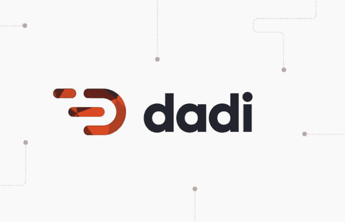

# DADI 是一个去中心化的网络服务，旨在革新云计算

> 原文：<https://medium.com/hackernoon/dadi-a-decentralized-web-service-designed-to-revolutionize-cloud-computing-c2c05386c301>

**关于 DADI 的信息**

DADI 是一个分散的网络服务，它利用区块链，希望彻底改变云计算。它旨在减少少数强大公司对互联网的控制，并在 DADI 参与者之间分配权力，所有人都可以成为收入的受益者。

像谷歌、脸书和亚马逊这样的公司已经在各自的领域获得了很大比例的市场份额，虽然网络服务非常有用，但它们在行业中的立足点让竞争对手窒息，这使得它们可以对简单的在线服务收取极高的佣金。

DADI 的目标是通过引入一个分散的平台来改变这一切，该平台向用户承诺各种好处，如降低高达 90%的成本，提高安全性和费率灵活性。

新的云计算服务建立在以太坊区块链之上，可以在全球范围内实现点对点(P2P)协作。它专注于提供网络服务，以帮助将产品推向市场，并允许任何在线设备作为矿工连接到平台，并出售这些服务所需的计算能力。

像 DADI 这样的分散式全球平台的潜力是巨大的。由于每一项在线业务都是由网络服务驱动的，因此每一项业务都可以利用 DADI 的技术来提高效率、降低成本，并为客户购买服务提供更安全的方式。

与大多数其他为区块链架构开发或转换的平台不同，支持 DADI 服务的技术已经推出，并被用于支持帝国在线、单片眼镜和维珍限量版等产品。

**技术落后于 DADI**

DADI 整合了一系列开放的 web 服务，这些服务在基于现有 P2P 技术的容器层上运行。这些开源 web 服务为用户提供了简化的、用户友好的解决方案来执行常见任务，并帮助他们构建、扩展和发展他们的数字产品。

目前，为了建立 API，提供商必须首先开发 API 包装，获取实例，安装必要的软件，并在开始维护阶段之前集成他们的代码。然后，当涉及到扩展产品时，事情变得更加复杂。使用 DADI，所有用户都需要获得一个 DADI API。目前有 10 架正在生产，其中 5 架已经上市。DADI API 被设计成易于扩展，允许开发者修改他们的技术以满足不断增长的需求。

DADI 原料药公司

DADI API(完整版)

DADI CDN(在建)

DADI 身份(正在建设中)

DADI 火柴(在建)

DADI 预测(在建)

DADI 出版(完整版)

DADI 队列(完成)

DADI 轨道(在建)

DADI 视野(正在建设中)

DADI 网站(完整版)

通过实施 DADI API，用户将能够提供各种服务，包括但不限于:

*   内容和发布平台以及内容分发
*   订阅服务
*   成本敏感型产品——慈善机构、政府、任何需要从日常开支中转移预算的组织
*   内容分类—使用高度精确的分类框架回顾性地重新组织内容，以提高 SEO 和可用性
*   电子商务
*   大数据—在数字产品组合中存储多个产品的用户数据

DADI web 服务是围绕一系列微服务组织的，这些微服务为创建数字产品提供智能应用程序。这些现成的解决方案旨在满足常见要求，并为几乎所有使用情形提供开箱即用的解决方案。

DADI API

一个高性能 RESTful API 层，旨在支持 API 优先开发和 COPE 原则。

DADI 出版公司

作家通向内容创作世界的窗口。旨在优化编辑工作流程的灵活界面。

DADI 网络

一个无模式的模板层，可以作为一个独立的平台运行，也可以与 API 一起作为一个全栈 web 应用程序运行。

DADI CDN

作为现代内容分发解决方案而设计的即时资产操作和交付层。

DADI 商店

适用于所有类型数据的云存储解决方案，具有内置的安全性、隐私性和冗余性。

DADI 队列

Redis 支持的轻量级队列处理系统，具有简单的任务路由和节流功能。

DADI 身份

为匿名和已知用户保证个人的唯一性，并增强细分能力。

DADI 赛道

一个实时的流数据层，提供个人和产品级别的准确指标。

DADI 视觉

用于身份和跟踪的数据可视化界面，能够从几乎任何来源获取数据。

DADI 火柴

一个通过机器学习进行自动内容分类的分类框架，插入到 Publish 中。

DADI 预测

一个机器学习层，根据过去的交互在个人层面预测用户行为。

DADI CLI

DADI CLI 是一个命令行工具，用于帮助安装和定制 DADI 平台的各种产品。

网络用户分为以下几类:

主机:贡献计算能力的网络节点所有者。DADI 的 web 服务运行在主机环境的容器中。主持人因参与网络而受到激励，他们通过锁定少量 DADI 代币来宣布自己，并因其工作而获得 DADI 代币的奖励。主机的可用性通过工作证明系统来管理，该工作证明系统还更新信誉系统以识别最有利的主机。

网关:贡献带宽的网络节点所有者。这些是主机到网络的入口点，并提供域名系统，使主机资源可寻址。本质上，它们是主机处理内容的缓存。网关也有 DADI 代币奖励；来自与其连接的所有主机的令牌的百分比。要成为网关，用户必须锁定大量令牌，比主机多得多。这有助于信誉系统并降低 Sybil 攻击的风险。

星际之门:以域名映射和消费者-DADI 合同谈判的形式在网络中提供重要的功能。它们适用于极高带宽的环境。星际之门也有 DADI 代币作为奖励；所有消费者代币的百分比，并且必须锁定最大量的代币来宣布它们自己。

消费者:网络的用户。这些人可能是企业、政府，甚至是个人和他们的顾客。

**DADI 令牌**

DADI 代币是区块链以太坊的 ERC20 代币。网络上的所有交易都将使用 DADI 令牌进行，其中最大一部分令牌流向主机，一部分支付给它们所连接的网关，然后保留较小的一部分用于支持网络，类似的一部分支付给开发团队。

该团队将开发一个钱包前端界面，允许消费者以自己选择的货币购买服务。

**有价值的信息**

**币名** : DADI 云(DADI)

**总供应量** : — 1 亿 DADI

**循环供给** : —

**市值** : —

**Ico 前价格** : — 1 DADI = 0.4 美元

**Ico 价格** : — 1 DADI = 0.5 美元

**通过 ICO 筹集的代币/资金**:2900 万美元中的 400 万美元(14%)

**社交媒体信息**

**脸书**

网址:——[https://www.facebook.com/daditechnology](https://www.facebook.com/daditechnology)

喜欢:967 个喜欢和 1 003 个追随者

过去 7 天有多少帖子/更新:—帖子

**推特**

网址:[https://twitter.com/dadi](https://twitter.com/dadi)

关注者:12.4 万关注者

过去 7 天有多少条推文/转发:14 篇帖子

**电报**

网址:——[https://t.me/dadichat](https://t.me/dadichat)

用户:34 659 名成员

**电报管理员**

用户名:@NoHexBot

用户名:@Whytecleon

用户名:@bjay2200

用户名:@arthurmingard

用户名:@paulregan

**Reddit**

网址:——[https://www.reddit.com/r/DADI/](https://www.reddit.com/r/DADI/)

读者:1，859 名读者

**Youtube**

网址:——【https://www.youtube.com/channel/UCPwoSL3xPOvRBhMz-A-Z2PA 

订户:— 2k 个订户

**中等**

网址:——[https://medium.com/@daditech](/@daditech)

追随者:1k 追随者

过去 7 天有多少更新:4 篇帖子

**领英**

网址:——[https://www.linkedin.com/company/dadi/?originalSubdomain=ph](https://www.linkedin.com/company/dadi/?originalSubdomain=ph)

追随者:349 名追随者

过去 7 天有多少更新:1 篇帖子

**钢模**

网址:—

追随者:—追随者

过去 7 天有多少更新:—

**GitHub**

网址:——[https://github.com/dadi](https://github.com/dadi)

过去 7 天有多少更新:4 篇帖子

**号外**

不调和

网址:[https://discordapp.com/invite/3sEvuYJ](https://discordapp.com/invite/3sEvuYJ)

**员工/团队信息**

姓名:约瑟夫·丹尼

**头衔**:创始人& CEO

简历:Joseph 是 DADI 的创始人兼首席执行官，也是 DADI 去中心化架构和网络服务背后的远见者。他是多智能体和区块链技术以及大数据和机器学习的专家。他曾负责 Symphony CMS，拥有 20 多年开发数据和内容平台的经验。Joseph 之前是李奥·贝纳集团的技术总监，Airlock(一家屡获殊荣的技术公司)的创始人，Chime Communications 的技术总监和 BBC 技术委员会的成员。他的作品在业界广为人知，并获得了多个威比奖、洛维奖、艾美奖奖、索尼奖和英国电影电视艺术学院奖。

领英:——[https://www.linkedin.com/in/josephdenne/](https://www.linkedin.com/in/josephdenne/)

**额外链接**:——[https://twitter.com/josephdenne/](https://twitter.com/josephdenne/)

[https://josephdenne.com/](https://josephdenne.com/)

**姓名**:克里斯·梅尔

**头衔**:创始人/架构师

克里斯是一名策略师，也是一名早期的区块链爱好者，他于 2011 年首次投资比特币。他是 DADI 的创始人，也是分散经营战略背后的关键设计师。在加入 DADI 之前，他是伦敦科技公司 Airlock 的合伙人，负责战略部门。在加入 Airlock 之前，Chris 是时尚品牌 Diesel 的数字技术全球负责人，负责该品牌在全球 33 个市场的数字战略的开发和实施。

**领英**:——【https://www.linkedin.com/in/chrismair/】T4

**额外链接**:——[https://twitter.com/chrismair/](https://twitter.com/chrismair/)

姓名:威尔·莱本斯

**标题**:合作伙伴关系和 DADI 技术的战略实施

生物**:—自 1998 年以来，威尔一直在创办科技公司，专门从事内容和数据管理。他领导 DADI 的解决方案和支持团队，专注于合作伙伴关系和 DADI 技术的战略实施。威尔之前是科技公司 Airlock 的董事总经理，负责监管所有客户关系，也是李奥·贝纳集团的高级管理委员会成员。他也是 Symphony CMS 的非执行董事。**

****领英**:——[https://www.linkedin.com/in/willlebens/](https://www.linkedin.com/in/willlebens/)**

****额外链接**:——[https://twitter.com/WillLebens/](https://twitter.com/WillLebens/)**

**姓名:保罗·金斯利**

****头衔**:首席运营官**

**简历:保罗是 DADI 的首席运营官，他从数字、营销和媒体公司和项目组合中带来了首席运营官和首席财务官的经验。他负责 DADI 的运营和财务管理。Paul 还在数字和技术组织的投资组合中担任各种高级和咨询职位，包括 Code and Theory 和 Bright Analytics。**

**领英:——[https://www.linkedin.com/in/paul-kingsley-838bb2/](https://www.linkedin.com/in/paul-kingsley-838bb2/)**

****额外链接**:——[https://twitter.com/PaulDKingsley/](https://twitter.com/PaulDKingsley/)**

**姓名:詹姆斯·兰比**

****职务**:技术总监**

**James 是 DADI 公司的技术总监，也是一名经验丰富的软件/数据架构师。他在区块链技术、负载平衡(nginx、nginx 模块)、容器化(Docker)和多代理技术(重点是 Node.js、Go、C#、ASP.Net 和 PHP)方面拥有丰富的经验。他负责开发 DADI 的分散式云和 web 服务层。James 之前是 BBC Worldwide 的首席开发人员、Barclays bank 的首席开发人员(从事深度系统集成和分布式数据仓库工作)和 Synergy International 的高级开发人员(从事非政府组织的网络领域工作)。**

****领英**:——【https://www.linkedin.com/in/jameslambie/】T4**

****额外链接**:——[https://twitter.com/jimlambie/](https://twitter.com/jimlambie/)**

**姓名:弗朗西斯科·伊安努泽利**

**职位:技术总监**

****简历** : — Francesco 是 DADI 公司的技术总监，拥有超过 25 年的工程经验。他是一名系统安全专家，拥有跨堆栈的经验，包括云和分布式网络。他专门从事网络架构设计，并监管 DADI 的大部分核心产品。Francesco 曾在许多组织担任高级系统和咨询职位，是多个行业中多个多渠道解决方案的技术架构师，如电子商务、零售(包括 tesco.com)、广播、旅游、教育、媒体和出版。**

****领英**:——[https://www.linkedin.com/in/iannuzzelli/](https://www.linkedin.com/in/iannuzzelli/)**

****额外链接**:——[https://twitter.com/iannuzzelli/](https://twitter.com/iannuzzelli/)**

**姓名:乔·比杜尔夫**

****职务**:技术实施总监**

**Bio:Jo 是 DADI 公司的技术实施总监，负责为使用该平台的日益增多的企业客户提供支持。她在产品管理、运营支持和客户处理方面拥有超过 15 年的经验，之前曾领导雷诺电视的交付，这是一个覆盖 126 个地区的全球分布式平台，提供超过 200，000 小时的广播内容。在 DADI，她已经为鲍尔媒体公司交付了 200 多种产品。乔是 DADI 的第二名雇员。**

**领英:——[https://www.linkedin.com/in/jobiddulph/](https://www.linkedin.com/in/jobiddulph/)**

****额外链接**:——【https://twitter.com/jobiddulph/ **

****姓名**:保罗·里根**

****头衔**:产品总监**

**简介:保罗是 DADI 公司的产品总监，负责 web 服务堆栈的战略开发。他在出版商和广播公司的数字和内容战略方面拥有多年的经验，擅长离散 web 服务的应用，以实现实时、个性化的体验，这是 DADI 技术的一个重要特征。保罗加入 DADI 之前，曾为 BBC Worldwide、探索频道、Monocle、Haymarket 和 BBC 等品牌做过多年的客户。**

****领英**:——[https://www.linkedin.com/in/paulrgn/](https://www.linkedin.com/in/paulrgn/)**

****额外链接**:——[https://twitter.com/paulrgn/](https://twitter.com/paulrgn/)**

**[http://paulrgn.com/](http://paulrgn.com/)**

**姓名:大卫·朗沃斯**

****头衔**:设计总监**

**简历:大卫是 DADI 的设计总监，负责用户体验和整个堆栈的设计。他的技能集设计和前端开发于一身，他更喜欢“用代码画草图”而不是静态创作——因此他是一名在 HTML、CSS 和 JS 方面有专长的能干的工程师。在加入 DADI 之前，大卫在制作公司 Stink Studios 工作，负责红牛、谷歌、香奈儿、雷朋和三星等知名品牌的设计工作。他的作品赢得了许多奖项，并不止一次出现在苹果的主题演讲中。**

****领英**:——[https://www.linkedin.com/in/davelongworth/](https://www.linkedin.com/in/davelongworth/)**

****额外链接**:——[https://twitter.com/abovedave/](https://twitter.com/abovedave/)**

**[https://davidlongworth.com/](https://davidlongworth.com/)**

**姓名:维克多·费罗**

****职务**:首席工程师**

**Viktor 是 DADI 公司的一名首席工程师，主要负责协议栈 web 服务层的开发。他在微服务架构、区块链技术、负载平衡(nginx、nginx 模块)、容器化(Docker)和部署方法方面拥有丰富的经验。Viktor 之前是耐克的技术负责人，在 Airlock 工作期间，他负责监督雷诺电视和 2012 年伦敦奥运会的分布式视频传输网络的开发。维克多是 DADI 的第一个雇员。**

****领英**:——【https://www.linkedin.com/in/viktorfero/】T4**

****额外链接**:——[https://twitter.com/viktorfero/](https://twitter.com/viktorfero/)**

****姓名**:亚瑟·明加德**

****职务**:首席工程师**

**生物 : —亚瑟是 DADI 的首席工程师，专注于分散环境中的机器学习技术。他是多代理技术方面的专家(重点是 Node.js、Python、PHP 和 Go)，在机器学习算法开发方面有丰富的经验。他还研究过创新技术，包括实时物理数据采集和分析。Arthur 之前是 Monocle 的技术主管，负责广播服务的实施，包括直播广播、播客分发和视频管理平台，在每个主要市场提供分布式基础设施。**

****领英**:——[https://www.linkedin.com/in/arthurmingard/](https://www.linkedin.com/in/arthurmingard/)**

****额外链接【https://twitter.com/ArthurMingard/】:——****

**[https://arthurmingard.com//](https://arthurmingard.com//)**

**姓名:爱德华多·布瓦斯**

****职务**:高级工程师**

****简历** : — Eduardo 是 DADI 的一名高级工程师，热衷于为出版商提供 API 优先的内容管理。他在行业中为自己开辟了一个利基，在许多活动中谈到了 COPE、‘headless’CMS 和离散 web 服务的好处。他在许多 DADI 产品的开发中发挥了关键作用。在加入 DADI 之前，Eduardo 负责管理时代公司 50 种出版物的多种产品的开发和交付，包括《墙纸》、《NME》和《未剪辑》。**

****LinkedIn**:——【https://www.linkedin.com/in/eduardoboucas/ T2**

**额外链接:——[https://twitter.com/eduardoboucas/](https://twitter.com/eduardoboucas/)**

**[https://eduardoboucas.com/](https://eduardoboucas.com/)**

**姓名:亚当·K·迪恩**

****职务**:高级工程师**

****Bio** : — Adam 是一名高级工程师，拥有全栈软件开发&系统管理的背景，对分布式计算&自动化有着浓厚的兴趣。他自 2013 年以来一直参与集装箱化，并参与了许多社区项目，包括 Docker、Deis 和 Rancher。他在一系列相关领域拥有丰富的经验，包括虚拟化、容器化、网络拓扑以及常见的网络协议，如 UDP、TCP、DNS、HTTP、AMQP 和 ZMTP。他对站点可靠性有着深刻的理解，曾在高流量的商业环境中领导过 devops 的工作。他精通一系列编程语言、多种数据库技术(SQL/NoSQL)和区块链技术。亚当加入 DADI 之前，曾在一家大型英国零售商担任开发总监。**

****领英**:——[https://www.linkedin.com/in/adamkdean/](https://www.linkedin.com/in/adamkdean/)**

****额外链接【https://twitter.com/imdsm/】:——****

**[http://akd.sh/](http://akd.sh/)**

**姓名:让-吕克·泽鲍特**

****职务**:高级工程师**

**Jean-Luc 是 DADI 公司的高级工程师，多年来一直与公司创始人共事。他在分布式和技术方面拥有丰富的经验，包括负载平衡(nginx、nginx 模块)、容器化(Docker)和多代理技术(重点是 Node.js、Go、C#和 PHP)。他是 Airlock 的技术经理，领导大型平台的开发，最著名的是为 BBC 报道温布尔登和 2012 年伦敦奥运会。Jean-Luc 还成功推出了威士忌交易平台(威士忌市场)和威士忌鉴赏家社交网络(Connosr)。**

**领英:——[https://www.linkedin.com/in/jean-luc-thiebaut/](https://www.linkedin.com/in/jean-luc-thiebaut/)**

****额外链接**:——【https://twitter.com/jeanylucky/ **

****姓名**:罗伯特·斯坦福**

****职称**:高级工程师**

**生物**:—Rob 是 DADI 大学的高级工程师，主要研究内容管理技术和分布式出版模型。他 20 年的软件工程经验带来了 Node.js、Ruby、Redis 和常见的前端嫌疑人的经验。罗布加入 DADI 之前，他是喜剧救济组织的开发主管。他以前是 MTV、Virgin 和 BBC 的高级工程师，在那里他领导了传统技术向为大规模性能而设计的离散 web 服务的迁移。****

******领英**:——[https://www.linkedin.com/in/orinocai/](https://www.linkedin.com/in/orinocai/)****

******额外链接**:——[https://twitter.com/orinocai/](https://twitter.com/orinocai/)****

******姓名**:陈佩珊****

****职务:高级项目经理****

****裴珊是 DADI 的高级项目经理，致力于支持 DADI 科技的发展。她给这个角色带来了对利用机器学习和大数据来个性化 CRM 的数字产品的兴趣，并致力于提供 DADI 驱动的解决方案来实现这一点。佩珊三年前加入 DADI，之前在一家创意公司工作，负责管理脸书、世界自然基金会、Threadless 和 W Hotels。****

******领英**:——[https://www.linkedin.com/in/peishanchen/](https://www.linkedin.com/in/peishanchen/)****

******额外链接**:——[https://twitter.com/shelfconscious/](https://twitter.com/shelfconscious/)****

****姓名:罗伯特·贝尔格雷夫****

******头衔**:顾问/ Wirehive 首席执行官****

****生物 : — DADI 很高兴欢迎 Wirehive 首席执行官 Robert Belgrave 担任其云计算产品的顾问。Robert 拥有云服务方面的经验，曾是 Wirehive 创始团队的一员，并在此后的五年中为其成功发挥了重要作用。他也是 BIMA 南方的主席，Alexa Stop 的共同创始人！播客和 Omnitude 的创始人，Omnitude 是一个建立在 blockchain 基础上的电子商务生态系统。Robert 在云咨询和区块链服务方面的独特背景，使他非常适合作为 DADI 分散式点对点托管网络发展的顾问。****

******LinkedIn**:——【https://www.linkedin.com/in/robertbelgrave/ T2****

****额外链接:——[https://twitter.com/robertbelgrave/](https://twitter.com/robertbelgrave/)****

****[https://about.me/robertbelgrave/](https://about.me/robertbelgrave/)****

******公司地址******

****英国伦敦****