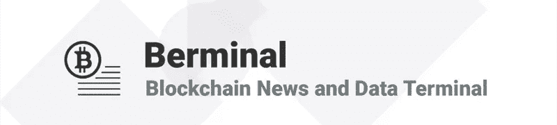

# 每日百慕大简报(09/13/18):格林和霍比市场收购日本交易所 BitTrade

> 原文：<https://medium.com/hackernoon/daily-berminal-brief-09-13-18-markets-in-green-and-huobi-acquires-japanese-exchange-bittrade-679aa6322129>

市场状况:昨日总市值跌至 2018 年新低 1886 亿美元后，今日回升。市值再次回到 2000 亿美元以上，达到 2008 亿美元，在过去 24 小时内增加了 120 亿美元。这次涨势是以太坊(ETH)放出的，该股现在的价格是 203.35 美元，在最近 24 小时内上涨了 17.17%。比特币(BTC)也出现小幅上涨，目前为 6538.41 美元，上涨 3.73%。在最近的自由落体式下跌后，今天的趋势逆转是防止进一步出血所必需的。

1) Huobi Global 的日本子公司 Huobi Japan Holding Ltd 已宣布收购 BitTrade 的多数股权。BitTrade 是日本 16 家受监管的加密货币交易所之一。火币日本的总裁海腾陈现在是 BitTrade 的董事长。OKEx 前首席执行官李宇春和霍利·霍比资本公司首席执行官将作为外部董事加盟。Huobi 是世界上最大的交易所之一，在过去的 24 小时内交易量达到了 6.3 亿美元。

2)加密货币市场昨日创下 1870 亿美元的新低，低于 1 月份 8300 亿美元的峰值。现在，官方数据显示，加密崩溃比网络崩溃更严重。加密崩溃现在已经超过了峰值的 80%,而网络崩溃只有 78%。然而，互联网公司已经卷土重来，成为美国第一个万亿美元的公司。市场已经复苏，现在已经超过 2000 亿美元([阅读更多](https://www.bloomberg.com/news/articles/2018-09-12/crypto-s-crash-just-surpassed-dot-com-levels-as-losses-reach-80?utm_content=crypto&utm_source=twitter&utm_campaign=socialflow-organic&utm_medium=social))。

3)日本流行的转账应用 Money Tap 宣布，它将使用 Ripple 的技术为 60 家日本银行提供连接。Money Tap 是一款简单的转账应用，不收取任何费用。今年晚些时候，Money Tap 将推出 iOS 和 Android 应用程序，并为超过 80%的日本银行带来该应用程序([阅读更多信息](https://www.coinspeaker.com/2018/09/13/japanese-fund-transfer-platform-money-tap-connects-60-banks-with-ripple-launches-website/))。

[**订阅百慕大简讯**](https://visitor.r20.constantcontact.com/d.jsp?llr=myyhdl6ab&p=oi&m=1131022639884&sit=9ar6aztmb&f=776989ec-8460-43a4-b86a-bcf8f2f1bca7)

[**免费下载 Berminal**](https://berminal.app.link/medium-post)

[**百代网站**](http://Berminal.com)

[**百慕大官方电报**](https://t.me/berminal)

[**伯明纳尔推特**](https://twitter.com/berminalapp)