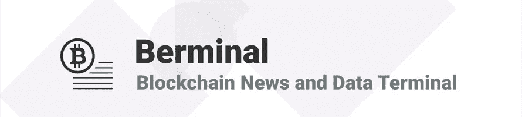

# 每日百慕大简报(2018 年 8 月 15 日):加密市场在低迷后反弹

> 原文：<https://medium.com/hackernoon/daily-berminal-brief-8-15-18-crypto-markets-rally-following-downturn-9c534d84440e>

市场状况:在持续数周的市场低迷之后，加密货币价格今天终于迎来了绿色的一天。以太坊(ETH)领涨，当日上涨 10%，至略低于 290 美元。比特币(BTC)也有所回升，涨幅更小，为 4.24%，至略高于 6300 美元。此外，加密货币的总市值增加了近 120 亿美元，再次恢复到 2000 亿美元以上的水平。

1)在最近对双子座加密货币交易所首席执行官彭博的采访中，泰勒·文克莱沃斯表示，华尔街的大玩家真正接受加密货币“需要时间”。文克莱沃斯说，他和他的兄弟无意减少他们的努力，让他们的 BTC 交易所交易基金申请获得美国证券交易委员会(SEC)的批准。尽管对于文克莱沃斯双胞胎来说，这是艰难的一年，但泰勒坚定地声称，“华尔街正在认真对待加密货币。然而，绝大多数华尔街公司仍然没有参与加密货币市场，该市场仍然主要是一个零售驱动的市场。”尽管市场状况不佳，Gemini 仍保持忙碌，将其员工人数增加了一倍，达到 150 人，并制定了零售业务增长计划。

2)由广受欢迎的 Kik 消息应用开发商支持的 Kin 生态系统基金会最近宣布，他们在“开发孵化器”中挑选了 40 款应用该孵化器将成为开发微型应用内“kin economies”的融资引擎，以刺激 kin 平台的采用，该平台去年通过首次发行硬币(ICO)筹集了 9800 万美元。Kin 总裁 Dany Fishel 表示，“Kin 开发者计划让我们能够利用全球开发者社区的创造力来实现我们成为世界上使用最多的加密货币的目标”([阅读更多](https://www.ccn.com/social-cryptocurrency-kin-selects-40-apps-for-3-million-developer-incubator/))。

3)Ripple(XRP)欧洲战略客户副总裁杰里米·莱特(Jeremy Light)最近在接受美国消费者新闻与商业频道采访时表示，他的公司正在寻求将其分布式总账平台扩大到中国市场。莱特说:“中国肯定是我们感兴趣的，它肯定是一个目标……中国肯定是我们感兴趣的国家和地区”([阅读更多](https://www.newsbtc.com/2018/08/15/ripple-executive-says-the-company-is-eyeing-an-expansion-into-china/))。

[**订阅百慕大简讯**](https://visitor.r20.constantcontact.com/d.jsp?llr=myyhdl6ab&p=oi&m=1131022639884&sit=9ar6aztmb&f=776989ec-8460-43a4-b86a-bcf8f2f1bca7)

[**免费下载 Berminal**](https://berminal.app.link/medium-post)

[**百代网站**](http://Berminal.com)

[**百慕大官方电报**](https://t.me/berminal)

[**伯明纳尔推特**](https://twitter.com/berminalapp)