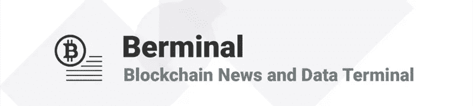

# 每日百慕大简报(8/31/18):CBOE 比特币期货于美国东部时间今天上午 11 点到期，比特币和其他加密货币岌岌可危

> 原文：<https://medium.com/hackernoon/daily-berminal-brief-8-31-18-bitcoin-and-other-cryptocurrencies-on-the-edge-as-cboe-bitcoin-ef35b8a52e>

市场现状:对于加密货币来说，这是美妙的一周，投资者希望这种良好的氛围能够持续下去。比特币价格飙升至 7100 美元以上，从技术角度看仍相当乐观。目前，整个社区都希望，在 CBOE 比特币期货于美国东部标准时间(EST)今天上午 11 点到期后，市场不会下跌。其他新闻方面，Square 获得了一项开发加密货币支付网络的专利，雅虎金融宣布计划将加密货币交易添加到他们的桌面平台和 IOS 应用程序中。这些无疑是加密货币半球的重大发展，表明更广泛采用的道路仍然非常清晰。目前，加密货币的市值为 2250 亿美元。

1)雅虎财经(Yahoo Finance)昨日报道称，该公司与 Tradelt 合作，在其平台上增加了一项新功能，允许加密货币交易。据说，其 iOS 移动应用程序中添加的功能支持其应用内交易中的四种资产。支持的资产有比特币、以太币、莱特币、Dogecoin。这项服务也可以在雅虎财经桌面版上使用。此外，雅虎财经宣布，该服务将很快在桌面、安卓和移动网络上发挥作用，尽管它没有提到 iOS 应用程序将在哪个平台上进行加密交易。([阅读更多。](https://www.coindesk.com/yahoo-finance-now-allows-trading-of-4-cryptos-on-its-ios-app/))

2)以太坊创始人维塔利克·布特林(Vitalik Buterin)出现在曼谷的一次闭门比特币现金会议上，被拒绝进入。不清楚为什么维塔利克试图去参加会议。据公司的首席执行官吴说，他被邀请来进行一次简短的交谈。在这种情况下，不清楚他为什么被拒绝入境。维塔利克尚未就此事件发布推文。克雷格·赖特也出席了会议，维塔利克和韩吉过去曾再次谈到过他。([多读书。](https://www.trustnodes.com/2018/08/31/vitalik-buterin-shows-bitcoin-cash-miners-meeting-bangkok))

3)由于正计划在港交所进行 150 亿美元的首次公开募股，关键工程师邢将离开该公司。杨在广受欢迎的 ASIC 矿机 S7 和 S9 的开发中发挥了重要作用。最近几周，至少有三个比特大陆团队离开了该公司，其中一个团队正在市场上寻求投资，以与比特大陆竞争。杨现在是深圳比特微电子技术有限公司的董事长，该公司正在开发速度高达每秒 33 秒的 WhatsMiner M10V1。)

[**订阅百慕大简讯**](https://visitor.r20.constantcontact.com/d.jsp?llr=myyhdl6ab&p=oi&m=1131022639884&sit=9ar6aztmb&f=776989ec-8460-43a4-b86a-bcf8f2f1bca7)

[**免费下载 Berminal**](https://berminal.app.link/medium-post)

[**百变网站**](http://Berminal.com)

[**百慕大官方电报**](https://t.me/berminal)

[**伯明纳尔推特**](https://twitter.com/berminalapp)