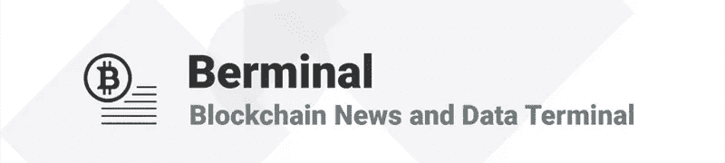

# 随着比特币交易量的增加，以及 UPbit 和币安计划在新加坡推出交易所，Ripple 继续获利

> 原文：<https://medium.com/hackernoon/daily-berminal-brief-9-19-18-ripple-continues-to-gain-as-bitcoin-volume-increases-and-upbit-and-63bc0c1c8649>

市场现状:有关沙特、日本和美国新合作伙伴关系的积极消息推动 XRP 在过去 24 小时内上涨了近 30%。Ripple 还宣布，其 xRapid 产品可能会成为这些新合作伙伴关系的一部分，并可能在未来 1 至 2 个月内推出。与此同时，随着 Consensus 2018 在新加坡举行，币安和 UPbit 宣布计划在新加坡推出新的加密货币交易所，该国以其对加密创业公司和交易所的友好态度而闻名。目前，加密货币的市值为 1985 亿美元。

1) PNC 最近完成了 Ripple xCurrent 的试验阶段，现在计划将概念验证协议完全集成到他们的整个银行系统中。这家美国公司现在将能够执行闪电般快速的跨境支付，并且是美国十大银行之一。Ripple 希望说服银行在不久的将来采用 xRapid，目前有超过 40 个客户在使用 Ripple 的产品，分布在六个不同的大洲。([阅读更多。](https://berminal.com/news/76691/PNC-Adopts-xCurrent))

2) Dash Text 是一种无需额外上网就能进行交易的钱包服务，它已经在委内瑞拉推出了测试版。破折号文本，允许使用 SMS 消息进行破折号交易。Dash Text 的联合创始人洛伦佐·雷伊(Lorenzo Rey)曾表示，他的灵感来自委内瑞拉无法充分使用互联网功能的手机和比特币现金的 CoinText。发布后，Dash Text 仅面向 Movistar 客户，但在完全发布后将很快推广到其他电信公司的客户。([多读书。](https://berminal.com/news/76670/Dash-Text-SMS-Wallet-Rolls-Out-its-Beta-Version-in-Venezuela))

3) CME 的集团董事总经理 Tim McCourt 认为比特币期货并没有导致市场的熊市趋势。在 2018 年新加坡共识会议上，他与 B2C2 首席执行官 Phillip Gillespie 分享了这一观点。McCourt 说，比特币期货是市场的一部分，衍生品市场主要在亚洲市场增长。此外，McCourt 表示，他们推出比特币期货是因为市场参与者的高需求。([多读书。](https://berminal.com/news/76661/CME-Exec-Bitcoin-Futures-Did-not-Trigger-a-Bear-Market))

[**订阅百慕大简讯**](https://visitor.r20.constantcontact.com/d.jsp?llr=myyhdl6ab&p=oi&m=1131022639884&sit=9ar6aztmb&f=776989ec-8460-43a4-b86a-bcf8f2f1bca7)

[**免费下载 Berminal**](https://berminal.app.link/medium-post)

[**百代网站**](http://Berminal.com)

[**百慕大官方电报**](https://t.me/berminal)

[**伯明纳尔推特**](https://twitter.com/berminalapp)