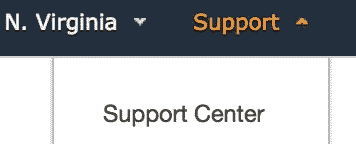

# 无服务器的每日 DynamoDB 备份

> 原文：<https://medium.com/hackernoon/daily-dynamodb-backups-with-serverless-ee625643254c>

## 在 re:Invent 2017 期间，亚马逊宣布了一个很酷的功能:DynamoDB 表的按需备份。在这篇文章中，我将介绍如何使用[无服务器](https://serverless.com/)框架建立定期自动备份。

***更新:随着*** [***时间点恢复***](https://docs.aws.amazon.com/amazondynamodb/latest/developerguide/PointInTimeRecovery.html) ***备份的推出，这种解决方案现在已经过时。***

TL；灾难恢复安装无服务器[包](https://github.com/unitoio/dynamodb-backup-scheduler)用于计划的 DynamoDB 备份


Remember photocopiers?

## 按需备份

以前，备份 [DynamoDB](https://hackernoon.com/tagged/dynamodb) 表既耗费资源又耗费时间。根据解决方案的不同，它将涉及在 EC2 基础设施上运行[定制程序](https://github.com/bchew/dynamodump)，或者甚至产生[Elastic Mapreduce](https://docs.aws.amazon.com/emr/latest/ReleaseGuide/EMRforDynamoDB.html)x-large 实例。

现在，只需点击一个按钮，您就可以获得数 Pb 数据的即时备份。亚马逊能够通过给表拍快照来做到这一点(如果你好奇，你可以阅读关于[快照技术](http://searchdatabackup.techtarget.com/tip/Using-different-types-of-storage-snapshot-technologies-for-data-protection))。

按需备份用 Amazon 管理的密钥加密。它们包括:

*   表格数据；
*   调配的容量设置；
*   以及本地和全局辅助索引的设置。

但是，它们不包括:

*   自动缩放设置，
*   TTL 设置
*   标签
*   IAM 策略
*   CloudWatch 指标和警报。

您必须意识到，恢复备份将花费更多的时间，如果您有一个巨大的表，从 30 分钟到几个小时不等。

## 无服务器框架

设置 Lambdas、AMI 权限、Cloudwatch 设置可能会很痛苦。幸运的是， [Serverless](https://serverless.com/) 框架让它变得轻而易举！

> 专注于您的应用，而不是您的基础设施。
> 
> serverless.com⎯

## 装置

让我们继续安装无服务器框架:

```
npm install -g serverless
```

根据您的安装，您可能需要 *sudo。*

然后安装代码:

```
git clone [https://github.com/unitoio/dynamodb-backup-scheduler.git](https://github.com/unitoio/dynamodb-backup-scheduler.git)
```

最棘手的部分是设置 [AWS](https://hackernoon.com/tagged/aws) 权限。首先，您需要创建一个 IAM 配置文件，并为无服务器配置适当的权限。编辑文件`aws-profile.json`中的代码，并用实际值替换`<region>`和`<account>`。获取您的帐号的最简单方法是从控制台的右上角访问支持中心:



你的账户会出现在页面的顶部。

转到 IAM 控制台，用这个 JSON 内容创建一个新策略。随意命名(比如`serverless-admin`)并将该策略附加到您的用户。

如果您没有设置访问密钥和密码，可以通过 IAM 生成它们，并通过创建新的配置文件将它们安装在您的机器上

```
aws configure --profile *<account_name>*
```

## 配置

这个`dynamodb-backup-scheduler`包很容易配置。将文件`env-example.yml`复制到`env.yml`。该文件是不言自明的。您将指定要备份的表的列表，以及备份的保留时间。

## 部署

我们都准备好了:

```
serverless deploy -v
```

观察 serverless 为您创建 Lambda 函数、它的 IAM 角色和 CloudWatch 事件时的输出。

就是这样！您的计划备份已设置好！不过，如果你像我一样，你会想现在就测试 lambda 函数，而不是等待每日事件触发。

## 测试 Lambda

在 Lambda 控制台中，单击刚刚创建的函数。它会有一个类似`dynamodb-backup-scheduler-production-backupDynamoDBTables`的名字。在顶部附近，创建一个新的测试事件:


通过查看源文件`serverless.yml`，我们看到 lamda 被发送了 3 个输入。我们在测试活动中需要这些:


确保在最后一个参数中给出真实的表名。一旦创建了测试事件，我们就回到了 Lambda 函数页面，单击 test 按钮


执行结果将显示在绿色部分。如果一切正常，您可以转到 DynamoDB 控制台，验证名为`backupTest`的备份确实已经创建:


## 通过 SNS 警报进行监控

为了使该过程完整并达到生产级别，还剩下一件事:在备份失败时添加一个警报。这是通过[无服务器插件-aws-alerts](https://serverless.com/blog/serverless-ops-metrics/) 插件完成的。该包允许您在生产阶段通过在`env.yml`中指定一个变量来启用这一功能，该变量指定将由插件创建的 SNS 主题的订阅。

```
notifications:
  - protocol: email
    endpoint: me@example.com
```