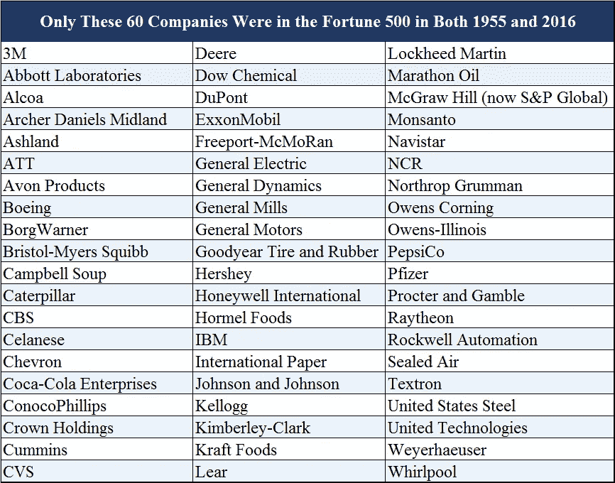
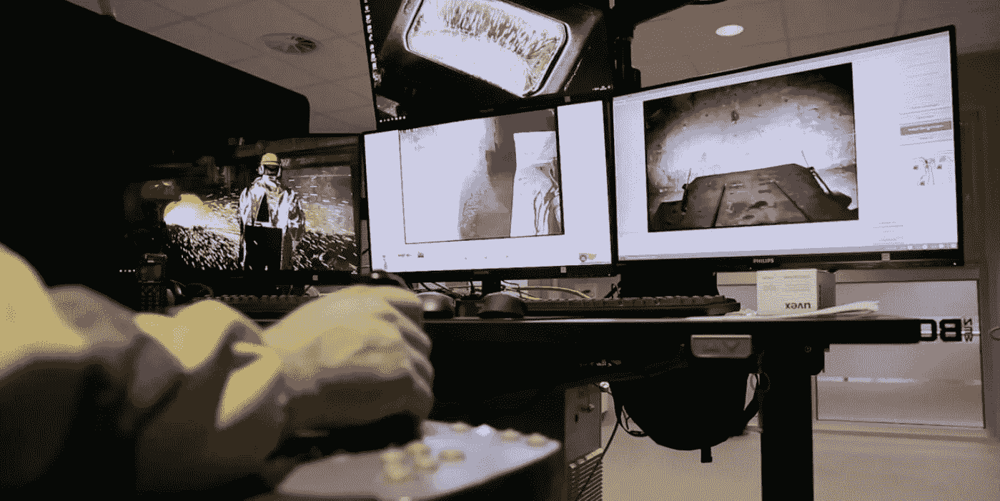

# 该死的女孩，你有一个高 AQ

> 原文：<https://medium.com/hackernoon/damn-girl-youve-got-a-high-aq-ba71a5c9c7f6>

## **为什么适应性比智商和情商更重要**

Two of the most adaptable species in the animal kingdom

我经常想，不久的将来——比如 2045 年——可能会是这样:

*在从高中放学回家的路上，马克斯路过街角的一家杂货店，顺便买了一粒神经刺激药丸——一种处方神经可塑性刺激物。她会在明天上午 10 点整坐下来吃 AEI 的时候爆炸。Neurostim 将加速她的大脑创建新突触路径的能力，帮助她在暴露于快速变化的刺激时快速学习新行为和发现新连接。AEI 是一项标准化考试，于 10 年前取代 SAT 实施。在现代工作场所，它已经成为全球公认的能力和预期表现的衡量标准。*

*俗称“Qs”，AEI 测试 3 个变量:适应商(AQ)、情商(情商)和智商(智商)。虽然每一个都很有价值，但很明显 AQ 是最有价值的。适应性方面的高分意味着你有资格进入“受薪轨道”。就薪水而言，你会得到一份最少 3 年的合同，雇主每隔 1-6 个月就会为你的再培训投入一大笔钱。分数低的话，你必须依靠“零工轨道”——这意味着灵活性和更高的金额，但只有短期合同，没有支持的再培训。如果你在垂死行业的错误任务上押了太长时间，而不是不断重新关注紧急需求，那么就没有内在的安全网。*

# **什么是 AQ，为什么它很重要？**

你可能不同意 2045 年纽约市还会有酒窖(你怎么敢！)，但我认为对 AQ——适应性商数——的高度依赖是可能的。技术正以指数速度变化，要求我们以比人类以往任何时候都要快的速度学习。我们磨砺了几十年的行为，短短几年就会过时。我们现成的神经可塑性可能不足以让我们在 45 年(或者可能更长)的职业生涯中取得成功，因为每年的工作都与上一年截然不同。

> 我敢打赌，适应性商数(AQ)将很快成为成功的主要指标，智商和情商都将让位于我们能够跟上不断变化的速度。

在 20 世纪 90 年代末，我们见证了情商的繁荣，以丹尼尔·戈尔曼为首的学者和心理学家让人们相信，我们一直过度关注智商，而不是优先考虑聪明的“人的一面”。在商业中，情商的概念是不断变化的，“尤其是在领导力和员工发展领域[……]。*《哈佛商业评论》*称赞情商是“一个突破性的、颠覆性的想法”，是十年来最有影响力的商业理念之一(戈尔曼)。

情商很重要，但只是凳子的一条腿。我赞同[卡罗尔·德韦克](https://www.ted.com/talks/carol_dweck_the_power_of_believing_that_you_can_improve)的成长心态:智商和情商都不是固定的属性，而是可以通过奉献和努力来培养的。我猜 AQ 也是如此——我们有些人生来就有较高的 AQ 潜能，但我们每个人都可以努力改变它。我们都有讨厌改变的朋友和喜欢新体验的朋友。这让我怀疑我们已经潜意识地意识到 AQ 的存在和它的变化，但我们没有谈论它。此外，我们没有令人信服的方法来测试或改进它。

谷歌“适应商”就像是在向深渊里呼喊。最受欢迎的是一篇由变革管理咨询公司的领导者撰写的简短的 [Inc 文章](https://www.inc.com/partners-in-leadership/4-steps-to-develop-your-aq-and-make-change-happen.html)，以及 2011 年《哈佛商业评论》的一篇题为“[适应性:新的竞争优势](https://hbr.org/2011/07/adaptability-the-new-competitive-advantage)”的文章(值得一读)，以及奇点大学的一篇[博客文章](https://singularityhub.com/2015/12/03/adaptability-the-way-of-the-entrepreneur/#sm.00017wiyckf3vevfwav103fpme9ey)(我第一次听说 AQ 的概念就是在那里)。除此之外，几乎没有。

如果今天的学者和科学家不像谈论情商那样谈论 AQ，我们到哪里去寻找例子来检验这个假设呢？

# 现实生活中的例子:高 AQ 与低 AQ

## **组织 AQ: IBM 对柯达**

> 根据 2012 年 Innosight 的一份报告，1965 年标准普尔 500 指数中的公司在该指数中平均停留了 33 年。到 1990 年，标准普尔 500 指数的平均任期已缩短至 20 年，2012 年降至 18 年，预计到 2026 年将缩减至 14 年。按照目前的流失率，标准普尔 500 指数中大约一半的公司将在未来 10 年被取代，因为我们进入了“一段加速变化的时期，大公司的寿命比以往任何时候都短”。([马克·j·佩里](http://www.aei.org/publication/fortune-500-firms-1955-v-2016-only-12-remain-thanks-to-the-creative-destruction-that-fuels-economic-prosperity/)

我的前雇主 IBM 是同时入选 1955 年指数和 2016 年指数的 12%的公司之一——下面列出了所有 60 家公司。

Source: [Mark J.Perry](http://www.aei.org/publication/fortune-500-firms-1955-v-2016-only-12-remain-thanks-to-the-creative-destruction-that-fuels-economic-prosperity/)

IBM 为什么能成功这么久？我认为，我亲眼目睹了 IBM 拥有强大的组织 AQ。我在弗吉尼亚州赫恩登进行企业培训的第一天(每个美国员工都必须参加)，我清楚地记得一张关于 IBM 核心竞争力的幻灯片。他们喋喋不休地说，IBM 不是硬件公司，也不是软件公司。

创新是自然发展的，因此 IBM 已经做好了充分的准备来应对这些年来不断变化的潮流。从 1880 年到 1924 年，IBM 销售制表机。1933 年，电动打字机。在 20 世纪 60 年代，他们是市场上首批拥有大型计算机的公司之一。从那以后，他们从从个人电脑到扫描隧道显微镜到软件和管理咨询的一切事物中获利。2014 年在 [IBM Watson](https://medium.com/u/368d6fdd39f?source=post_page-----ba71a5c9c7f6--------------------------------) 的时候，我和一个合伙人一起工作，他是 IBM 最顶尖的机器学习专家之一。快进到 2017 年，他的 LinkedIn 个人资料现在写着“比特币&数字货币行业专家”。IBM 迅速改变路线。总是朝着钱的方向。

对比 IBM 和柯达的轨迹，很明显，一个比另一个更能体现组织的 AQ。从 20 世纪 90 年代开始，面对手机技术和最终的社交媒体照片共享，柯达开始急剧衰落。这种商业模式深深植根于摄影胶片，这被证明是一种濒临灭绝的艺术。该公司难以利用新的收入来源，并且在采用数字印刷和数字相框等相关产品方面进展缓慢。与 IBM 不同，柯达没有足够的组织适应性来生存，最终在 2012 年被迫申请破产保护。

## 国家 AQ:瑞典对美国

上周,《纽约时报》发表了一篇[的精彩文章](https://www.nytimes.com/2017/12/27/business/the-robots-are-coming-and-sweden-is-fine.html),内容是关于瑞典对自动化的看法以及对他们集体生活的影响。Mika Perrson 是接受采访的瑞典人之一，他是一名远程煤矿操作员，正在测试自动驾驶汽车以取代卡车司机。

Source: [New York Times](https://www.nytimes.com/2017/12/27/business/the-robots-are-coming-and-sweden-is-fine.html)

> 35 岁的佩尔松先生坐在四台电脑屏幕前，其中一台显示着他驾驶的装载机在搬运新炸的含有银、锌和铅的岩石。如果他在矿井下手动操作装载机，他会吸入灰尘和废气。相反，他靠在办公椅上，用操纵杆控制机器。—《纽约时报》

佩尔松和整个国家不担心现有工作的自动化，因为强大的社会安全网——政府提供医疗保健和免费教育，加上雇主资助广泛的职业培训计划。根据瑞典就业和融合部长的说法，“工作消失了，然后我们为新的工作培训人员。我们不会保护工作。但我们会保护工人”(NYT)。此外，瑞典的工会“普遍认为自动化是一种竞争优势，能让工作更有保障”(NYT)。如果 AEI 测试存在于今天，我想瑞典会得到一个非常高的 AQ 分数。

然而，对比一下瑞典和美国，我开始对我们自己的 AQ 深感担忧。在美国，我们的医疗体系依赖于我们的雇主，所以“失去一份工作可能会引发灾难性的深渊。这使得员工不愿意离开工作岗位去打造可能更赚钱的职业。它使工会倾向于保护工作高于一切”(NYT)。

有了这种心态，难怪 **72%的“美国人对机器人和计算机取代人类的未来感到‘担忧’**”(皮尤研究[在 NYT 的调查](http://www.pewinternet.org/2017/10/04/automation-in-everyday-life/pi_2017-10-04_automation_0-01/))相比之下**“根据欧盟委员会(NYT)今年的[调查，80%的瑞典人对机器人和人工智能表达了积极的看法](https://ec.europa.eu/digital-single-market/en/news/attitudes-towards-impact-digitisation-and-automation-daily-life)**。

## **个人:程**

2003 年，杨洋·程刚刚大学毕业，是一名注册会计师，在香港安永会计师事务所担任审计师。到 2007 年，她作为佩珀代因大学的兼职教授在世界各地教授中国语言和文化，同时晚上在著名的“正直公民旅”上即兴表演课。2009 年，她将自己的跨文化理解发挥到了《你好》 [*主持人的角色中。好莱坞*](https://www.youtube.com/watch?v=_VuyXyZFoow&feature=youtu.be) ，一部在洛杉矶拍摄但在 mainland China 播出的电视剧。该节目大受欢迎——3 亿中国观众观看了杨洋介绍“好莱坞生活方式”并将西方文化带进他们的家庭。2012 年，尽管取得了成功，杨洋还是第四次决定创建一个教育视频平台，帮助说英语的人在线学习汉语普通话。从那以后，Yoyo 中文已经为全球超过 30 万名学生提供了超过 1200 万节课程。在下面我最喜欢的视频中(点击量超过 48000 次)，杨洋通过奥斯卡获奖影片《啦啦国度》中的歌曲教普通话。

杨洋显然适应性很强，不仅因为她在不到 15 年的时间里经历了四次非常成功的职业生涯，还因为她在每一步中都表现出了成长的心态。她被好奇心所驱使——因此有了每晚的即兴表演课——并且能够在她的经历中看到未来的主题，将她的教授身份和表演角色联系起来，成为 Yoyo 中国人的一个大愿景。

# AQ 的下一步是什么？

IBM、瑞典和阳炎足以让我相信，我们可能正朝着高中 AQ 测验和神经刺激药丸的未来前进。

从更广泛的意义上说，我认为有三件事可能发生:

1.  作为一个社会，我们会同意适应性是未来成功的重要指标，我们需要一个衡量标准——AQ。
2.  我们将寻求新的方法来测试我们的 AQ，并随着时间的推移不断改进。
3.  一个相当大的行业将会出现，以促进我们的 AQ——从制药到培训，游戏和媒体(甚至可能是杨洋主持的电视节目！).

传递麦克风——我希望听到更多 AQ 在野外的例子，以及对 AQ 驱动的未来可能会是什么样子的预测。把你的想法发给我: [@nataliefratto](https://twitter.com/nataliefratto) 在 Twitter 上

*请注意:观点是我个人的，不代表我雇主的观点。*