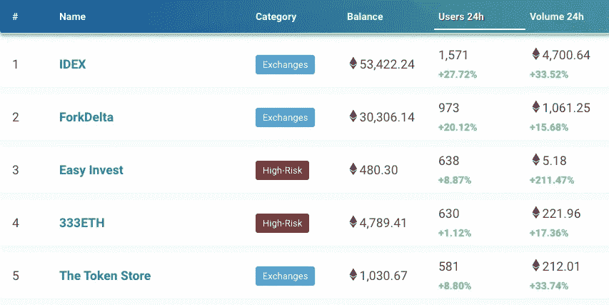
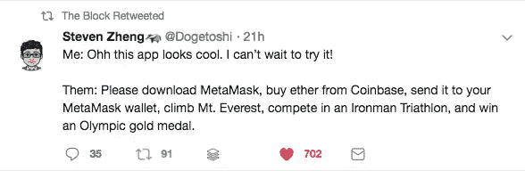

# DApps 不是加密货币大规模采用的关键

> 原文：<https://medium.com/hackernoon/dapps-are-not-the-key-to-cryptocurrency-mass-adoption-500dae799925>

How can we bring crypto into the hands of the mainstream?

当以太坊在 2017 年首次成为公众关注的焦点时，它突然被誉为“区块链 2.0”、“比特币杀手”或“技术更好的区块链”。被称为“智能合约”的自动执行交易的概念，以及“世界计算机”等其他流行词汇，让投资者和区块链的狂热爱好者神魂颠倒。

以太坊的繁荣和以太的价格在很大程度上是由执行 ico 的智能合约平台的使用推动的。在加密市场崩溃、ICO 抛售和投资者信心下降的共同作用下，最近以美元计算的 ETH 价格低点已降至 Q2 2017 年的水平，比峰值约 1400 美元下降了 90%以上！

ICO Funding vs ETH Price, 2017–2018\. Ref: [https://www.icodata.io/stats/](https://www.icodata.io/stats/)

不用说，以太坊目前的情况看起来有点不妙。随着 ICO 时代的终结，以太坊的用途将会从何而来？当然，最近的炒作是在证券代币发行(sto)上，但随着与证券相关的大量监管，sto 不会像 ico 那样疯狂、容易和疯狂。与此同时，越来越多像 EOS 和 Cardano 这样聪明的合同竞争者试图加入竞争，这可能会进一步稀释以太坊的市场份额。

当然，以太坊的一个伟大之处是它能够吸引开发者的兴趣。以太坊仍然遥遥领先于任何竞争对手，仅仅是因为它庞大而活跃的开发者社区，不管其他人在 TPS 测量竞赛中说什么。随着 ICO 船的航行，建造以太坊变得越来越重要。大多数 ico 承诺在过去发布“无所不包”的产品，但事实上却什么都没生产出来，而许多更合法的项目到目前为止也只是构建了一些几乎不可用的分散式应用程序(dApps)。

DApps 被认为是我们新区块链时代的“互联网 3.0”，从农业到云存储的一切都是分布式和分散的。然而，没过多久，许多人就意识到“区块链”或智能合同实际上并不需要，或者对许多宣称的用例毫无意义。在大多数情况下，智能合同平台的应用简单地向集中式系统或数据库提供了改进的透明度和跟踪级别，但是绝对没有实现所述用例的去中心化或防弹不变性。

然而，在一些使用案例中，与传统系统相比，dApps 确实在信任度、透明度或费用降低方面提供了升级。因此，这些 dapp 目前被证明是以太坊区块链上使用最多的 dapp，并且可能是未来“区块链”仅有的几个合法应用。到目前为止，这些用例仅限于用于交易和分散赌博平台的分散交易所(dex)。换句话说，到目前为止最有意义的 dApp 是取代第三方托管服务的 dApp，在第三方托管服务中，用户的资金留在他们的钱包中，可以直接通过 dApp 进行交换。更直白地说，如果你拿走了开发团队/公司，而用户仍然能够像以前一样通过 dApp 交易/交换资产，那么我们可能有一个很好的 dApp 用例。

Ethereum dApp DAU on 2018/10/23, source: [https://dappradar.com/dapps](https://dappradar.com/dapps)

然而，为 dApp 找到正确的用例只是第一步，就像有一个创业的好主意一样。行刑怎么办？dApp 最终成功的关键在于它的可用性和采用度，因为它拥有很多很多真正的用户。

目前，由于以太坊的技术限制，还没有 dApp 能够吸引大量的活跃用户。IDEX，每周都是 dApp 每日活跃用户(DAU)的行业领导者，每天的活跃用户数一直不到 2000。在过去的一些场合，严重的媒体炒作已经推高了一些 dApps 的日活跃用户量，正如我们在 2017 年和 2018 年看到的 CryptoKitties 和 Fcoin。然而，正如我们已经看到的，这些链上活动的峰值很快堵塞了以太坊网络，使与网络相关的一切完全不可用。

不仅 dApps，而且大多数区块链产品的另一个主要痛点是当前缺乏用户友好性。dex 在改善用户界面和 UX 方面取得了很大进步，在易用性方面几乎可以与一些较低层的集中式交易所相媲美。然而，对于几乎所有其他 dApps，用户仍然经常需要使用 MetaMask 或其他更具技术性的工具，这立即增加了采用的障碍。即使在使用 DEX 改进 UX 的情况下，以太坊网络固有的扩展限制仍然不时地完全破坏用户体验，正如 2018 年早些时候 IDEX 在两种非常受欢迎的硬币 HOLO 和 NEXO 同时上市后完全崩溃时所表现的那样。

Source: [https://twitter.com/Dogetoshi/status/1065631126990008320](https://twitter.com/Dogetoshi/status/1065631126990008320)

基于目前的事态，dApps 看起来不像是让主流用户大规模采用加密货币的解决方案。在微观层面上，许多 dApps 受到 UX/去中心化权衡的限制，而在宏观层面上，任何增加的使用都会立即被以太坊网络固有的扩展限制所压制。在为以太坊找到更好的扩展解决方案之前(很可能是离线)，dApps 将很难在主流聚光灯下看到自己的时代。

与此同时，该行业必须继续探索其他方式来吸引主流用户使用加密货币。一个例子，也是我们目前正在开发的东西，是高度用户友好的游戏，带有加密元素，在实际游戏中不需要分布式账本技术。这种游戏具有传统(非区块链)游戏的壮观的游戏元素，同时结合了加密元素，实际上应该是主流游戏玩家成为未来加密用户的极好入口。用户能够以加密货币的形式为他们的游戏时间赚取游戏内奖励，然后可以将这些奖励转换为比特币或其他加密货币，从而使用户意识到他们花费的时间货币化是可能的。

**d** 去中心化和 **app** 应用的分离可能是主流大众采用加密技术的关键。

*原载于 2018 年 11 月 23 日*[*hopefreiheit.com*](https://hopefreiheit.com/2018/11/24/dapps-are-not-the-key-to-cryptocurrency-mass-adoption/)*。*

如果你在这篇文章中发现了一些价值，请给我一些掌声让我知道。；-)