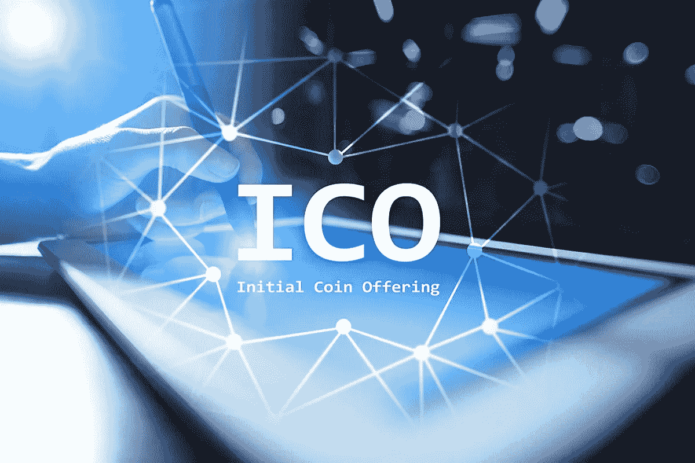
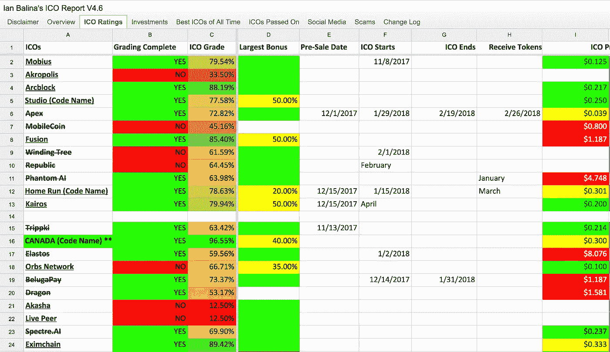
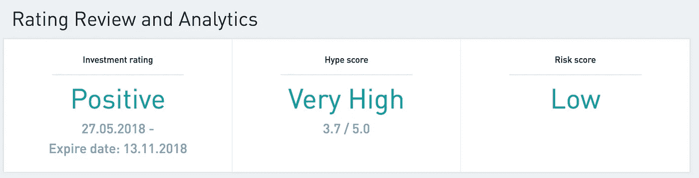
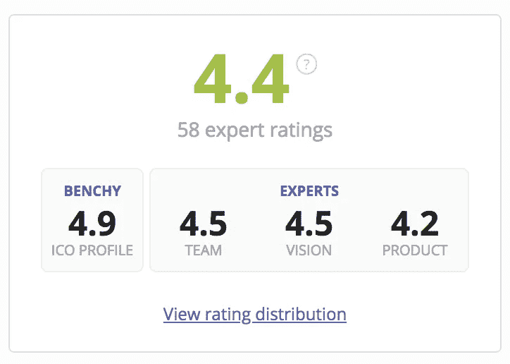
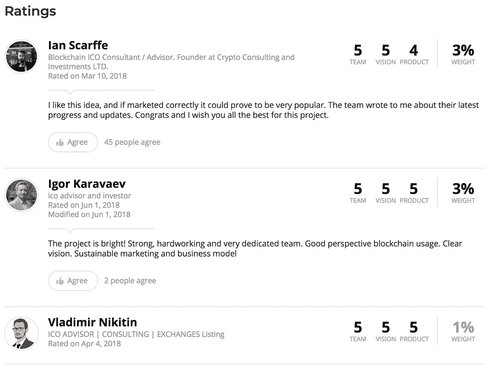

# ICOs 的阴暗面

> 原文：<https://medium.com/hackernoon/dark-side-of-icos-e487b29ca735>

因此，这篇文章并不是要吓唬人们不要投资加密货币，特别是 ico(首次发行硬币)。如果你是密码领域的新手，首次发行硬币相当于首次公开募股或首次公开发行股票。如果你也不知道那是什么，我就简单说一下，那就是当一家公司试图在股票或硬币进入交易所供公众买卖之前，通过发行股票或硬币/加密货币代币来筹集资本(更多的钱)。对于股票市场，只有合格的投资者才能参与首次公开募股，你必须有几百万美元作为初始投资才能购买一些股票。

最初的硬币发行没有这个荒谬的最低金额，我投资的大多数都有 10 美元的最低金额，任何人都可以投资，只要你符合他们的标准，通常不是来自一个有严格规则的国家，美国是其中之一，你通过了他们的了解你的客户(KYC)程序。

世界各地的银行都采用这种 KYC 流程，这是一种防止潜在洗钱客户参与此类机构的措施。一旦他们接受了你的申请，你只需要等待 ICO 的日期，然后想投资多少就投资多少。在 ICO 过程中购买一枚硬币可能会非常有利可图，因为潜在收益非常大。如果你在网上搜索，有几个案例表明，在 2017 年 ico 热潮期间，一些人仅仅因为投资 ico 就成为了百万富翁。只要搜索伊恩·巴利纳这个名字，你就会明白我在说什么。如果你听说过他，据说他最初投资 2 万美元，几个月后就成了百万富翁。但这绝不意味着他就是 ICO 大师。

现在，您已经对 ico 有了一些了解，也知道了为什么加密领域的每个人都在谈论 ico，接下来让我们来了解一下如何找到好的项目进行投资，以及不要做什么。

# 投资 ico

世界上每个人在投资任何东西之前应该做的第一步是做自己的研究，有些时候这需要时间，很多时间。但是，如果你想要好的回报，你必须谨慎选择。但是这项研究对 ico 来说包括什么呢？这是一个很难回答的问题，很多秘密的 YouTubers 和博客会有不同的回答。第一步是阅读一家公司的白皮书。可以说，白皮书是这些[区块链](https://hackernoon.com/tagged/blockchain)公司的详细商业计划。在那里，你会发现为什么他们的项目对社会有用，他们打算如何实现他们的目标，有时，甚至他们不得不面对什么样的逆境。对我个人来说，看到这一点是有利的，因为这意味着公司承认有困难，而不是试图向公众隐瞒。

另一步是研究团队成员。如果公司网站上没有明确显示团队成员，这已经是一个危险信号了。如果是的话，那么你必须去 Linkedin 上搜索他们过去的工作经历，并提出批评，他们过去的工作经历是否相关？很多时候，联合创始人和其他成员会试图让人们觉得他们做了很多，但也许他们对团队来说并没有那么有价值，以下面的图片为例:

这是来自 Linkedin，来自 [Yappadappadoo](https://yappadappadoo.io/) 的创始人之一。显然，这家伙所拥有的只是他自己创建的几个高尔夫相关网站的经验。显然，他可以用 web 开发经验来帮助团队。那么，按照我个人的观点，这个家伙将如何给一家与区块链有关的公司带来足够的价值呢？如果你能回答这个问题，或者最重要的是，只是想一想它或任何其他可能出现的问题，你就在正确的道路上。同样，这很费时间，但是你应该把你的钱给这家公司吗？这是我们试图为每个项目回答的终极问题，世界上没有人有正确的答案。

另一步是在你的研究中真正使用谷歌。例如，我用谷歌搜索可能的竞争对手，我也搜索类似的内容:“为什么不投资……”或“……是个骗局”。这些搜索几乎总是提出重要的观点。在谷歌上搜索“为什么投资……”很容易，你会发现很多人称赞每个项目，特别是 YouTubers，虽然不是所有人，但很多人都在谈论为什么一个项目可能会增长很多。此外，有几十个网站审查 ico，这似乎是完美的，因为这样你就不必自己花时间去审查它们。但是要特别小心！

# ICOs 的阴暗面

让我们再来谈谈伊恩·巴利纳。他有一个 YouTube 频道，拥有超过 120，000 名订户，在那里他谈论有前途的新项目，以及他是否会投资那个特定的项目。他还一度创建了一个[谷歌文档电子表格](https://docs.google.com/spreadsheets/d/1qvCCS6lwEH9nOa8KwQGTVhtQ3VXPzed3rXUqksDQkT0/htmlview?usp=sharing&sle=true#)，每个人都可以访问它来查看他如何评估不同的项目(如下图)。

如你所见，他对每个项目的分析都相对深入。我在这里用的是过去式，因为他宣布谷歌文档将不再对公众开放，或者至少它的更新版本将不可用。我强烈建议你去看他的视频，这样你就能理解我的下一个观点。

你的研究不应该像伊恩那样基于他人的观点，而应该基于你为自己设定的重要标准。原因如下。Ian 有时会谈论一些很棒的项目，但在他的电子表格上也会显示他是该项目的顾问。现在，如果你不熟悉这一点，这是一个巨大的利益冲突，要宣传你建议的项目，因为顾问通过该项目的代币/硬币赚取项目的一部分。伊恩和其他 YouTube 用户是顾问，赚取代币，然后他们可以在 YouTube 上谈论一个项目有多棒，然后人们会大肆宣传，代币的价格会上涨，他可以出售他的代币，你就有了，他赚了很多利润，你就在那里期待这个项目爆炸。我并不是说这就是他的所作所为，我是说他有很大的动机去做这件事，特别是因为现在还没有关于 ico 的法律，所以几乎可以肯定的是，有些人心怀不轨，试图快速获利。

# 不要相信 ICO 评审网站

这是极其重要的另一点。有很多网站声称他们会全面审查新 ico，我说的全面是指，他们会分析每个人可以获得的信息，并根据他们自己的方法给你打分。如果你想看一看，在谷歌上输入“ICO review”就可以了。最让我困扰的是，这些网站中有很多是如何进行风险评分的，他们实际上将一些项目评为“低风险”。

Taken from icoratings.com

怎么会有人把任何 ico 评为“低风险”呢？如果连被认为是最大、最重要的加密货币的[比特币](https://hackernoon.com/tagged/bitcoin)都是高波动、高风险的投资，那么一个大肆炒作的全新项目，在上述案例中，非常高的炒作，又怎么会被认为是低风险的呢？事实是，这些网站可能会将每个 ICO 与其他 ICO 进行比较，但如果你比较两个风险投资，其中一个风险较小，这并不意味着它风险较低。同样，在参考所有这些工具时要小心，你应该看看它们来补充你的研究/分析，但它们不应该是你做的所有分析。

最后，我建议远离“专家意见”。有一个叫 ICObench.com 的网站，他们自己审查 ico，但他们也考虑“专家”的评级。

看看这有多荒谬。这些家伙中的一些对收视率有很大的影响，这个家伙弗拉基米尔只是给所有东西打了 5 分，没有给出任何解释。其他一些评级包括一些非常笼统的句子，如:“强大、勤奋和非常敬业的团队……清晰的愿景”。但是是什么让这个团队变得强大和敬业呢？他们有没有通过提供一致的结果来展示他们有多努力？只要记住这一点，当涉及到 ico 时，总是要批判别人的观点。这里我们又有了利益冲突的问题，因为谁能向我保证这些人不会因为离开正面评价而得到公司的报酬？答案是，没有人能保证，所以你应该总是小心没有适当分析的高评级。我喜欢使用这个网站来检查不好的评论，看看他们在说什么，如果有人对一个项目提出一些我不能驳回或表明它是不正确的担忧，那么我通常不会投资那个项目。

我希望这篇文章能给你一些启发，告诉你应该如何准备投资 ico，以及不要做什么。有很多人试图通过欺骗他人来赚快钱，而事实上，目前没有针对 ico 的法规，这只会使一切更容易受到这些行为的影响。祝你好运，永远做你自己的研究。

* *免责声明:我**不是**理财顾问，这不应该**而不是**被视为理财建议。你应该在投资前做好自己的研究。本文中的信息仅反映我的个人观点。投资 ico 有风险。

*   *更多密码相关信息，请查看我的 **YouTube 频道**:【https://www.youtube.com/channel/UCR7DmzG8UULUuYLLIU7FhLw? view _ as =订户