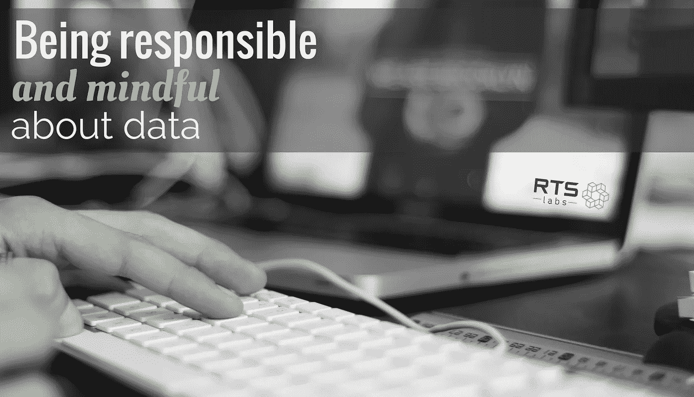

# 数据可以是你的朋友，也可以是你最大的敌人(由你选择)

> 原文：<https://medium.com/hackernoon/data-can-be-your-friend-or-your-worst-enemy-its-up-to-you-to-choose-ff68ee589ea3>

> 剑桥分析公司的泄密事件让全世界都在谈论数据和隐私。这整个崩溃只是强调了一点，即 ***数据可以是你的朋友，也可以是你最大的敌人****——这取决于我们每个人的选择。*

人们对竞选目标的道德性提出了质疑。

#删除 Facebook 运动正在推特上蔓延。

愤怒的脸书用户正在删除他们的账户。

从表面上看，对于在脸书投放广告的营销人员和政治候选人来说，剑桥分析公司的做法并不少见。使用数据让你的广告出现在目标受众面前被认为是一种最佳实践。**那么，为什么脸书和剑桥分析公司会陷入困境呢？**

简而言之，根据最近的估计，剑桥分析公司获得了超过 8700 万脸书用户的私人信息。(根据来自 NPR.org 的报道，这个数字可能会更大，但是马克·扎克伯格说他认为这是最终的数字。)他们收集的数据(据《纽约时报》报道)包括用户的身份、朋友网络和“喜好”这些数据随后被用来建立人物角色(每个营销人员都会做的事情)来描绘性格特征，然后他们可以通过数字广告瞄准这些性格特征。

事情是这样的:这些用户中只有 270，000 人同意收集他们的数据，他们是在学术研究的幌子下这样做的。没有同意的用户？收集这些数据是因为他们是同意的 27 万人的朋友。

更糟糕的是:一旦剑桥分析公司使用这些个人数据来建立两党潜在选民的个性档案，他们就向政客们宣传，他们可以制作针对这些个性类型的广告，并影响他们的行为。一旦剑桥分析公司掌握了这些人的心理特征，他们就利用这些数据来投放针对特定性格类型的广告，并在选举周期中对他们进行心理操纵。

其结果是:这可能是第一个真实的例子，说明数据如何被武器化并用于对付人口。

剑桥分析公司因为这样做而陷入困境，脸书因为放任数据泄露事件发生和没有更严格地控制其数据而陷入困境。

对于企业、作为个人用户的我们以及在社交媒体上有孩子的父母来说，有什么收获？

# 企业:大数据意味着重大责任

我们喜欢 RTS 实验室的数据。我们用它来为我们的客户获得深刻的见解，这样他们就可以更有效地经营他们的业务。但是从隐私、安全和道德的角度来看，收集数据伴随着责任。

作为一家企业，如果你要收集数据，拥有保护数据的系统至关重要。这意味着要遵守网络安全协议，对你的雇员和团队中能接触到信息的人保持敏感。

[了解 RTS 如何最大限度地保护您的数据。](https://rtslabs.com/data-analytics)

除了数据的安全性，您还需要确保数据的收集和使用符合道德规范。数据可以帮助你。但是如果用错了方法，它可能会对你不利，就像这个案例一样。剑桥分析公司不仅不道德地收集他们的数据，他们还将这些数据出售给政治候选人，这些候选人利用这些数据来攻击性格古怪的人，试图在竞选期间传播假新闻，制造更多的分裂。

**最终，企业和研究人员要成为他们收集的数据的好管家。**

# 用户:我们的责任是什么？

数字平台已经进入我们的日常生活(就像吃饭一样平常)。他们都收集你的资料。

我们使用的这些免费平台并不完全免费。使用的代价是允许出售和使用你的数据。没错。你在这些渠道上做的一切都会被广告商跟踪和利用。

广告商可以通过很多方式锁定你和其他用户:年龄、性别和性取向；家庭收入；教育；“喜欢”某些脸书页面的人；对特定活动、电影和其他流行文化趋势感兴趣的人；表现出熬夜或定期分享新闻故事等特定**在线行为的人；这个清单还在继续。像脸书这样的平台不会通过让人们做调查来获得这些信息。他们通过跟踪用户所做的一切来获取信息。**

这对广告商来说太棒了。但对于不知情的用户来说，这可能非常令人担忧，这也是剑桥分析公司事件(以及数据当时是如何被使用的)引发如此多愤怒的部分原因。

你上周在脸书做的关于你应该住在哪个州或者你是哪个迪斯尼公主的测试？开发人员这样做可能不是为了“好玩”它可能是为了收集你的数据而被委托开发的。你读了你同意的许可了吗？您可能无意中允许他们收集您的所有信息，甚至跟踪您的位置和在线活动。

这就是我们现在生活的世界。收获和挖掘数据是人工智能和机器学习的全部前提。作为用户，留意你分享的数据是很重要的。阅读用户协议。质疑权限请求。找出公司正在收集什么，为什么。

# 家长:这对我们的孩子意味着什么？

我们在网上所做的一切，让我们自己变得如此公开。我们的孩子也一样。

创始人 Jyot Singh 关心我们的青年和他们面临的未来。“现在的孩子非常脆弱，”他说。“当他们长大后，他们申请工作时可能会大吃一惊，因为他们的生活太暴露了。”

Jyot 预测今年的营销会变得更加强大——可怕的强大。在他的文章“2018 年技术趋势和预测”中，他写道，“营销将在 2018 年变得更深入，更受数据驱动。在线行为将被更密切地跟踪，销售/营销将变得更好，但更具侵入性。脸书、Instagram 和 YouTube 等社交媒体平台将变得更加强大，因为它们收集了大量用户数据。”

所以，如果你是父母，一定要和你的孩子谈论数据、隐私，并留意他们发布的信息。

作为一家企业，数据驱动至关重要。但是如果你从人们那里收集数据，认真对待这个责任。作为一名消费者，要注意你在网上发布了什么，以及你向谁提供了你的信息。