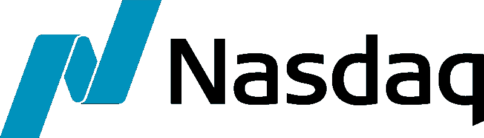
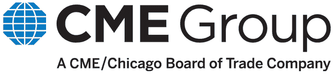
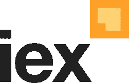

# 数据数据数据！11 家(+2)大型金融数据供应商

> 原文：<https://medium.com/hackernoon/data-data-data-11-great-financial-data-vendors-844d2cfce77d>

By Chris Lee on Unsplash

嘿各位，实习生[饶](/@raobvinnakota)在这里。几周前，我和[仁志](https://twitter.com/umitanuki/)和[耀西](https://twitter.com/iyoshyoshi/)一起整理了“9 个伟大的算法交易工具”。

 [## 算法交易的 9 大工具

### 在过去的 5-10 年里，算法交易，或称 algo 交易，在个人投资者中很受欢迎。的…

hackernoon.com](https://hackernoon.com/9-great-tools-for-algo-trading-e0938a6856cd) 

看了一下对那篇文章的反应，我们决定写一篇后续文章。无论你是金融公司还是个人交易者，金融[数据](https://hackernoon.com/tagged/data)是制定任何好策略的关键。如今市场上有如此多的供应商，许多好的选择都被淹没了。以下是 11 家优秀的金融数据供应商。

*如果您的服务被以某种形式歪曲，请尽快联系我(通过我的媒体页面，链接在底部)，我们将立即做出更正。*

# 面向个人投资者的供应商

以下数据供应商将他们的目标受众视为个人投资者。虽然他们有较大的高用量的保费计划，各种用户计划和社区是围绕个人投资者。

## [(1)纳斯达克](http://www.nasdaqomx.com/transactions/marketdata/europeanproducts/data-products/nasdaq-web-api-service)

纳斯达克公司成立于 1971 年，拥有并运营着纳斯达克——目前世界第二大交易所(按市值计算)。在收购了 OMX 之后，他们还收购了几家欧洲交易所，这家前瑞典-芬兰公司拥有几家北欧和波罗的海交易所。

纳斯达克提供免费的历史数据供个人使用。用户可以一次最多查找 25 个符号，然后在中下载长达 10 年的历史 EOD 数据。csv 或 excel 格式。纳斯达克也有几个产品实时数据流。这些产品包括在纳斯达克交易的美国股票数据，以及它们拥有的 8 家外国交易所的数据。

虽然纳斯达克价格较高的产品可以高达每月 1200 美元，但它的免费历史数据、查找以及基本 API 意味着它在个人交易者的能力范围内。

## (2) [CME 集团](https://www.cmegroup.com/):

芝加哥商品交易所集团是一家在芝加哥运营的金融市场公司。它们由 2007 年芝加哥市场交易所合并而成，自 2010 年以来，芝加哥商业交易所集团通过购买 S&P 道琼斯指数、堪萨斯城期货交易所和英国 NEX 集团的所有权股份进行了扩张。

目前，CME 集团提供历史市场数据和实时数据。历史市场数据以一次性付款的方式出售，并根据所提供数据的深度和范围进行定价。CME 集团还提供市场数据平台，发布实时市场数据。

## (3) [Quandl](https://www.quandl.com/)

如果您曾经使用 Zipline 进行过回溯测试，那么您可能已经使用了 Quandl 的免费数据。Quandl 总部位于多伦多，最初是作为金融数据集的搜索引擎。随着 algo trading 成为一个领域，Quandl 开始将他们的数据集搜索引擎重新打包成单独的包。

Quandl 免费提供美国股票捆绑包，这实际上是你在 Quantopian 的 Zipline 回溯测试引擎上接收的默认捆绑包。请记住，该组合包含截至 2018 年 2 月 28 日的 EOD 数据，并且仅包含美国股票。其他具有更大范围和最新数据的捆绑包是一次性收费的。Quandl 甚至成为第三方出售其产品包的市场。如果你是这个领域的新手，Quandl 是一个不错的起点。

## (4) [阿尔法华帝](https://www.alphavantage.co/#page-top)

AlphaVantage 是一家基于社区的数据供应商。在过去的几年里，AlphaVantage 一直在努力培养一个开发者社区，就像 Quantopian 一样。该社区帮助他们开发产品，并讨论投资策略和其他基于 AlphaVantage 数据的应用。

AlphaVantage 是一个免费的资源，有多种语言的 API。它们为回溯测试提供实时数据流和历史市场数据。API 没有每日/每周/每月的限制，但免费订阅确实有有限的延迟。对于有大量 API 调用的严肃投资者来说，高级订阅是最好的。

## (5) [Intrinio](https://intrinio.com/)

Intrinio 成立于 2012 年，其理念是让财务数据易于访问。Intrinio 实际上将他们的产品面向开发者，目前是回溯测试引擎 QuantRocket 的数据提供者。

 [## 使用 Python 和交互式经纪人进行自动化国际交易

### 然而，处理 IB 数据可能具有挑战性:不完整的文档、速度违规、事件驱动的编程…

www.quantrocket.com](https://www.quantrocket.com/) 

他们目前提供两种形式的数据——数据流和数据包。数据流提供免费试用，然后根据数据流进行订阅。数据包是成捆的历史数据。这些捆绑包可以一次性付款购买，并根据数据覆盖的宽度和深度定价。他们还提供像 Intrinio screener for Excel 这样的应用程序。

## (6) [咤克斯](https://www.zacks.com/)

咤克斯创立于 1985 年，是基于预期收益对潜在买家进行量化排名。咤克斯所说的工具是咤克斯今天所能提供的基石。

咤克斯不仅仅是一个数据供应商。它提供历史和实时数据，以及使用这些数据的各种第三方应用程序。咤克斯还有时事通讯、行业专家的建议和开发者社区。对于想尝试一下的交易者来说，咤克斯可能是个好去处。

## (7) [多边形](https://polygon.io/)

Polygon 是数据供应商领域的新成员，成立于 2015 年。他们有各种基于数据覆盖和连接延迟的定价方案。

Polygon 提供实时报价和数据流，并拥有包括 Python、C 和 Go 在内的 10 种不同语言的官方客户端。与最近的其他数据供应商保持一致的趋势是，Polygon 尽最大努力培养开发人员社区，这导致了包括 Perl。NET 和 Scala。

*免责声明:Polygon 是羊驼选择的数据供应商*

## (8) [EOD 史料](https://eodhistoricaldata.com/)

 [## 股票价格数据、金融和股票市场 API、实时货币和加密

### 市场上最便宜的股票历史数据和价格。最佳日终数据。30 多家证券交易所和…

eodhistoricaldata.com](https://eodhistoricaldata.com/) 

古怪地命名为 EOD 历史数据公司成立于去年 5 月，但它以准确的数据和合理的价格确立了自己的地位。这家总部位于法国里昂的公司提供的月费率从低至 9.99 美元到高达 39.99 美元不等。

## (9) [IEX](https://iextrading.com/)

IEX 是投资者交易所的缩写，由加拿大皇家银行的四名前雇员创建。由于对当今股市的不公平状况感到不安，他们希望创建一个为长期投资者提供公平竞争环境的交易所。他们的故事被记录在 2014 年迈克尔·刘易斯出版的《闪光男孩:华尔街的反抗》一书中。

 [## 闪光男孩:华尔街的反抗

### 1 本《纽约时报》畅销书，并有一个新的后记“保证让你热血沸腾”――珍妮特·马斯林，《纽约时报》

www.amazon.com](https://www.amazon.com/Flash-Boys-Wall-Street-Revolt/dp/0393351599) 

IEX 有大量的免费数据，以及多种访问数据的 API。问题是，所有的定价数据都是 IEX 证券的价格。也就是说，他们对证券的报道是首屈一指的，因为他们有美国股票、固定收益和 ETF 的信息。在 IEX 网站上了解更多信息[点击这里](https://iextrading.com/)。

# 面向业务的供应商

上一节列出的供应商面向个人投资者，他们为企业提供高级订阅。以下这些供应商是专门面向公司的，超出了一般个人投资者的价格范围。

## (10) [昔格尼特](http://www.xignite.com/)

Xignite 最初是作为一个财富管理平台而创立的。当创始人夏羽·迪布瓦意识到获取准确的市场数据的挑战时，他决定让 Xignite 成为一家数据供应商。

Xignite 提供实时数据流、每日报价和历史市场数据。对于开发人员来说，他们为历史数据提供了多个 API。他们的产品对个人投资者来说很贵，而 Xignite 自己认为是面向商业的。他们的一些比较著名的客户包括 Robinhood、Wealthfront 和 StockTwits。

## (11) [汤森路透](https://www.thomsonreuters.com/en.html)

汤森路透是大众多媒体汤森公司和信息集团路透的合并。路透社成立于伦敦，自 1951 年以来一直提供金融信息。像彭博一样，路透社在 20 世纪末转型为信息提供商。

路透提供了 200 多家交易所的资产定价数据，包括股票和固定收益。他们的软件不仅包括定价数据，还包括研究和分析工具，以及专门的新闻流和移动界面。Eikon 的完整软件每年售价 22，000 美元，但个人投资者可以找到一个精简版，价格仅为 3，600 美元。

## (12) [彭博](https://www.bloomberg.com/)

彭博由前纽约市长迈克尔彭博于 1981 年创建。彭博可能没有路透社血统，但它很快确立了自己的行业标准。如此符合行业标准，以至于它出现在了《新闻编辑室》第三季中。

Scene taken from Season 3 Episode 01 of the Newsroom on HBO

彭博终端为全球 300 多家交易所打包了每分钟的数据、交易工具和分析。对于 algo 交易者，终端订阅甚至提供了一个多种语言的 API。但考虑到每年 24000 美元的收入，这对个人投资者来说很难接受。如果你有门路，不管是通过你的公司还是机构，你不可能比彭博做得更好。

## (13) [YCharts](https://ycharts.com/)

YCharts 由 Ara Anjargolian 和 Shawn Carpenter 创建，试图与彭博终端直接竞争。成立于 2009 年，自称的网络金融终端平衡了大量数据以及各种有用的工具和集成。

他们提供 Excel 集成和利基指标的数据可视化，这符合他们的目标受众；对冲基金经理和销售代表。这两个群体都习惯于代表他们的客户进行深入研究。

YCharts Professional 每月收费 199 美元，很贵，但只有彭博终端的 10%左右。对于那些对只能访问最简单的数据指标的精简订阅感兴趣的人，YCharts 提供每月 49 美元的会员资格，这是大多数个人投资者可以承受的。

我希望这个数据供应商列表有用。如果你喜欢，请留下掌声(或者五十个，我不介意)。如果你认为有我错过的服务，请在下面留言！我总是感谢所有的反馈。

*按* [按*饶*按](/@raobvinnakota)

**编辑(08/03/18):
-关于 Quandl 数据产品的信息已经过时。2 月 28 日之后，他们不再提供免费的 EOD 数据。
-增加了 CME 和 Nasdaq 作为数据供应商，将名称从 11 改为 13。
-清单也进行了重新排序。**

## 金融市场、算法交易、技术方面的新岗位请关注[羊驼](/@alpacahq)和[自动化生成](https://medium.com/automation-generation)。

## 你可以找到我们[@羊驼 HQ](https://twitter.com/AlpacaHQ) ，如果你用 twitter 的话。

如果你是一名黑客，并且能够创造出在金融市场上运行的很酷的东西，**请查看我们的项目“** [**免佣金股票交易 API**](https://alpaca.markets/?utm_source=medium&utm_medium=blog&utm_campaign=strategy_list&utm_content=part1) **”，在那里我们免费提供简单的 REST 交易 API 和实时市场数据。**

经纪服务由 FINRA/SIPC 成员羊驼证券有限责任公司([羊驼市场](https://alpaca.markets/?utm_source=medium&utm_medium=blog&utm_campaign=strategy_list&utm_content=part1))提供。羊驼证券有限责任公司是 AlpacaDB，Inc .的全资子公司。