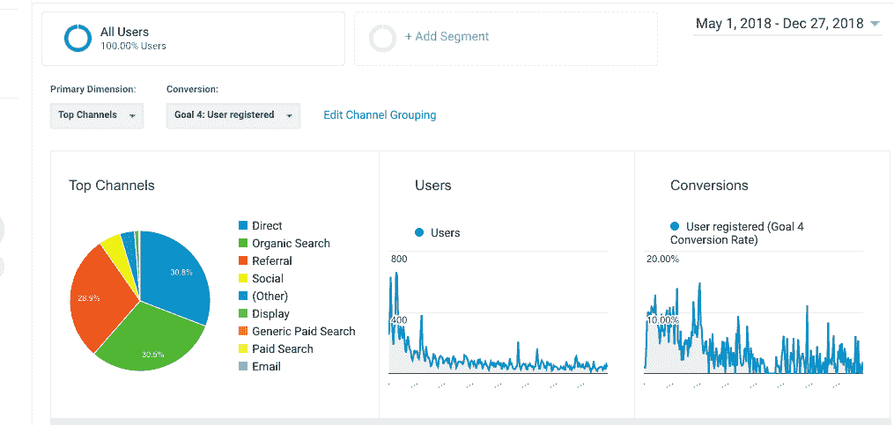
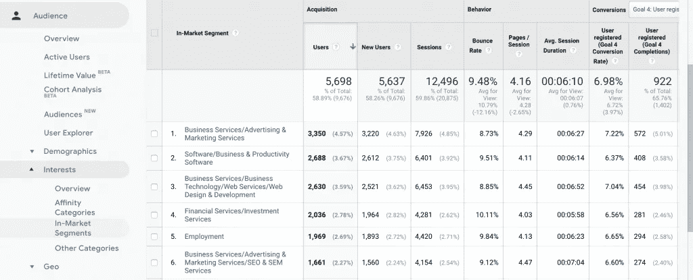
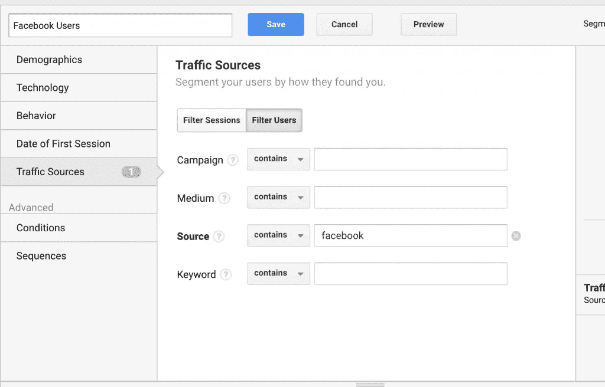
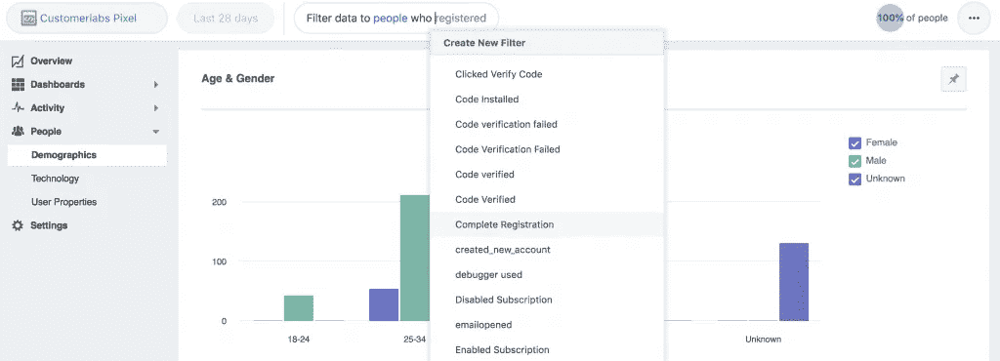
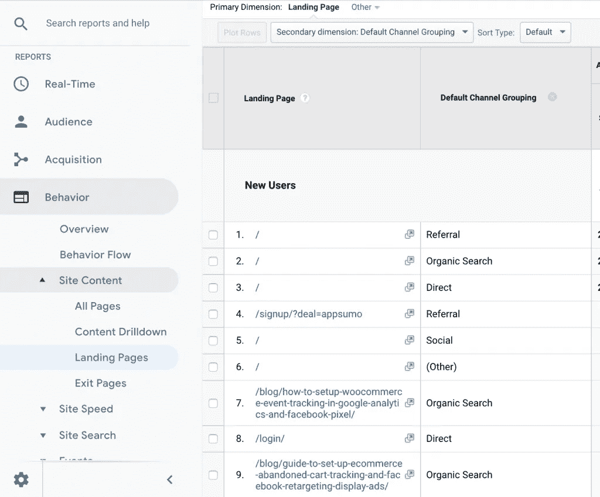
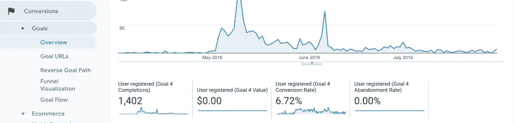
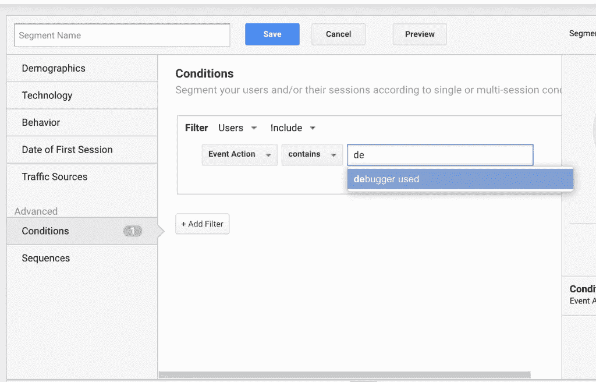
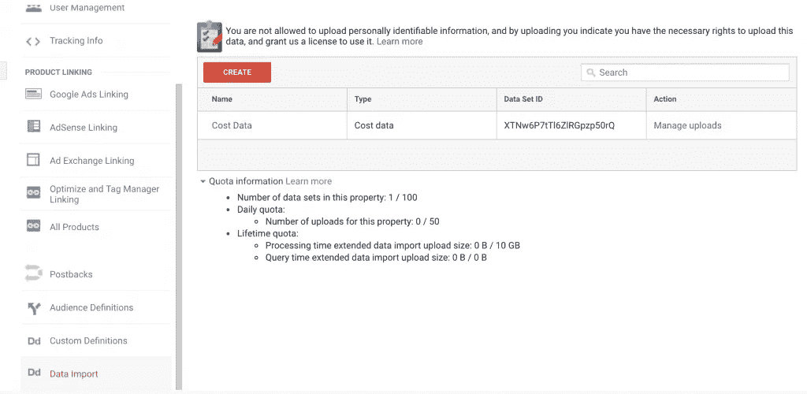

# SaaS 企业的 5 个数据驱动营销指标

> 原文：<https://medium.com/hackernoon/data-driven-marketing-metrics-for-saas-businesses-2a1640a211b3>

SaaS 企业的数字营销工作正变得越来越有竞争力，为了维持这一游戏，营销人员需要大规模采用数据驱动的营销来管理他们的渠道营销。

对于数字营销人员来说，深入研究详细的数据驱动指标来衡量他们的工作和实验是非常重要的。

营销团队现在可以通过执行客户生命周期或全渠道或管道营销策略来帮助销售和客户成功团队实现他们的目标。

在前一篇文章中，我们已经详细讨论了如何一步一步地进行管道营销。

尽管每个渠道都需要用自己定制的指标进行评估，但最终你需要将它们映射到你的漏斗中。漏斗通常基于营销重点领域和贵公司所处的阶段而演变。

# 收集原始用户行为数据

收集尽可能多的用户行为数据，以了解你的漏斗上发生了什么，现成的分析产品没有给你足够的灵活性来跟踪数据，而且它们不可扩展。顶级公司收集原始数据，并将其整合到自己的营销数据湖中，用于数据驱动的营销工作。每当您想要了解一个重要的指标时，您可以基于您收集的数据构建您自己的定制报告。

随着业务的发展，任何现成的分析工具都无法满足您的需求。对任何 SaaS 企业来说，重要的是要朝着这样一个方向发展，即你能够从自己的数据源中提取数据，并将其拼接在一起，以便更好地了解你的营销活动。

如果你有兴趣了解更多，请参考这篇文章作为起点— [营销数据湖或客户数据平台](https://www.customerlabs.co/blog/martech-2-0%e2%80%8a-%e2%80%8arise-marketing-operations-marketing-data-lake/)。

# 数据驱动营销从漏斗开始。

钉住你的漏斗是任何营销人员的首要任务。SaaS 公司的基本漏斗侧重于知名度->网站访问量->潜在客户->试用->付费客户。在设计您的漏斗时，让销售团队参与进来以确定您希望将谁定义为销售线索是很重要的，这是一个重复的练习，您可能每个季度都需要重温一次

# 意识:

对于任何数字营销人员来说，清楚地了解人们是如何知道你的业务的，哪个渠道给你的网站带来了更多的流量是很重要的。

菜鸟数字营销人员直接关联网站访问，创造知名度，但实际上你应该为首次访问创建一个细分市场，并了解哪些渠道为你带来新的流量。

# 数据驱动的营销指标 1:新访客

第一步是确定哪些渠道给你带来了新的访客流量，并加倍努力在特定的渠道。

深入挖掘以了解哪些内容带来了流量，并进一步分析以了解哪些渠道推动了流量。这将有助于你衡量网站转化过程中渠道的重要性。

展示营销活动通常能为你的网站带来新的访问者，但是，你应该以数据为导向，了解谁值得你的网站。

这里有一些提示，让你开始，以及你如何了解你的网站访问者，以获得成功的展示活动。

**数据驱动的营销技巧 1:有针对性的谷歌展示活动**

如果你想尝试有针对性的谷歌展示活动，并获得最大的投资回报，你可以尝试市场细分报告，以了解哪些细分市场转化为注册。

In-market audience segments

**数据驱动营销技巧 2:结合脸书和谷歌的细分市场数据进行利基定位**

根据脸书源数据对你的客户进行细分，以了解谷歌广告的细分市场，这将让你了解这些用户是谁，你可以制定一个策略来吸引最有转化力的用户。

Segment Facebook users

**数据驱动的营销技巧 3:analytics.facebook.com 了解用户的年龄统计**

你可以简单地使用上面的技巧来增加对谁在你的网站上转换的了解，并加倍努力瞄准那个特定的细分市场。

Facebook analytics data filter based on events

# 数据驱动的营销指标 2:带来新用户的渠道

如果您进一步深入查看默认的渠道分组，您会惊讶地发现哪些渠道推动了这些登录页面的流量和转化指标。

Analyse landing pages which brings you new visitors

# 数据驱动的营销指标 3:潜在客户或试用注册

一般来说，大多数早期阶段的企业希望跟踪每天有多少试用注册产生。虽然这是一个非常重要的跟踪指标，但它通常不是他们所说的北极星指标。但是，当你处于早期阶段时，重要的是几乎每周测量这个指标，以了解你的网站上发生了什么。

这将有助于你了解内容与你的目标用户的共鸣程度，以及你的网站在转化方面的表现。

您可以通过在 Google Analytics 上配置一个事件并将其作为目标进行跟踪来跟踪这一指标。如果你需要任何帮助来跟踪你的申请，这篇文章将帮助你[快速设置跟踪，只需点击几下](https://www.customerlabs.co/blog/no-coding-needed-track-form-submit-events-google-analytics/)。

Goal tracking in Google Analytics

# 数据驱动的营销指标 4:激活/啊哈时刻

一旦你进入管道的下一个阶段，你将开始激活。这是用户在决定付费之前开始意识到它的价值的一步。尤其是查看您的试用产品的有效性，以及该时间表是否足以让您做出购买决定。

您应该依靠事件跟踪来获得这种跟踪。在 Google Analytics 中创建一个细分市场，以非常精确地衡量这一指标。有时，将它标记为销售合格线索并传递给您的销售人员是值得的。

Creation of segments based on activation event.

# 数据驱动的营销指标 5: CAC

你的 CAC 是决定你生意成败的重要指标。CAC 应在您从客户处获得第一笔付款时进行测量。这可以从谷歌分析目标转换数据来衡量，你应该上传成本数据，以获得真正的 ROAS。

一旦你从上面开始，你就可以慢慢地进入其他复杂的问题，如归属，客户成功和保留领域。

对于任何数据驱动的营销工作，请遵循以下步骤，随着时间的推移提高您的成熟度:

a)从您的网站和应用程序中收集尽可能多的原始和正确的数据。

b)利用细分市场更好地了解你的用户，不是每个人都是你的客户。你应该设法瞄准正确的观众。

c)建立一个惊人的漏斗，但最好每个季度都随着你的成长不断改进。

d) **跨您的营销渠道统一客户数据。**

e)采用全渠道营销策略来帮助客户做出决策。

f)专注于激活，即尽快证明您的产品价值。

g)重复上述步骤，直到你确信自己能够回答所有与营销相关的问题。

[customer labs Action Recorder](http://www.customerlabs.co/action-recorder?utm_souce=medium)可以帮助您在不依赖开发者的情况下跟踪您的网站数据，并在您的营销堆栈中统一客户数据。

我们很乐意帮助您开始数据驱动营销。

*原载于 2018 年 12 月 28 日*[*www.customerlabs.co*](https://www.customerlabs.co/blog/data-driven-marketing-saas/)*。*