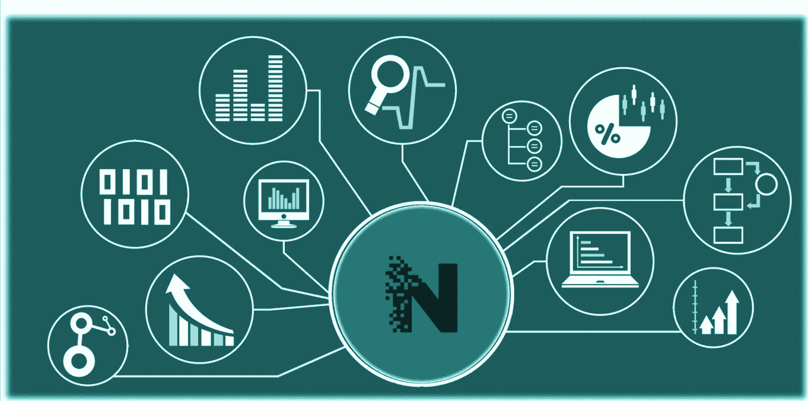
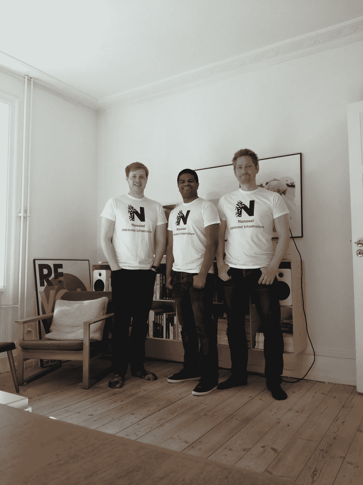

# 无需编程的数据智能

> 原文：<https://medium.com/hackernoon/data-intelligence-without-programming-2996257b28a1>

# **背景历史**

[Nanosai](https://nanosai.com/) 是 2015 年 1 月启动的一个创业项目，由英国 [Zaiku Group](http://jenkov.com/) 和丹麦 [Jenkov Aps](http://www.jenkov.com) 合资合作。当时该项目的目标是创建一个反应式后端服务平台，比我们从谷歌应用引擎和 AWS 获得的更连贯、一致和专注。

Nanosai founders (right to left) in Copenhagen: [Jakob Jenkov](https://www.linkedin.com/in/jakob-jenkov-4a3a8/), [Bamborde Balde](https://www.linkedin.com/in/bambord%C3%A9/) and [Liam Shore](https://www.linkedin.com/in/liamshore/).

为了创建一个更加一致的平台，我们意识到我们必须重新发明一些我们想要提供的技术，以及支持这些技术的技术，包括数据格式、网络协议和应用平台。然而，随着项目的发展，我们觉得有必要将我们的关注点从一般的 SaaS / IaaS 缩小到创建一个“数据智能生态系统”。然而，大多数潜在的想法和技术是相同的。

# **关于纳赛工作室**

[Nanosai Studio](https://nanosai.com/studio) 是一款通用数据智能桌面应用，可以连接到数据源，并以多种方式分析和可视化数据。该应用程序定期从数据源请求最新数据，因此您可以看到实时分析和可视化的数据。

作为一个桌面应用程序，Nanosai Studio 可以使用本地文件作为数据源，或者使用本地开发 web 服务器。它也可以通过 HTTP 连接到您自己的基础设施来获取数据。您只需要提供一个以正确格式返回数据的 web 服务。

只需点击几次鼠标即可配置数据视图并将其连接到数据源。多个数据视图可以组合成一个实时更新的仪表板。仪表板的配置可以保存到磁盘，因此您可以在将来再次打开该配置。如果您将仪表板配置文件上传到 web 服务器，则可以与其他用户共享该配置。当他们打开仪表板配置文件时，他们将获得一个仪表板，其中包含用于创建配置的相同数据视图和数据源。

下面是关于 Nanosai Studio 的 Youtube 简介视频。

最后，Nanosai Studio 还可以使用 [Nanosai Streams](https://nanosai.com/streams) 作为数据源——以防您不想使用自己的数据基础设施。Nanosai Streams 就像简化版的卡夫卡，由 Nanosai 托管。

*发帖人*[*bambordébaldé*](https://medium.com/u/665359d135fa?source=post_page-----2996257b28a1--------------------------------)*、联合创始人| Twitter:*[*@ cloud balde*](https://twitter.com/cloudbalde)*| LinkedIn:*[linkedin.com/in/bambordé](https://www.linkedin.com/in/bambord%C3%A9)|