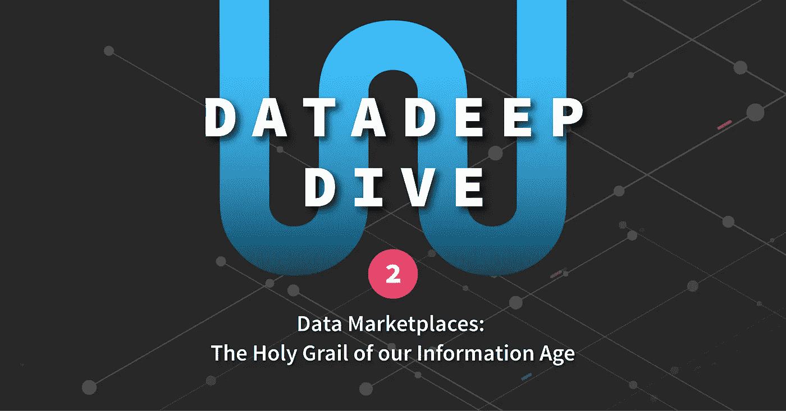
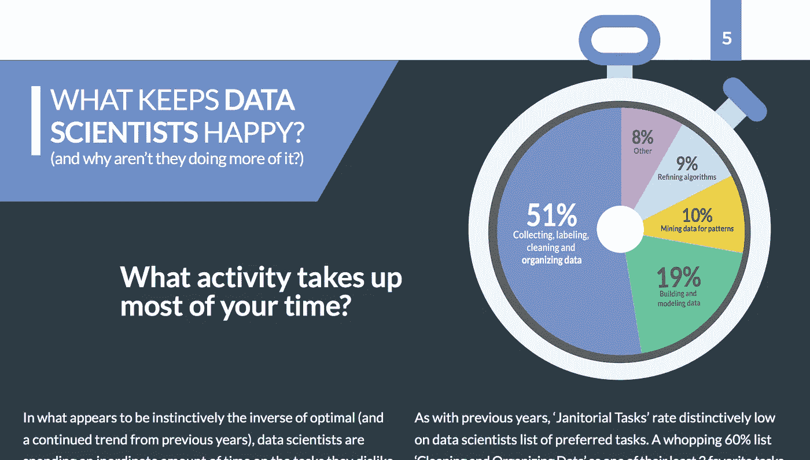
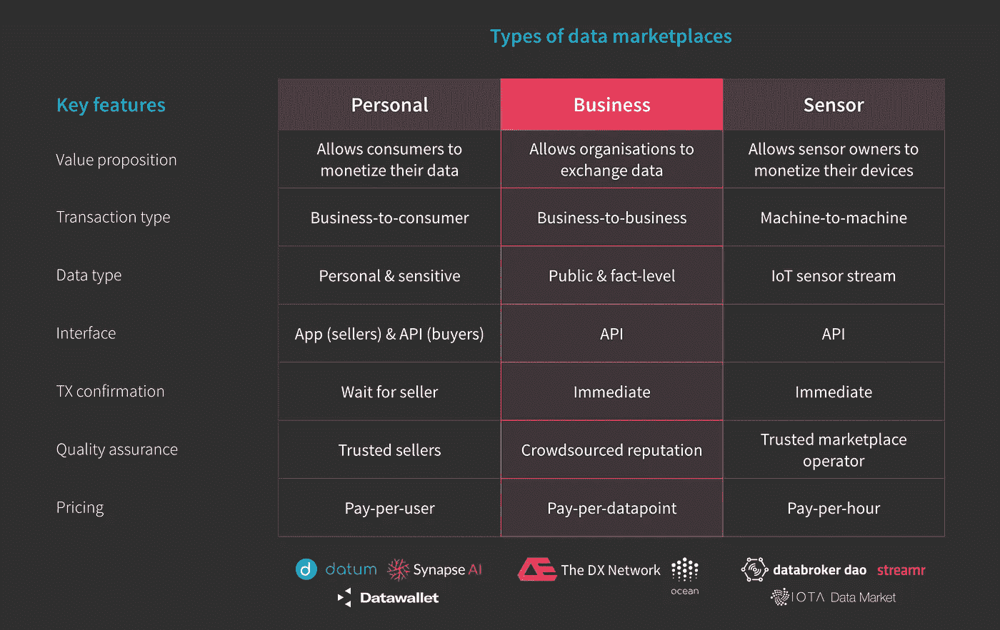

# 数据市场:我们信息时代的圣杯

> 原文：<https://medium.com/hackernoon/data-marketplaces-the-holy-grail-of-our-information-age-1211a6fec390>

这是**数据深度挖掘**系列的第 2 部分。 [**第 1 部分**](https://hackernoon.com/the-fundamental-problem-of-the-data-economy-nobody-is-talking-about-dfcaa31546c1) 描述了数据如何改变我们经济和社会的几乎所有方面，但数据经济的真正承诺在很大程度上仍未实现，因为我们仍然缺乏允许标准、安全和高效数据交换的技术。

# *输入数据市场*

首先，什么是数据市场？就像任何市场一样，它是一个平台，可以方便地买卖资源，在这里是数据。实际上，数据市场是一个软件，数据提供者和数据消费者通过一个图形或后端界面连接到这个软件上，相互买卖数据。

正如股票和货币在不同类型的交易所交易一样，不同类型的数据和用例需要不同类型的市场。例如，*个人数据*市场可以让个人选择将他们的个人数据出售给谁，并直接获得收益，而*商业数据*市场可以允许两家公司相互买卖行业数据，如本地化产品价格、保险索赔统计数据或特定行业最近投资交易的数据。

# 数据市场的关键属性

为了理解为什么数据市场是数据经济中缺失的支柱，让我们考虑一下 [**数据深度挖掘第 1 部分**](https://hackernoon.com/the-fundamental-problem-of-the-data-economy-nobody-is-talking-about-dfcaa31546c1) 中概述的阻碍其全部潜力的 3 个基本障碍。

*   大多数数据以未提炼(或非结构化)的形式存在，将其转换为结构化数据(软件中使用的格式)并不容易。
*   数据所有者使用不兼容的数据模型来构建他们的数据，这些数据保存在孤立的孤岛中，尽管经常受到其他人的追捧。
*   还没有人想出如何有效地定价和交换数据。

尽管不同的数据市场根据其特定的用例具有不同的属性，但一般来说，数据市场范式允许:

*   **众包:**通过实现*自助式数据销售*，他们提供了摆脱不准确/昂贵的单一来源数据的解决方案。
*   **一致的激励措施:**数据所有者/收集者直接受益于以结构化形式保存数据并使其可供他人使用。
*   标准化:通过设计，市场为买家和卖家定义了一个通用的数据模型和接口来交换数据。
*   **公平:**供应商可以*设定自己的价格*，而消费者可以*选择从谁那里购买*，而不是拥有一个中央定价数据。

# 更好的知识共享模式

最终，数据市场可以被认为是一个知识共享平台，它比当前的数据源方法更好地协调了数据消费者和数据所有者的动机。

例如，*手动数据收集*对于数据消费者来说是一个冗长乏味的过程，对数据所有者来说没有任何价值。类似地，*网络抓取*对于消费者来说是缓慢和/或昂贵的，有时甚至是非法的，并且同样没有给所有者带来任何价值。另一方面，*数据消费者和孤立的数据提供者之间的临时数据交易*倾向于将大量权力放在提供者手中，使他们没有动力提供负担得起的高质量数据。

因此，矛盾的是，在我们所谓的信息时代，数据流被打破了。这使得数据获取成为一项不必要的高成本任务，同时对于经常坐拥大量未利用或未充分利用的数据的数据所有者来说，这是一个巨大的错失机会——双输。

The reality of working with data today: data scientists spend over half their time collecting, cleaning and organizing data before they can use it [[Figure Eight](https://visit.crowdflower.com/rs/416-ZBE-142/images/CrowdFlower_DataScienceReport.pdf?mkt_tok=eyJpIjoiTTJFek1UaGxNekl5TmpJeCIsInQiOiJPMXpWVnREbHJGR1RHN1BUVk9Zdm5xTEEyNXRpdDRONmZ4XC9oaFwvZGpFNnB0Z0hIWERGS1NqN0huRjB5QUE1UUJVbVZxNFhaeVBSUXJzMTNYdmRJR)].

然而，在市场环境中，购买者只为他们消费的数据付费，这有效地激励了数据提供商提供最高质量、最受欢迎的数据，因为这可以最大化他们的收入。同样，市场创建的基础设施和固有的数据交换标准消除了数据买方和卖方之间的摩擦，从而降低了获取数据的成本，为数据经济实现其真正潜力提供了前两个障碍的解决方案。

反过来，对消费者更好的价值可能会增加需求，从而为数据提供商提供更多的潜在收入。这最终使它成为一个比现状(想想 Airbnb)对双方都更好的交易，并形成一个正反馈循环。

最后，通过允许数据提供商设定自己的数据价格，并允许数据消费者选择向谁购买数据，数据市场不仅允许消费者表明哪些数据/卖方提供价值，而且还通过采取自由市场方法解决了数据定价难题。

由于许多组织已经将收集数据作为其正常运作的一部分，

> **数据市场将在不久的将来*至少*将现有数据的广度和深度扩大一个数量级**，就像维基百科对百科知识所做的那样。

最后一部《大英百科全书》于 2010 年出版，涵盖了 50 万个主题。今天，维基百科有超过 500 万篇文章，每天有 600 篇新文章，每秒钟有 10 次以上的编辑。

# 区块链:缺失的一环

既然我们已经解决了理论问题，让我们转向实践吧。为了创建实现上述承诺的数据市场，我们需要:

*   一种让数据市场尽可能开放的方法——众包尽可能多的数据——同时保护买家和卖家免受坏人的影响。
*   一种保证数据销售者每次购买数据时都能获得报酬(并获得正确金额)的方式。
*   一个快速、安全和可扩展的微支付基础设施，允许自由使用:购买者只需支付他们消费的数据。
*   一种保证数据来源的方法，以确保购买的数据没有被篡改，并且*实际上*来自所谓的卖家。

区块链智能合约的出现最终创造了一种强制执行这些属性的方式，这种方式不需要数据提供者和数据消费者相互信任。在处理市场参与者、数据和支付的认证时，信任是一个关键因素。事实上，信任的集中化可能是之前创建数据市场的尝试失败的主要原因之一——最明显的是微软 Azure DataMarket，它在 7 年后于 2017 年 3 月关闭。

我们现在来看看新一代的企业，他们利用区块链的技术让数据成为可交易的资产。

# 区块链驱动的数据市场即将到来！

数据市场就像交通工具。自行车、汽车、飞机等。每一种都构成了一种独特的技术，这使得它们在不同的使用情况下都是理想的，但是似乎不太可能存在一种通用的解决方案，可以无一例外地胜过所有其他的解决方案。

因为数据利益相关者如此多样，数据的使用案例无穷无尽，所以对数据市场进行分类的直观方法是根据它们允许参与者交换的数据类型:**个人**、**商业**和**传感器**数据。

Some of the key properties of blockchain-powered data marketplaces categorized by data type [[The DX Network](https://dx.network/#data-marketplaces)]

个人数据市场的使命是通过允许消费者根据自己的条件直接利用他们的数据赚钱来赋予他们权力。例子包括 [**数据**](https://datum.org/) 、 [**数据钱包**](https://datawallet.com/) 和 [**数据钱包**](https://fysical.org/) 允许用户出售任何东西，从他们的电子邮件地址到社交媒体流或他们的位置。

个人数据市场的主要特征是它们具有面向消费者的组件，例如移动应用程序，其目的是收集数据，确保数据被安全地存储/交付(本地或第三方分散存储),并为用户提供管理数据购买请求的界面。在买方方面，使用 API 从目标用户处购买个体数据集，以集成到内部产品、线索生成流程、营销活动等中。

**业务数据市场**旨在实现高效的企业对企业数据交换，重点关注结构化数据和大型数据提供商/消费者。 [**海洋协议**](https://oceanprotocol.com/) 和我们自己的 [**DX 网络**](https://DX.network)**就是这种情况，这些**为交易企业知识如特定行业的数据或科学实验结果提供平台。****

****商业数据市场的独特之处在于，提供商提供的数据通常与提供商本身无关。这对他们的底层技术有着根本性的影响，底层技术必须具有共享数据库的许多属性，而个人和传感器数据市场更接近于数据目录。这导致数据在市场内被聚集，从而可以立即使用。提供商和消费者都通过面向商业智能、研究、机器学习等的 API 与市场进行交互。****

******传感器数据市场**允许从远程设备购买实时数据。例如， [**IOTA Data Market**](https://data.iota.org/) ， [**DataBroker DAO**](https://databrokerdao.com/) 和[**stream**](https://www.streamr.com/)提供污染、电网和车辆远程信息处理数据馈送。****

****传感器数据市场的特性是待售数据的实时性。目前，卖家在市场界面上列出他们的传感器，以及每期或每次读数的价格，买家使用相同的界面订阅数据流。在未来，物联网设备可以使用 marketplace APIs 自动列出自己并将其数据流货币化，和/或自主从其他设备购买数据流，以改善城市生活、交通、制造等。****

*****如果你知道另一个应该在上面提到的数据市场，请在下面留下评论或联系@*[**twitter.com/itsJeremiahS**](https://twitter.com/itsJeremiahS)****

# ****智能合同是关键****

****区块链驱动的数据市场是推动新兴数据经济的创新。下一次数据深度探讨将给出智能合约如何用于在数据市场中分散信任的实际细节。****