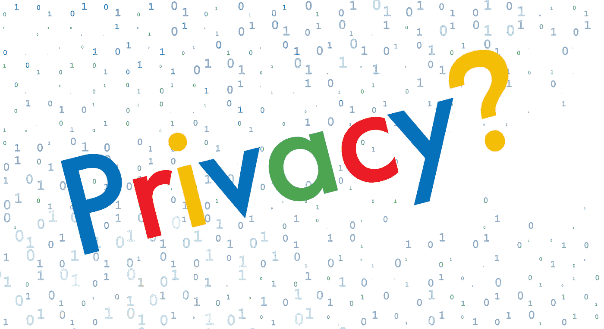

# 谷歌的数据隐私问题

> 原文：<https://medium.com/hackernoon/data-privacy-concerns-with-google-b946f2b7afea>

谷歌母公司 Alphabet 的市值为 7120 亿美元。在谷歌的产品系列中，有 7 款产品拥有至少 10 亿用户。在其隐私政策中，该公司概述了其广泛而深远的数据收集。数据收集延伸到谷歌的整个产品套件，这意味着该公司存储的数据量是巨大的。[谷歌](https://hackernoon.com/tagged/google)拥有估计 [15 艾字节的数据](https://www.cirrusinsight.com/blog/much-data-google-store)，或者说……