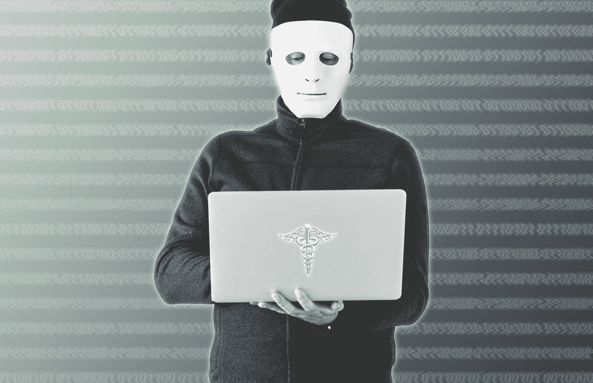

# 医疗保健中的数据隐私和安全

> 原文：<https://medium.com/hackernoon/data-privacy-security-in-healthcare-8bb15e203e56>

# 是的，不一样

如果你曾经和一位在[医疗保健](https://hackernoon.com/tagged/healthcare)工作的朋友讨论过技术、商业战略或你自己的经历，你可能对这个主题很熟悉:

"*在医疗保健方面，情况有所不同."*

考虑到该行业特有的众多挑战，或者医疗保健患者设定的崇高期望(事关生死，有人知道吗？).医疗保健行业的技术和组织需求是独特的。现在，随着医疗保健行业进入一个令人兴奋的增长期，并面临巨大的挑战，他们被带到了最前沿。

考虑到严格的法律法规要求、混乱的商业环境，以及在患者护理过程中促进信任、公平和舒适环境的微妙本质。所有这些不寻常的变量只能在医疗保健的环境中找到——它们要求我们用一种特殊的视角来审视当今医疗保健行业面临的不同问题。

# 安全变得(不)容易

这一观点清晰地延伸到了医疗保健中的数据隐私和[安全](https://hackernoon.com/tagged/security)的话题。我们的健康信息现在在众多公司中广泛传播，并迅速成为我们最有价值的数据形式之一。除了数据，我们赖以生存和幸福的医疗设备正变得比以往任何时候都更加数字化，使它们成为恶意实体和黑客的目标。

在商业世界中，一个被盗的身份可能会给某人带来数月的不便，并让他们损失数千美元，但这与一个受损的医疗设备所造成的潜在损害相比又如何呢？当患者的健康取决于心率监测器是否正常工作时，风险会成倍增加。这些用于治疗和诊断患者的医疗设备，如果被识别为攻击面并被恶意行为者破坏，会带来巨大而独特的风险。

除了生命和肢体，患者与医疗保健服务的关系还包括另一个敏感的组成部分:受保护的健康信息(PHI)。PHI 由个人医疗信息组成，在患者、医疗服务提供者和支付者之间进行交换，这些信息是在患者整个医疗保健过程中产生的。一般来说，这些数据是由与我们的治疗相关的医疗公司处理的。这使得他们有责任确保这些信息是保密的、可访问的并且保持不变。

这说起来容易做起来难，但是说与不做的时候已经过去了。正如患者、健康公司和监管机构发现的那样，暴露 PHI 的违规行为可能会造成与心痛同样多的现金损失:最大的损失。

> *附注:医疗设备安全问题是联邦监管机构开始着手解决的问题之一。最近，FDA 宣布了他们加强医疗设备网络安全的努力:*
> 
> [链接到美国美国食品药品监督管理局新闻发布会](https://www.fda.gov/NewsEvents/Newsroom/PressAnnouncements/ucm622074.htm)

# 算是技术革命吧

在过去的十年中，我们看到了数据和服务从二十世纪末的模拟技术向现在互联的空灵技术基础设施的快速、无处不在的迁移。这场革命已经渗透到我们生活的方方面面，更确切地说，渗透到支撑我们福祉的医疗保健行业。

特别是，医疗保健的数字化体现在采用强大的电子医疗记录系统(EMR)对健康记录进行编目和跟踪患者护理。通过网络提供的患者平台现在是将患者与他们的医疗信息、诊断报告、处方履行服务，当然还有支付联系起来的行业标准。

最前沿的例子是与远程医疗系统的集成，允许患者通过摄像头咨询他们的护理提供者，完全消除了前往医生办公室的需要。

尽管这一技术进步令人印象深刻，但在医疗保健行业，它还没有完全*全面*——在这个领域，传真患者数据是一种常见的做法，医生仍在强化手写刻板印象。因此，大多数医疗保健组织的 PHI 都以电子和纸质形式存在。

所有这些都有助于增加 PHI 的流通数量——记录通过许多不同的医疗系统传递，这些系统具有不同程度的隐私和安全保证机制。

毫不奇怪，管理和保护 PHI 是一项巨大的挑战。除了明显的以网络为中心的安全问题(如黑客、数据泄露、勒索软件攻击)，还必须认真考虑健康信息的物理安全。许多医生的办公室并没有像他们应该的那样依赖电子病历保存系统。结果，在这些办公室里，成百上千的病历被堆在桌子上，被塞进文件柜，或者被不当丢弃在垃圾箱而不是碎纸机里。

> EMR 系统已经被广泛采用，但是还没有被充分利用。该出版物详细介绍了在三个加拿大医疗实践中观察到的“天花板效应”。
> 
> [链接到 EMR 系统同化中的天花板效应:初级保健家庭实践中的多案例研究，2017 年 4 月 20 日发表。](https://bmcmedinformdecismak.biomedcentral.com/articles/10.1186/s12911-017-0445-1)

# 珍贵货物

那些读者可能已经熟悉了近年来影响消费者的众多安全事件。2017 年 9 月的 Equifax 黑客攻击暴露了数百万人的个人信息，他们发现自己在事后争相锁定自己的身份和信用额度。

乍一看，很容易认为财务信息是我们最宝贵的。这在过去可能是正确的，但随着我们通过与医疗保健公司和提供商的关系产生更多的 PHI，这种平衡肯定会发生变化。

事实上，PHI 的真正价值已经被医疗保健公司在安全违规后的财务成本所证明:

> “连续第八年，医疗保健组织的数据泄露相关成本最高，每条丢失或被盗记录的成本为 408 美元，几乎是全行业平均水平(148 美元)的三倍。”
> 
> [链接到 IBM 研究:数据泄露的隐藏成本……发表于 2018 年 7 月 11 日](https://newsroom.ibm.com/2018-07-11-IBM-Study-Hidden-Costs-of-Data-Breaches-Increase-Expenses-for-Businesses)

有趣的是，与跨行业的替代方案相比，恶意黑客和数据窃贼分享了这一估值。[这篇文章详细描述了三个被盗病历数据库的要价](https://news.softpedia.com/news/hacker-selling-651-894-patient-records-on-the-dark-web-505680.shtml)，它们可以在暗网市场上买到。我可以帮你省去这一趟——396，458 份病历，占被出售的三个数据库之一，标价 405，000 美元。

是什么让这些记录在非法的暗网市场上如此有价值？首先，医疗记录可以被用来进行保险欺诈。更糟糕的是，当它们以这种方式被使用时，它们经常会在被身份窃贼拥有时被更改。

这些不准确的改动严重影响了病历所属的所有者。在紧急情况下接受不准确的护理是更可怕的假设结果之一——影响一个人的健康保险资格是一个更“无害”的例子。

另一个有助于其黑市价值的因素是，这些医疗记录通常包含其他私人信息，如社会安全号码或联系信息。当然，医疗保健往往是有成本的，所以财务信息也往往包含在一揽子交易中。

在一个地方找到所有这些信息为有事业心的黑客节省了大量的时间和精力，如果医疗行业当前的安全状况不能胜任这项任务，那么，这只是另一个好处。

# 一饮而尽，政府

目前，有一些针对医疗机构信息安全需求的安全原则。具体来说，就是 HITECH 和 HIPAA 这两项联邦法律，这两项法律通过对任何涉足医疗保健的组织强制实施监管标准来保护患者的隐私信息和健康。

尽管这些联邦标准是专门针对医疗保健而制定的，但它们自身的升级速度可能不足以跟上创新的步伐。
与此同时，更新的安全框架，如 NIST 发布的那些，在范围上是广泛和通用的，而不是针对医疗保健信息安全部门的规定。

也就是说，医疗保健行业解决隐私和安全问题的创新速度也不是很快。尤其是与它采用的机械臂相比——希望不会被黑客攻击并被命令在手术台上掐死你…

对患者来说幸运的是，联邦机构实施的制裁针对的是未能确保患者数据安全的公司。他们被处以固定比例的罚款，屡教不改者将被处以更高的罚款。在 HHS 的网页上可以找到民权办公室执行的许多案例。这里有一个这样的例子:

> [法官做出有利于 OCR 的裁决，并要求德克萨斯州癌症中心为违反 HIPAA 支付 430 万美元的罚款](https://www.hhs.gov/about/news/2018/06/18/judge-rules-in-favor-of-ocr-and-requires-texas-cancer-center-to-pay-4.3-million-in-penalties-for-hipaa-violations.html)
> 
> 来自[美国卫生部&人类服务网站](https://www.hhs.gov/hipaa/for-professionals/compliance-enforcement/agreements/index.html)

显然，患者数据的安全性给医疗机构带来了巨大的运营和财务负担。他们有充分的动机继续改善他们的医疗保健环境，为他们服务的人们提供更多的隐私和安全性。毕竟，患者、提供商和支付者网络都要分担数据泄露的成本。

# 谢谢你的诊断，但有什么治疗方法呢？

显然，在改善患者数据隐私状况方面仍有工作要做。医疗保健技术的飞跃很有可能最终会将安全性抛在一边。随着 PHI 快速类似于数字黄金，对信息隐私的关注在未来几年只会增加。问题仍然是:我们做得够不够？

联邦和私营医疗机构的努力正在改善，因此数据安全实践可能会继续同步发展。重要的是，组织应该努力让员工和患者接受关注安全的文化。

当然，接受医疗安全教育是我们所有人的责任。当我们寻求并接受护理时，我们应该注意我们的数据将如何被使用，或可能被滥用——除了我们自己的安全行为之外，还要对我们的护理提供者的安全行为采取批判性的眼光。通过将隐私引入讨论，我们可以培养对我们数据的整体尊重，确保医疗保健能够提供信任和关怀。

简而言之，有好消息:预后不是晚期。