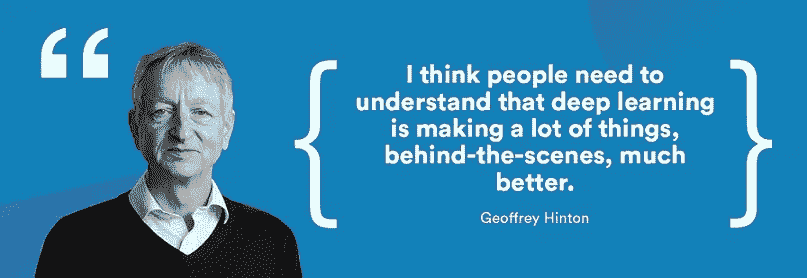

# 数据科学资源

> 原文：<https://medium.com/hackernoon/data-science-resources-464c35712a33>

[2018 年 8 月 20 日](https://themenyouwanttobe.wordpress.com/2018/08/20/data-science-resources/)

Geoffrey Hinton(God Father of Deep Learning)

通过 ***教程*** ，我指的是旨在简明扼要地教授一个概念的介绍性内容。我已经避免包括书籍的章节，这些章节覆盖面更广，也避免包括研究论文，这些论文通常在教授概念方面做得不好。为什么不买本书呢？当你试图学习一个特殊的主题或者想获得不同的观点时，教程是很有帮助的。

我把这篇文章分成了四个部分:**机器学习**、 **NLP** 、 **Python** 和**数学**。我在每一部分都包含了一些主题的样本，但是考虑到资料的庞大，我不可能包含所有可能的主题。

如果有 ***好的*** 教程你知道我没了，请告诉我！我试图将每个主题限制在五到六个教程内，因为超出这个范围的内容会重复。每个链接应该有不同于其他链接的材料，或者以不同的方式(例如代码与幻灯片和长格式)或从不同的角度呈现信息。(来源 via —罗比·艾伦)

# 机器学习

[机器学习很好玩！](/@ageitgey/machine-learning-is-fun-80ea3ec3c471)(medium.com/@ageitgey)

机器学习速成班:[第一部分](https://ml.berkeley.edu/blog/2016/11/06/tutorial-1/)，[第二部分](https://ml.berkeley.edu/blog/2016/12/24/tutorial-2/)，[第三部分](https://ml.berkeley.edu/blog/2017/02/04/tutorial-3/)(机器学习在柏克莱)

[机器学习理论及其应用的介绍:带有示例的可视化教程](https://www.toptal.com/machine-learning/machine-learning-theory-an-introductory-primer)(toptal.com)

机器学习简明指南(monkeylearn.com)

[我应该使用哪种机器学习算法？](https://blogs.sas.com/content/subconsciousmusings/2017/04/12/machine-learning-algorithm-use/)(sas.com)

## 激活和损失函数

[乙状结肠神经元](http://neuralnetworksanddeeplearning.com/chap1.html#sigmoid_neurons)(neuralnetworksanddeeplearning.com)

激活函数在神经网络中的作用是什么？(quora.com)

【stats.stackexchange.com】神经网络中激活函数的综合列表及其利弊

[激活函数及其类型——哪个更好？](/towards-data-science/activation-functions-and-its-types-which-is-better-a9a5310cc8f)(medium.com)

[了解对数损失](http://www.exegetic.biz/blog/2015/12/making-sense-logarithmic-loss/) (exegetic.biz)

[损失函数](http://cs231n.github.io/neural-networks-2/#losses)(斯坦福 CS231n)

[L1 vs L2 损失函数](http://rishy.github.io/ml/2015/07/28/l1-vs-l2-loss/) (rishy.github.io)

[交叉熵代价函数](http://neuralnetworksanddeeplearning.com/chap3.html#the_cross-entropy_cost_function)(neuralnetworksanddeeplearning.com)

## 偏见

[偏差在神经网络中的作用](https://stackoverflow.com/questions/2480650/role-of-bias-in-neural-networks/2499936#2499936)(stackoverflow.com)

[神经网络中的偏置节点](http://makeyourownneuralnetwork.blogspot.com/2016/06/bias-nodes-in-neural-networks.html)(makeyourownneuralnetwork.blogspot.com)

[人工神经网络中的偏差是什么？](https://www.quora.com/What-is-bias-in-artificial-neural-network)(quora.com)

## 感知器

[感知器【neuralnetworksanddeeplearning.com ](http://neuralnetworksanddeeplearning.com/chap1.html#perceptrons)

[感知](http://natureofcode.com/book/chapter-10-neural-networks/#chapter10_figure3)(natureofcode.com)

[单层神经网络(感知器)](http://computing.dcu.ie/~humphrys/Notes/Neural/single.neural.html) (dcu.ie)

[从感知机到深度网络](https://www.toptal.com/machine-learning/an-introduction-to-deep-learning-from-perceptrons-to-deep-networks)(toptal.com)

## 回归

[线性回归分析介绍](http://people.duke.edu/~rnau/regintro.htm)(duke.edu)

【ufldl.stanford.edu】线性回归

[线性回归](http://ml-cheatsheet.readthedocs.io/en/latest/linear_regression.html) (readthedocs.io)

[逻辑回归](http://ml-cheatsheet.readthedocs.io/en/latest/logistic_regression.html) (readthedocs.io)

[机器学习的简单线性回归教程](http://machinelearningmastery.com/simple-linear-regression-tutorial-for-machine-learning/)(machinelearningmastery.com)

[机器学习的逻辑回归教程](http://machinelearningmastery.com/logistic-regression-tutorial-for-machine-learning/)(machinelearningmastery.com)

[Softmax 回归](http://ufldl.stanford.edu/tutorial/supervised/SoftmaxRegression/)(ufldl.stanford.edu)

## 梯度下降

[梯度下降学习](http://neuralnetworksanddeeplearning.com/chap1.html#learning_with_gradient_descent)(neuralnetworksanddeeplearning.com)

[梯度下降](http://iamtrask.github.io/2015/07/27/python-network-part2/) (iamtrask.github.io)

[如何理解梯度下降算法](http://www.kdnuggets.com/2017/04/simple-understand-gradient-descent-algorithm.html)(kdnuggets.com)

[梯度下降优化算法概述【sebastianruder.com ](http://sebastianruder.com/optimizing-gradient-descent/)

[优化:随机梯度下降](http://cs231n.github.io/optimization-1/)(斯坦福 CS231n)

## 生成学习

[生成学习算法](http://cs229.stanford.edu/notes/cs229-notes2.pdf)(斯坦福 CS229)

一个朴素贝叶斯分类器的实用解释(monkeylearn.com)

## 支持向量机

[支持向量机简介(monkeylearn.com SVM)](https://monkeylearn.com/blog/introduction-to-support-vector-machines-svm/)

[支持向量机](http://cs229.stanford.edu/notes/cs229-notes3.pdf)(斯坦福 CS229)

[线性分类:支持向量机，Softmax](http://cs231n.github.io/linear-classify/) (Stanford 231n)

## 反向传播

是的，你应该了解 backprop(medium.com/@karpathy)

[能不能给神经网络的反向传播算法一个直观的解释？](https://github.com/rasbt/python-machine-learning-book/blob/master/faq/visual-backpropagation.md)(github.com/rasbt)

[反向传播算法如何工作](http://neuralnetworksanddeeplearning.com/chap2.html)(neuralnetworksanddeeplearning.com)

[通过时间和消失梯度的反向传播](http://www.wildml.com/2015/10/recurrent-neural-networks-tutorial-part-3-backpropagation-through-time-and-vanishing-gradients/)(wildml.com)

[对时间反向传播的温和介绍](http://machinelearningmastery.com/gentle-introduction-backpropagation-time/)(machinelearningmastery.com)

反向传播，直觉

## 深度学习

[深度学习一言以蔽之](http://nikhilbuduma.com/2014/12/29/deep-learning-in-a-nutshell/)(nikhilbuduma.com)

[深度学习教程](http://ai.stanford.edu/~quocle/tutorial1.pdf)(国诉乐)

[什么是深度学习？【machinelearningmastery.com】(T21)](http://machinelearningmastery.com/what-is-deep-learning/)

[人工智能、机器学习、深度学习有什么区别？](https://blogs.nvidia.com/blog/2016/07/29/whats-difference-artificial-intelligence-machine-learning-deep-learning-ai/)(nvidia.com)

## 优化和降维

[数据降维的七种技术](https://www.knime.org/blog/seven-techniques-for-data-dimensionality-reduction)(knime.org)

[主成分分析](http://cs229.stanford.edu/notes/cs229-notes10.pdf)(斯坦福 CS229)

[辍学:改善神经网络的简单方法](http://videolectures.net/site/normal_dl/tag=741100/nips2012_hinton_networks_01.pdf) (Hinton @ NIPS 2012)

[如何训练自己的深度神经网络](http://rishy.github.io/ml/2017/01/05/how-to-train-your-dnn/) (rishy.github.io)

## 长短期记忆(LSTM)

专家对长短期记忆网络的温和介绍(machinelearningmastery.com)

[了解 LSTM 网络](http://colah.github.io/posts/2015-08-Understanding-LSTMs/) (colah.github.io)

[探索 lstm](http://blog.echen.me/2017/05/30/exploring-lstms/)(echen . me)

[任何人都可以学习用 Python 编写 LSTM-RNN 代码](http://iamtrask.github.io/2015/11/15/anyone-can-code-lstm/) (iamtrask.github.io)

## 卷积神经网络

[介绍卷积网络](http://neuralnetworksanddeeplearning.com/chap6.html#introducing_convolutional_networks)(neuralnetworksanddeeplearning.com)

[深度学习和卷积神经网络](/@ageitgey/machine-learning-is-fun-part-3-deep-learning-and-convolutional-neural-networks-f40359318721)(medium.com/@ageitgey)

[Conv 篮网:模块化视角](http://colah.github.io/posts/2014-07-Conv-Nets-Modular/)

[了解卷积](http://colah.github.io/posts/2014-07-Understanding-Convolutions/) (colah.github.io)

## 递归神经网络

[递归神经网络教程【wildml.com ](http://www.wildml.com/2015/09/recurrent-neural-networks-tutorial-part-1-introduction-to-rnns/)

[注意力和增强递归神经网络](http://distill.pub/2016/augmented-rnns/)(distilt . pub)

[递归神经网络的不合理有效性](http://karpathy.github.io/2015/05/21/rnn-effectiveness/) (karpathy.github.io)

深入研究循环神经网络(nikhilbuduma.com)

## 强化学习

[强化学习简易入门指南&其实施](https://www.analyticsvidhya.com/blog/2017/01/introduction-to-reinforcement-learning-implementation/)(analyticsvidhya.com)

【mst.edu】强化学习教程

【wildml.com】学习强化学习

[深度强化学习:Pong from Pixels](http://karpathy.github.io/2016/05/31/rl/)(karpathy . github . io)

## 生成对抗网络

[什么是生成性对抗性网络？](https://blogs.nvidia.com/blog/2017/05/17/generative-adversarial-network/)(nvidia.com)

[滥用生成对抗网络制作 8 位像素艺术](/@ageitgey/abusing-generative-adversarial-networks-to-make-8-bit-pixel-art-e45d9b96cee7)(medium.com/@ageitgey)

[生成性对抗网络介绍(带 TensorFlow 中的代码)](http://blog.aylien.com/introduction-generative-adversarial-networks-code-tensorflow/)(aylien.com)

[面向初学者的生成式对抗网络](https://www.oreilly.com/learning/generative-adversarial-networks-for-beginners)(oreilly.com)

## 多任务学习

[深度神经网络中多任务学习概述](http://sebastianruder.com/multi-task/index.html)(sebastianruder.com)

# 自然语言处理

[关于自然语言处理的神经网络模型的初级读本](http://u.cs.biu.ac.il/~yogo/nnlp.pdf) (Yoav Goldberg)

自然语言处理权威指南【monkeylearn.com 

[自然语言处理简介](https://blog.algorithmia.com/introduction-natural-language-processing-nlp/)(algorithmia.com)

[自然语言处理教程](http://www.vikparuchuri.com/blog/natural-language-processing-tutorial/)(vikparuchuri.com)

[自然语言处理(几乎)从无到有](https://arxiv.org/pdf/1103.0398.pdf)(arxiv.org)

## 深度学习和自然语言处理

[深度学习应用于 NLP](https://arxiv.org/pdf/1703.03091.pdf)(arxiv.org)

[NLP 深度学习(无魔法)](https://nlp.stanford.edu/courses/NAACL2013/NAACL2013-Socher-Manning-DeepLearning.pdf)(理查德·索彻)

【wildml.com】理解用于 NLP 的卷积神经网络

[深度学习、NLP 和表示](http://colah.github.io/posts/2014-07-NLP-RNNs-Representations/) (colah.github.io)

[嵌入、编码、出席、预测:最新 NLP 模型的新深度学习公式](https://explosion.ai/blog/deep-learning-formula-nlp) (explosion.ai)

[使用 Torch 利用深度神经网络理解自然语言](https://devblogs.nvidia.com/parallelforall/understanding-natural-language-deep-neural-networks-using-torch/)(nvidia.com)

[用 Pytorch 进行 NLP 的深度学习](http://pytorch.org/tutorials/beginner/deep_learning_nlp_tutorial.html)(pytorich.org)

## 词向量

一袋文字遇上一袋爆米花(kaggle.com)

论词语嵌入[第一部分](http://sebastianruder.com/word-embeddings-1/index.html)，[第二部分](http://sebastianruder.com/word-embeddings-softmax/index.html)，[第三部分【sebastianruder.com ](http://sebastianruder.com/secret-word2vec/index.html)

词汇的惊人力量(acolyer.org)

[word2vec 参数学习讲解](https://arxiv.org/pdf/1411.2738.pdf)(arxiv.org)

Word2Vec 教程— [跳格模型](http://mccormickml.com/2016/04/19/word2vec-tutorial-the-skip-gram-model/)、[负采样](http://mccormickml.com/2017/01/11/word2vec-tutorial-part-2-negative-sampling/)(mccormickml.com)

## 编码器-解码器

[深度学习和 NLP 中的注意力和记忆](http://www.wildml.com/2016/01/attention-and-memory-in-deep-learning-and-nlp/)(wildml.com)

【tensorflow.org】序列到序列模型

[用神经网络进行序列对序列学习](https://papers.nips.cc/paper/5346-sequence-to-sequence-learning-with-neural-networks.pdf) (NIPS 2014)

[机器学习很有趣第五部分:深度学习的语言翻译和序列的魔力](/@ageitgey/machine-learning-is-fun-part-5-language-translation-with-deep-learning-and-the-magic-of-sequences-2ace0acca0aa)(medium.com/@ageitgey)

[如何使用编码器-解码器 LSTM 回应随机整数序列](http://machinelearningmastery.com/how-to-use-an-encoder-decoder-lstm-to-echo-sequences-of-random-integers/)(machinelearningmastery.com)

[TF-seq 2 seq](https://google.github.io/seq2seq/)(Google . github . io)

# 计算机编程语言

[用 Python 掌握机器学习的 7 个步骤](http://www.kdnuggets.com/2015/11/seven-steps-machine-learning-python.html)(kdnuggets.com)

[一个机器学习笔记本的例子](http://nbviewer.jupyter.org/github/rhiever/Data-Analysis-and-Machine-Learning-Projects/blob/master/example-data-science-notebook/Example%20Machine%20Learning%20Notebook.ipynb)(nbviewer.jupyter.org)

## 例子

[如何用 Python 从零开始实现感知器算法](http://machinelearningmastery.com/implement-perceptron-algorithm-scratch-python/)(machinelearningmastery.com)

[用 Python 从零开始实现神经网络](http://www.wildml.com/2015/09/implementing-a-neural-network-from-scratch/)(wildml.com)

[11 行 Python 中的一个神经网络](http://iamtrask.github.io/2015/07/12/basic-python-network/) (iamtrask.github.io)

[使用 Python 实现自己的 k-最近邻算法](http://www.kdnuggets.com/2016/01/implementing-your-own-knn-using-python.html)(kdnuggets.com)

[用 Python 演示长短期记忆网络的记忆](http://machinelearningmastery.com/memory-in-a-long-short-term-memory-network/)(machinelearningmastery.com)

[如何学习用长短期记忆递归神经网络回显随机整数](http://machinelearningmastery.com/learn-echo-random-integers-long-short-term-memory-recurrent-neural-networks/)(machinelearningmastery.com)

【machinelearningmastery.com】如何用 seq2seq 递归神经网络学习数字加法

## 科学和愚蠢

【scipy-lectures.org】科学的讲稿

[Python Numpy 教程](http://cs231n.github.io/python-numpy-tutorial/)(斯坦福 CS231n)

[Numpy 和 Scipy 介绍](https://engineering.ucsb.edu/~shell/che210d/numpy.pdf) (UCSB CHE210D)

科学家的 Python 速成班(nbviewer.jupyter.org)

## sci kit-学习

[PyCon scikit-学习教程索引](http://nbviewer.jupyter.org/github/jakevdp/sklearn_pycon2015/blob/master/notebooks/Index.ipynb)(nbviewer.jupyter.org)

[sci kit-学习分类算法](https://github.com/mmmayo13/scikit-learn-classifiers/blob/master/sklearn-classifiers-tutorial.ipynb)(github.com/mmmayo13)

[sci kit-学习教程](http://scikit-learn.org/stable/tutorial/index.html)(scikit-learn.org)

[删节的 scikit-learn 教程](https://github.com/mmmayo13/scikit-learn-beginners-tutorials)(github.com/mmmayo13)

## 张量流

[张量流教程【Tensorflow】](https://www.tensorflow.org/tutorials/)

[tensor flow 简介——CPU vs GPU](/@erikhallstrm/hello-world-tensorflow-649b15aed18c)(medium.com/@erikhallstrm)

[张量流:入门](https://blog.metaflow.fr/tensorflow-a-primer-4b3fa0978be3) (metaflow.fr)

[张量流中的 RNNs](http://www.wildml.com/2016/08/rnns-in-tensorflow-a-practical-guide-and-undocumented-features/)(wildml.com)

[在 TensorFlow 中实现 CNN 进行文本分类](http://www.wildml.com/2015/12/implementing-a-cnn-for-text-classification-in-tensorflow/)(wildml.com)

[如何使用 TensorFlow 运行文本摘要](http://pavel.surmenok.com/2016/10/15/how-to-run-text-summarization-with-tensorflow/)(surmenok.com)

## PyTorch

【pytorch.org】py torch 教程

[py torch](http://blog.gaurav.im/2017/04/24/a-gentle-intro-to-pytorch/)的温柔介绍

[教程:PyTorch 中的深度学习](https://iamtrask.github.io/2017/01/15/pytorch-tutorial/) (iamtrask.github.io)

[PyTorch 示例](https://github.com/jcjohnson/pytorch-examples)(github.com/jcjohnson)

[PyTorch 教程](https://github.com/MorvanZhou/PyTorch-Tutorial)(github.com/MorvanZhou)

[深度学习研究者 PyTorch 教程](https://github.com/yunjey/pytorch-tutorial)(github.com/yunjey)

# 数学

[用于机器学习的数学](https://people.ucsc.edu/~praman1/static/pub/math-for-ml.pdf)(ucsc.edu)

[机器学习的数学](http://www.umiacs.umd.edu/~hal/courses/2013S_ML/math4ml.pdf) (UMIACS CMSC422)

## 线性代数

线性代数直观指南(betterexplained.com)

一个程序员对矩阵乘法的直觉【betterexplained.com 

[了解叉积](https://betterexplained.com/articles/cross-product/)(betterexplained.com)

[了解点积](https://betterexplained.com/articles/vector-calculus-understanding-the-dot-product/)(betterexplained.com)

[用于机器学习的线性代数](http://www.cedar.buffalo.edu/~srihari/CSE574/Chap1/LinearAlgebra.pdf)(布法罗大学 CSE574)

[深度学习的线性代数小抄](/towards-data-science/linear-algebra-cheat-sheet-for-deep-learning-cd67aba4526c)(medium.com)

[线性代数复习与参考](http://cs229.stanford.edu/section/cs229-linalg.pdf)(斯坦福 CS229)

## 可能性

[用比率理解贝叶斯定理](https://betterexplained.com/articles/understanding-bayes-theorem-with-ratios/)(betterexplained.com)

[概率论复习](http://cs229.stanford.edu/section/cs229-prob.pdf)(斯坦福 CS229)

[机器学习的概率论复习](https://see.stanford.edu/materials/aimlcs229/cs229-prob.pdf)(斯坦福 CS229)

[概率论](http://www.cedar.buffalo.edu/~srihari/CSE574/Chap1/Probability-Theory.pdf)(水牛城大学 CSE574)

[机器学习的概率论](http://www.cs.toronto.edu/~urtasun/courses/CSC411_Fall16/tutorial1.pdf)(多伦多大学 CSC411)

## 结石

[如何理解导数:商法则、指数和对数](https://betterexplained.com/articles/how-to-understand-derivatives-the-quotient-rule-exponents-and-logarithms/)(betterexplained.com)

[如何理解衍生品:产品、权力&连锁规则](https://betterexplained.com/articles/derivatives-product-power-chain/)(betterexplained.com)

[向量微积分:理解梯度](https://betterexplained.com/articles/vector-calculus-understanding-the-gradient/)(betterexplained.com)

[微分学](http://web.stanford.edu/class/cs224n/lecture_notes/cs224n-2017-review-differential-calculus.pdf)(斯坦福 CS224n)

[微积分概述](http://ml-cheatsheet.readthedocs.io/en/latest/calculus.html) (readthedocs.io)

希望你喜欢这篇文章！！

> 别忘了订阅和喜欢我的博客。也分享一些爱吧！

# 分享:

*   [按下这个](https://themenyouwanttobe.wordpress.com/2018/08/20/data-science-resources/?share=press-this&nb=1)
*   [电报](https://themenyouwanttobe.wordpress.com/2018/08/20/data-science-resources/?share=telegram&nb=1)
*   [WhatsApp](https://api.whatsapp.com/send?text=Data%20Science%20Resources%20https%3A%2F%2Fthemenyouwanttobe.wordpress.com%2F2018%2F08%2F20%2Fdata-science-resources%2F)

> 莫希特·夏尔马公司
> 
> **接我** [**电报**](https://t.me/themenyouwanttobe)
> 
> **我的最新博客:**[**THEMENYOUWANTTOBE**](https://themenyouwanttobe.wordpress.com/blogs/)