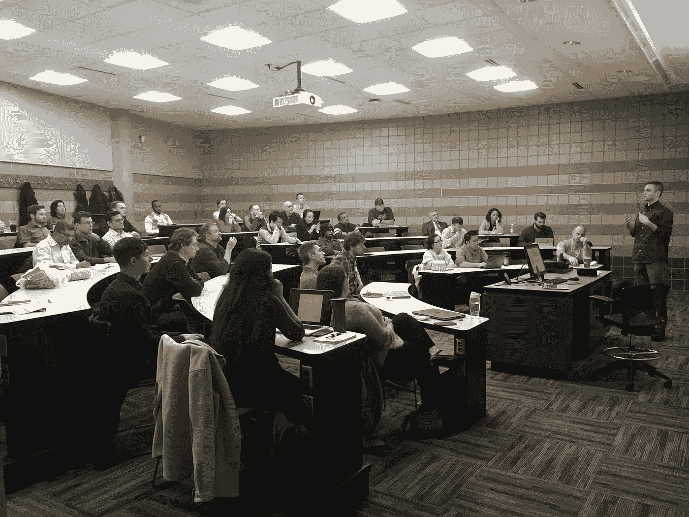

# 数据科学超级英雄前来救援

> 原文：<https://medium.com/hackernoon/data-science-superheroes-come-to-the-rescue-41290d1a1728>

***在明尼苏达州，志愿专业人士和学生数据科学家一起帮助非营利组织***

一个帮助药物滥用的慈善机构，明尼苏达科学博物馆和一群双城房主有什么共同点？**他们都急需数据科学的帮助！**周三晚上，这些团队来到明尼苏达大学，在由[star 882](https://www.stareightytwo.org/)和 [Social Data Science](https://www.meetup.com/socialdatascience/) 组织的新年数据科学决议活动上，向 40 多名学生和数据科学从业者展示了他们的数据科学项目。

该活动将那些想要学习和实践数据科学的人与需要数据科学志愿者的组织团结在一起。每个组织都有机会提出自己的想法，与会的数据科学家讨论这些想法，决定开展哪些项目，并组建团队，在接下来的三个月里就这些项目进行合作。

在八个项目推介中，与会的数据科学家决定研究三个:

*   **一个帮助**[**Avivo**](https://avivomn.org/)**的项目，这是一个致力于为无家可归者和低收入个人提供服务的双城非营利组织，旨在改善其化学健康治疗和康复计划。来自 Avivo 的 Courtney Flug 和 Boyd Brown 展示了他们的想法:使用 Avivo 案例数据库中的数据来建立模型，以在这些程序中实现更好的结果。一个志愿者数据科学家团队将与 Avivo 专家密切合作，以实现这一目标。**
*   **帮助房主了解房价的项目。**我们的志愿数据科学家将与采集数据的房地产经纪人 Shannon Furlong 合作，为东北部双城市的数千套房屋建立销售价格预测模型。有了这种模式，房主将把信息的力量掌握在自己手中，以便在买卖时谈判更好的价格。
*   **一个帮助明尼苏达州** [**科学博物馆**](https://www.smm.org/) **提高筹款的项目。明尼苏达州科学博物馆的会员服务总监 Beth Varro 需要帮助来扩大博物馆的会员基础，并使科学博物馆能够继续提供精彩的景点。利用博物馆会员数据库中的数据，该团队将建立一个预测模型来改善筹款。**

这三个团队将在接下来的三个月里致力于他们的项目，并在四月份的压轴演出中展示他们的工作成果。

如果您有兴趣参与新一年的数据科学解决方案，现在加入这些团队还为时不晚。如需了解更多信息，请发送电子邮件至 dfeldman.mn@gmail.com 的丹尼尔·费尔德曼。

star 882 和 Social Data Science 是非营利组织，它们已经举办了八次数据科学黑客马拉松，并主办了 30 多次免费的教育会议。过去的黑客马拉松赛有下一代，明尼苏达州污染控制机构，人类栖息地，永旺，和地图偏见，以及其他地方组织。

Data Science Superheroes at the Carlson School of Management

*感谢 MinneAnalytics 赞助食物和饮料，感谢卡尔森管理学院提供会议场所。*