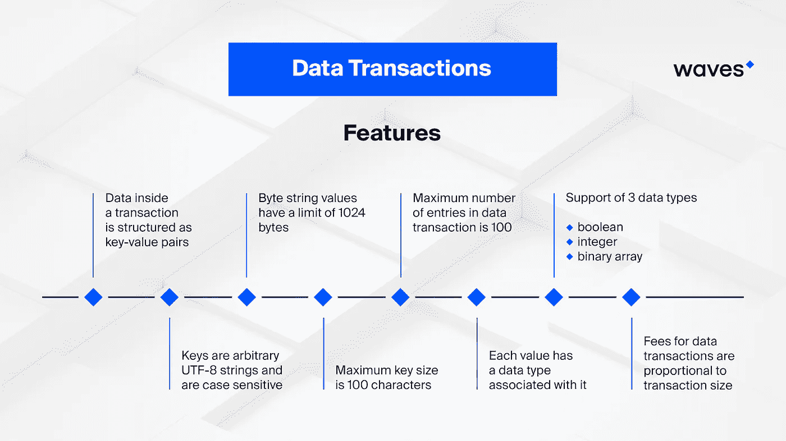
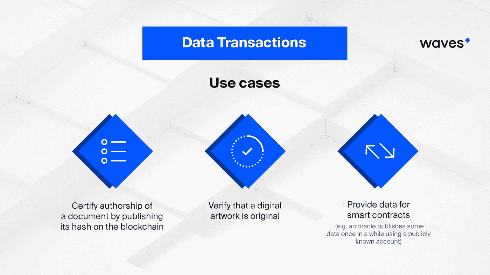

# 图解数据交易

> 原文：<https://medium.com/hackernoon/data-transactions-illustrated-1627a0398621>

区块链最初用于以不变的方式存储信息。这些信息通常由带有加密的收件人和发件人地址的交易数据以及潜在的交易历史组成。然而，区块链不仅仅是各种交易的网关，因为区块链本身是一个不可变的信息库，可以是任何性质的信息。

区块链作为存储库的应用非常广泛，从银行账户信息到投票结果，无所不包。这种数据库的最大价值在于，它将包含所有交易的完整记录，这些交易以固定的方式导致最近的交易，从而排除任何篡改历史的企图。

# 数据交易

数据交易允许区块链用户将各种格式的数据输入区块链。事务内部的数据被结构化为键值对。密钥是区分大小写的 UTF-8 字符串。每个值都有一个关联的数据类型，最初支持四种数据类型，布尔型、整数型、字节数组型和字符串型。

在散列中使用相同密钥的所有后续事务可以覆盖/取代先前的数据事务，但是没有办法擦除它们。但是，任何用户都不能覆盖这些值。

由单个账户发出的数据交易以累积的方式定义账户的状态。一旦挖掘出以下两个交易，就会定义帐户。换句话说，后一个事务可以覆盖现有的键，但不能删除它们，因为删除在区块链本身是不可预见的。

为了便于说明，我们将以 [Waves 平台](https://wavesplatform.com/)为例，该平台目前正在测试其自己的数据交易格式，以便在其 mainnet 上发布。

# 用例

数据事务的主要应用可直接归因于区块链的本质，或其以不可变的方式存储数据并充当可在任何时候用于验证目的的事务历史的存储库的能力。

数据事务的一个重要应用可以是通过在区块链上发布文档的散列来认证文档的作者。很容易想象一个场景，当一个文档需要被签名时，没有办法确保它是由一个被授权的实体签名的。通过应用区块链系统，排除了错误、腐败或串通的人为因素，因为数据交易根本不允许未经授权的实体签署文件，如果在允许签署文件的一串钥匙中无法预见该实体。并且即使环境的相关性确实导致文档的错误签名，区块链也将允许直接对错误的来源进行即时跟踪。

此外，假设每个数据事务在进入散列时都被签名，则它的作者是永久密封的，并且可以根据情况通过跟踪起源块或任何后续签名块来毫无困难地识别。

艺术世界是应用区块链的沃土。有太多的赝品被当作真正的杰作出售。鉴于许多原始艺术家长期致力于记忆，不能质疑，唯一的手段来验证书法是通过艺术专家和证书。这种证书可以从昂贵的文件减少到区块链条目，从而立即允许访问任何特定艺术作品的完整历史并证明其真实性。

数据事务的另一个重要应用是在各种操作中作为智能合约的数据源。例如，如果 oracle 使用公开的帐户发布一些数据，智能合约可以在逻辑中使用这些数据，并执行各种协议的条款。作为第三方验证者，甲骨文将授予智能合同与现实世界的额外连接，并确认各种场景的发生，或授予额外的信息源。

例如，Waves Platform 在与 legal things project 合作后，已经在寻找数据交易的应用程序，legal things project 是一个平台，它使起草和签署文件(如 NDA)像填写问卷一样简单，或者在几分钟内完成创建、审查和审计。

通过与 LegalThings 合作，Waves 将为该项目提供必要的区块链，作为 LegalThings 项目框架内的文档周转库。自然，所有的文件都将以数据交易的形式存档。

# 数据事务大小

数据事务中密钥的最大长度为 100 个字符。密钥可以包含任意的 Unicode 码位，包括空格和其他不可打印的符号。字符串值的限制为 32，768 字节，任何数据事务中可能条目的最大数量为 100 个字符。总体而言，数据事务的最大大小约为 140kb，大约相当于莎士比亚不朽悲剧《蒙塔古和卡布利特家族》的大小。

# 智能合同

所有数据事务都在智能契约语言上操作，该语言具有函数 getLong()、getBoolean()、getByteArray()和 getString()。所有这些函数都接受两个参数，地址和密钥。如果成功，它们返回一些(值)，如果给定的键没有值，则不返回任何值。如果存储在该项下的值属于不同的类型，智能协定将无法通过验证。

# 费用

数据交易费用与交易规模成正比，即每千字节 100，000 美元，四舍五入到最接近的千字节。例如，在 WAVES 平台上，费用只能用 Waves 代币支付。由于 Waves mainnet 上的最大交易量为 140kb，这意味着在区块链上张贴一篇莎士比亚经典的全文只需 0.14 WAVES(不到 1 美元)。

数据交易是区块链的生命线，确保其正常运行是该系统成功开发和实施的关键。