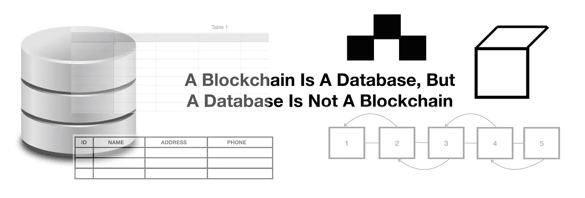
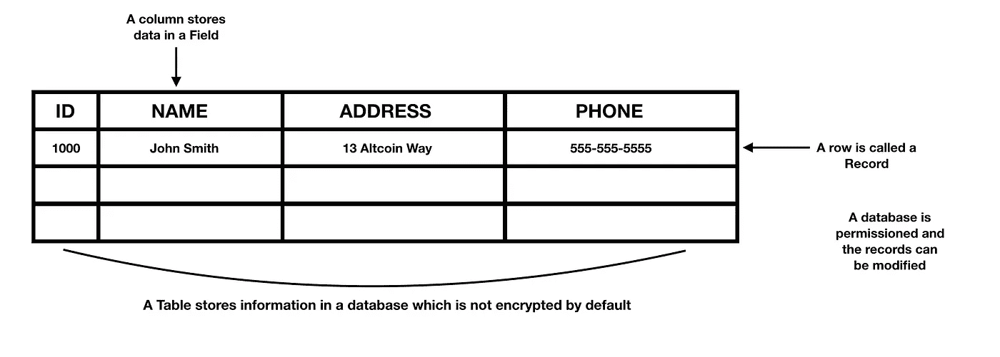
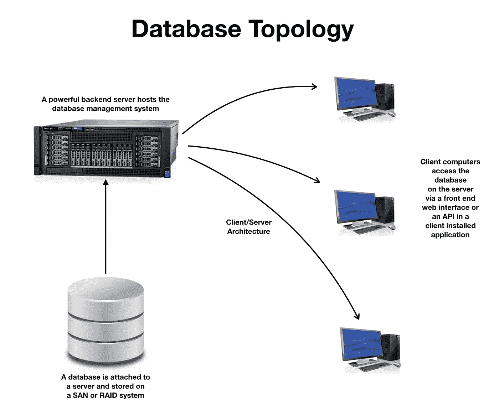
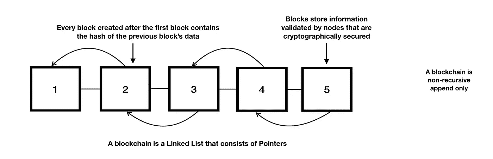
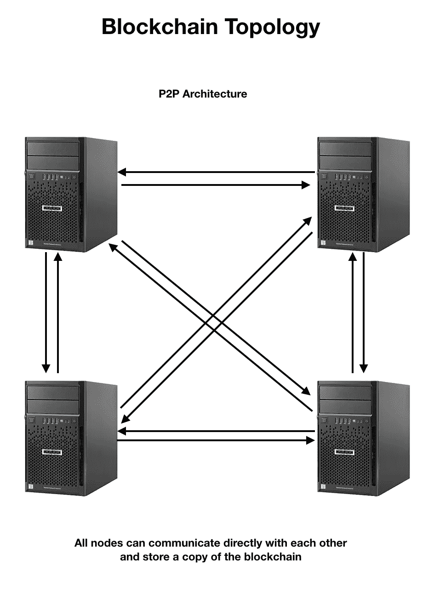
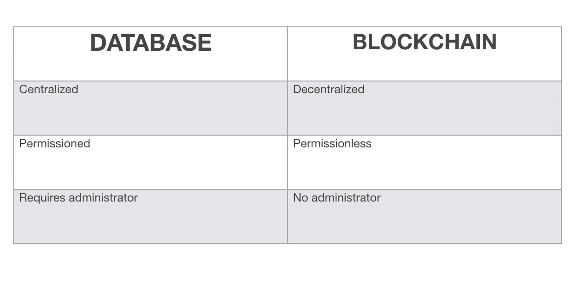

# 数据库和区块链的区别在于它们的目的和设计

> 原文：<https://medium.com/hackernoon/databases-and-blockchains-the-difference-is-in-their-purpose-and-design-56ba6335778b>

对于什么是区块链以及它与数据库的二分法有很多混淆。区块链实际上是一个数据库，因为它是一个数字分类帐，以称为块的数据结构存储信息。数据库同样将信息存储在称为表的数据结构中。然而，虽然区块链是一个数据库，但数据库不是区块链。

虽然它们都存储信息，但它们的设计不同，从这个意义上说，它们是不可互换的。这两者在目的上也有所不同，对于那些想要理解为什么需要区块链以及为什么数据库更适合存储某些数据的人来说，这可能是不清楚的。

首先，让我们看看数据库和区块链之间的区别。

## ***数据库***

传统的数据库是用于存储信息的数据结构。这包括可以查询的数据，以收集实体用于支持业务、财务和管理决策的结构化报告的见解。政府还利用数据库来存储大量数据，这些数据可达数百万条记录。

数据库最初是平面文件层次系统，提供简单的信息收集和存储。后来，数据库使用了一种关系模型，这种模型通过关联来自多个数据库的信息，允许以更复杂的方式收集数据。

可以使用数据库管理系统来组织存储在数据库中的信息。一个简单的数据库存储在称为表的数据元素中。表包含定义记录类型的字段，这些字段存储称为属性的数据。每个字段包含描述字段的列和定义存储在数据库中的记录的行。

A database design

一个数据库可以由一个叫做管理员的用户来修改、管理和控制。数据库总是有一个作为数据库管理员的用户，该用户拥有对数据库的完全控制权。该用户可以创建、删除、修改和更改存储在数据库中的任何记录。

他们还可以对数据库执行管理，例如优化性能和将数据库大小管理到更易于管理的水平。大型数据库往往会降低性能，因此管理员可以运行优化方法来提高性能。

然后，管理员可以将某些角色委派给其他用户，允许他们管理数据库。例如，管理员可以将角色委托给用户，允许他们为数据库创建新用户。当出现问题时，管理员及其代表可以从备份中恢复数据库。在企业界，这样的问题很常见。服务器崩溃，恢复数据的唯一方法是从备份中恢复数据库。

数据库也是递归的，这意味着您可以返回到特定记录上重复一项任务，并修改或删除它。管理员通常会清除数据库中的旧记录，这些记录要么已经备份到另一个数据库，要么被视为过时信息。

例如，如果您在当前数据库中有“John Smith”的记录，需要更新到新的居住地址。在存档的数据库中已经有“John Smith”的先前地址的备份，因此可以用当前数据库中的新地址来更新记录。

A Database Uses A Client/Server Architecture

从小型办公室/家庭办公室到企业环境，数据库都是在客户机/服务器架构中实现的。这是因为计算机需要连接到托管数据库的服务器，以便获取信息或存储数据。最初，使用 ODBC 连接的数据库客户机是由客户机上的管理员或技术人员配置的，以便连接到数据库。然后，客户端软件运行以建立安全连接，该连接必须经过身份验证才能访问。

身份验证可以使用管理员配置的访问字符串，或者给用户提供登录数据库的密码。这就是创建用户帐户的原因，允许通过身份验证的人访问，拒绝未通过身份验证的人。在今天的大多数系统中，使用的是 web 界面。私人访问仍然需要认证，而公共数据库可以更容易地从网站上访问。

我们可以看到，数据库需要大量的控制，这使得它高度集中。它也是有权限的，这意味着它需要来自管理员的用户帐户，然后管理员设置用户如何访问数据库的权限。在生产环境中，数据库管理员对数据库上的公共信息设置只读权限。然后，他们必须为可以更新数据库和向数据库写入信息的用户设置不同的权限集。

传统数据库的集中化设置了系统的安全性和信任度。许多数据库在大公司运营的数据中心的防火墙后面的私有网络中运行。其他的托管在对公众开放的云上。它们仍然需要管理员来控制。

## 区块链

在我对区块链的描述中，我将以比特币的设计为基础。还有用于企业环境的私有区块链，但我将在后面讨论。区块链从 2009 年才出现，当时比特币成为第一个实现它的系统。在比特币中，区块链是一个不可变的数字公共账本，是一个不断增长的分布式数据库，受到加密保护。

区块链将信息存储在统一大小的块中。每个块包含来自前一个块的散列信息，以提供加密安全性。哈希使用 SHA256，这是一种单向哈希函数。该散列信息是来自前一个块的数据和数字签名，以及前一个块的散列，该散列可以一直追溯到区块链中产生的第一个块，称为“起源块”。该信息通过一个哈希函数运行，然后指向前一个块的地址。区块链数据结构是 Merkle 树的一个例子，Merkle 树被用作验证数据的有效方式。

A blockchain design

为了将方块添加到区块链中，博弈理论参与了这个过程。在网络中充当节点的计算机被称为“矿工”，它们必须相互竞争，以找到由散列函数产生的一个值，该值被称为随机数。矿工必须使用他们的计算资源来求解这个值，这需要强大的计算机硬件。区块链中内置了一个称为难度级别的协议，它根据网络中所谓的总哈希能力来确定求解该值的难易程度。

这意味着矿工越多，调整的难度就越大。这是因为随着矿工越来越多，网络上可用的计算资源也越来越多，从而提高了散列能力，以每秒散列数或 h/s 来衡量。一旦矿工验证了某个块，他们将获得奖励，作为向网络提供计算资源的奖励。激励是节点挖掘块的动机，因为它们以交易费和硬币的形式获得奖励。在比特币协议中，这被称为工作证明共识算法。

如您所见，区块链使用分散的分布式节点网络。分散化意味着网络上的所有节点都存储一份区块链。这些节点或者存储区块链的完整拷贝(完整节点),或者执行挖掘操作，或者两者都执行。没有管理员来验证事务块。取而代之的是挖掘器，它根据与可用的总网络散列能力成比例的难度级别来解决密码难题，从而执行这种验证。

一旦数据块被添加到区块链，信息就不可改变，并且对所有人都是透明的。区块链交易是非递归的，这意味着一旦在区块中验证，它们就不能重复。区块链具有高度容错能力，因为如果一个或多个节点出现故障，总会有其他节点运行区块链。

去中心化的另一个好处是，它可以是*无许可*和*无信任*，允许不了解或不信任对方的人进行交易。区块链通过记录交易和提供加密的安全方式来交换价值，通过透明度来提供这种信任。

Blockchains Use A P2P Peer-to-Peer Network Architecture

区块链使用对等或 P2P 网络架构。它不需要访问中央数据库，而是网络中的所有参与节点可以相互连接。没有控制所有节点的“主节点”。每个对等体在无需管理员访问的情况下访问区块链的方式是平等的。

***那么，如果一个同伴叛变了，他们能影响网络吗？***

答案是理论上他们可以，如果他们拥有大部分的散列权力。理论上，流氓对等体可以使用所谓的“51%攻击”来控制网络。它需要大量的计算资源来完成，因为发动攻击比不攻击网络的成本更高。在这种情况下，挖掘使用计算资源更有利可图。

在区块链，使其安全的机制是权力下放。如果一个对等体试图修改区块链上的任何信息，它将需要来自其他对等体的支持来验证它。这将创建一个独立于主网络的链，只有当它比主网络的链长时才有效。

像比特币这样的网络包含成千上万个节点，因此试图操纵数据将需要在网络中的所有其他节点上更改数据。在现实中，这是计算密集型的，需要消耗大量的电力，这将是非常困难的，而且非常昂贵。这是一种治理形式，以确保没有人试图欺骗任何人。这就是区块链防篡改和不可改变的原因。同时，它是透明的，因为每个人都可以看到交易发生的证据。

我们可以清楚地看到，这种设计是传统数据库和区块链的不同之处。让我们总结一下其中的一些特性。

Database vs. Blockchain — Main Features

*现在让我们指出各自的优缺点。*

## 我们为什么使用数据库的优势

***用户友好的可定制性***

管理员可以根据业务需求定制传统的集中式数据库。它还可以分布到许多位置，在这些位置，数据可以合并到一个主数据库中进行查询和报告。它们提供了强大的功能，允许开发人员创建应用程序，为用户提供更加一致和友好的界面。

***稳定***

如果管理得当，数据库系统可以处理大量数据，每秒钟可以处理数千个事务。它们也很快，因为数据库，因为它们是有权限的，只允许少数人进行写操作，数据记录在少数服务器上，但信息可以提供给许多用户。它不在许多节点上运行，它只需要一个强大的服务器在后端处理数据，而前端主机提供一个接口。数据库的速度可以通过使用 RAID 级别 1 的硬件以及其他技术(如分片和收缩)来优化。发生灾难时，管理员也可以回滚更改。所有形式的更新和安全性都由管理整个系统的管理员来处理。

***交易速度和交易量***

当今的数据库是为高容量事务处理和数据分析而设计的。这意味着它们在企业生产环境中的任务关键型操作中经过了考验和测试。

## 我们为什么使用区块链的优势

***放权***

分散式系统具有很高的容错能力。比方说，如果比特币网络上的一个节点崩溃，不会导致整个系统瘫痪。网络上还有其他运行区块链的节点。分散化还增加了安全性，因为存储在一台计算机上的信息必须复制到网络中的所有节点。

这意味着，如果一个节点遭到破坏，黑客将需要能够改变所有节点上的信息来操纵数据。事实证明，这是阻止对系统攻击的一个很好的保障。

***不变性***

区块链存储的信息是不可变的，这意味着一旦块被验证，就不能更改。这也使得它能够抵抗篡改和操纵，因为信息被记录在存储在许多节点上的数字公共分类账上。损害它意味着改变网络上所有节点中的信息。

***透明度***

区块链给商业带来好处的一个重要特征是透明度。这使得所有记录在区块链审查系统上的东西都具有抵抗性。关于交易的信息不能被隐藏，因此这创造了更多的信任并增加了系统的价值。使用区块链不需要任何人的许可，它是一个在公共环境中对所有人开放的平台。

***安全***

由于区块链使用先进的加密技术和分布式分散网络，它们提供了一个安全的环境。修改数据块上的数据需要消耗大量计算资源。它也不理想，因为它需要改变网络上所有节点的数据。这是阻止攻击的原因，因为这比挖掘方块获得奖励的成本更高。该功能有助于保护区块链免受流氓矿工和黑客的攻击。

## 数据库的问题

*单点故障*

*既然是集中，那就有一个失败点。数据掌握在单个实体或团体手中，因此没有办法保证它被用于正确的目的，就像来自社交媒体的数据落入坏人手中一样。控制信息的公司可以通过第三方使用来赚钱，但有时这并不符合用户的最佳利益。*

*当一个数据库被黑客攻击，这也是另一个问题，因为它可以影响许多用户的信息。当数据库服务器出现故障时，也会影响整个系统。如果数据库中存储的信息没有备份，那么就没有办法恢复有价值的数据。这就是为什么故障转移和冗余在集中式系统中很重要。*

****管理员账号****

*由于数据库需要管理员，因此如果密码丢失，恢复数据库将变得更加困难。如果 DB Admin 没有拥有数据库管理系统权限的委派管理员，则没有人可以创建新数据库或修改现有数据库。*

*另一个问题是，当数据库管理员离开公司时，重新设置密码和提升新管理员的权限就变成了一个非常繁琐的过程。很可能有人会忘记更改密码或删除某些权限，或者删除有权访问数据库的前员工的帐户。这是 MIS 部门为了保证信息安全而不得不处理的事情。*

****安全问题****

*在集中式系统中，如果管理员忘记应用补丁和更新，系统很容易受到黑客的安全攻击。这使得数据库容易遭到破坏。集中化应该使管理更简单，但在其他时候，如果处理不当，可能会导致非常严重的问题，影响系统中的数据完整性。*

*将我们所有的信息委托给一家公司是一种规范，但如果该公司不遵守信息安全方面的最佳做法，就会出现问题。黑客攻击已经影响了许多大公司，随着信息成为宝贵的资产，数据泄露变得越来越普遍。这就是为什么第三方审计和严格的法规适用于涉及生产数据库的数据安全。*

## *区块链的问题*

****能耗****

*首先，运行像比特币这样的区块链的计算资源消耗了大量的电力。这是在工作证明算法中处理事务所需的协议的一部分。所有的能量都被矿工用来解决密码难题以验证区块。*

*消耗的能量随着难度的增加而增加，这与来自计算资源的更多散列能力有关。挖掘的节点越多，验证一个事务块所需的计算工作量就越大。这需要消耗大量的能量。据估计，整个比特币网络消耗的电量相当于海地或丹麦这样的小国。*

****扩展性****

*当涉及到大量交易时，区块链的规模就不大了。由于固定的数据块大小，事务量的增加会带来一些问题。延迟还会影响交易速度，大多数区块链每秒不能处理超过 15 笔交易。*

*扩展解决方案已经成为许多项目的焦点，以优化性能来处理更多的事务并增加处理时间。如果声称每秒 100 万次交易在区块链得到证实(在撰写本文时还没有)，那么这将极大地扰乱该行业的其余部分。*

****大小****

*包括区块链在内的大多数数据库的一个问题是它们的大小。当它们变大时，它们消耗更多的存储空间，这使得它们变慢。比特币的区块链已经超过 100 GB，而以太坊的区块链已经超过 1 TB(截至本文撰写之时)。这不仅仅是节点的存储问题，也是网络的问题。*

*对于较大的区块链，将它们复制到网络上的新节点需要更长的时间。根据网络带宽，这可能需要几个小时到几天的时间。较大的区块链大小需要更多的带宽来传输到另一个节点。这会影响新节点或重新联机且长时间未更新的节点。*

****高昂的交易费用****

*处理交易的费用是比特币面临的另一个问题。每当需求高涨时，交易费用也会上涨，这有利于矿商。保持低交易费用或取消交易费用对区块链设计师来说是一个挑战。由于交易费用高，用户不敢使用网络。当缩放问题解决了交易速度和交易量的问题时，应该应用更合理的费用。*

****互通****

*这是目前的一个问题，因为与传统数据库不同，每个区块链都有自己的生态系统。有一些协议旨在使区块链之间能够互操作。例如，允许用户将价值从比特币转移到另一个区块链，如以太坊，需要使用数字交易所。开发人员正在寻找使不同的区块链具有互操作性的方法，以使价值转移更加简单。*

**

## *数据库和区块链的最佳使用案例*

*数据库最适合企业网络，因为它们很稳定。它们对用户也更加友好，并且为管理员和开发人员提供了许多受支持的管理系统。福布斯 500 强公司利用运行高端系统的数据库处理大量数据。数据库可以很容易地扩展到数百万条记录，每秒处理数千个事务。*

*对于处理高流量的系统，如零售，数据库仍然是最好的解决方案。如果有一个可以快速存储信息并允许即时检索而不需要矿工验证数据的数据库，股票市场会更好。区块链不需要存储大量用于分析处理的数值数据。数据库可以更好地存储这些数据，也可以更快地处理这些数据，因为它不需要多个节点来运行每条数据。*

*您也不需要加密或散列存储在数据库中的每一条数据。默认情况下，数据库是不加密的，因为加密会在实时数据库中增加很多开销。被许可是传统数据库的安全特性。但是，存档的数据库可以加密。*

*数据库已经证明了其存储信息和提供快速查询以检索用于报告和分析目的的数据的可靠性。非结构化数据是另一种不需要区块链的东西，这些更适合数据库管理系统。使用不需要信任验证的数据，如商店在一天结束时销售的商品数量，最好记录在数据库中。*

*对于像私人簿记信息这样简单的事情，使用区块链的成本也更高，因为独立的数据库效率更高。像社保、病历等只有某个公司需要知道的个人信息，最好存储在数据库里。该信息可用于依赖于区块链的公共验证系统。个人信息可以被隐藏，但在基于公钥加密的区块链上可以被验证。*

****一个数据库最适合:****

*   *需要持续更新的数据，如监控和传感器*
*   *快速在线交易处理*
*   *机密信息(对公众不透明)*
*   *来自需要快速处理的市场的金融数据*
*   *不需要验证的数据*
*   *存储数据的独立应用程序*
*   *关系数据*

*对区块链的要求是建立信任和透明度。它只是一个数字公共分类账，让每个人都可以访问信息。在这种情况下，它可以帮助验证与供应链、分销和库存相关的 B2B 企业对企业交易的信息。透明度有助于像广告业这样的行业，通过对广告商的公司和广告支出的来源建立更多的验证来最大限度地减少欺诈。*

*区块链虽然不用于大规模数据记录，但可以更多地用于验证信息。比特币是第一个成功实现的区块链，它作为交易中转移价值和验证支付的系统运行良好。比特币的成功之处在于，它还解决了数字支付系统中的重复消费问题，这种问题会让用户多次消费同一枚比特币。*

*比特币实现了一种协议，该协议使用基于时间戳和用户可用资金的时间顺序的确认来验证交易。通过不允许系统同时处理交易，这有助于防止重复支出，交易总是按时间顺序进行。*

*一些项目正在探索区块链的许可系统，如那些用于验证系统。这在理论上很有意义，因为区块链可以验证一个人的数字身份。目的是防止欺诈，所以区块链真正的目标是在无信任和无许可系统中，同样在可信和有许可系统中实施公平。在后一种情况下，一些区块链不需要加密货币或采矿，如区块链企业。这些是一类新的系统，在私有和许可的环境中使用区块链技术，有时与数据库集成形成混合系统。*

*长期从事数据库管理的人会注意到，区块链是非关系型的。不能在不同区块链和相关数据上创建连接。这是两者之间的主要区别，所以当信息需要关联时，区块链并不适合。*

*其他区块链实施所谓的“智能合同”,比如以太网。这很像在数据库中使用存储过程，其中触发器可用于执行代码来处理事务。在以太坊的网络中，一个智能合同作为字节码在网络的所有节点上执行。以太坊和其他加密货币如 EOS 和 NEO 使用区块链作为其智能合约生态系统的平台。这是区块链使用与传统数据库不同的另一个例子。*

****区块链最适合:****

*   *货币交易*
*   *价值转移*
*   *可信数据的验证(身份、声誉、可信度、完整性等)。)*
*   *公钥验证*
*   *分散式应用程序*

*关于数据库和区块链，还有许多其他事情需要讨论，但由于主题范围广泛，所以没有讨论。我在这里呈现的只是一些事实和观察，从技术的角度来看。归根结底，这并不是说数据库比区块链好，也不是说区块链比数据库好。它们都有自己的目的，如何使用它们取决于您希望如何处理您的数据。*

*_________________________________________________________________*

****注:本文基于作者对数据库和区块链技术的研究和了解。请在回复中分享你对这个主题的看法，谢谢。****