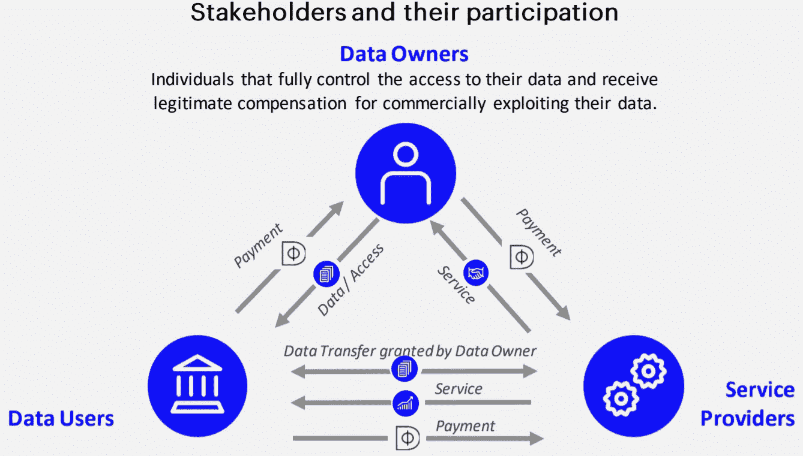

# Datafund ICO 回顾:去除大数据中的油脂

> 原文：<https://medium.com/hackernoon/datafund-ico-review-degreasing-big-data-c877e9fcbb84>

Datafund Wants to Convert Our Personal Data Into Digital Assets

他们上钩了，我们每次都上当。想使用像脸书或谷歌这样的免费、广受欢迎的公共平台吗？去吧。

几乎每个拥有智能手机的人每天都在使用这些服务——或者他们祖国的同类服务。

但不管你喜不喜欢，当你在寻找一份晚餐食谱或窥视一个几乎被遗忘的熟人的夸张生活方式时，你正在被记录。

他们知道你去过哪里，在那里呆了多久，以及你一直在做什么。

令人毛骨悚然，侵犯性强，让我很不舒服。但是任何人都可以做些什么呢？

好吧，整个过程，整个买卖个人数据的行业，早就应该进行一场区块链式的争吵了。

这个系统坏了，但我们能修好它。我们可以做得更好。但这需要让步、协议和有说服力的调解人。

一家这样的区块链初创公司——[**【data fund】**](https://datafund.io/)**——希望将个人数据重新交到合法所有者手中。也不是以反公司的方式。**

**相反，该团队希望创造一个双赢的场景，在一个透明的市场中进行道德数据交换。**

**Datafund 将如何试图给今天的大数据行业带来一次大变革？**

**我们很快会谈到这一点。但首先，这里有一些重要的数据供您参考…**

*****免责声明*** *:这不是投资或理财建议。无论如何我都不是金融专家。本文中的大部分信息都是推测性的，仅仅是我个人的观点。在参与任何创业项目之前，一定要进行自己的研究。***

**永远记住，你用钱做什么是你自己的决定。如果这个决定对你一个人来说太难了，向金融专家寻求指导。**

***我可能会也可能不会收到创建此内容的少量令牌分配。也就是说，我会尽我所能保持公正和公平。我尽量避开所有的 FOMO 和 FUD，也绝不希望把这些情绪传染给我的秘密首脑伙伴们。***

# **开垦**

**法加。你已经知道他们，但我会为你拼写出来，以防你不知道他们的新的，集体缩写。可以和 GAMAF 或者 MAGFA 一起去，但是也许他们已经被占用了？**

> **脸书。亚马逊。微软。谷歌。苹果。**

**如果你认为自己是人类，并且可以连接到任何类型的计算设备，那么你每天都会使用这些公司的一个或多个产品。**

**将每一项的全球用户基数加起来——这将是棘手的，因为有大量的重叠——我们谈论的是数十亿人。地球上相当一部分人知道，在某些情况下，喜欢这些公司。**

**所有这些庞然大物都用从我们这里收集的数据做什么呢？这些已经从我们这里赚钱的超级富豪公司*——如何对待我们随意交给他们的个人资料？***

***坦白地说，他们对待我们的数据就像对待一个该死的妓女。***

> ***他们建立了一个巨大的全球化、去中心化、数据驱动的红灯区，数据皮条客让我们违背自己的意愿在那里工作。***

***Datafund 的首要任务是成为同意的推动者。他们希望人民能够收回理应属于他们的东西。***

***在同意的情况下，个人数据发展成为易于数字化的资产。***

***数据的创造者——我们都是锄头——决定是否张开双腿。如果我们做到了，我们会得到相应的报酬。***

***数据的提供者——“丝滑的”，穿着彩色毛皮大衣，戴着朴克帽，拄着拐杖，在 7 英寸的厚底高跟鞋上保持平衡，高跟鞋上可能有也可能没有金鱼——在把我们的商品卖给 randos 之前，必须征得我们的同意。***

***作为开始，该项目创建了自己的 PAC——隐私意识运动。它现在正在运行，我将在以后的文章中更详细地介绍它。***

***但是如果你现在想亲自去看看的话，这里有一个到 [**Datafund 的 PAC**](https://reclaim.datafund.io/#/register) 的链接。***

# ***货币铸造***

******

***How DEX tokens flow through the Datafund protocol***

***像大多数区块链协议一样，Datafund 运行在本机治理令牌上。在这种情况下，DEX 实用程序令牌(ERC777/ERC20)为链提供信息。***

***当您同意将您的数据提供给选择加入 Datafund 生态系统的道德公司时，您将获得 DEX 令牌作为奖励。***

## ***数据用户***

***这些商业组织处理数据以增强现有的产品和服务，或者发明新的产品和服务。他们甚至可能会选择在转身出售数据之前充实数据。***

***这些公司向像你我这样的数据生成者提供支付。***

## ***服务提供商***

***这些是我们以及数据用户为其提供的服务付费的公司。我们与这些组织的业务对他们来说是双重利益——我们用资金支付他们，我们用数据支付他们。***

***我们已经每天都在这样做了。但现在，我们至少会因此得到补偿。***

> *****除了出售数据的奖励外，在网络上出售 DEX 代币的人还将获得赌注奖励。*****

***是的，这就是被动收入。***

# ***加密监管***

***你不能把你的数据到处乱放。嗯，说实话，它已经出来了。***

***你的个人数据已经在互联网上到处流动。它存储在服务器、数据库和云中。复制品和复制品遍布世界各地。***

***但是在 Datafund 的加密数据存储解决方案的帮助下——你可以用 DEX 令牌支付——你可以管理自己的个人信息数据库。安全存储可以保留您的数字遗产。***

***你控制钥匙，决定谁开车。你可以决定是否向他们收费。***

# ***最后的想法…***

***Datafund 设想——并且正在努力构建——一个个人数据交换公开且合乎道德的环境。***

***不再偷东西了。不要再背着我们集体行事了。再也没有免费乘车了。***

***至少目前，区块链技术是我们爬出这个我们为自己挖的个人数据盗窃洞的最佳机会。但是改变的道路是漫长而崎岖的。***

***大公司过得很好，除非被授权，否则不打算交还控制权。***

***但值得庆幸的是，像 Datafund 这样的项目正在努力提高人们的意识。DataStolen，Inc .需要清醒地认识到，如果我们都能友好相处，事情会变得多好。***

***如果公司有道德的话，我们永远也不会忍受那两周持续不断的 GDPR 合规邮件。他们可以避免像脸书剑桥分析公司的尴尬的昂贵的考验。***

***Datafund 寻求成为大数据行业的道德指南针。个人自由作为一种权利的理念贯穿整个项目。***

***我完全同意这种观点。我们的数据应该 ***属于*** 我们，而不是他们。如果我们都能遵守规则，我们就能创造一个人人共赢的生态系统。***

***当每个人都赢了，即使是在一个封闭的生态系统中，世界也会变得更好。这正是区块链理工大学诞生的原因。***

***我们有能力清除大数据行业的污点。Datafund 项目希望帮助我们所有人实现这个梦想。***

## ***DYOR***

***现在，仅仅因为你读了我对 Datafund 项目的看法并不意味着你现在是专家了。自己调查项目总是一个好主意。***

***这里有一些方便的资源，你可以这样做:***

***[**Datafund 网站**](https://datafund.io/technology.html)***

***[**Datafund 白皮书**](https://docs.google.com/document/d/1PzfN5lPzzYA_c72KNkq3-568NBluF12U63HQPH2bPsM/)***

## ***社交化***

> ***[中等](https://blog.datafund.net/)电报[电报](https://t.me/DataFund)推特[推特](https://twitter.com/DataFundProject)***

## ***顺便说一下…***

***如果你喜欢你在这里看到的，并且需要帮助把你的加密信息传递给大众，我很想听听你的项目。***

***你可以在这里找到我:Gmail 的 blockchainauthor***