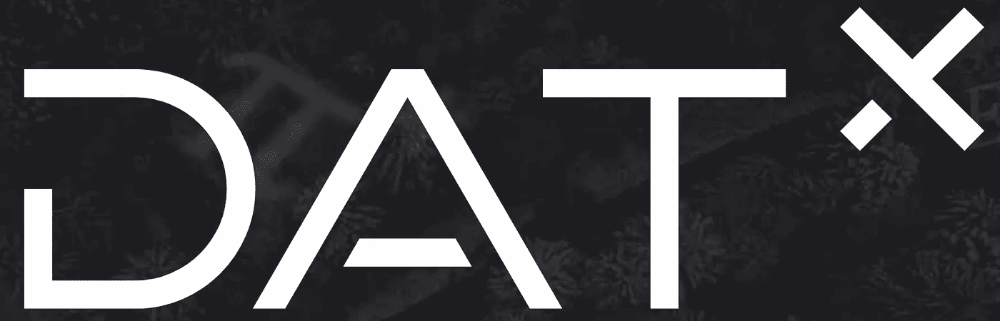

# DATx:区块链驱动的分散式广告生态系统

> 原文：<https://medium.com/hackernoon/datx-a-blockchain-powered-decentralized-advertising-ecosystem-71fb944b02ea>

# DATx 是什么？

DATx 是一个新的区块链数字广告终端，旨在创建一个分散的广告生态系统，摆脱传统的程序化广告面临的主要问题。

这个概念很简单:建立一个智能广告生态系统，以区块链的去中心化为基础，以人工智能为主要机制。

DATx 将基于区块链的技术与人工智能和大数据技术相结合，构建了一个创新的广告生态系统，在数据所有者(用户)和使用数据的广告商之间提供数据隐私、安全和透明，授予用户控制他们希望提供的数据的权利，并为他们提供数据提供适当的激励。作为交换，广告客户变得更有效率，因为他们能够更准确地接触到他们的目标受众，创造一种公正和双赢的用户-广告客户关系。

# DATx 任务

DATx 生态系统保证不可逆转性、公正性、透明度和可审计性。创新的目标是解决传统程序化媒体购买在处理用户数据时面临的问题。他们基于区块链的新系统为这些问题提供了解决方案，解决这些问题不仅有利于最终用户，也有利于广告商。

以下是 DATx 旨在解决的传统广告平台的主要问题:

# **用户数据所有权**

移动和大数据技术中程序化媒体购买的进步使得广告中的自动化程序在收集和分析用户数据方面更加有效，使他们能够接触到目标受众并最大化他们的投资回报(ROI)。然而，这些发展产生了关于这些数据的适当性的问题。可以说，用户拥有这些有争议的数据，因此应该有权保护他们的数据，并决定他们是否希望分享这些数据。不幸的是，传统技术并非如此。

# **数据隔离**

由于个体广告商在跟踪和分析用户数据方面开发了他们自己的集中式技术，广告平台在公共广告交易市场之外建立了他们自己的隔离的广告交易市场和交付系统。由于 exchange 系统的这种碎片化，用户数据变得冗余，从而有可能无意中向用户发送垃圾邮件，并导致用户信息不一致。

# **广告的特异性**

对于向用户显示什么广告，用户往往几乎没有控制。这对广告商和用户来说都是一个很大的劣势，因为这会导致投资回报(ROI)和点击率(CTI)的下降。此外，用户在收到他们不感兴趣的广告时给出负面反馈，损害了广告平台和广告商的形象。个性化推荐最近在广告业得到了发展，解决了其中的一些问题，尽管没有完全消除这些问题。这是因为广告生态系统中缺乏用户参与。

# **广告价值链中缺失的用户**

DATx 强调的一个主要问题是缺乏用户激励来换取他们提供的数据。由于用户对他们想看什么没有发言权，广告没有发挥最佳作用，产生了大量的资源浪费。此外，由于用户是其数据的合法所有者，他们应该完全控制自己提供的数据。通过这种方式，用户提供的数据为广告商提供了一个更有效的系统，以准确地到达对其感兴趣的目标受众。

通过基于区块链的 DATx 生态系统，这些问题通过使用户、广告商和出版商的分散网络在基于激励的系统中一起工作来解决，在该系统中，用户从他们自愿提供的数据中受益，以换取激励和更好的广告体验，广告商通过利用准确的用户提供的数据来优化他们的投资回报，出版商通过集成 DATx SDK 来获得回报。

# 基于区块链的广告创新

通过整合区块链以构建透明的广告生态系统，DATx 通过以下方式为广告行业带来创新:

●艾与优势互补

●精准广告和高投资回报率(ROI)

●分散的可信系统，降低运营成本

●开放性和可扩展性

●更强的可靠性、匿名性、独立性和合规性

●优化的激励机制

●更公平的利益分配，更高的系统内匹配效率

●数字世界和现实世界之间的联系

# DATx 区块链

DATx 广告生态系统由 3 个主要部分组成:区块链、广告平台和应用平台。

区块链是维系整个系统的纽带。它执行智能合同，处理生态系统激励机制，以 DATx 加密货币令牌的形式实现货币交换，并且它是所有行为信息和数据的存储位置。

# Ad 平台和 DATx 令牌

广告客户能够通过广告平台连接到区块链，在那里他们可以检查交付性能并访问他们购买的用户提供的数据。广告商还可以通过拥有加密货币钱包来管理他们的预算，并通过使用 DATx 令牌在生态系统中进行交易。广告商和用户之间的这些交易通过智能合同得到保护和执行。

# 应用平台和激励机制

用户和出版商能够通过应用平台连接到区块链，这是 DATx 人工智能机制和大数据技术发挥作用的地方。这些系统是反欺诈系统、人工智能推荐系统和大数据反馈系统。出版商通过集成 DATx SDK，通过分散式应用程序(DAPPS)向用户展示这些系统，并获得相应的回报。这些系统然后在用户知情和许可的情况下收集用户数据，作为交换，通过区块链的生态系统激励机制获得回报。

姓名:Ralph SasInterim
职位:DotC 联合集团 Avazu 全球首席执行官

简历:拉尔夫毕业于荷兰博世大学。目前，他是 DotC 联合集团的代理首席执行官和移动广告平台子公司 Avazu Europe Europe/NA/Latam 的首席执行官。他是 Avazu Holding 的董事会成员。此外，Ralph 曾为 ZinQ Media 和 R&D Media 工作，这两家公司都是荷兰移动互联网和在线数字营销的领先公司。

 [## Ralph Sas-Avazu Global-DotC 联合集团临时首席执行官| LinkedIn

### 上领英，在全球领先职业社交平台查看 Ralph Sas 的职业档案。Ralph 的职业档案列出了 13 个职位。查看 Ralph 的完整档案，结识职场人脉和查看相似公司的职位。

cn.linkedin.com](https://cn.linkedin.com/in/ralph-sas-635849b) 

姓名:古斯·埃斯比尔·威尔德曼

职位:首席运营官阿瓦祖欧洲/北美/拉美阿瓦祖

简介:Guus 毕业于荷兰 Hogeschool 大学，他是联盟营销、社交媒体、SEO、PPC、PPV、在线推广领域的专家。他在 DotC 联合集团工作了 3 年多，现在是 Avazu Europe /NA/Latam 的首席运营官，在此之前，他是 iQU 欧盟区的销售总监。Guus 致力于在游戏玩家、发行商和广告商之间建立完美的联系，并试图为在线游戏赢得更强大的市场。通过使用他以前的情报平台——互联网、社交媒体、移动设备等复杂的 GameriQU，在欧洲国家产生了巨大而深远的影响。

 [## 古斯·埃斯比尔·威尔德曼-首席运营官·阿瓦祖欧洲/北美/拉美- DotC 联合集团| LinkedIn

### 查看全球最大的职业社区 LinkedIn 上 Guus Esbir Wildeman 的个人资料。Guus 有 4 份工作列在…

www.linkedin.com](https://www.linkedin.com/in/guusesbirwildeman) 

Robert krbs
Avazu 欧洲/北美/拉丁美洲董事总经理

Robert krbs 毕业于柏林应用科学大学(在西欧地区排名第一)，他专攻商业计算机科学。到目前为止，他在数字营销、用户访问、广告业务方面拥有超过 8 年的工作经验，是运营初创企业生态系统的先锋团队领导。目前，Robert 担任 Avazu Europe/NA/Latam 的董事总经理。他曾任职于 Hitfox group 的子公司 ad2games，一家数字创新营销游戏公司，职位是广告客户关系主管。

 [## Robert krbs-Avazu Europe/NA/Latam-DotC 联合集团董事总经理| LinkedIn

### 在世界上最大的职业社区 LinkedIn 上查看 Robert krbs 的个人资料。罗伯特有一份工作列在他们的…

www.linkedin.com](https://www.linkedin.com/in/robertk3/) 

Avazu LATAM 的业务发展总监 Alejandro Bonsignore

Alejandro 是 UADE 大学(布宜诺斯艾利斯排名第一的大学之一)的法律和社会科学教授，拥有在数字广告行业的主要公司担任领导职务的经验，如改善媒体网络。他做了多年的顾问，对航空业有很深的了解。如今，亚历杭德罗是 Avazu LATAM 的业务发展总监

 [## Alejandro Bonsignore-Avazu LATAM-Avazu Holding | LinkedIn 的业务发展总监

### 查看 Alejandro Bonsignore 在世界上最大的职业社区 LinkedIn 上的个人资料。亚历杭德罗列出了 1 项工作…

www.linkedin.com](https://www.linkedin.com/in/abonsignore/)