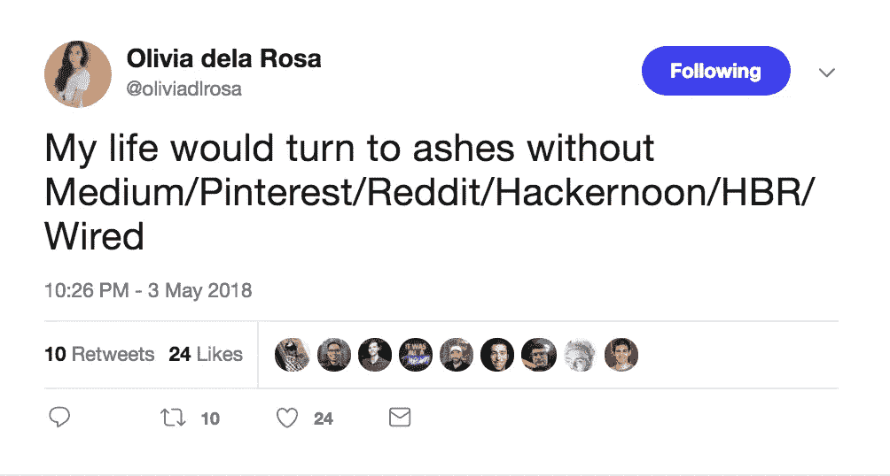

# 大卫掉进了坑里，

> 原文：<https://medium.com/hackernoon/david-fell-into-the-pit-6cbb1f0b6726>

## 但是演出必须继续。

Airport rollers buddies: “Hey, we both have no control over where we’re going!”

多好的一周啊。你可能知道也可能不知道，黑客正午的母公司 [AMI，规模很小](https://hackernoon.com/the-ami-origin-story-f386ef84c79c)。喜欢出奇的小。我们经常收到电子邮件&推文&脸书消息，假设[我们是](https://www.readory.com/sources?ref=producthunt)[媒体](https://medium.com/u/504c7870fdb6?source=post_page-----6cbb1f0b6726--------------------------------)或[赫芬顿邮报](https://medium.com/u/91327d9dac27?source=post_page-----6cbb1f0b6726--------------------------------)或[产品搜索](https://medium.com/u/b8b4445269d0?source=post_page-----6cbb1f0b6726--------------------------------)的规模，这很讨人喜欢，但也有问题。我想这是一个好问题:-)

yoooooooo [Olivia dela Rosa](https://medium.com/u/650f2c4fc138?source=post_page-----6cbb1f0b6726--------------------------------) 🙌🙌🙌

所以，当我们唯一的全职员工兼首席执行官大卫在周一凌晨发生意外，被送到急诊室时，影响是实实在在的。必须采取行动。杰伦加紧审查和出版大多数提交的故事。我现在正在给 321，616 名《黑客正午》的读者写第一份时事通讯。这是一个全新的领域，因为我的主要职责(除了作为大卫孩子的母亲之外)是寻找故事来源、管理合作伙伴和增加收入。

正如他们所说——这个节目必须继续下去，这要感谢这些了不起的、敬业的贡献者，还有你，读者们。

# Hacker Noon 本周十大故事:

[为什么 AI 会带来新工作的爆发](https://hackernoon.com/why-ai-will-bring-an-explosion-of-new-jobs-11dc203890b)丹尼尔·杰弗里斯

[摊牌:MySQL 8 vs PostgreSQL 10](https://hackernoon.com/showdown-mysql-8-vs-postgresql-10-3fe23be5c19e) 由[肯·埃吉马](https://medium.com/u/f3ca8f77a60a?source=post_page-----6cbb1f0b6726--------------------------------)

[你在做 Scrum 错误的事情，下面是如何解决这个问题](https://hackernoon.com/youre-doing-scrum-wrong-and-here-s-how-to-fix-it-6d45fdd26721?source=collection_archive---------0----------------)Eric Weiss

[在面试开发人员角色时永远不要说的话](https://hackernoon.com/things-you-should-never-say-when-interviewing-for-a-developer-role-138609321d7b)伊莎贝尔·尼奥

[帮助塑造我现在热爱的职业的 8 条职业建议](https://hackernoon.com/the-8-pieces-of-career-advice-that-helped-shape-a-career-i-now-love-bfd7f4bec8cd)作者[迈克尔·汤普森](https://medium.com/u/bb18b13c5ef4?source=post_page-----6cbb1f0b6726--------------------------------)

[吸拇指反比特币者！](https://hackernoon.com/thumb-sucking-anti-bitcoiners-da7fcaad05c9) by [Beautyon](https://medium.com/u/e6958b5742d2?source=post_page-----6cbb1f0b6726--------------------------------)

[比特币(BTC) /比特币现金(BCH)。第一部](https://hackernoon.com/bitcoin-btc-bitcoin-cash-bch-part-1-dbf9fc69d687)作者[亚历山大·斯维茨基](https://medium.com/u/c3dfe7e1392a?source=post_page-----6cbb1f0b6726--------------------------------)

有证据表明我们生活在克里斯·比斯利的模拟世界里

[想知道第一轮怎么加注？开始表现得好像你已经关闭了它。](https://hackernoon.com/want-to-know-how-to-raise-your-first-round-start-acting-like-youve-already-closed-it-ed2e690b58b5)由[马克斯·赞科夫](https://medium.com/u/679c3de69ed?source=post_page-----6cbb1f0b6726--------------------------------)

[10 款火狐开发工具，你可能还不知道](https://hackernoon.com/10-firefox-dev-tools-tricks-that-will-blow-your-mind-d641f1714903)

直到下一次，不要把世界的现实想当然。你永远不知道你的生活和生意伙伴什么时候会[掉进一个坑](https://www.youtube.com/watch?v=-vMpfbuI9FY)。

亲切的问候，

[林吸烟](https://www.linkedin.com/in/linhdao90/)