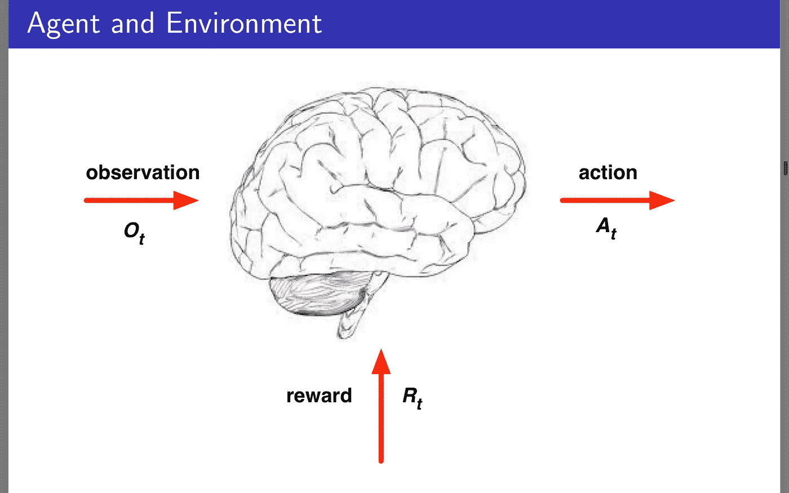

# 大卫·西尔弗·UCL-RL 课程:第一讲笔记

> 原文：<https://medium.com/hackernoon/david-silver-rl-course-lecture-1-notes-a42cd1c6f687>

> [你可以在 Twitter @bhutanisanyam1](http://twitter.com/bhutanisanyam1) 上找到我，在 [Linkedin 上联系我](https://www.linkedin.com/in/sanyambhutani/)
> 
> [你可以在这里找到课堂讲稿。请随意贡献并进一步改进它们。](https://github.com/init27/DavidSilverRL-Notes)

强化[学习](https://hackernoon.com/tagged/learning):它坐拥[科学](https://hackernoon.com/tagged/science)众多领域的交汇点。这是决策的科学，是理解最佳决策的方法。

例如:

*   工程学:最优控制用不同的术语处理同一问题。
*   神经科学:研究表明，基于多巴胺的人脑奖励系统的工作是非常相关的。
*   心理学:关于动物为什么会做出某些决定，已经做了很多工作。
*   数学:运算研究。
*   经济学:博弈论、效用理论和有限理性都致力于同一个问题。

所以这是很多分支的共同之处，也是解决基于奖励的问题的一般方法。

## RL 与 OtherLearning:

*   没有监督者，它使用试错法工作，使用奖励信号改进。
*   奖励信号可以是也可以不是即时的。
*   时间是相关的。给定时间的一个事件与下一个事件中的动作非常相关。
*   在 RL 情况下,“代理”可以影响它看到的数据。它影响环境。

真实生活使用案例:

*   直升机特技表演
*   双陆棋游戏
*   投资管理
*   发电站控制
*   教一个人形机器人走路
*   雅达利游戏

# RL 问题

*   奖励:Rt，只是一个标量反馈信号。它定义了“代理人”在时间步长 t 的绩效。代理人的目标是最大化目标，这是一笔报酬。

(非正式)奖励假设:所有的目标都可以用期望累积奖励的最大化来描述。

所有的奖励都可以根据比较后的行动来衡量。因此，所有的奖励都可以分解成一个比较的尺度，因此最终必须得到一个标量奖励。

根据定义，目标可以是中间目标、最终目标或基于时间的目标等。

第一步是理解奖励信号。

# 顺序决策

*   目标:选择行动以最大化未来奖励。
*   行动有长期的后果，所以我们必须提前考虑。贪婪的方法在这里可能没有用。
*   奖励可能会延迟(不是立即)
*   为了(更大的)长期回报而牺牲眼前的回报。

# 形式主义

## 代理人

我们在这里控制大脑——大脑是代理。

*   代理可以采取措施
*   在每一步，行动都受到给定时间步的观察的影响。
*   它接收奖励信号。
*   我们必须找出基于这些来决定行动的算法

## 环境:

环境存在于环境之外。

在每一步中，主体接收由环境产生的观察，主体本身通过采取行动来影响环境。

RL 的机器学习问题与来自试错交互的数据流有关。

# 历史和国家

经验流、观察顺序、行动和回报。

H(t)是

*   到时间 t 为止所有观测的历史
*   我们的下一步行动取决于历史
*   我们建立从历史 H(t)到一组动作的映射(算法)。
*   环境回报观察(发射)和基于 H(t)的奖励

状态:是对信息的总结，以决定下一步的行动。它捕捉历史来确定接下来应该发生的所有事情。

*   国家是历史的函数。
*   S(t) = f[H(t)]
*   Def 1:环境状态:环境内部使用的信息，用于根据环境的历史确定下一个事件。确定环境的下一个事件所必需的信息，这通常对代理不可见。它们有助于理解环境。通常情况下，与算法无关。

注意:对于多代理问题，代理可以将其他代理视为环境的一部分。

*   Def 2:代理状态:存在于我们算法中的数字的状态。它总结了代理的信息和内部状态。代理状态被我们的 RL 算法所利用，并决定下一个动作。该功能由我们定义。

# 信息状态:马尔可夫状态

一个信息系统包含所有有用的历史信息。

马尔可夫性质:一个状态是马尔可夫的当且仅当:下一个状态的概率，给定你的当前状态与所有先前状态相同。换句话说，只有当前状态决定下一个状态，而历史是不相关的。

换句话说，如果马尔可夫性质成立。鉴于现在，未来独立于历史。因为国家代表了过去的一切。

另一个定义:状态是对未来的充分统计。

根据定义:环境状态是马尔可夫的。

而整个历史也是一个马尔可夫状态。(不是一个有用的)

1.  完全可观察的环境:代理可以看到完整的环境，代理状态=环境状态=信息系统。这被称为 MDP(马尔可夫决策过程)。
2.  部分可观测环境:智能体间接观测环境。在这种情况下，代理状态！=环境状态。这被称为部分可观测 MDP (POMDP)。可能的代理状态表示:

*   天真的方法:代理状态=完整的历史。

*   贝叶斯方法:我们发展信念，其中代理状态是概率的向量，以选择下一步。
*   RNN:先前状态和最新观察的线性组合。所以这是旧状态到新状态的线性转换，伴随着给定的观察，伴随着一些非线性。

# 在 RL 特工内部

RL 代理可能包括(也可能不包括)以下一项:

*   策略:这是代理如何选择它的动作。将其状态映射到操作
*   价值函数:对每个状态或动作进行估价。
*   模型:代理对环境工作的感知。

## 政策:

这是一张从国家到行动的地图。确定当代理处于某种状态时它将做什么。

*   确定性策略:a = F(S)。我们希望从经验中学习这一政策，并希望通过它获得最大回报。
*   随机策略:允许随机的探索活动。这是在给定状态下采取行动的概率(随机地图)。

## 价值函数:

这是对预期未来回报的预测。我们在行动之间做出选择，决定追求最高的回报，这是通过价值函数得到的估计。

价值函数取决于我们的行为方式，取决于政策。如果我们采取行动，它会给予奖励，从而有助于优化我们的行为。

伽马:贴现。它影响我们是否关心当前/以后的状态。它决定了评估未来的视野。(地平线-我们需要计算我们行动的结果有多远)。

## 型号:

它用于了解环境，预测环境下一步会做什么。没有必要创建一个环境模型。但是当我们这样做的时候它是有用的。

它可以分为两种状态:

*   过渡:预测环境的动态。下一个州。
*   奖励:预测即时奖励。这分为:

1.  状态转换模型:在给定当前奖励的情况下，预测状态转换。
2.  奖励模型:它预测给定当前状态下的预期奖励。

RL 代理:

我们根据上述三个概念中的哪一个来对我们的代理进行分类。比方说，如果我们有一个基于价值的代理:如果它有一个价值函数，一个策略是隐含的。

*   基于价值
*   基于策略
*   演员评论家

基于策略:维护每个状态的数据结构，而不存储值函数。

演员评论家:结合了政策和价值功能。

因此，RL 问题可以分类为:

*   无模型:我们不试图理解环境，我们直接看到经验，并制定政策。
*   基于模型:涉及一个 RL 代理。

# RL 内部的问题

## 学习和规划:

当涉及到顺序决策时，有两个问题。

*   RL 问题:

1.  最初环境是未知的(通过反复试验)。
2.  与环境互动。
3.  改进 it 政策。

*   规划:

1.  我们描述环境，agent 的模型为 agent 所知。
2.  代理计算其模型并改进其策略

## 探索与开发

RL 的另一个重要方面。

*   RL 就像试错学习。
*   当我们探索的时候，我们可能会错过奖励。
*   我们想找出最佳策略。

探索:选择放弃一些已知的奖励，以发现更多关于环境的东西。

利用:利用已知信息来获取最大回报。

有一个探索和开发的权衡。

## 预测和控制

预测:给定当前政策，对未来的估计

控制:找到最佳策略。

在 RL，我们需要评估我们所有的政策，找出最好的。

> 订阅时事通讯，获取深度学习和计算机视觉阅读的每周精选列表。
> 
> [你可以在 Twitter @bhutanisanyam1](http://twitter.com/bhutanisanyam1) 上找到我，在 [Linkedin 上联系我](https://www.linkedin.com/in/sanyambhutani/)