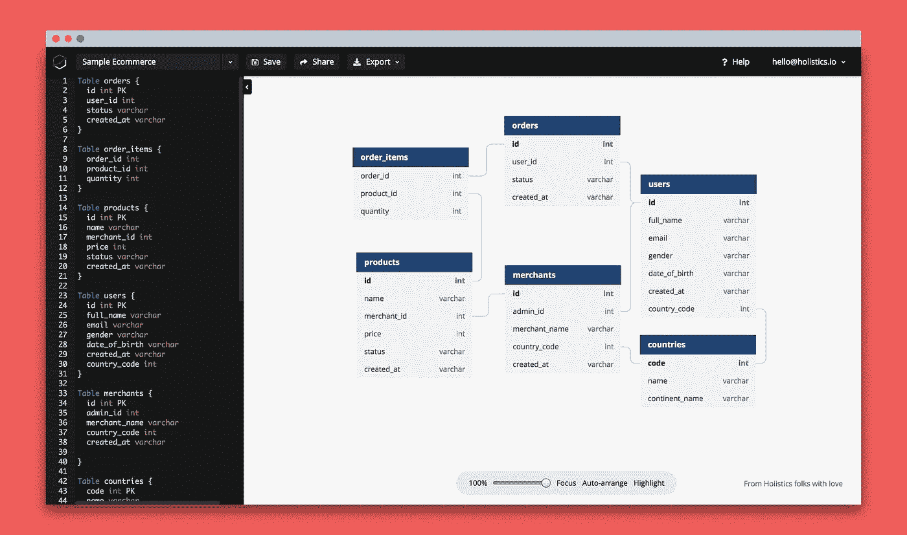
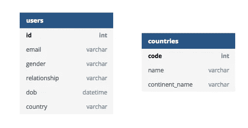
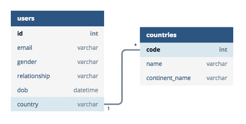
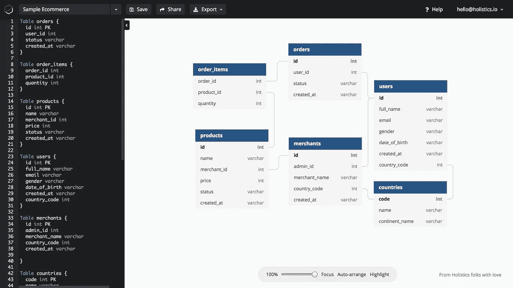
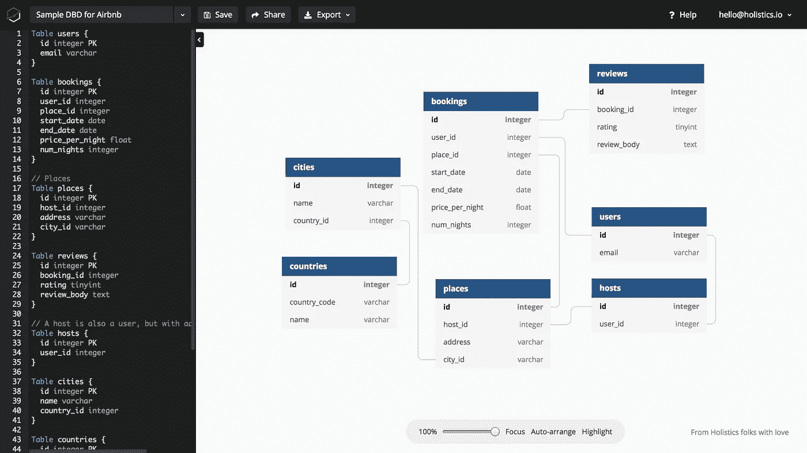

# 为开发人员和分析人员构建的数据库图表设计器

> 原文：<https://medium.com/hackernoon/dbdiagram-io-a-database-diagram-designer-built-for-developers-and-analysts-975f310d4f13>

从我们的实习生开发的一个功能开始，以帮助我们的客户在 [holistics.io](http://holistics.io) —商业智能平台上可视化他们的数据库模式，我们发现有机会发布 [dbdiagram.io](http://dbdiagram.io) 作为一个独立的工具，为数据社区做出贡献。

这就是 [dbdiagram.io](http://dbdiagram.io) 如何构建的，这是一个快速简单的数据库设计器，它针对数据分析师和开发人员进行了优化，帮助他们只需使用键盘即可设计数据库图表。

[](https://hackernoon.com/making-our-tiny-feature-free-led-to-20-000-users-and-2-500-leads-within-2-months-98c6d23485d4) [## 让我们的小功能免费，在两个月内就有了 20，000 名用户和 2，500 条线索

### dbdiagram.io 是怎么建成的！](https://hackernoon.com/making-our-tiny-feature-free-led-to-20-000-users-and-2-500-leads-within-2-months-98c6d23485d4) 

# dbdiagram.io 如何让你的生活更美好😌

## 0.它是免费的——免费设计，免费分享

## 1.流畅的体验—专为数据分析师和开发人员而设计

作为数据分析师和开发人员，我们都知道这样一个事实，有时鼠标就是不起作用。要知道，虽然其他工具侧重于您需要 x2 单击来创建表、x2 单击来创建字段、x2 单击来更改值的体验，但 [dbdiagram.io](http://dbdiagram.io) 带给您的体验是键入就够了。让我们看看它是如何工作的:

用户界面/UX: 只需打开 dbdiagram.io，开始设计你的图表

*   **工具栏** —管理您的图表，导入、导出、登录并与其他人共享
*   **代码编辑器**——在你添加表格、字段和关系的地方，你键入简单的规则，图表出现在✨
*   **图表** —要放大/缩小，请移动您的图表



**创建表和字段:**要创建表和字段，遵循下面的语法并在左边的代码编辑器中键入

```
//Syntax
**Table** tablename {
  field1 type **PK**
  field2 type
  ...
}*//Example***Table** users {
  id int **PK**
  email varchar
  gender varchar
  relationship varchar
  dob datetime
  country int
}**Table** countries {    
  code int **PK**
  name varchar
  continent_name varchar
}
```



**创建关系:**当你需要你的鼠标时，你有你的鼠标。对于关系，在图表上进行交互会更直观，所以我们支持通过键入代码和从一个字段拖动到另一个字段来创建关系

```
*//3 Relationship Types
//   <   one-to-many
//   >   many-to-one
//   -   one-to-one**//Long-form syntax* **Ref** name-optional { table1.field1 **<** table2.field2 }*//Short-form syntax*
**Ref** name-optional: table1.field **<** table2.field2*//Example* **Ref** users.country **<** countries.code
```



## 2.按需进出口

*   通过从您现有的 PostgreSQL 或 MySQL 脚本导入，在几秒钟内可视化您的数据库
*   导出到 PDF/PNG/SQL 脚本或与他人轻松共享
*   由于我们正在使用 DSL(特定领域语言),我们可以很容易地添加其他数据库的导入/导出，请随时让我们知道！👐

## 3.技巧

*   任何表格标签上的🖱Double-clicking 将引导您找到表格代码的定义
*   💾Ctrl/Cmd + S 保存您的项目
*   🤔代码编辑器太小，请拖动边缘使其变大

# 示例数据库图表

怀着为社区做出更多贡献的使命，我们也希望社区也将 dbdiagram 作为一种工具，与他人分享他们的项目。这里是我们设计的一些示例数据库模式。

## 👉[电子商务模式示例](https://dbdiagram.io/d/5b714ac98e7b0f0014dc235d)



## 👉[Airbnb 模式示例](https://dbdiagram.io/d/5b8d6f49286d31001428ae8b)



如果你爱它，请用#dbdiagram.io 这个标签来传播你的爱！欢迎在这里添加您的反馈[！](https://goo.gl/forms/88AmYOyiIiTuFuzG3)