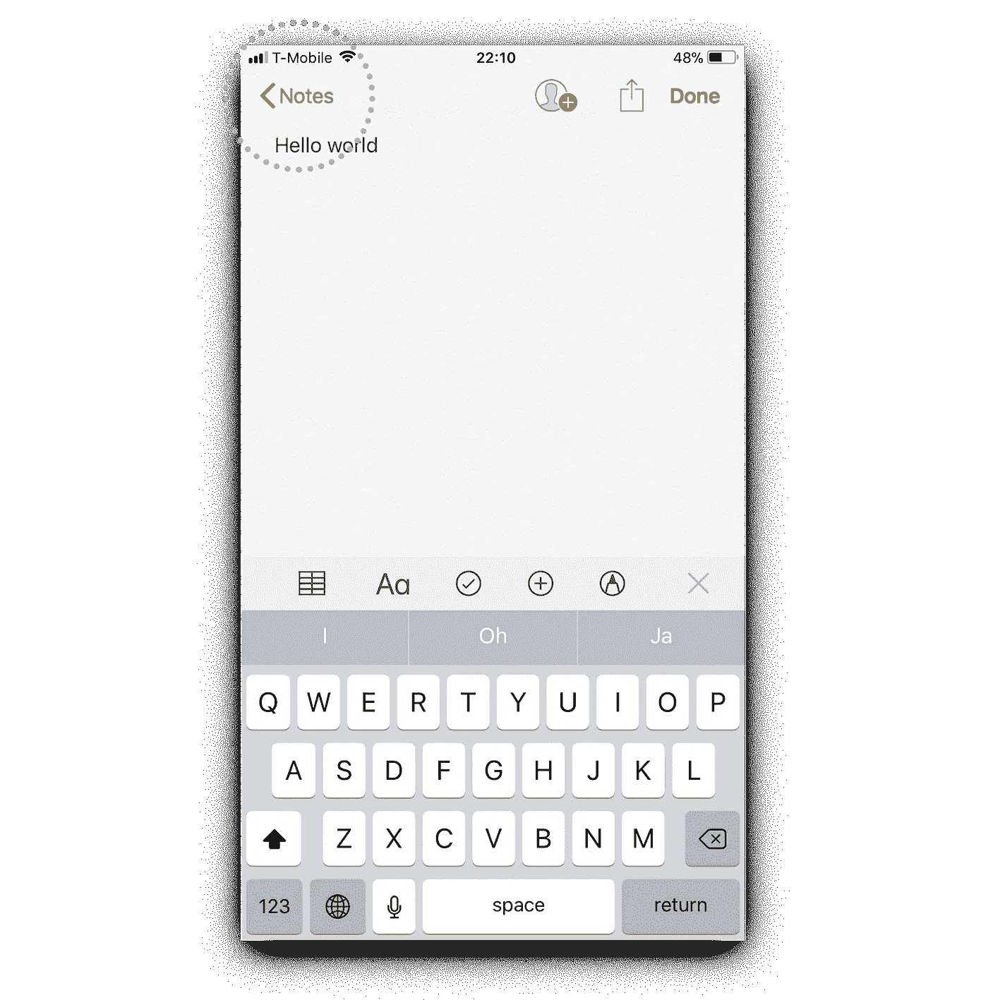
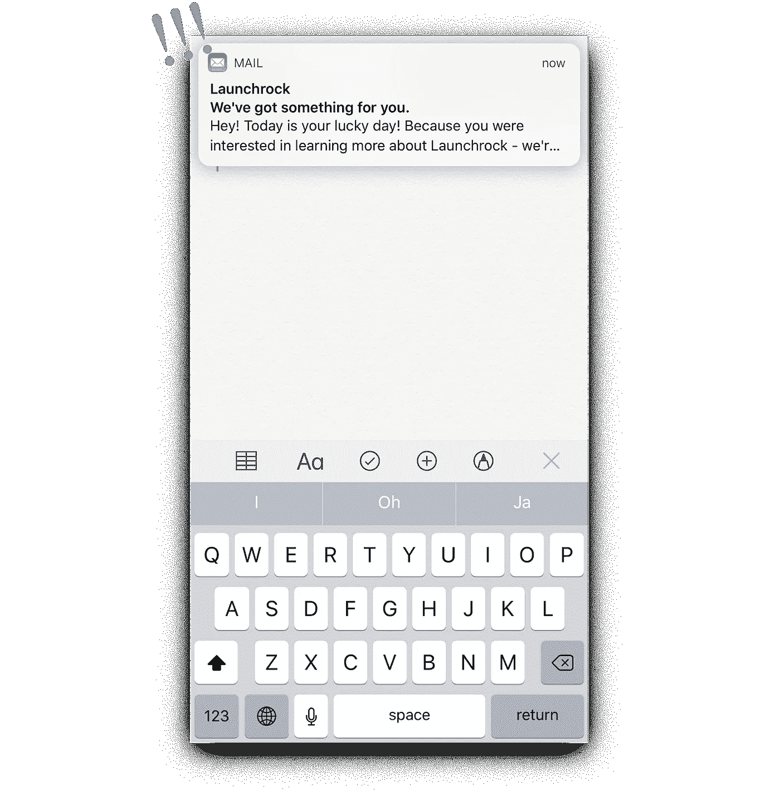
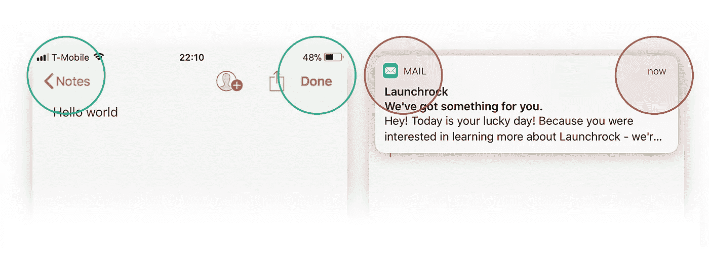
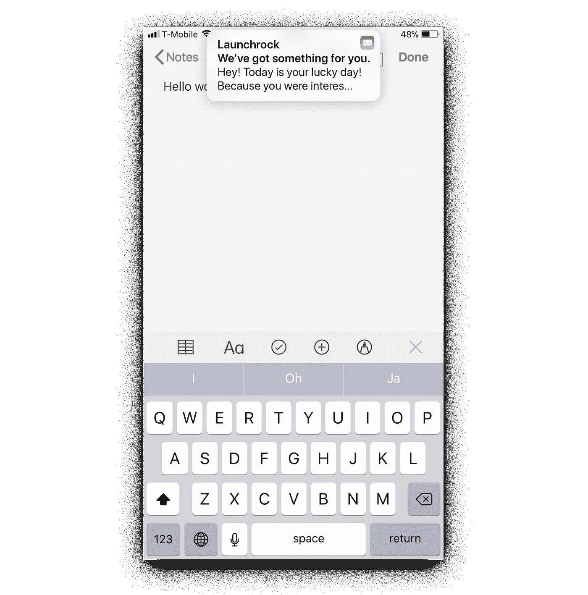

# 亲爱的苹果，请修复通知。

> 原文：<https://medium.com/hackernoon/dear-apple-please-fix-notifications-647fe26ff1c4>

我爱我的 iPhone。

细节和用户体验大多令人愉悦。

然而……大约一天 2-4 次，强烈的挫败感突然出现。把原本平稳的体验变成一片混乱。

让我举例说明。

假设我在 Notes 应用程序中。我决定回去编辑我以前的一个笔记。

于是……我把手指移到左上角的***<音符***按钮。**

****

**在我的手指接触到玻璃的前一瞬间，一个弹出窗口出现在屏幕上！**

****

**我不小心点击了通知，然后我被带到了一个完全不同的应用程序，离我想要去的地方*远*。**

**类似于日本 RPG 中出现的随机敌人，你被带出你的和平之旅，直接进入激烈的战斗模式。**

**当我导航回 Notes 应用程序并执行最初打算的动作时，我已经经历了大约 2 秒钟的痛苦。**

****2 秒钟的极度痛苦，每天 3 次，一年大约是 0.6 小时。****

**如果 7 亿多 iPhone 用户中只有 0.002%的人每天都有类似的经历，那么总的来说*这些通知每年会给用户带来超过 8400 小时的痛苦*。**

**经历过太多次这样的经历，我发现自己经常被迫打开“请勿打扰”模式来阻止潜在的弹出窗口干扰我的信息流。它把我从痛苦的闪光中拯救出来，但它一点也不理想。**

**作为一名[**www . fair pixels . pro**](http://www.fairpixels.pro/?mid)的 UI 设计师，我每天都在为创业公司寻找和解决这样的问题。**

**所以我决定找到这个问题的解决方案，重新设计弹出窗口，希望苹果能够在下一次 iOS 更新中推出一个修复程序。**

****首先，我们来分析一下事情的根源:****

> **绝大多数情况下，当试图点击顶角的某个操作项时，会出现此问题。大量的应用程序利用这些角落来实现关键的导航功能。当前的通知会在导致意外点击的随机时刻阻止这些操作项，从而导致用户流量的突然变化。**

****

****这个 UX 故障可以通过一个微小的用户界面更新来解决:****

**通过改变弹出窗口的宽度，左上角和右上角的操作项不再被覆盖，90%的意外点击可以被消除。**

****

**像这样的微小变化会对用户使用产品时的情绪产生巨大的影响。作为 UI 和 UX 设计师，我们的持续使命是识别产品中的这些摩擦点，并设计出优雅的解决方案。**

**我希望苹果推出一个补丁，让(大部分都很棒的)iPhone 体验更加令人愉快。**

**—卡里姆，UI 设计师@ [Fairpixels.pro](http://fairpixels.pro)**