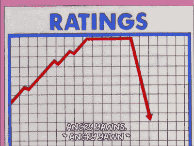

# 亲爱的加密投资者，你不能收购一个网络

> 原文：<https://medium.com/hackernoon/dear-crypto-investors-you-cannot-acquire-a-network-a01bf231fa2a>

## 能上市为什么要私有化？

大多数首次发行的硬币最近开始通过象征性的种子轮，也称为*私人销售，从传统的创业投资者(天使投资者和风险资本家)那里寻求资金。*

不像《T2》中的 ICOs 出现之前的《T3》，私下销售是在闭门进行的，大部分时间都非常不透明。另一方面，pre-ico 向早期投资者提供有吸引力的价格折扣，但交易是公开透明的。

私募销售不透明，因为公开销售投资者无法看到两个关键指标:

*   售出的代币数量(占代币分发总量的%)
*   每个代币的价格

如果没有这些信息，公开出售的投资者就无法在私下出售时估算网络价值。因此，他们不知道 ICO 是否是为了保证私人投资者的利润而设计的，以牺牲公共投资者的利益为代价*。*

ICO 投资者以比私人投资者更高的估值进入“令牌上限表”——这很好，因为他们进入的阶段较晚。

然而，delta 可能是荒谬的，有时高达 50 倍…而且仅在几个月内。

# 1.网络与传统投资

“效用”加密令牌和金融监管证券在基本价值方面几乎没有共同之处。

在主流金融中，证券代表法律实体中的所有权(或所有权)或与第三方的债权人关系。

另一方面，在[加密货币](https://hackernoon.com/tagged/cryptocurrency)网络投资中，代币代表合作经济的股份。

例如，让我们为全球航运市场考虑一个虚构的 dAPP。它将把集装箱班轮、船舶、港口和企业(有运输要求)聚集到一个单一的市场。在这个场景中，令牌“SHIP”是预订被确认后的财务保证。

因此，在这里，SHIP tokens 的总供应量将表示应用程序中预订的集装箱数量。持有船舶令牌将代表船舶网络经济的一部分。

另一方面，普通证券只会将所有权提供给航运市场的单一实体，而不是整个生态系统。

请注意，加密货币可以代表一种证券，如指数追踪器或实物资产的权利。并不是所有的加密货币都打算建立一个“网络”。

# 2.令牌分布和速度的情况

并不是每一个成功的企业都打算上市并在二级市场发行股票。因此，一家企业将其股票限制在私人股东手中是完全没有问题的。今天的大多数企业都没有公开上市，而是由一个家族或少数个人拥有。

与公司不同，网络必须是公开的。

嗯，从技术上讲，一个富有的经济代理人*可以*决定收购一个网络，但是这个“网络”将只包含一个人。

不再是电视网了，对吧？

当一个网络被一个单独的实体控制时，它的令牌不能被用于它的核心功能，因为没有人可以把它发送过去。加密货币的目的已经过时，因为它既集中又不活跃。

收购一个网络会消除与令牌、网络和应用程序相关的所有固有价值。

一个令牌化的网络只有当它促进了对等点之间有用的交流时才变得有价值，这可以通过它的**集中度**和**速度**来衡量。

1.  **集中度**是给定资产在用户间的分布水平。当一个人持有所有的代币时，它的集中度达到最大，而集中度会摧毁一个网络。
2.  **速度**是给定资产的交换程度。换句话说，它衡量的是一项资产在一定时期内的易手次数。没有速度意味着代币不会转手，也不会被使用。高/低速度不一定意味着高/低值，然而，没有速度意味着在网络中没有价值。

因此，获得大量网络令牌会对其固有价值产生负面影响，因为:

1.  随着网络的分散性降低，资产集中度显著提高。
2.  较低的分布意味着用户和使用的减少以及速度的下降。

当然，大多数代币经济都处于萌芽阶段。虽然他们确实计划建立一个网络，但这还远远没有实现，因为今天的网络令牌持有者更多的是金融投机者，而不是用户。

# 3.私下销售的情况

首先，我们研究了网络投资与传统证券的不同之处，然后研究了网络的价值是如何从其代币集中度和速度中获得的。

因此，高净值投资者应该意识到，他们可以获得的代币数量**是有限的，**否则将对网络的分布和速度产生负面影响。

贡献“天花板”现在显然是理论上的，但单个玩家对网络的任何重大收购都是破坏性的和不理性的。

投资者将支付高价购买代币，这将增加集中度，降低速度，对网络价值产生负面影响。

从这个意义上来说，区块链的初创企业应该尽量减少任何私人销售贡献。尽管筹集种子资金是获得资金和专业知识的一种非常有效的方式，但私募发行吸引的投资者更少，人均票价更高。

在私人销售的大量投资的情况下，长期速度和分销将保持相对较低，对网络价值产生负面影响。

ICOs:适度组织私人销售。能上市为什么要私有化？

*最初发表于*[*【tropyc.co】*](https://tropyc.co/pages/news/dear-investors-you-cannot-acquire-a-network)*。*

*我们列出了最初的硬币产品基础知识，并提供有价值的见解，以帮助加密货币爱好者做出更明智的决定。*

## 来加入 tropyc 吧！

 [## Tropyc

### 加密很难，Tropyc 让它变得简单。Tropyc 是加密货币新闻…

www.facebook.com](https://www.facebook.com/tropyc)  [## Tropyc (@tropyc_crypto) | Twitter

### 🌴加密货币的基础🎙️新闻，见解，ico-tokensale…

twitter.com](https://twitter.com/tropyc_crypto)  [## Tropyc 是一个秘密聊天室

### 🔥www.tropyc.co🔥 🏖加密货币和 ICO 聊天室🌴@Tropyc🌴加入这个家庭

www.t.me](https://www.t.me/tropychouse)